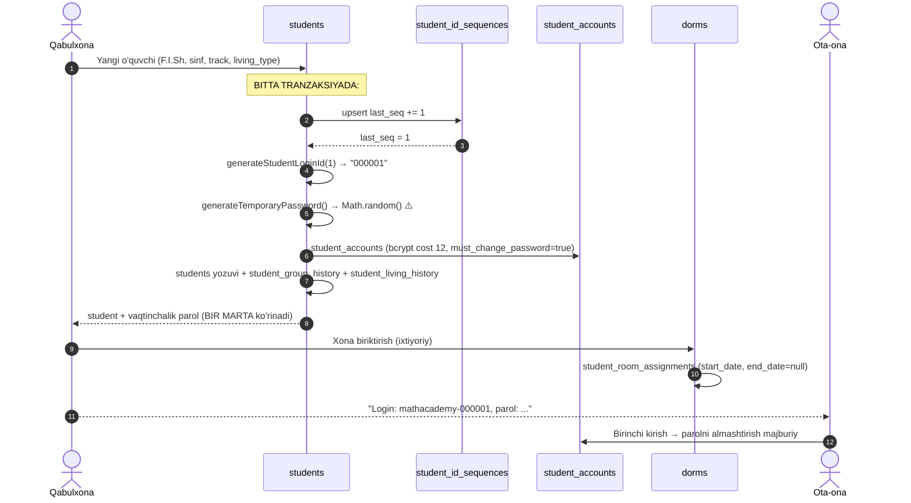
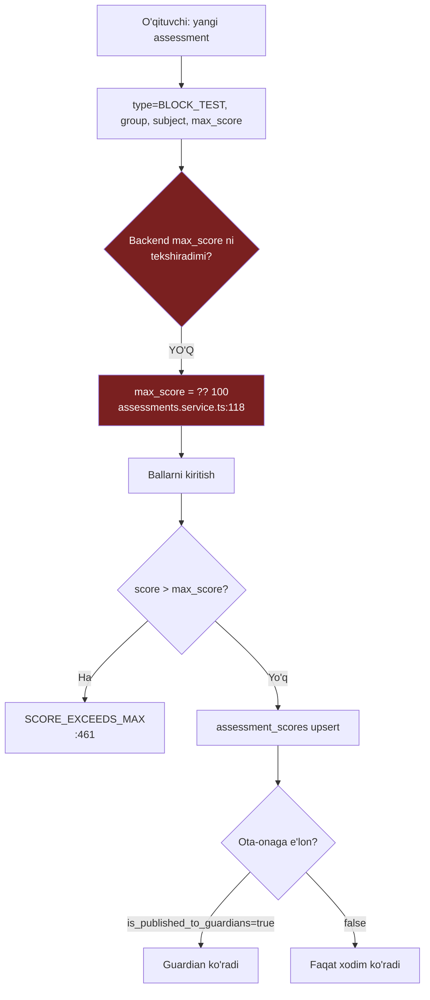
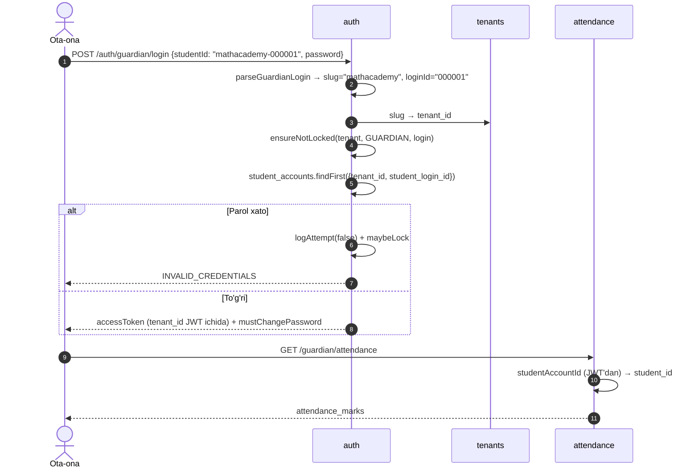
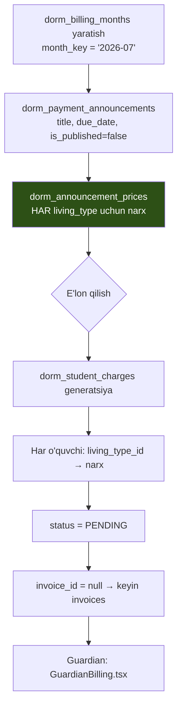

# Ziyo — Mahsulot spetsifikatsiyasi

> **Loyiha:** Ziyo — ko'p ijarachilik (multi-tenant) Student Information System
> **Hujjat:** 01 — Product Specification · **Holat:** Draft v1
> **Muallif:** Sarvarbek Sodiqov · **Kanon:** [`CANON.md`](./CANON.md) (ziddiyat bo'lsa — kanon g'olib)

## 0. Hujjat haqida

Bu yerda arxitektura yo'q (u `02-architecture.md` da bo'ladi). Bu yerda: **kim** foydalanadi,
**nima** qilmoqchi, qanday oqim bilan, tizim **nima qiladi** va ataylab **nima qilmaydi**.

⚠️ **Eng muhim kontekst.** Bu **demo emas**. Tizim muallif o'qigan akademiyada **real xodimlar
va real ota-onalar tomonidan har kuni ishlatiladi**. Ya'ni bu hujjat noldan qurish rejasi emas —
**ishlab turgan tizimni bitta akademiyadan ko'p akademiyaga olib chiqish** rejasi. Har bir
"yetishmaydi" satri ortida ishlayotgan kod turadi, uni sindirish mumkin emas.

Raqam to'qib chiqarilmaydi. Aniq bo'lmagan joyda "o'lchov bilan aniqlanadi" yoki "ochiq savol"
yoziladi. Mavjud kod tanqid qilinganda — **aniq fayl va qator** ko'rsatiladi.

| Termin | Ma'nosi |
|---|---|
| Tenant | Bitta akademiya. Barcha ma'lumot `tenant_id` bilan ajratiladi |
| DTM | Davlat test markazi — O'zbekistonda oliy ta'limga kirish imtihoni |
| 189 ball | DTM formati: MAIN 93 + SECONDARY 63 + 3×MANDATORY 33 |
| Track | O'quvchi yo'nalishi (`student_tracks`) — qaysi fanlar qaysi rolda |
| Living type | Yashash turi (`living_types`) — yotoqxona / uyda / boshqa. Narx shunga bog'liq |
| Guardian | Ota-ona / vasiy. Alohida portal, alohida login formati |
| Outcome | O'quvchi qayerga kirgani (`student_outcomes`) — akademiyaning asosiy KPI'si |
| Risk score | Xavf skori (`student_risk_scores`) — 0–100, GREEN / YELLOW / RED |

---

## 1. Aktyorlar (personas)

Olti rol. Har biri uchun: **kim** · **kunlik ishi** · **tizim nima beradi** · **og'riq nuqtasi**.

Tartib tasodifiy emas: birinchi ikkitasi tizimni **sozlaydi**, keyingi uchtasi uni **har kuni
to'ldiradi**, oxirgisi esa faqat **o'qiydi** — lekin aynan u eng ko'p foydalanuvchi.

### 1.1. Superadmin — platforma operatori

**Kim.** Loyiha muallifi yoki platformani yurituvchi texnik xodim. **Akademiya xodimi emas** —
u barcha akademiyalardan yuqorida turadi. Bugun bu — bitta odam.

**Kunlik ishi.** Odatda hech narsa. U tizim ishlayotganida ko'rinmaydi. Ishga tushadi:
yangi akademiya qo'shilganda, tenant sozlamasi buzilganda, boshqa hech kim yecha olmaydigan
muammo chiqqanda.

**Tizim nima beradi.** `tenants` moduli — yagona **global** modul, `tenant_id` bilan
filtrlanmaydi (`tenants.service.ts`). Bu **to'g'ri**: tenantlarni boshqaradigan modul
tenantga bog'liq bo'lolmaydi. `tenants.controller.ts:33` va `users.controller.ts:34` —
klass darajasida `@RequireRoles('SUPERADMIN')`.

Kodda superadminning yana bir imtiyozi bor: `perms.guard.ts` da rol `SUPERADMIN` bo'lsa
ruxsat tekshiruvi **umuman o'tkazib yuboriladi** (`if (roles.includes('SUPERADMIN')) return true;`).
Bu ongli qaror — superadmin o'zini ruxsatdan qulflab qo'ya olmasligi kerak.

**Og'riq nuqtasi.** ⚠️ **Yangi akademiya qanday qo'shiladi — javob yo'q.** `POST /tenants`
tenant yozuvini yaratadi, lekin akademiya ishlashi uchun kerak bo'lgan qolgan hamma narsa —
academic year, rollar, ruxsatlar, living types, birinchi admin foydalanuvchi — **qo'lda**.
`billing.service.ts:108` da `seedDefaultLivingTypes()` bor, ya'ni muammo qisman tan olingan,
lekin faqat bitta lug'at uchun. Self-service onboarding yo'q (Kanon §6).

**Mezon.** Yangi akademiya superadminning aralashuvisiz ishga tushadi — **hozir bajarilmaydi**.

### 1.2. Admin — akademiya rahbari

**Kim.** Akademiya direktori yoki o'quv ishlari bo'yicha o'rinbosari. 30–55 yosh. Bitta tenant
ichida deyarli hamma narsaga ruxsatli.

**Kunlik ishi.** Ertalab dashboard: bugun nechta o'quvchi kelmadi, qaysi guruhda o'zlashtirish
tushdi, kimda RED xavf skori bor. Hafta davomida: guruh tuzish, o'qituvchi biriktirish, dars
jadvali, intizom masalalari, e'lonlar. Chorakda: baho kesimi, ota-onalar yig'ilishi uchun
ma'lumot. Yil oxirida — eng muhimi: **nechta o'quvchi qayerga kirdi**.

**Tizim nima beradi.** 36 ta staff sahifasining deyarli hammasi. `groups`, `academic-years`,
`timetable`, `cohorts`, `ranking`, `risk`, `discipline`, `announcements`, `displays`.
`student_outcomes` — yil yakuni hisoboti.

**Og'riq nuqtasi.** Admin ko'radigan raqamlar to'g'riligini **hech narsa kafolatlamaydi**.
Testlar amalda nol (Kanon §3). Xavf skori — qo'lda kiritilgan (§1.4 ga qarang). Ya'ni admin
dashboard'ga ishonadi, lekin dashboard xodimlarning intizomiga ishonadi.

**Mezon.** "Nechta o'quvchi qayerga kirdi?" — 1 klik. "Kim xavf ostida?" — ishonchli javob,
kimdir qo'lda kiritgani emas.

### 1.3. O'qituvchi (teacher) — eng ko'p yozadigan rol

**Kim.** Fan o'qituvchisi. Bir necha guruhda dars beradi. Ba'zisi guruh **kuratori**
(`groups.curator_user_id`).

**Kunlik ishi.** Dars boshida davomat. Dars davomida yoki keyin — baho. Blok test bo'lsa —
butun guruhning natijasini kiritish. Kurator bo'lsa: ruxsat so'rovlari, intizom, ota-ona bilan
aloqa.

**Tizim nima beradi.** `attendance` (sessiya + belgilar), `assessments` (ish yaratish,
ball kiritish, ota-onaga e'lon qilish), `timetable`, `leaves`, `discipline`.

**Og'riq nuqtasi — bu hujjatning eng jiddiy topilmasi.**

⚠️ **O'qituvchi FAQAT o'z guruhiga baho qo'ya oladimi? — YO'Q. Va buni tuzatish uchun avval
ma'lumot modeli o'zgarishi kerak.**

Kanon §5.3 buni ochiq savol sifatida qoldirgan. Kodni tekshirdim — javob aniq va u yoqimsiz:

1. Butun 69 modelli sxemada **o'qituvchi ↔ guruh bog'lanishi yo'q**. `teacher_user_id`
   maydoni **faqat bitta joyda** bor — `schema.prisma:1080`, `timetable_lessons` modelida.
   Ya'ni o'qituvchi **dars jadvalidagi konkret darsga** biriktiriladi, guruhga emas.
2. `groups` modelida (`schema.prisma:501-527`) faqat `curator_user_id` bor — bu kurator,
   fan o'qituvchisi emas, va u **nullable**.
3. `assessments` modelida (`schema.prisma:53-75`) o'qituvchi egaligi **yo'q** — faqat
   `created_by_user_id`, ya'ni "kim yaratdi", "kim huquqli" emas.
4. `assessments.controller.ts` da himoya `@RequirePermissions('assessments.write')` darajasida —
   ya'ni **rol darajasida**, resurs darajasida emas.

**Natija:** `assessments.write` ruxsatiga ega **istalgan** o'qituvchi **istalgan** guruhga,
**istalgan** fandan baho qo'ya oladi. Bu ruxsat tekshiruvining xatosi emas — **ma'lumot
modelida tekshirish uchun kerak bo'lgan bog'lanishning o'zi yo'q**.

Buni hozir ushlab turgan narsa — texnik cheklov emas, balki bitta akademiyada hamma bir-birini
tanishi. Ikkinchi akademiya qo'shilganda bu argument yo'qoladi.

**Mezon.** O'qituvchi begona guruhga baho qo'ya olmaydi — **API darajasida bloklanadi**,
UI'da tugma yashirilishi bilan emas.

### 1.4. Qabulxona (receptionist) — tizimga kirish eshigi

**Kim.** Qabulxona xodimi. Yangi o'quvchi hujjatlarini qabul qiladi, ota-ona bilan birinchi
bo'lib gaplashadi.

**Kunlik ishi.** Yangi o'quvchini ro'yxatga olish: ma'lumotlar, guruh, track, yashash turi,
yotoqxona xonasi. Ota-onaga login berish. Ruxsat so'rovlarini qabul qilish. Telefon qo'ng'iroqlariga
javob.

**Tizim nima beradi.** `students` moduli (eng katta servis — 2079 qator), `dorms` (xona
biriktirish), `leaves`, `announcements`.

**Og'riq nuqtasi.** ⚠️ **Qabulxona xodimi ota-onaga aytadigan login — hujjatlarda yozilganidan
boshqa.** Batafsil §2.1 da; qisqasi: kod `000001` beradi, ekrandagi namuna `MA-0001` deydi.

**Mezon.** Yangi o'quvchini qabul qilish — bitta ekran, bitta oqim, ota-onaga beriladigan login
**aniq va ishlaydi**.

### 1.5. Buxgalter (accountant) — pul zanjiri

**Kim.** Akademiya buxgalteri yoki moliya xodimi.

**Kunlik ishi.** Oy boshida: yotoqxona to'lovini e'lon qilish. Har hafta: ovqatlanish
(`meal_weeks`). Kun davomida: kelgan to'lovlarni belgilash, qarzdorlarni kuzatish, ota-onaga
eslatma.

**Tizim nima beradi.** `billing` moduli (1610 qator): `living_types`, `meal_weeks`,
`meal_payment_announcements`, `dorm_billing_months`, `dorm_payment_announcements`,
`invoices`, `payments`. Uchta staff sahifasi: `BillingPage`, `DormBillingPage`,
`MealBillingPage`, `InvoicesPage`, `PaymentsPage`.

**Muhim domen qarori — narx yashash turiga bog'liq.** `dorm_announcement_prices` —
`(dorm_announcement_id, living_type_id)` bo'yicha kompozit PK. Ya'ni bitta e'londa har xil
yashash turi uchun har xil narx. Yotoqxonada yashovchi bilan uyidan qatnaydigan o'quvchi bir xil
to'lamaydi — bu akademiyaning real qoidasi va u modelga to'g'ri singdirilgan.

**Og'riq nuqtasi.** ⚠️ Bu **buxgalteriya tizimi emas** va bo'lishga urinmasligi kerak (§5).
Hozir: soliq yo'q, dvoynoy zapis yo'q, moliyaviy yopish (period close) yo'q. Pul qaytarish
(refund) oqimi kodda ko'rinmaydi — **tekshirilishi kerak**.

**Mezon.** Oylik e'lon → barcha o'quvchiga to'g'ri summa → 1 daqiqa. Kim to'lamagani — 1 klik.

### 1.6. Ota-ona (guardian) — eng ko'p sonli, eng kam huquqli

**Kim.** O'quvchining otasi/onasi yoki vasiysi. 30–50 yosh. **Texnik tayyorgarligi past.**
Telefon orqali kiradi. Akademiyaga pul to'laydi va farzandi haqida javob kutadi.

**Bu eng ko'p sonli persona.** Har o'quvchiga kamida bitta guardian. Xodimlar o'nlab, ota-onalar
yuzlab.

**Kunlik ishi.** Kuniga bir-ikki marta telefonda ochadi: "bolam darsga bordimi?", "yangi baho
bormi?", "to'lov qancha qoldi?". Real savol — juda oddiy va juda takroriy.

**Tizim nima beradi.** 12 sahifali alohida portal (§4). Alohida autentifikatsiya:
`student_accounts` jadvali, `users` emas — ya'ni ota-ona **xodim emas**, u tizimning boshqa
fuqarosi. Login formati `<tenant-slug>-<student-id>`.

**Og'riq nuqtasi — bir nechta va jiddiy:**

1. ⚠️ Login formati ziddiyatli (§2.1).
2. ⚠️ **Vaqtinchalik parol xavfsiz emas.** `students.service.ts:37-47`:
   ```typescript
   function generateTemporaryPassword(): string {
     const chars = 'ABCDEFGHIJKLMNOPQRSTUVWXYZabcdefghijklmnopqrstuvwxyz0123456789!@#$%^&*';
     let password = '';
     for (let i = 0; i < 12; i++) {
       password += chars.charAt(Math.floor(Math.random() * chars.length));
     }
     return password;
   }
   ```
   `Math.random()` — **kriptografik jihatdan xavfsiz emas**. V8 da u `xorshift128+`, ya'ni
   bashorat qilinadigan PRNG. Ketma-ket yaratilgan bir necha parolni ko'rgan odam generator
   holatini tiklab, boshqa parollarni hisoblab chiqishi nazariy jihatdan mumkin. Bu parol —
   **voyaga yetmagan bolaning butun profiliga kirish kaliti**. Yechim oddiy: `crypto.randomInt()`
   yoki `crypto.randomBytes()`. Parol `bcrypt` cost 12 bilan hash qilinadi — bu to'g'ri;
   muammo hash'da emas, **parolning o'zi qanday tug'ilishida**.
3. **Ota-ona hech qachon yozmaydi** — bitta istisno bilan: `billing.service.ts:1181`
   `guardianPayInvoice()`. Bu to'g'ri chegara: ota-ona to'laydi, lekin bahoga, davomatga,
   intizomga aralasha olmaydi.

**Mezon.** "Bolam bugun darsda bo'ldimi?" — ilovani ochgandan 5 soniyada, hech kimga qo'ng'iroq
qilmasdan. Login bir marta beriladi va ishlaydi.

### 1.7. Kim tizimni to'ldiradi, kim undan foydalanadi

Oltita personadan **ma'lumot faqat uchtasidan kiradi**: o'qituvchi (davomat, baho), qabulxona
(o'quvchi, xona), buxgalter (to'lov). Admin asosan **o'qiydi** va qaror qabul qiladi. Superadmin
odatda umuman yo'q. Ota-ona **faqat o'qiydi**.

Bu muhim assimetriya: tizimning qiymati o'qiydigan personalar uchun, lekin ishonchliligi
yozadigan uchtasining intizomiga bog'liq. Shuning uchun §3 dagi talablarning aksariyati
**yozish oqimini** qattiqlashtiradi, o'qish oqimini bezashni emas.

---

## 2. Asosiy foydalanuvchi yo'llari (user journeys)

Har oqim uchun: qadamlar → hozir nima bo'ladi → nima buzuq. Oqimlar real, kod bilan
tekshirilgan.

### 2.1. Yangi o'quvchi qabul qilinadi

**Aktyor:** qabulxona · **Modullar:** `students`, `groups`, `student-tracks`, `dorms`, `auth`



**Nima to'g'ri.** Butun yaratish **bitta tranzaksiyada** (`students.service.ts:370` atrofida).
Sekvens `upsert` + `increment` bilan atomar — ikki xodim bir vaqtda o'quvchi qo'shsa ham ID
takrorlanmaydi. `student_id_sequences.tenant_id` `@unique` — har akademiya o'z hisobini yuritadi,
ya'ni ikki akademiya bir xil `000001` ga ega bo'lishi **mumkin va bu to'g'ri**; ular
`(tenant_id, student_login_id)` juftligi bilan ajraladi (`schema.prisma:773`).

**⚠️ Nima buzuq — o'quvchi ID formati uch xil.**

Bu real bag, uchta faylda uchta har xil haqiqat:

| Manba | Fayl:qator | Format | Natija |
|---|---|---|---|
| **Real kod** | `students.service.ts:48-50` | `String(lastSeq).padStart(6,'0')` | `000001` |
| **Seed** | `seed.ts:622` | `` `MA-${String(seqNum).padStart(4,'0')}` `` | `MA-0001` |
| **Login sahifasi** | `GuardianLogin.tsx:80` | placeholder | `mathacademy-MA-0001` |

Ya'ni:
- **Seed bilan yaratilgan** o'quvchi → `mathacademy-MA-0001` ✅ hujjatga mos
- **API orqali yaratilgan** (real o'quvchi!) → `mathacademy-000001` ❌ hujjatga zid

Kanon §4.2 `MA-0001` ni kanonik format deb belgilaydi. **Kod unga rioya qilmaydi.** Demo
ma'lumot hujjatga mos, real ma'lumot esa yo'q — bu eng yomon kombinatsiya, chunki xato faqat
production'da ko'rinadi.

Ziddiyat hatto **bitta faylning ichida** ham bor — `guardian-login.dto.ts`:
```typescript
@ApiProperty({
  example: 'mathacademy-000123',              // ← 1-format
  pattern: '^[a-z0-9-]+-\\d+$',               // ← 2-format (Swagger'ga ko'rinadi)
})
@Matches(/^[a-z][a-z0-9]*-[A-Za-z0-9][A-Za-z0-9-]*$/, {
  message: 'studentId must be like mathacademy-MA-0001',  // ← 3-format
})
studentId!: string;
```
Bitta DTO'da: misol `000123`, Swagger pattern faqat raqam talab qiladi (`\d+`), xato xabari
`MA-0001` deydi, haqiqiy regex esa ikkalasini ham qabul qiladi. **Swagger'dagi `pattern`
haqiqiy `@Matches` bilan mos emas** — ya'ni API hujjati yolg'on gapiradi.

**TZ qarori.** Format **bitta joyda** aniqlansin (prefix tenant sozlamasi bo'lishi mumkin —
har akademiya o'z prefiksini xohlaydi: `MA-`, `PA-`...). `generateStudentLoginId()`, `seed.ts`,
DTO va UI **bitta manbadan** oqsin. Mavjud yozuvlar uchun migratsiya yo'li kerak — real
o'quvchilarning login'ini o'zgartirish ota-onani tizimdan chiqarib yuboradi, shuning uchun eski
format **qabul qilinishda davom etsin**, faqat yangi yaratishda yangi format ishlatilsin.

**⚠️ Ikkinchi bag — tenant slug'ida tire.**

`parseGuardianLogin()` (`auth.service.ts:62-72`) **birinchi** tire bo'yicha ajratadi:
```typescript
const idx = s.indexOf('-');
const tenantSlug = s.slice(0, idx).trim().toLowerCase();
const loginId = s.slice(idx + 1).trim();
```
Kanon buni to'g'ri deb yozgan va **to'g'ri** — chunki `MA-0001` ning ichida tire bor, oxirgi
tire bo'yicha ajratsak `loginId` `0001` bo'lib qolardi.

Lekin: `create-tenant.dto.ts:25` slug'da **tire ruxsat etadi** ("slug must be lowercase,
numbers, and hyphens only"). Slug `math-academy` bo'lsa:
```
"math-academy-MA-0001" → indexOf('-') = 4 → tenantSlug = "math" → TENANT_NOT_FOUND
```
Guardian login **strukturaviy ravishda imkonsiz** bo'ladi. Hozir bu portlamaydi, chunki yagona
tenant slug'i `mathacademy` — tiresiz. Ikkinchi akademiya `yangi-akademiya` deb qo'shilsa,
uning **barcha ota-onalari** tizimga kira olmaydi.

Bu — ko'p akademiyaga chiqish yo'lidagi **to'g'ridan-to'g'ri to'siq** va aynan Kanon §7 dagi
vizyonga zid. Yechim variantlari (qarori `02-architecture.md` da):
- slug'da tire taqiqlansin (eng arzon, lekin `math-academy` tabiiy nom)
- ajratgich boshqa belgi bo'lsin (`mathacademy_MA-0001`)
- tenant login maydonida alohida kiritilsin (eng toza, UI o'zgaradi)

### 2.2. O'qituvchi blok test bahosini kiritadi

**Aktyor:** o'qituvchi · **Modullar:** `assessments`, `groups`, `subjects`



**Nima to'g'ri.**
- Ball `max_score` dan oshmaydi (`assessments.service.ts:461`) — `SCORE_EXCEEDS_MAX`.
- Ota-onaga e'lon **alohida qadam** (`is_published_to_guardians`, default `false`,
  `assessments.service.ts:207` `@Patch(':id/publish')`). O'qituvchi bahoni kiritib, tekshirib,
  keyin e'lon qiladi. Bu to'g'ri qaror: yarim kiritilgan baho ota-onaga ko'rinmasligi kerak.

**⚠️ Nima buzuq — DTM 189 qoidasi domen qatlamida yo'q.**

Kanon §4.1 buni asosiy muammo deb belgilagan; tasdiqlayman va aniqlashtiraman.

`schema.prisma:60-61`:
```prisma
max_score  Decimal  @default(100)     @db.Decimal(8, 2)
weight     Decimal  @default(1.000)   @db.Decimal(6, 3)
```
`Decimal(8,2)` → 999999.99 gacha. `assessments.service.ts:118` da `max_score: args.dto.maxScore ?? 100`
— ya'ni **hech qanday tekshiruv yo'q**. `type` esa oddiy `String @db.VarChar(30)` — enum emas,
ya'ni `BLOCK_TEST` deb yozilgani ham, `blok test` deb yozilgani ham o'tadi.

189 ball qoidasi **faqat frontendda** yashaydi:
`AssessmentsPage.tsx:503, 516, 710, 719, 727`.

**Natija:** `POST /staff/assessments` ga `{ type: "BLOCK_TEST", max_score: 500 }` yuborilsa —
qabul qilinadi. UI'ni chetlab o'tgan har qanday chaqiruv (skript, integratsiya, boshqa client,
kelajakdagi mobil ilova) akademiyaning **asosiy domen qoidasini** buzadi.

Yana bir topilma — o'tish chegarasi hardkod: `assessments.service.ts:368`
```typescript
(s) => Number(s.score) >= Number(assessment.max_score) * 0.6
```
`0.6` — sehrli raqam, kodda ko'milgan. Har akademiyaning o'tish chegarasi bir xil bo'lishi shart
emas; bu tenant sozlamasi bo'lishi kerak (`system_settings` jadvali allaqachon mavjud).

**TZ qarori.** `SubjectRole` allaqachon enum. `assessments.type` ham enum bo'lsin, va
`BLOCK_TEST` uchun `max_score` domen qatlamida majburlansin: MAIN=93, SECONDARY=63,
MANDATORY=11, jami 189. Qoida frontend'dan **backend'ga ko'chirilsin**, frontend'da esa
qolsin (UX uchun) — lekin **haqiqat manbai backend** bo'lsin.

### 2.3. Ota-ona farzandi davomatini ko'radi

**Aktyor:** ota-ona · **Modullar:** `auth`, `attendance`



**Nima to'g'ri.**
- `tenant_id` **JWT'dan** olinadi, mijoz parametridan emas — bu tizimning eng muhim xavfsizlik
  qoidasi va u bu yerda saqlangan.
- Ota-ona `studentId` ni **so'rovda yubormaydi** — u JWT ichidagi `studentAccountId` dan
  chiqariladi (`dorms.service.ts:782` `guardianDorm({ studentAccountId })`,
  `risk.service.ts:271` `guardianMe({ studentAccountId })`, `billing.service.ts:1336`).
  Ya'ni ota-ona `?studentId=` ni almashtirib boshqa bolaning ma'lumotini ko'ra olmaydi —
  **IDOR himoyasi strukturaviy**, tekshiruvga bog'liq emas. Bu yaxshi dizayn.
- Brute-force himoyasi: `auth_attempts`, `auth_locks` — **PostgreSQL'da**.
  ⚠️ Redis **umuman ishlatilmaydi** (o'lchangan: import 0 ta; `CacheModule`
  `store`siz = in-memory). Va bu **to'g'ri qaror** — Postgres'dagi lock
  restart'dan omon qoladi, Redis'dagi TTL bilan yo'qolardi.
  [ADR-0007](./adr/0007-postgres-as-only-datastore.md)

**⚠️ Nima buzuq.**

`attendance_marks` modelida (`schema.prisma:76-85`) **`tenant_id` yo'q**:
```prisma
model attendance_marks {
  session_id  BigInt
  student_id  BigInt
  status      String  @db.VarChar(10)
  note        String?
  @@id([session_id, student_id])
}
```
Izolyatsiya `session_id → attendance_sessions.tenant_id` orqali **bilvosita**. Bu o'z-o'zidan
xato emas (normallashtirish nuqtai nazaridan hatto to'g'ri), lekin **muhim oqibati bor**:
Kanon §5.1 taklif qilgan **Prisma extension barcha modelga bir xil qo'llanilmaydi**.
`tenant_id` ustuni bo'lmagan modellarga avtomatik filtr qo'shib bo'lmaydi.

Shu holatdagi modellar (tekshirilgan): `attendance_marks`, `dorm_rooms`,
`dorm_announcement_prices`, `student_cohort`, `event_participants`, `attendance_marks`.
Ular ota-modeli orqali himoyalanadi.

**TZ qarori.** Extension ikki toifani ajratsin: (a) `tenant_id` bor modellar — avtomatik filtr;
(b) `tenant_id` yo'q modellar — **ota-model orqali kirish majburiy**, to'g'ridan-to'g'ri so'rov
taqiqlansin (lint qoidasi yoki extension darajasida xato). Aks holda extension "hammasi
himoyalangan" degan **soxta xotirjamlik** beradi — bu `tenant.util.ts` bilan bo'lgan xatoning
takrori.

### 2.4. Buxgalter oylik yotoqxona to'lovini e'lon qiladi

**Aktyor:** buxgalter · **Modullar:** `billing`, `dorms`



**Nima to'g'ri — model domenni aniq ifodalaydi.**

- `dorm_billing_months.@@unique([tenant_id, month_key])` — bir oy bir marta.
- `dorm_payment_announcements.@@unique([tenant_id, dorm_month_id])` — **bir oyga bitta e'lon**.
  Ikki marta e'lon qilib ikki marta hisoblash **modelda bloklangan**, kodda emas. Bu kuchli
  qaror: DB constraint xodimning xatosidan ham, kodning bagidan ham himoya qiladi.
- `dorm_student_charges.@@unique([dorm_announcement_id, student_id])` — bir o'quvchiga bir
  e'londan bir marta charge. **Idempotentlik DB darajasida.** Generatsiya qayta ishga tushsa
  dublikat yaratilmaydi.
- `dorm_announcement_prices` PK `(dorm_announcement_id, living_type_id)` — yashash turiga qarab
  narx (§1.5).
- Pul: `Decimal(12,2)` + `currency` default `UZS`. **Float emas** — to'g'ri.

Bu modulning ma'lumot modeli — loyihaning eng puxta joyi. Uni tanqid qiladigan narsa kam.

**⚠️ Nima buzuq / noaniq.**

- `dorm_student_charges.status` — `String @default("PENDING")`, enum emas. `PENDING`, `PAID`,
  `CANCELLED`? Ro'yxat kodda tarqoq. Xuddi `students.status`, `student_outcomes.outcome_status`
  kabi — **butun loyihada bitta enum bor** (`SubjectRole`), qolgan barcha holat maydonlari
  erkin matn. Bu 69 modelli sxemadagi tizimli zaiflik.
- Charge → invoice bog'lanishi (`invoice_id` nullable) — qachon va kim tomonidan to'ldiriladi,
  oqim aniq emas. **Tekshirilishi kerak.**
- Refund oqimi ko'rinmaydi. **Ochiq savol.**

### 2.5. Xavf skori RED bo'lgan o'quvchi aniqlanadi va aralashuv qilinadi

**Aktyor:** admin / kurator · **Modullar:** `risk`, `discipline`, `attendance`, `assessments`

**Bu — akademiyaning eng qimmatli funksiyasi bo'lishi kerak edi.** O'quvchi "yiqilishidan
oldin" ko'rish — DTM'ga tayyorlaydigan akademiyaning butun ma'nosi. Kanon uni domen
xususiyati sifatida sanaydi (§4.2).

**Hozir nima bo'ladi.**

`risk.service.ts:22-26`:
```typescript
function levelFromScore(score: number): 'GREEN' | 'YELLOW' | 'RED' {
  if (score <= 33) return 'GREEN';
  if (score <= 66) return 'YELLOW';
  return 'RED';
}
```

**⚠️ Skor avtomatik hisoblanmaydi. Uni odam qo'lda kiritadi.**

`risk.service.ts:38` — `setRisk()`, va `:60`:
```typescript
const signals = { manual: true, note: args.dto.note || null };
```

Butun `risk` modulida **hisoblash funksiyasi yo'q**. `signals` maydoni — signallar to'plami
uchun mo'ljallangan (nomi shundan), lekin unga yoziladigan yagona narsa `{ manual: true }`.

Ya'ni oqim aslida bunday:
```
Admin o'ylaydi: "Bu bola qiynalyapti" → qo'lda 75 yozadi → tizim "RED" deb ataydi
```
Tizim **hech narsa aniqlamaydi**. U odam allaqachon bilgan narsani saqlaydi va unga rang beradi.
`levelFromScore()` — 3 qatorlik chegara funksiyasi; "xavf skori tizimi" deb atash uchun yetarli
emas.

Bu — mahsulot bo'shlig'i, bag emas. Lekin uni **halol atash kerak**: hozir bu *risk tracking*,
*risk detection* emas.

**Xom ashyo mavjud.** Avtomatik hisoblash uchun kerak bo'lgan barcha ma'lumot allaqachon
bazada:
- `attendance_marks` — davomat pasayishi
- `assessment_scores` + `grade_snapshots` — baho trendi (aynan shuning uchun `grade_snapshots`
  `period_type`/`period_start`/`period_end` bilan yozilgan — tarixiy kuzatuv)
- `violations`, `discipline_actions` — intizom
- `dorm_student_charges.status` — to'lov qarzi (⚠️ **ochiq savol:** to'lov qarzi akademik xavf
  signali bo'lishi kerakmi? Bu **axloqiy** qaror, texnik emas — kambag'al oila farzandini
  "xavfli" deb belgilash tizimi qurmaslik kerak)

**TZ qarori.** Signal → skor funksiyasi **domen qatlamida**, og'irliklari **tenant bo'yicha
sozlanadigan** (`system_settings` mavjud). Hisob **davriy job**. Qo'lda kiritish **saqlanib
qolsin** — kurator tizim ko'rmagan narsani biladi; lekin `signals` da `manual: true` va
avtomatik signal **ajratilsin**, ikkalasi ham ko'rinsin. Skor **hech qachon avtomatik
jazo/harakat keltirib chiqarmasin** — u faqat odamning e'tiborini qaratadi.

⚠️ **Yana bir kamchilik:** `student_risk_scores` da `created_by_user_id` **yo'q**
(`schema.prisma:842-853`). Ya'ni qo'lda kiritilgan skorni **kim** qo'yganini yozuvning o'zidan
bilib bo'lmaydi. `audit_logs` da bor, lekin bola haqidagi qaror uchun bu yetarli emas.

### 2.6. O'quvchi universitetga kirdi → `student_outcomes`

**Aktyor:** admin / qabulxona · **Modul:** `certificates` (guardian route: `guardian/outcome`)

**Bu — akademiyaning asosiy KPI'si** (Kanon §4.2). Butun tizim shu bitta jadvalga xizmat qiladi.

`schema.prisma:825-840`:
```prisma
model student_outcomes {
  student_id          BigInt    @unique
  outcome_status      String    @default("UNKNOWN") @db.VarChar(30)
  institution_name    String?
  faculty_or_program  String?
  decision_date       DateTime? @db.Date
  source              String?
  ...
}
```

Holatlar: `EARLY_ADMITTED` / `ON_TIME_ADMITTED` / `NOT_ADMITTED` / `UNKNOWN`.

**Nima to'g'ri.**
- `student_id @unique` — bir o'quvchi bir natija. Domen jihatdan to'g'ri.
- `source` maydoni bor — ma'lumot qayerdan kelgani (ota-ona aytdimi, rasmiy ro'yxatdanmi).
  Bu — halol modellashtirish: akademiya bu ma'lumotni **ishonchli manbadan olmaydi**, u
  eshitib yozadi.
- Default `UNKNOWN` — to'g'ri. Bilmaslik ham holat, va u eng ko'p uchraydigani.

**⚠️ Nima buzuq.**
- `outcome_status` — enum emas, `VarChar(30)`. Bosh KPI erkin matnda. Bitta xato yozuv
  (`ADMITTED` vs `ON_TIME_ADMITTED`) hisobotni jimgina buzadi.
- **Yil bo'yicha kesim yo'q.** `student_id @unique` bir o'quvchi bir marta natija oladi deb
  faraz qiladi. Lekin o'quvchi bir yil kira olmay, keyingi yil qayta topshirsa? `decision_date`
  bor, lekin `academic_year_id` yo'q. "2025-yilgi bitiruvchilarning necha foizi kirdi?" degan
  savolga javob berish uchun `students.expected_graduation_year` orqali bilvosita bog'lanish
  kerak. Bu — asosiy KPI uchun mo'rt.
- ⚠️ **Ochiq savol:** natija **qachon** yoziladi? DTM natijalari avgustda chiqadi, o'quvchi
  allaqachon `archived_at` bo'lishi mumkin. Bitirgan o'quvchining outcome'ini kim, qaysi ekranda
  kiritadi — kodda aniq oqim ko'rinmadi.

### 2.7. Yangi akademiya qo'shiladi (onboarding)

**Aktyor:** superadmin · **Modul:** `tenants`

Bu oqim **to'liq mavjud emas** va aynan shuning uchun bu yerda.

```
POST /tenants {name, slug, timezone}  →  tenants yozuvi yaratildi
                                          ↓
                              ... va keyin nima? ...
```

`tenants` modelida (`schema.prisma:1000-1057`) faqat: `name`, `slug`, `timezone`, `created_at`.
Akademiya ishlashi uchun kerak: academic year, rollar + ruxsatlar, birinchi admin, living types,
subjects, tracks. Hech biri avtomatik emas.

⚠️ **Slug o'zgarmas bo'lishi kerak, lekin bunga hech narsa majburlamaydi.** Slug guardian
login'ining bir qismi (§2.1). `tenants.service.ts` da slug'ni update qilish taqiqlanganmi —
**tekshirilishi kerak**. Agar yo'q bo'lsa: admin slug'ni o'zgartirsa, o'sha akademiyaning
**barcha ota-onalari** login'ini yo'qotadi va buni hech kim oldindan aytmaydi.

**TZ qarori.** Tenant provisioning **bitta tranzaksiyali oqim**: tenant + default rollar +
ruxsatlar + birinchi admin + minimal lug'atlar. Slug — **immutable** (`@unique` bor, lekin
o'zgarmaslik kafolati yo'q). Bu Kanon §6 dagi "Self-service onboarding yo'q" bo'shlig'ining
mahsulot tilidagi javobi.

---

## 3. Modul bo'yicha funksional talablar

28 modul. Kanon §8 dagi ro'yxat **qat'iy** — yangi modul qo'shilmaydi, mavjudi o'zgartirilmaydi.
Har biri uchun: **bor** / **yetishmaydi** / **nega muhim**.

Umumiy, barcha modulga tegishli talablar (takrorlanmasligi uchun bir marta):
- **T-ALL-1.** Har modul tenant izolyatsiyasini **strukturaviy** oladi (§2.3, `02-architecture.md`).
  *Sabab:* hozir 845 qo'lda nuqta; bittasi unutilsa akademiyalar bir-birini ko'radi.
- **T-ALL-2.** Har modulda kamida bitta **tenant izolyatsiya testi**: "A tenanti B'nikini o'qiy
  olmaydi". *Sabab:* Kanon §6 — bu tizimning eng muhim testi va u yo'q.
- **T-ALL-3.** Holat maydonlari (`status`, `type`) **enum** bo'lsin. *Sabab:* 69 modelda 1 enum;
  qolgani erkin matn — hisobotni jimgina buzadi.

| # | Modul | Hozir bor | Yetishmaydi | Ustuvorlik |
|---|---|---|---|---|
| 1 | `academic-years` | O'quv yili CRUD, guruh/assessment bog'lanishi (927 q.) | Yil yopish (period close) oqimi; yopilgan yilga yozishni bloklash | O'rta |
| 2 | `announcements` | E'lon CRUD, guardian route | Maqsadli auditoriya (guruh/track bo'yicha)? **tekshirilsin** | Past |
| 3 | `assessments` | Ish CRUD, ball upsert, `max_score` tekshiruvi (`:461`), guardianga e'lon | **DTM 189 domen qatlamida** (§2.2); `type` enum; 0.6 chegara sozlanadigan | **Yuqori** |
| 4 | `attendance` | Sessiya + belgilar, `@@unique(group_id, session_date, type, period_no)` | `attendance_marks` da `tenant_id` yo'q (§2.3); o'qituvchi scope'i (§1.3) | **Yuqori** |
| 5 | `auth` | JWT, refresh, `auth_attempts/locks/sessions` — **PostgreSQL'da** (Redis yo'q), bcrypt 12 (1644 q.) | Login format ziddiyati (§2.1); **slug'da tire — ikkinchi akademiyani to'sadi** (§2.1); refresh rotation | **Yuqori** |
| 6 | `awards` | Mukofot + oluvchilar, guardian route | — | Past |
| 7 | `billing` | Living types, meal/dorm oylik e'lon, invoice, payment, `Decimal(12,2)` (1610 q.) | `status` enum; refund oqimi; charge→invoice bog'lanishi noaniq (§2.4) | O'rta |
| 8 | `campuses` | Kampus CRUD, dorm/group/student bog'lanishi | — | Past |
| 9 | `certificates` | Sertifikat + `student_outcomes` (831 q.) | Outcome enum; `academic_year_id` yo'q; kiritish oqimi noaniq (§2.6) | **Yuqori** |
| 10 | `cohorts` | Cohort + `student_cohort` (1:1) | `student_cohort` da `tenant_id` yo'q — ota orqali | Past |
| 11 | `competitions` | Musobaqa, `competition_entries`, `competition_results` (856 q.) | — | Past |
| 12 | `discipline` | `violations`, `discipline_actions`, assessment bilan bog'lanish (1123 q.) | Bola haqidagi yozuv — saqlash muddati? **yurist savoli** | O'rta |
| 13 | `displays` | Bino ekranlari, playlist, items (1136 q.) | Ekran autentifikatsiyasi? Ekran qanday token oladi — **tekshirilsin** | O'rta |
| 14 | `dorms` | Dorm, xona, biriktirish, `student_living_history` (835 q.) | `dorm_rooms` da `tenant_id` yo'q; xona sig'imi (`capacity`) majburlanadimi? **tekshirilsin**; `gender_policy` majburlanadimi? | O'rta |
| 15 | `events` | Tadbir + ishtirokchilar (872 q.) | — | Past |
| 16 | `files` | Fayl saqlash, guardian route, migratsiya `000001_files_storage` | Fayl kirish nazorati — guardian boshqa bolaning faylini ko'rmasligi **testlansin** | O'rta |
| 17 | `groups` | Guruh CRUD, `curator_user_id`, `group_subjects`, tarix | **O'qituvchi ↔ guruh bog'lanishi yo'q** (§1.3) | **Yuqori** |
| 18 | `leaves` | Ruxsat so'rovi + tasdiq (742 q.) | Kim tasdiqlaydi — resurs darajasida tekshiriladimi? | O'rta |
| 19 | `notifications` | Bildirishnoma, shablon, afzalliklar (811 q.) | Real yetkazish kanali (SMS/Telegram) bormi yoki faqat ichki? `telegram_chat_id` bor — **tekshirilsin** | O'rta |
| 20 | `ranking` | Reyting, guardian route | Reyting formulasi qayerda — kodda hardkodmi? | Past |
| 21 | `rbac` | `permissions`+`roles`+`role_permissions`+`user_roles`, 234× `@RequirePermissions` | **Resurs darajasidagi scope yo'q** (§1.3, §3.2) | **Yuqori** |
| 22 | `risk` | `setRisk`, `levelFromScore`, ro'yxat, guardian route | **Avtomatik hisob yo'q** (§2.5); `created_by_user_id` yo'q | **Yuqori** |
| 23 | `student-tracks` | Track CRUD, `track_subjects`, MAIN/SECONDARY nazorati | **Jimgina almashtirish bagi** (§3.3) | **Yuqori** |
| 24 | `students` | O'quvchi CRUD, ID generatsiya, bulk import, tarix (2079 q.) | Login format (§2.1); `Math.random()` parol (§1.6); `calculateGraduationYear` da `11` hardkod | **Yuqori** |
| 25 | `subjects` | Fan CRUD, track bog'lanishi | — | Past |
| 26 | `tenants` | Tenant CRUD, **global** (to'g'ri) | Onboarding oqimi (§2.7); slug immutability | **Yuqori** |
| 27 | `timetable` | Jadval, `timetable_lessons`, `teacher_user_id` (818 q.) | To'qnashuv nazorati (bir o'qituvchi bir vaqtda ikki xonada)? **tekshirilsin** | O'rta |
| 28 | `users` | Xodim CRUD, `@RequireRoles('SUPERADMIN')` klass darajasida | — | Past |

### 3.1. `auth` — token muddati ziddiyati

Kanon §5.4 belgilagan ziddiyatni tekshirdim:
- `.env.example`: `ACCESS_TOKEN_TTL="15h"`
- `auth.service.ts:88`: `return process.env.ACCESS_TOKEN_TTL || '15m'` — **kod default'i 15 daqiqa**

⚠️ **TUZATILGAN — da'voni aniq qiling.** Bu bandning oldingi tahriri "har qanday
deployment 15 soat oladi" degan edi. **Bu XATO.**

```yaml
# render.yaml:21-22 — deploy qilingan servis
- key: ACCESS_TOKEN_TTL
  value: 15m
```

`render.yaml` env'ni ochiq o'rnatadi, ya'ni `.env.example` **production'ga umuman
yetib bormaydi**. Deploy qilingan API **har doim 15 daqiqa** ishlatgan.

Real ta'sir: `15h` faqat `cp .env.example .env` qilgan **lokal dasturchiga**
tegardi. Ya'ni bu production hodisasi emas — **muhitlar orasidagi jimgina
farq**: mahalliy muhit production'dan 60 barobar uzoqroq TTL bilan ishlardi,
va xavfsizlik xatti-harakati mahalliyda hech qachon sinalmasdi.

**Holati: `.env.example` `15m` ga tuzatildi.** Saboq qimmat: `.env.example` —
**hujjat**, va u har yangi dasturchining muhitini belgilaydi.

Bu `.env.example` dagi **bitta harf** (`h` ↔ `m`). Lekin `env.validation.ts` mavjud
(Kanon §5.4) — ya'ni infratuzilma bor, faqat bu qiymat tekshirilmaydi.

**T-AUTH-1.** `.env.example` `15m` ga tuzatilsin. **T-AUTH-2.** `env.validation.ts` access TTL
uchun yuqori chegara qo'ysin (masalan > 1h → ishga tushmasin). *Sabab:* konfiguratsiya xatosi
jimgina xavfsizlik zaifligiga aylanmasin — bu `env.validation.ts` ning butun maqsadi.

### 3.2. `rbac` — nima ishlaydi, nima yo'q

Kanon §5.3 ochiq savolini tekshirdim. Halol natija — **avvalgi taxminimdan yaxshiroq**:

| | Holat |
|---|---|
| `@RequirePermissions` ishlatilishi | **234 ta** joyda |
| `@RequireRoles` ishlatilishi | 6 ta (`auth`, `tenants`, `users`) |
| Ruxsatsiz qolgan route | **0 ta** — `PermissionsGuard` ostidagi har bir route ruxsat e'lon qiladi |
| Resurs darajasidagi scope | **Yo'q** |

Ya'ni RBAC **rol/ruxsat darajasida jiddiy ishlaydi**. 36 controller tekshirildi — himoyasiz
route topilmadi. Bu — loyihaning kuchli tomoni va uni tan olish kerak.

Muammo **bitta, lekin chuqur**: ruxsat "nima qila oladi" ga javob beradi, "**qayerda**" ga
emas. `assessments.write` — bu "baho qo'yish huquqi", "**o'z guruhiga** baho qo'yish huquqi"
emas. Va §1.3 da ko'rsatilganidek, "o'z guruhi" tushunchasi ma'lumot modelida **umuman yo'q**.

**T-RBAC-1.** `groups` ↔ o'qituvchi bog'lanishi modelga qo'shilsin (`group_subjects` ga
`teacher_user_id` — u yerda allaqachon guruh+fan juftligi bor, ya'ni eng tabiiy joy).
*Sabab:* scope tekshiruvi uchun oldin scope **mavjud bo'lishi** kerak.
**T-RBAC-2.** Yozish operatsiyalari resurs darajasida tekshirilsin.
**T-RBAC-3.** Migratsiya: yangi maydon nullable boshlanadi, `null` = "eski xatti-harakat"
(hamma guruh) — ishlab turgan tizim sinmaydi; to'ldirilgach qat'iylashtiriladi.

### 3.3. `student-tracks` — jimgina almashtirish bagi

Kanon §4.1 `tracks.service.ts:280` ni "MAIN va SECONDARY yagona bo'lishi **tekshiriladi**" deb
ta'riflaydi. Kodni o'qidim — u **tekshirmaydi**, u **jimgina almashtiradi**:

```typescript
// tracks.service.ts:281-292
if (role === SubjectRole.MAIN || role === SubjectRole.SECONDARY) {
  const existing = await this.prisma.track_subjects.findFirst({
    where: { tenant_id, track_id, role },
  });
  if (existing) {
    await this.prisma.track_subjects.update({
      where: { id: existing.id },
      data: { subject_id },        // ← eski MAIN fan JIMGINA yo'qoladi
    });
    return { ok: true };           // ← xato emas, muvaffaqiyat
  }
}
```

Track'da MAIN = Matematika. Xodim MAIN = Fizika qo'shadi. Natija: Matematika **track'dan
yo'qoladi**, xodimga `{ ok: true }` qaytadi. Hech qanday ogohlantirish, hech qanday tasdiq.

Nima uchun jiddiy: track o'quvchining DTM yo'nalishi. MAIN fan — 93 ball, uning **eng og'ir
fani**. Uni tasodifan almashtirish o'quvchining butun tayyorgarlik rejasini o'zgartiradi va
`track_subjects` da eski yozuv **qolmaydi** — ya'ni buni keyin bilib ham bo'lmaydi.

`@@unique([tenant_id, track_id, subject_id])` mavjud, lekin u `(track, subject)` juftligini
qo'riqlaydi — `(track, role)` yagonaligini emas.

**T-TRK-1.** MAIN/SECONDARY yagonaligi **DB constraint** bo'lsin: `MAIN`/`SECONDARY` uchun
partial unique index `(tenant_id, track_id, role)`. *Sabab:* domen invarianti kod intizomiga
emas, bazaga suyansin — §2.4 dagi `dorm_*` modellari aynan shunday qilingan va bu ishlaydi.
**T-TRK-2.** Almashtirish **aniq harakat** bo'lsin: mavjud MAIN bo'lsa `409 MAIN_ALREADY_SET`,
almashtirish uchun alohida chaqiruv + audit log.

---

## 4. Guardian portali

**Nega alohida bo'lim.** Bu tizimning **eng ko'p foydalanuvchisi** va **eng past texnik
tayyorgarligi** bo'lgan qismi. U staff paneli bilan bir xil qoidalar bo'yicha qurilmaydi.

**Alohida identifikatsiya.** Guardian `users` jadvalida **emas** — `student_accounts` da.
Ya'ni ota-ona rol emas, **boshqa turdagi sub'yekt**. Bu to'g'ri qaror: unga rol berish uni
xodim ierarxiyasiga tortadi va bir kun kimdir unga tasodifan ruxsat berib qo'yadi.

**Login formati:** `<tenant-slug>-<student-id>`

```
mathacademy-MA-0001
└─────┬────┘ └──┬──┘
   slug      student_login_id
   (birinchi tire bo'yicha ajratiladi)
```

Birinchi tire — **ongli qaror** (Kanon §4.2, real bag edi): `MA-0001` ning ichida tire bor,
oxirgi tire bo'yicha ajratish `0001` beradi. ⚠️ Lekin bu qaror slug'da tire bo'lmasligini
**talab qiladi** va bunga hech narsa majburlamaydi (§2.1).

**12 sahifa** (`apps/web/src/pages/guardian/`) va ularning API qarshiligi:

| # | Sahifa | Backend route | Nima ko'rsatadi |
|---|---|---|---|
| 1 | `GuardianLogin` | `POST /auth/guardian/login` | Login. ⚠️ placeholder `mathacademy-MA-0001` — real ID `000001` |
| 2 | `GuardianDashboard` | bir nechta | Bosh sahifa: bugungi holat |
| 3 | `GuardianStudent` | `guardian/...` | Farzand profili, guruh, track |
| 4 | `GuardianGrades` | `guardian/grades` | Baholar — **faqat `is_published_to_guardians=true`** |
| 5 | `GuardianAttendance` | `guardian/attendance` | Davomat (§2.3) |
| 6 | `GuardianBilling` | `guardian/billing` | Invoice, to'lov. **Yagona yozish nuqtasi** (`guardianPayInvoice`) |
| 7 | `GuardianTimetable` | `guardian/...` | Dars jadvali |
| 8 | `GuardianAnnouncements` | `guardian/announcements` | E'lonlar |
| 9 | `GuardianNotifications` | `guardian/notifications` | Bildirishnomalar |
| 10 | `GuardianDiscipline` | `guardian/discipline` | Intizom yozuvlari |
| 11 | `GuardianEvents` | `guardian/events` | Tadbirlar |
| 12 | `GuardianCertificates` | `guardian/certificates`, `guardian/outcome` | Sertifikatlar + kirish natijasi |

Backend'da bundan **ko'proq** guardian route bor: `guardian/awards`, `guardian/competitions`,
`guardian/dorm`, `guardian/files`, `guardian/leaves`, `guardian/ranking`. Ya'ni **API sahifadan
oldinda** — bu bo'shliq emas, zaxira.

### 4.1. Guardian invariantlari

Jadval ifodalay olmaydigan, kod darajasida majburlanishi kerak bo'lgan qoidalar:

1. **Ota-ona `studentId` ni hech qachon yubormaydi.** U JWT'dagi `studentAccountId` dan
   chiqariladi. **Hozir bajarilgan** (`guardianMe({ studentAccountId })`,
   `guardianDorm({ studentAccountId })`) — bu strukturaviy IDOR himoyasi va **buzilmasin**.
2. **Ota-ona faqat o'qiydi** — bitta istisno: `guardianPayInvoice`. Yangi guardian yozish
   route'i qo'shilsa — bu ongli mahsulot qarori bo'lsin, tasodif emas.
3. **Faqat e'lon qilingan baho ko'rinadi** (`is_published_to_guardians`).
4. **Birinchi kirishda parol almashtiriladi** (`must_change_password` default `true`).
5. ⚠️ **Bir ota-ona — bir bola.** `student_accounts.student_id @unique`. Akademiyada ikki
   farzandi bor ota-ona **ikki alohida login** oladi va ular orasida almashib turadi.
   Bu — bilib turib qabul qilingan cheklovmi yoki e'tibordan chetda qolganmi? **Ochiq savol.**
   Real ehtimol yuqori: aka-uka bir akademiyada o'qishi keng tarqalgan.

### 4.2. Guardian talablari

- **T-GRD-1.** Login formati bitta manbadan (§2.1). *Sabab:* qabulxona xodimi ota-onaga
  aytadigan qator ekrandagi namunaga mos kelsin.
- **T-GRD-2.** Vaqtinchalik parol `crypto.randomInt()` bilan (§1.6). *Sabab:* `Math.random()`
  bashorat qilinadi; bu bolaning profiliga kalit.
- **T-GRD-3.** Slug immutable + tiresiz (yoki ajratgich o'zgarsin). *Sabab:* ikkinchi akademiya
  qo'shilishi uchun **shart**.
- **T-GRD-4.** Guardian ma'lumot kirishi testlansin: "A akademiyaning ota-onasi B'nikini,
  va o'z akademiyasidagi **boshqa bolani** ko'ra olmaydi". *Sabab:* bu ikki xil test va
  ikkinchisi ko'pincha unutiladi.

---

## 5. Nima qilmaydi (non-goals)

Ataylab qilinmaydigan narsalar. Bu ro'yxat qilinadiganlar ro'yxatidan **kam emas** — chunki
28 modul allaqachon bor va yana qo'shish oson.

### 5.1. Bu LMS emas

**Yo'q:** kurs kontenti, video dars, uy vazifasi topshirish, avtomatik tekshiruv, SCORM,
o'quvchi ↔ o'qituvchi chat.

*Sabab:* Ziyo o'qitish **jarayonini** emas, o'qitish **faktini** yozadi. Dars sinfda,
jonli, o'qituvchi bilan o'tadi — akademiya modeli aynan shu. `assessments` — bahoni **yozadi**,
imtihon **o'tkazmaydi**. Bu chegara buzilsa, tizim Moodle bilan raqobatlashadi va o'zining
haqiqiy kuchini — yotoqxona, ovqat, intizom, DTM, outcome — yo'qotadi.

### 5.2. Bu video/konferensiya platformasi emas

**Yo'q:** onlayn dars, striming, yozib olish.

*Sabab:* yotoqxonali akademiya — o'quvchi allaqachon binoda. Masofaviy ta'lim bu domenning
muammosi emas.

### 5.3. Bu buxgalteriya tizimi emas

**Yo'q:** dvoynoy zapis, soliq hisoboti, balans, moliyaviy yopish, 1C integratsiyasi, bank
o'tkazmasi.

*Sabab:* `billing` moduli — **kim qancha to'lashi kerak va to'ladimi**, shu. Bu operatsion
kuzatuv, moliyaviy hisobot emas. Buxgalter rasmiy hisobotni o'z tizimida qiladi. Bu chegara
buzilsa — **yuridik javobgarlik** paydo bo'ladi (soliq hisoboti noto'g'ri chiqsa kim javob
beradi?) va bu **yurist savoli**, texnik qaror emas.

### 5.4. Bu CRM emas

**Yo'q:** lid, savdo voronkasi, marketing kampaniyasi, potensial o'quvchi kuzatuvi, SMS
rassilka.

*Sabab:* Kanon §7 — bozorda o'quv markazi CRM'lari bor (WeWork, EducationCRM, CRM Edu,
univ.uz) va ular aynan shuni qiladi. Ziyo **qabul qilingan** o'quvchidan boshlanadi.
Bu raqobatdan qochish emas — **boshqa mahsulot bo'lish**.

### 5.5. Bu HEMIS o'rnini bosmaydi

*Sabab:* HEMIS oliy ta'lim (OTM) uchun majburiy. Akademiya OTM emas → qo'llanilmaydi
(Kanon §7). ⚠️ Lekin **tekshirilishi kerak**: maktab/akademiya uchun davlat axborot tizimiga
ulanish talabi bormi? Bu **ochiq savol** va javobi mahsulotga jiddiy ta'sir qiladi.

### 5.6. Bu mobil ilova emas (hozircha)

*Sabab:* web responsive. Native ilova — alohida qaror, alohida narx. ⚠️ Lekin ota-ona **telefondan
kiradi** (§1.6) — ya'ni mobil **tajriba** majburiy, mobil **ilova** yo'q.

### 5.7. O'quvchining o'zi uchun kabinet yo'q

**Yo'q:** o'quvchi login'i.

*Sabab:* hozirgi model — `student_accounts` **ota-ona uchun**. O'quvchi tizimga kirmaydi.
⚠️ Bu ongli qarormi yoki shunchaki hali qilinmaganmi — **ochiq savol**. 11-sinf o'quvchisi
o'z bahosini ko'rishni xohlashi tabiiy. Lekin bu yangi persona, yangi ruxsat qatlami va yangi
xavf (voyaga yetmagan foydalanuvchi) — arzon qo'shimcha emas.

### 5.8. Bu qayta yozish emas

*Sabab:* 62 783 qator kod **ishlaydi va har kuni ishlatiladi**. Bu TZ dagi **hech bir talab**
"buni qaytadan yozamiz" demaydi. Har o'zgarish — ishlab turgan tizim ustida, migratsiya yo'li
bilan (Kanon §10).

---

## 6. Ochiq savollar

Javobi yo'q, taxmin qilinmaydigan savollar. Tartib — muhimligi bo'yicha.

### 6.1. Mahsulot va bozor

1. **O'zbekistonda nechta yotoqxonali tayyorlov akademiyasi bor?** Kanon §7 — noma'lum.
   Raqamsiz "ko'p akademiya mahsuloti" degan maqsadning o'lchami noma'lum. Bu **eng muhim
   javobsiz savol**: agar ularning soni 5 ta bo'lsa, multi-tenancy'ga sarflangan mehnat
   boshqacha oqlanadi.
2. **Ikkinchi akademiya kim?** Konkret. Chunki ikkinchi tenant qo'shilgan kun — barcha
   izolyatsiya farazlari sinovdan o'tadigan kun.
3. **Tenant bo'yicha billing kerakmi?** (Kanon §6) Obuna, tarif, limit — bularning hech biri
   yo'q. Agar akademiyalar pul to'lasa, model qanday: o'quvchi boshiga? oyiga?
4. **Maktab/akademiya uchun davlat axborot tizimiga ulanish talabi bormi?** (§5.5)

### 6.2. Domen

5. **Ikki farzandli ota-ona** (§4.1). `student_accounts.student_id @unique` — bir login bir
   bola. Real hayotda aka-uka bir akademiyada o'qiydi. Bu qabul qilingan cheklovmi?
6. **Outcome qachon va kim tomonidan yoziladi?** (§2.6) DTM natijasi o'quvchi bitirgandan
   keyin chiqadi.
7. **O'quvchi qayta topshirsa?** `student_outcomes.student_id @unique` buni ifodalay olmaydi.
8. **To'lov qarzi xavf signali bo'lishi kerakmi?** (§2.5) Texnik jihatdan oson, **axloqiy
   jihatdan shubhali**.
9. **Xavf skori og'irliklari kim tomonidan belgilanadi?** Akademiya sozlaydimi yoki platforma
   bittasini beradimi?
10. **Bitirgan o'quvchi ma'lumoti qancha saqlanadi?** `archived_at` bor, o'chirish siyosati yo'q.

### 6.3. Texnik (javobi `02-architecture.md` da)

11. **Prisma extension `tenant_id` yo'q modellarga qanday munosabatda bo'ladi?** (§2.3)
    `attendance_marks`, `dorm_rooms`, `dorm_announcement_prices`, `student_cohort`,
    `event_participants` — ota-model orqali himoyalangan.
12. **845 nuqta qanday ko'chiriladi?** Bir kunda emas. Bosqichlar, tekshirish, orqaga qaytish.
13. **Tenant slug o'zgartirilishi mumkinmi?** (§2.7) Agar ha — guardian login buziladi.
14. **Xona sig'imi (`dorm_rooms.capacity`) va `gender_policy` majburlanadimi?**
15. **Jadval to'qnashuvi tekshiriladimi?** Bir o'qituvchi bir vaqtda ikki xonada.
16. **`displays` qanday autentifikatsiya qiladi?** Devordagi ekran token'ni qayerdan oladi?
17. **`notifications` real yetkazadimi?** `telegram_chat_id` bor — ishlaydimi yoki maydongina?

### 6.4. Yuridik (yurist savoli — texnik qaror emas)

18. ⚠️ **Voyaga yetmaganlar ma'lumoti.** Bu maktab; o'quvchilar bola. O'zbekiston shaxsiy
    ma'lumotlar to'g'risidagi qonuni (2019, №ЗРУ-547) nima talab qiladi? Rozilik kimdan?
19. ⚠️ **Ma'lumot qayerda saqlanadi?** Lokalizatsiya talabi bor — chet el serveri mumkinmi?
20. ⚠️ **Intizom yozuvlari** (`violations`, `discipline_actions`) — bola haqidagi salbiy yozuv.
    Saqlash muddati? Bitirgach o'chiriladimi?
21. ⚠️ **Ko'p akademiya = ko'p shartnoma.** Ma'lumot egasi kim — akademiyami, platformami?
    Akademiya ketsa ma'lumotini olib keta oladimi?

---

## 7. Keyingi hujjatlar

| Hujjat | Nima hal qiladi |
|---|---|
| `02-architecture.md` | Tenant izolyatsiyasi (Prisma extension + 845 nuqta migratsiyasi), §6.3 savollari |
| `03-domain-rules.md` | DTM 189 domen qatlamida, enum'lar, track invariantlari |
| `04-testing.md` | Tenant izolyatsiya testi (eng muhim test), CI |
| `05-security.md` | `Math.random()`, `ACCESS_TOKEN_TTL`, RBAC resurs scope'i |
| `06-onboarding.md` | Tenant provisioning, slug siyosati |

---

> **Xulosa.** Tizim ishlaydi va uning ma'lumot modeli ko'p joyda kutilganidan puxta —
> `dorm_*` zanjiri domen qoidalarini DB constraint darajasida ushlab turadi, guardian oqimi
> IDOR'dan strukturaviy himoyalangan, RBAC 234 nuqtada e'lon qilingan va bitta ham ochiq route
> qolmagan. Bular tanqid emas, **poydevor**.
>
> Lekin uchta narsa uni ikkinchi akademiyaga chiqishdan to'sadi: **tenant izolyatsiyasi
> intizomga suyanadi** (845 qo'lda nuqta), **o'qituvchi scope'i modelda yo'q**, va **guardian
> login formati uch xil haqiqatga ega**. Birinchisi — arxitektura ishi. Ikkinchisi — model
> o'zgarishi. Uchinchisi — bir kunlik ish, lekin u ikkinchi akademiya qo'shilgan kuni
> portlaydi.
>
> Eng halol jumla: bu tizim **bitta akademiyada mukammal ishlaydi, chunki o'sha akademiyada
> hamma bir-birini taniydi**. Mahsulotga aylanish — o'sha ishonchni **kod bilan almashtirish**.
