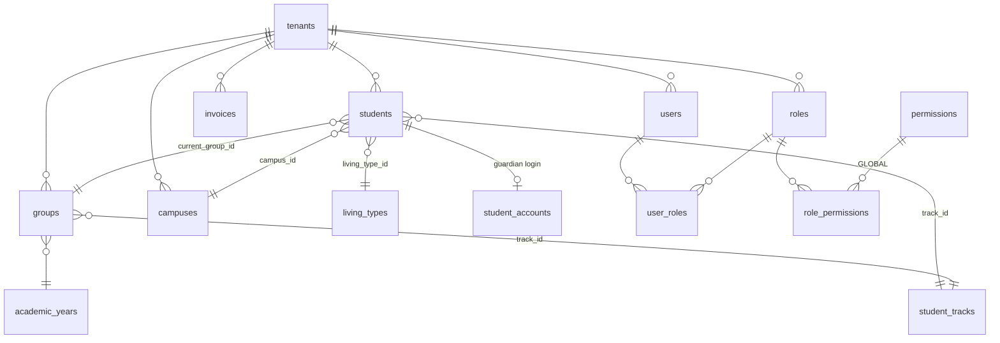

# 04 — Ma'lumotlar modeli

> **Hujjat maqomi:** Loyiha · **Oxirgi yangilanish:** 2026-07-15
> **Manba fayl:** [`apps/api/prisma/schema.prisma`](../apps/api/prisma/schema.prisma) — bu hujjat uni
> **tushuntiradi, almashtirmaydi**. Ziddiyat bo'lsa **schema.prisma g'olib**.
> **Qamrov:** 69 model, 1 enum (`SubjectRole`), 2 migratsiya.

---

## 0. Bu hujjat nima uchun

Ziyo — **ishlab turgan tizim**. Har kuni real xodimlar va ota-onalar ishlatadi.
Shuning uchun bu hujjat **"qanday qurish kerak edi"** haqida emas, **"hozir qanday qurilgan,
nega shunday, va nimani xavfsiz yaxshilash mumkin"** haqida.

Uch qoida:

1. **Model nomlari o'zgarmaydi.** 69 model, 28 modul, 37 294 qator backend ularga bog'langan.
2. **Har tanqid — aniq fayl va qator bilan.** Umumiy gap yozilmaydi.
3. **Har tavsiya — migratsiya yo'li bilan.** "Shunday qilish kerak" yetarli emas; "bugungi
   ma'lumotni yo'qotmasdan qanday o'tiladi" kerak.

Bu hujjatni o'qib chiqqach siz bilishingiz kerak: qaysi jadval qayerda, pul qanday saqlanadi,
nega ID'lar `BigInt`, va **nima buzuq** (spoiler: indekslar va migratsiyalar).

---

## 1. Konvensiyalar

### 1.1. Tabel

| Qoida | Hozirgi holat | Sabab / hukm |
|---|---|---|
| Prisma model nomi | **`snake_case`, ko'plik** (`student_tracks`) | ⚠️ Prisma'ning **odatiy uslubi emas**. Pastda batafsil |
| Ustun nomi | `snake_case` (`tenant_id`, `created_by_user_id`) | PostgreSQL konvensiyasi. **To'g'ri** |
| PK | `BigInt @default(autoincrement())` | 4-bo'limda batafsil. **To'g'ri** |
| Vaqt (moment) | `DateTime @db.Timestamptz(6)` | Timezone bilan. Tenant `timezone` default `Asia/Tashkent`. **To'g'ri** |
| Vaqt (kun) | `DateTime @db.Date` | `session_date`, `start_date` — kun, moment emas. **To'g'ri** |
| Vaqt (soat) | `DateTime @db.Time(6)` | `timetable_lessons.starts_at`. **To'g'ri** |
| Pul | `Decimal @db.Decimal(12, 2)` | 5-bo'limda batafsil. **Deyarli to'g'ri** |
| Enum | Faqat **1 ta** (`SubjectRole`) | ⚠️ **43 cheklangan ustun `String`.** Allaqachon zarar keltirgan. 1.3-bo'lim |
| `created_at` | Deyarli hamma jadvalda | **To'g'ri** |
| `updated_at` | **Deyarli hech qayerda** | ⚠️ Faqat `users`, `notification_preferences`, `student_id_sequences` |
| Soft delete | `students.archived_at` | ⚠️ **Faqat `students`da**. 7-bo'limda |
| Migration | Majburiy, `db push` hech qachon | ⚠️ **Qoida buzilgan.** 8-bo'limda |

### 1.2. ⚠️ Nega `snake_case` ko'plik model nomlari qoladi

Prisma'ning rasmiy va keng tarqalgan uslubi — **`PascalCase`, birlik**:

```prisma
// Prisma odatiy uslubi (bizda EMAS)
model StudentTrack {
  id       BigInt @id @default(autoincrement())
  tenantId BigInt @map("tenant_id")

  @@map("student_tracks")
}
```

Ziyo'da esa:

```prisma
// apps/api/prisma/schema.prisma:885 — MAVJUD HOLAT
model student_tracks {
  id          BigInt   @id @default(autoincrement())
  tenant_id   BigInt
  name        String
  description String?
  color       String?
  created_at  DateTime @default(now()) @db.Timestamptz(6)
  // ...
  @@unique([tenant_id, name])
}
```

**Nega shunday bo'lib qolgan?** Schema `prisma db pull` (introspection) bilan mavjud
PostgreSQL bazasidan generatsiya qilingan. Introspection jadval nomini o'zgartirmaydi —
DB'da `student_tracks` bo'lsa, model ham `student_tracks` bo'ladi. Buni `@@map` bilan
"chiroyli"lashtirish mumkin edi, lekin qilinmagan.

**Nega o'zgartirilmaydi — halol hisob:**

| Argument | Baho |
|---|---|
| Bu Prisma konvensiyasiga zid | ✅ Rost. Lekin bu **estetika**, xato emas |
| TypeScript'da `prisma.student_tracks.findMany()` g'alati ko'rinadi | ✅ Rost. Lekin ishlaydi |
| O'zgartirish narxi | ❌ **69 model × har biri o'rtacha 10+ ishlatilish nuqtasi**. `@@map` qo'shsa ham, generatsiya qilingan client tipi o'zgaradi → **37 294 qator backend'ni qayta ko'rib chiqish** |
| O'zgartirish foydasi | Nol funksional foyda. Faqat "chiroyliroq" |
| Xavf | Har almashtirish — potensial bag. Testlar **amalda yo'q** (1 ta placeholder) → xatoni tutadigan to'siq yo'q |

**Hukm: qoladi.** Bu — texnik qarz emas, **uslub farqi**. Uni to'lash uchun sabab yo'q.

⚠️ **Lekin bitta shart:** bu qaror **yozib qo'yilishi** kerak, aks holda har yangi
dasturchi "buni tuzataymi?" deb so'raydi. Shuning uchun bu bo'lim mavjud.

**Agar kelajakda baribir o'zgartirilsa** — faqat shu tartibda:
1. Avval testlar (tenant izolyatsiya testi birinchi)
2. `@@map` qo'shish, model nomini o'zgartirish — **bitta modul bittadan**
3. Har qadamda migratsiya generatsiya qilinadi va u **bo'sh** bo'lishi kerak (`@@map`
   DB'ni o'zgartirmaydi). Bo'sh emas bo'lsa — xato qilingan

### 1.3. ⚠️ O'lchangan fakt: 69 model — 1 ta enum

Bu — hujjatdagi ikkinchi markaziy strukturaviy topilma (birinchisi — 2.11).

#### 1.3.1. Raqam

```bash
$ grep -c "^enum " apps/api/prisma/schema.prisma
1
```

Yagona enum:
```prisma
// apps/api/prisma/schema.prisma:979
enum SubjectRole {
  MAIN
  SECONDARY
  MANDATORY
}
```

Va u **to'g'ri ishlatilgan** — DTM 189 ning o'zagida:
```prisma
// apps/api/prisma/schema.prisma:985
model track_subjects {
  id         BigInt      @id @default(autoincrement())
  tenant_id  BigInt
  track_id   BigInt
  subject_id BigInt
  role       SubjectRole @default(MANDATORY)   // ← DB kafolati
  created_at DateTime    @default(now()) @db.Timestamptz(6)
  // ...
  @@unique([tenant_id, track_id, subject_id])
}
```

**Qolgan hamma cheklangan qiymat — `String`.**

#### 1.3.2. To'liq ro'yxat — schema skan qilindi

**A. `VarChar` bilan — 34 ta ustun** (`@db.VarChar(n)` = "men cheklanganman" degan
niyat, lekin kafolatsiz):

| Model | Ustun | Tur | Haqiqiy qiymatlar (DTO'dan) |
|---|---|---|---|
| `announcements` | `audience` | `VarChar(20)` | `STAFF` `GUARDIANS` `PUBLIC` `DISPLAY` `ALL` |
| `assessments` | `type` | `VarChar(30)` | `WEEKLY_TEST` `BLOCK_TEST` `WRITTEN` `CONTROL` `MOCK` |
| `attendance_marks` | `status` | `VarChar(10)` | `PRESENT` `ABSENT` `LATE` `EXCUSED` |
| `attendance_sessions` | `type` | `VarChar(20)` | `CLASS` `STUDY_HALL` `EVENT` |
| `audit_logs` | `actor_type` | `VarChar(20)` | `USER` `STUDENT_ACCOUNT` ? |
| `audit_logs` | `action` | `VarChar(20)` def `OTHER` | `CREATE` `UPDATE` `DELETE` `OTHER` ? |
| `auth_attempts` | `account_type` | `VarChar(20)` | `USER` `STUDENT_ACCOUNT` |
| `auth_locks` | `account_type` | `VarChar(20)` | `USER` `STUDENT_ACCOUNT` |
| `auth_sessions` | `account_type` | `VarChar(20)` | `USER` `STUDENT_ACCOUNT` |
| `award_recipients` | `recipient_type` | `VarChar(10)` | `STUDENT` `GROUP` |
| `awards` | `award_type` | `VarChar(20)` | `GIFT` `STIPEND` `CERTIFICATE` `BADGE` |
| `competition_entries` | `entry_type` | `VarChar(20)` | `STUDENT` `GROUP` |
| `competitions` | `mode` | `VarChar(20)` | ? |
| `discipline_actions` | `action_type` | `VarChar(20)` | ? |
| `display_items` | `item_type` | `VarChar(20)` | ? |
| `events` | `event_type` | `VarChar(20)` def `OTHER` | ? |
| `files` | `purpose` | `VarChar(30)?` | ? |
| `files` | `storage_provider` | `VarChar(20)` def `LOCAL` | `LOCAL` `S3` ? |
| `grade_snapshot_rows` | `risk_level` | `VarChar(10)` def `GREEN` | `GREEN` `YELLOW` `RED` |
| `grade_snapshots` | `period_type` | `VarChar(10)` | ? |
| **`invoices`** | **`type`** | **`VarChar(10)`** | **`COURSE` `MEAL` `DORM` `OTHER`** ⚠️ |
| `invoices` | `status` | `VarChar(20)` def `PENDING` | `PENDING` `PAID` `OVERDUE` `CANCELLED` `REFUNDED` |
| `leave_requests` | `requested_by` | `VarChar(20)` def `STUDENT_VERBAL` | ? |
| `leave_requests` | `status` | `VarChar(20)` def `PENDING` | `PENDING` `APPROVED` ... |
| `notification_preferences` | `account_type` | `VarChar(20)` | `USER` `STUDENT_ACCOUNT` |
| `notification_templates` | `channel` | `VarChar(10)` | `IN_APP` `TELEGRAM` `SMS` |
| `notifications` | `channel` | `VarChar(10)` | `IN_APP` `TELEGRAM` `SMS` |
| `notifications` | `status` | `VarChar(10)` def `QUEUED` | `QUEUED` `SENT` `FAILED` |
| `payments` | `source` | `VarChar(10)` def `MANUAL` | `MANUAL` `ONLINE` |
| `payments` | `method` | `VarChar(10)` def `CASH` | `CASH` `CARD` `TRANSFER` `OTHER` |
| **`student_outcomes`** | **`outcome_status`** | **`VarChar(30)` def `UNKNOWN`** | **`EARLY_ADMITTED` `ON_TIME_ADMITTED` `NOT_ADMITTED` `UNKNOWN`** ⚠️ |
| `student_risk_scores` | `level` | `VarChar(10)` | `GREEN` `YELLOW` `RED` |
| `students` | `status` | `VarChar(20)` def `ACTIVE` | `ACTIVE` `WITHDRAWN` `EXPELLED` `GRADUATED` |
| `violations` | `severity` | `VarChar(10)` def `LOW` | `LOW` `MEDIUM` `HIGH` ? |

**B. `VarChar` ham yo'q — 9 ta ustun** (cheklangan niyat **umuman ifodalanmagan**):

| Model | Ustun | Default |
|---|---|---|
| `dorm_student_charges` | `status` | `PENDING` |
| `meal_student_charges` | `status` | `PENDING` |
| `dorm_student_charges` | `currency` | `UZS` |
| `meal_student_charges` | `currency` | `UZS` |
| `dorm_announcement_prices` | `currency` | `UZS` |
| `meal_announcement_prices` | `currency` | `UZS` |
| `invoices` | `currency` | `UZS` |
| `event_participants` | `role` | `PARTICIPANT` |
| `tenants` | `timezone` | `Asia/Tashkent` |

⚠️ **`currency` — 5 ta jadvalda cheksiz `String`.** `Decimal(12,2)` bilan pul aniq
saqlanadi, lekin **valyutasi** — validatsiyasiz matn. `'UZS'`, `'uzs'`, `'сум'` — hammasi
qabul qilinadi. Bu **pul ustuni** (5-bo'lim).

`?` — DTO'da `@IsIn` topilmadi, ya'ni qiymatlar to'plami **hujjatlashtirilmagan**. Ular
`SELECT DISTINCT` bilan aniqlanishi kerak. **Bu o'z-o'zidan topilma.**

#### 1.3.3. Nega bu ma'lumot modeli muammosi

**Validatsiya faqat DTO qatlamida.** `grep -c "@IsIn(" apps/api/src` → **70 ta**. Ya'ni
qoida **bor**, lekin u `class-validator` da:

```ts
// apps/api/src/modules/certificates/dto/set-outcome.dto.ts:28
@IsIn(['EARLY_ADMITTED', 'ON_TIME_ADMITTED', 'NOT_ADMITTED', 'UNKNOWN'])
```

**HTTP → DTO yo'li himoyalangan.** Lekin **bazaga boradigan boshqa har qanday yo'l — yo'q:**
seed skripti, migratsiya, qo'lda `psql`, kelajakdagi endpoint, boshqa servis, ichki
`prisma.*.update()` chaqiruvi. **Baza rozi bo'ladi.**

Bu — kanonning markaziy tezisi (**"kafolatni intizomdan strukturaga ko'chirish"**) ning
aynan takrori, faqat tenant emas, **domen qiymatlari** uchun.

**⚠️ Va bu allaqachon buzilgan — nazariy xavf emas:**

```
commit a3dab3064437b18c4c88ff376c0aacd6d6cb6d65
Date:   Tue May 19 14:38:18 2026 +0500

    fix: production bugs — timetable dayOfWeek coercion, billing fields,
         certificates outcomeStatus, CSV limit

    - CertificatesPage: outcomeStatus field + correct enum values (EARLY_ADMITTED etc)
```

Kommit sarlavhasi: **"production bugs"**. Ya'ni `outcome_status` qiymatlari
**production'da noto'g'ri edi** va tuzatildi. Agar `outcome_status` PostgreSQL enum
bo'lganida — bu bag **yozuv paytida** portlardi, oylar keyin emas.

#### 1.3.4. ⚠️ `outcome_status` — eng qimmat holat

Bu ustun — kanon (4.2) bo'yicha **akademiyaning asosiy KPI'si**: "nechta o'quvchi qayerga
kirdi".

```prisma
// apps/api/prisma/schema.prisma:829
outcome_status String @default("UNKNOWN") @db.VarChar(30)
```

Va u **`groupBy`** da ishlatiladi:
```ts
// apps/api/src/modules/certificates/certificates.service.ts:690
by: ['outcome_status'],
```

**Muammo:** `EARLY_ADMITTED` va `early_admitted` va `EARLY_ADMITED` (bitta `T`) —
PostgreSQL uchun **uch xil qiymat**. `GROUP BY` ularni **uch alohida guruh** qiladi.

```
Kutilgan:                    Haqiqiy (bitta typo bilan):
EARLY_ADMITTED    │ 47       EARLY_ADMITTED    │ 46
ON_TIME_ADMITTED  │ 112      EARLY_ADMITED     │ 1     ← yangi "guruh"
NOT_ADMITTED      │ 8        ON_TIME_ADMITTED  │ 112
UNKNOWN           │ 3        NOT_ADMITTED      │ 8
                             UNKNOWN           │ 3
```

⚠️ **Hech narsa xato bermaydi.** Exception yo'q, log yo'q, ogohlantirish yo'q. Hisobot
**jimgina noto'g'ri**. Va bu — akademiya rahbariga ko'rsatiladigan raqam.

**Enum bo'lganida:** `INSERT ... 'EARLY_ADMITED'` →
`ERROR: invalid input value for enum "OutcomeStatus"`. **Darhol, yozuv paytida.**

#### 1.3.5. ⚠️ `invoices.type` — pul, va bu yerda HAQIQIY BAG bor

```prisma
// apps/api/prisma/schema.prisma:533
type String @db.VarChar(10)
```

DTO ruxsat beradi:
```ts
// apps/api/src/modules/billing/dto/billing.dto.ts:262
@IsIn(['COURSE', 'MEAL', 'DORM', 'OTHER'])    // ← TO'RT qiymat
```

Agregatsiya esa:
```ts
// apps/api/src/modules/billing/billing.service.ts:1565-1574
payments.forEach((p) => {
  const key = monthKey(p.paid_at);
  if (monthMap.has(key)) {
    const data = monthMap.get(key);
    const amount = Number(p.paid_amount) / 1000;
    if (p.invoices.type === 'COURSE') data.kurs += amount;
    else if (p.invoices.type === 'MEAL') data.ovqat += amount;
    else if (p.invoices.type === 'DORM') data.yotoq += amount;
    // ⚠️ `else` YO'Q — 'OTHER' JIMGINA TASHLAB YUBORILADI
  }
});
```

**Bu — typo emas, mavjud bag.** `OTHER` — DTO tomonidan **ruxsat etilgan yaroqli
qiymat**. Ya'ni:

1. Xodim `type: 'OTHER'` bilan invoice yaratadi — API **qabul qiladi** ✅
2. Ota-ona to'laydi — `payments` yoziladi ✅
3. Oylik daromad diagrammasi — **bu to'lov YO'Q** ❌

Pul kelgan, bazada bor, **hisobotda yo'q**. Va hech narsa xato bermaydi.

⚠️ **Va ikkita DTO bir xil ustun uchun IKKI XIL to'plamga ruxsat beradi:**
```ts
// apps/api/src/modules/billing/dto/billing.dto.ts:262
@IsIn(['COURSE', 'MEAL', 'DORM', 'OTHER'])   // bir endpoint

// apps/api/src/modules/billing/dto/billing.dto.ts:344
@IsIn(['COURSE', 'OTHER'])                    // boshqa endpoint
```
Bitta ustun, ikkita haqiqat. **Enum bo'lganida — bitta ta'rif, bitta joy, TypeScript
turi avtomatik.**

⚠️ **Enum bu bagni tuzatmaydi** — `OTHER` baribir `else` ga tushmaydi. Lekin enum
`invoices.type` ni **TypeScript union turiga** aylantiradi (`'COURSE' | 'MEAL' | 'DORM' |
'OTHER'`), va shunda TypeScript `switch` da **exhaustiveness** tekshiruvini beradi:

```ts
// Enum bilan — kompilyator yetishmagan shohobchani TUTADI
switch (p.invoices.type) {
  case 'COURSE': data.kurs += amount; break;
  case 'MEAL':   data.ovqat += amount; break;
  case 'DORM':   data.yotoq += amount; break;
  case 'OTHER':  data.boshqa += amount; break;
  default: {
    const _exhaustive: never = p.invoices.type;  // ← 'OTHER' unutilsa: COMPILE ERROR
    throw new Error(`Unhandled invoice type: ${_exhaustive}`);
  }
}
```

**Ya'ni enum foydasi ikki qatlamli:** DB kafolati **va** kompilyator kafolati. Bu bag —
ikkinchisining yo'qligining natijasi.

#### 1.3.6. Halol tahlil — "hammasini enum qil" NOTO'G'RI javob

| | Enum foydasi | Enum narxi |
|---|---|---|
| Kafolat | ✅ DB darajasida. Chetlab o'tib bo'lmaydi | — |
| TypeScript | ✅ Union turi avtomatik, exhaustiveness | — |
| `GROUP BY` | ✅ Ishonchli | — |
| Hujjat | ✅ Qiymatlar to'plami schema'da ko'rinadi | — |
| **Yangi qiymat** | — | ⚠️ **Har qiymat = migratsiya** |
| **Qaytarish** | — | ⚠️ `ALTER TYPE ... ADD VALUE` — **qiymat o'chirilmaydi** |
| **Tranzaksiya** | — | ⚠️ Eski PostgreSQL'da `ADD VALUE` tranzaksiya ichida ishlamaydi |
| Tenant farqi | — | ❌ **Enum global** — tenant o'z qiymatini qo'sha olmaydi |

**Ya'ni enum — tez-tez o'zgaradigan yoki tenant bo'yicha farq qiladigan ro'yxat uchun
NOTO'G'RI.** Uch guruhga ajratiladi:

**Guruh 1 — Enum bo'lishi SHART** (domen belgilagan, o'zgarmaydi, foydalanuvchi
**hech qachon** qo'shmaydi):

| Ustun | Nega |
|---|---|
| **`student_outcomes.outcome_status`** | ⚠️ **KPI.** `groupBy` da. Allaqachon buzilgan (a3dab30). **Birinchi navbat** |
| **`invoices.type`** | ⚠️ **Pul.** `billing.service.ts:1570` bagi. Shohobchalar kod bilan bog'langan |
| **`attendance_marks.status`** | `PRESENT`/`ABSENT`/`LATE`/`EXCUSED` — domen. Yangi status = yangi kod |
| **`assessments.type`** | DTM formatlari. `WEEKLY_TEST`/`BLOCK_TEST`/... — domen |
| `students.status` | `ACTIVE`/`WITHDRAWN`/`EXPELLED`/`GRADUATED` — va `archived_at` mantiqi shunga bog'liq (`students.service.ts:803`) |
| `student_risk_scores.level` | `GREEN`/`YELLOW`/`RED` — `levelFromScore()` (`risk.service.ts:22-25`) qattiq belgilagan |
| `invoices.status` | Pul holati. `PENDING`/`PAID`/`OVERDUE`/`CANCELLED`/`REFUNDED` |
| `auth_*.account_type` | `USER`/`STUDENT_ACCOUNT` — arxitektura, domen emas. O'zgarmaydi |
| `notifications.channel` | `IN_APP`/`TELEGRAM`/`SMS` — har kanal = yangi kod integratsiyasi |

**Guruh 2 — Lookup jadval bo'lishi kerak** (tenant bo'yicha farq qiladi yoki
foydalanuvchi qo'shadi):

✅ **`living_types` allaqachon shunday qilingan — va bu TO'G'RI QAROR:**
```prisma
// apps/api/prisma/schema.prisma:569
model living_types {
  id          BigInt   @id @default(autoincrement())
  tenant_id   BigInt              // ← har tenant O'Z turlarini yaratadi
  code        String
  name        String
  description String?
  is_active   Boolean  @default(true)
  // ...
  @@unique([tenant_id, code])
}
```
Yashash turi — **tenant qarori**. Bir akademiyada `DORM_4`/`DORM_2`/`HOME`, boshqasida
boshqacha. Enum bo'lganida — har yangi akademiya **migratsiya** talab qilardi. **Jadval —
to'g'ri tanlov. Tan olinadi.**

Nomzodlar (o'lchov kerak):
- `awards.award_type` — akademiya o'z mukofot turini qo'shishi mumkinmi?
- `violations.severity` / `rule_code` — intizom qoidalari tenant bo'yicha farq qiladimi?
- `discipline_actions.action_type` — xuddi shu savol
- `events.event_type`, `competitions.mode`, `display_items.item_type`

⚠️ Bular — **ochiq savol** (10-bo'lim). "Tenant buni sozlashi kerakmi?" — bu **biznes**
savoli, texnik emas. Javobsiz enum qilinmasin: enum qilingach, tenant sozlashi kerak
bo'lsa — **qaytarish qimmat**.

**Guruh 3 — `String` qolsin:**
- `tenants.timezone` — IANA zonalari. Ro'yxat **tashqi** (tzdata), enum bo'lolmaydi
- `files.purpose`, `files.storage_provider` — texnik metama'lumot, kengayadi
- `competitions.rules`, `announcements.body`, `violations.description` — erkin matn
- ⚠️ `currency` — **alohida holat**. Bugun faqat `UZS`. Enum bo'lsa — yangi valyuta =
  migratsiya. ISO 4217 lookup jadvali — ortiqcha. **Tavsiya:** `CHECK (currency = 'UZS')`
  hozircha, yoki DTO'da `@IsIn(['UZS'])`. Hech bo'lmasa **bitta** to'siq

#### 1.3.7. ⚠️ Migratsiya xavfi va to'g'ri tartib

**Enum migratsiyasi mavjud ma'lumotda yaroqsiz qiymat bo'lsa — YIQILADI.** Va u
`000000_init` kabi katta jadvalda **qulf** oladi.

**To'g'ri tartib — `outcome_status` misolida (eng aniq va eng qimmat):**

**Qadam 1 — O'LCHOV (majburiy, birinchi):**
```sql
-- Production'da real holat. Bu qadam TASHLAB KETILMAYDI.
SELECT outcome_status, COUNT(*)
FROM student_outcomes
GROUP BY outcome_status
ORDER BY COUNT(*) DESC;
```

Kutilgan: faqat 4 qiymat. **Agar boshqasi chiqsa — a3dab30 bagining qoldig'i.**

**Qadam 2 — TOZALASH (agar kerak bo'lsa):**
```sql
-- FAQAT 1-qadam natijasiga qarab. Ko'r-ko'rona ishlatilmaydi!
-- Har mapping qo'lda tasdiqlanadi — bu KPI ma'lumoti.
BEGIN;
UPDATE student_outcomes SET outcome_status = 'EARLY_ADMITTED'
  WHERE outcome_status IN ('early_admitted', 'EARLY_ADMITED');
-- ...1-qadamda topilgan har bir yaroqsiz qiymat uchun

-- Tekshirish: 0 bo'lishi SHART
SELECT COUNT(*) FROM student_outcomes
WHERE outcome_status NOT IN
  ('EARLY_ADMITTED','ON_TIME_ADMITTED','NOT_ADMITTED','UNKNOWN');
COMMIT;   -- faqat yuqoridagi 0 bo'lsa
```

⚠️ **Noma'lum qiymatni `UNKNOWN` ga aylantirish — MA'LUMOT YO'QOTISH.** "Qayerga
kirdi" — akademiyaning KPI'si. Har qator **qo'lda** ko'riladi.

**Qadam 3 — Enum migratsiyasi:**
```sql
-- apps/api/prisma/migrations/000003_outcome_status_enum/migration.sql

CREATE TYPE "OutcomeStatus" AS ENUM (
  'EARLY_ADMITTED', 'ON_TIME_ADMITTED', 'NOT_ADMITTED', 'UNKNOWN'
);

-- Default'ni vaqtincha olib tashlash — aks holda cast yiqiladi
ALTER TABLE "student_outcomes" ALTER COLUMN "outcome_status" DROP DEFAULT;

-- VarChar → enum. 2-qadam bajarilmagan bo'lsa — SHU YERDA YIQILADI (bu yaxshi)
ALTER TABLE "student_outcomes"
  ALTER COLUMN "outcome_status" TYPE "OutcomeStatus"
  USING "outcome_status"::"OutcomeStatus";

ALTER TABLE "student_outcomes"
  ALTER COLUMN "outcome_status" SET DEFAULT 'UNKNOWN';
```

Va schema:
```prisma
enum OutcomeStatus {
  EARLY_ADMITTED
  ON_TIME_ADMITTED
  NOT_ADMITTED
  UNKNOWN
}

model student_outcomes {
  // ...
  outcome_status OutcomeStatus @default(UNKNOWN)   // @db.VarChar(30) OLIB TASHLANADI
}
```

⚠️ **`ALTER COLUMN ... TYPE` — `ACCESS EXCLUSIVE` qulf oladi va jadvalni qayta yozadi.**
`student_outcomes` kichik (o'quvchiga 1 qator) → tez. **Lekin `attendance_marks` ga
xuddi shu qilinsa — u eng katta jadvallardan biri.** U uchun ish vaqtidan tashqari
oyna kerak.

**Qadam 4 — Kod:**
`certificates.service.ts:475,488` — `outcome_status: args.dto.outcomeStatus`. Prisma
endi `OutcomeStatus` turini kutadi. DTO `string` qaytaradi → **TypeScript xato beradi**.
Bu — **yaxshi**: kompilyator tur chegarasini majburlaydi. `@IsIn` DTO'da **qoladi** (u
HTTP chegarasida 400 qaytaradi, DB xatosi 500 emas).

**Tartib — muzokara qilinmaydi:** o'lchov → tozalash → enum. **Hech qachon teskari.**

**Ustuvorlik:** bu ish — **8-bo'lim (migratsiya drifti) tuzatilgandan KEYIN**. Bugun
migratsiya quvuri ishonchsiz (68 ≠ 69); unga yangi migratsiya qo'shish — buzuq poydevorga
qurish. Va **har enum bittadan alohida migratsiya** — 34 ustun bitta migratsiyada emas.

**Boshlash nuqtasi: `outcome_status` va `invoices.type`.** Ikkalasi kichik jadval, aniq
qiymatlar to'plami, va ikkalasida ham **hujjatlashtirilgan zarar** bor (a3dab30 va
`billing.service.ts:1570`).

---

## 2. 69 modelning to'liq xaritasi

Guruhlash — **domen bo'yicha**, schema fayldagi alifbo tartibi bo'yicha emas. Nomlar
`schema.prisma` dan **so'zma-so'z** olingan.

Jami: 13 + 10 + 4 + 5 + 2 + 8 + 4 + 2 + 5 + 16 = **69** ✅

### 2.1. Tenant va identity (13 model)

| Model | tenant_id | Vazifa |
|---|:---:|---|
| `tenants` | — | Ildiz. `slug` **global unique**. `timezone` default `Asia/Tashkent` |
| `users` | ✅ | Xodimlar. `@@unique([tenant_id, username])` |
| `roles` | ✅ | Rol. `@@unique([tenant_id, name])` — har tenant o'z rollariga ega |
| `permissions` | ❌ | ⚠️ **Global!** `code` global unique. Pastda muhokama |
| `role_permissions` | ❌ | M:N. PK `[role_id, permission_id]` |
| `user_roles` | ❌ | M:N. PK `[user_id, role_id]` |
| `auth_sessions` | ✅ | Refresh token (hash). `expires_at`, `revoked_at` |
| `auth_attempts` | ✅ | Brute-force uchun urinishlar jurnali |
| `auth_locks` | ✅ | Qulflar. `@@unique([tenant_id, account_type, username_or_id])` |
| `audit_logs` | ✅ | Kim/nima/qachon. `before_data` / `after_data` — `String` (JSON emas!) |
| `student_accounts` | ✅ | **Ota-ona (guardian) login'i**. `@@unique([tenant_id, student_login_id])` |
| `system_settings` | ✅ | Key-value. `@@unique([tenant_id, key])` |
| `student_id_sequences` | ✅ | `tenant_id @unique`, `last_seq` → MA-0001 generatsiyasi |

⚠️ **`permissions` global — bu qaror mi yoki unutishmi?**

```prisma
// apps/api/prisma/schema.prisma:720
model permissions {
  id               BigInt             @id @default(autoincrement())
  code             String             @unique   // ← tenant_id YO'Q
  description      String?
  role_permissions role_permissions[]
}
```

Bu **ehtimol to'g'ri**: ruxsat kodlari (`students.create`, `billing.read`) — tizim
konstantalari, tenant ma'lumoti emas. Har tenant o'z `roles` ini yaratadi va ularga shu
umumiy `permissions` ni bog'laydi.

**Lekin `role_permissions` va `user_roles` da ham `tenant_id` yo'q** — va bu **xavfliroq**:

```prisma
// apps/api/prisma/schema.prisma:727
model role_permissions {
  role_id       BigInt
  permission_id BigInt
  // tenant_id YO'Q
  @@id([role_id, permission_id])
}

// apps/api/prisma/schema.prisma:1091
model user_roles {
  user_id BigInt
  role_id BigInt
  // tenant_id YO'Q
  @@id([user_id, role_id])
}
```

`user_roles` ga A tenantining `user_id` si va B tenantining `role_id` si yozilsa — **DB
buni to'xtatmaydi**. Yagona himoya — servis kodi.

⚠️ **Bu — jiddiy savol va u alohida tahlil qilingan: 2.11.4-bo'limga qarang.**
Qisqacha: `roles` da `tenant_id` **bor**, lekin `user_roles` ning ikki FK'si
**mustaqil** — ya'ni cross-tenant rol berish **FK darajasida to'silmagan**, va agar
o'sha rol `superadmin` bo'lsa — imtiyoz oshirilishi. Yechim (composite FK) va
migratsiya yo'li — **2.11.7-bo'lim, Bosqich 0**.

### 2.2. Akademik (10 model)

| Model | tenant_id | Vazifa |
|---|:---:|---|
| `academic_years` | ✅ | O'quv yili. `is_current`. `@@unique([tenant_id, name])` |
| `campuses` | ✅ | Bino/filial. `lat`/`lng` — `Decimal(10,7)` |
| `groups` | ✅ | Sinf/guruh. `@@unique([tenant_id, academic_year_id, name])`. `curator_user_id` |
| `group_subjects` | ❌ | M:N guruh↔fan. PK `[group_id, subject_id]` |
| `subjects` | ✅ | Fan. `@@unique([tenant_id, name])`. ⚠️ `track_id` bor — pastda |
| `student_tracks` | ✅ | **Yo'nalish** (DTM). `@@unique([tenant_id, name])` |
| `track_subjects` | ✅ | **DTM 189 ning o'zagi**. `role: SubjectRole` |
| `cohorts` | ✅ | Bitiruv to'lqini. `graduation_year`. `@@unique([tenant_id, label])` |
| `student_cohort` | ❌ | `student_id @id` — o'quvchi **bitta** cohort'da |
| `students` | ✅ | **Markaziy model.** 21 ta bog'lanish |

⚠️ **`subjects.track_id` va `track_subjects` — ikkita yo'l, bitta manzil**

```prisma
// apps/api/prisma/schema.prisma:949
model subjects {
  id             BigInt          @id @default(autoincrement())
  tenant_id      BigInt
  name           String
  code           String?
  is_core        Boolean         @default(true)
  track_id       BigInt?         // ← 1-yo'l: to'g'ridan-to'g'ri
  // ...
  track_subjects track_subjects[]  // ← 2-yo'l: role bilan
}
```

Fan trackka **ikki xil** bog'lanadi:
- `subjects.track_id` — bitta track, role'siz
- `track_subjects` — ko'p track, **har biriga `role`** (MAIN/SECONDARY/MANDATORY)

Bular **ziddiyatga tushishi mumkin**: `subjects.track_id = 5`, lekin `track_subjects` da shu
fan uchun `track_id = 7`. Qaysi biri haqiqat?

**Ehtimoliy tarix:** `subjects.track_id` — eski, sodda model. `track_subjects` — DTM 189
qoidasi kelganda qo'shilgan to'g'ri model. Eskisi o'chirilmagan.

**Tavsiya:** `track_subjects` — haqiqat manbai. `subjects.track_id` **deprecated** deb
belgilanadi:
1. Avval o'lchov: `SELECT COUNT(*) FROM subjects WHERE track_id IS NOT NULL` —
   ishlatiladimi umuman?
2. Kod tekshiruvi: `grep -rn "track_id" apps/api/src/modules/subjects/`
3. Ishlatilmasa → migratsiya bilan ustun o'chiriladi
4. Ishlatilsa → `track_subjects` ga ko'chiriladi, keyin o'chiriladi

⚠️ Bu **taxmin**. Tasdiqlash kerak — `subjects.service.ts` va `tracks.service.ts` o'qilsin.

### 2.3. Baholash (4 model)

| Model | tenant_id | Vazifa |
|---|:---:|---|
| `assessments` | ✅ | Imtihon/test. `type` VarChar(30), `max_score` Decimal(8,2), `weight` Decimal(6,3) |
| `assessment_scores` | ❌ | Ball. PK `[assessment_id, student_id]` |
| `grade_snapshots` | ✅ | Davriy kesim. `period_type`, `period_start`, `period_end` |
| `grade_snapshot_rows` | ❌ | Kesim qatori. PK `[snapshot_id, student_id]`. `rank`, `risk_level` |

⚠️ **Muhim: `grades` modeli YO'Q.** Sizning ro'yxatingizda `grades(?)` bor edi — schema'da
bunday model **yo'q**. Ball `assessment_scores` da yashaydi.

⚠️ **Muhim: `ranking` modeli ham YO'Q.** `ranking` — **modul**, jadval emas. Reyting
`assessment_scores` dan **hisoblab chiqariladi** yoki `grade_snapshot_rows.rank` da
muzlatiladi. Bu — **to'g'ri dizayn**: reyting hosila ma'lumot, uni saqlash =
ziddiyat manbai.

⚠️ **DTM 189 qoidasi bu yerda YO'Q — kanondagi asosiy muammo:**

```prisma
// apps/api/prisma/schema.prisma:53
model assessments {
  id                        BigInt   @id @default(autoincrement())
  tenant_id                 BigInt
  academic_year_id          BigInt
  group_id                  BigInt
  subject_id                BigInt
  type                      String   @db.VarChar(30)
  title                     String
  max_score                 Decimal  @default(100) @db.Decimal(8, 2)  // ← 100? 189 emas?
  weight                    Decimal  @default(1.000) @db.Decimal(6, 3)
  held_at                   DateTime @db.Timestamptz(6)
  created_by_user_id        BigInt?
  is_published_to_guardians Boolean  @default(false)
  created_at                DateTime @default(now()) @db.Timestamptz(6)
  // ...
}
```

`max_score` default **100**, `Decimal(8,2)` → `999999.99` gacha qabul qiladi. DTM
93/63/11 qoidasi bu yerda **yo'q**. U faqat frontendda:
`apps/web/src/pages/staff/AssessmentsPage.tsx:503,516,710,719,727`.

Ya'ni `POST /assessments` ga `{ type: "BLOCK_TEST", max_score: 500 }` yuborilsa — **API
qabul qiladi**. Ma'lumot qatlami domen qoidasini bilmaydi.

**Bu ma'lumot modeli muammosimi?** Qisman. Ikki yechim:
- **(a) Domen qatlamida:** `assessments.service.ts` da `type` + `track_subjects.role` ga
  qarab `max_score` tekshiriladi. **Arzon, tez, tavsiya etiladi**
- **(b) DB darajasida:** `CHECK` constraint. Lekin `max_score` ruxsat etilgan qiymati
  `track_subjects.role` ga bog'liq — bu **boshqa jadval**. CHECK buni ko'ra olmaydi
  (trigger kerak). **Qimmat, tavsiya etilmaydi**

**Hukm:** (a). Bu ma'lumot modeli emas, domen qatlami vazifasi. Bu hujjat faqat muammoni
qayd etadi; yechim — assessments moduli TZ'sida.

### 2.4. Davomat va jadval (5 model)

| Model | tenant_id | Vazifa |
|---|:---:|---|
| `attendance_sessions` | ✅ | Sessiya. `session_date` Date, `type` VarChar(20), `period_no` SmallInt |
| `attendance_marks` | ❌ | Belgi. PK `[session_id, student_id]`. `status` VarChar(10) |
| `timetable` | ✅ | Jadval konteyner |
| `timetable_lessons` | ❌ | Dars. `@@unique([timetable_id, day_of_week, period_no])` |
| `leave_requests` | ✅ | Ruxsat so'rovi. `status` default `PENDING` |

⚠️ **Sizning ro'yxatingizda `attendance` va `leaves` bor edi** — aniq nomlar
`attendance_sessions` / `attendance_marks` va `leave_requests`.

⚠️ **`attendance_sessions` da schema ↔ migratsiya drift bor** — 8-bo'limda batafsil. Bu
hujjatdagi **eng jiddiy topilmalardan biri**.

### 2.5. Intizom (2 model)

| Model | tenant_id | Vazifa |
|---|:---:|---|
| `violations` | ✅ | Qoidabuzarlik. `severity` default `LOW`. `evidence_file_id` → `files` |
| `discipline_actions` | ✅ | Chora. `action_type`, `is_active`, `related_assessment_id` |

Ikkisi **ikki tomonlama** bog'langan:
- `violations.linked_discipline_action_id` → `discipline_actions.id`
- `discipline_actions.violations[]` ← teskari

`discipline_actions.related_assessment_id` → `assessments.id` — ya'ni chora imtihon
natijasiga bog'lanishi mumkin (masalan, ko'chirish).

### 2.6. Yotoqxona (8 model)

| Model | tenant_id | Vazifa |
|---|:---:|---|
| `dorms` | ✅ | Yotoqxona. `campus_id?` |
| `dorm_rooms` | ❌ | Xona. `@@unique([dorm_id, room_code])`. `capacity`, `gender_policy` |
| `student_room_assignments` | ✅ | Joylashuv tarixi. `start_date` / `end_date?` |
| `living_types` | ✅ | **Yashash turi.** `@@unique([tenant_id, code])` — narx o'qi |
| `dorm_billing_months` | ✅ | Hisob oyi. `@@unique([tenant_id, month_key])` |
| `dorm_payment_announcements` | ✅ | To'lov e'loni. `@@unique([tenant_id, dorm_month_id])` — oyiga bitta |
| `dorm_announcement_prices` | ❌ | Narx. PK `[dorm_announcement_id, living_type_id]` |
| `dorm_student_charges` | ✅ | O'quvchi hisobi. `@@unique([dorm_announcement_id, student_id])` |

**Bu — schema'dagi eng nozik ishlangan domen.** Naqsh:

```
dorm_billing_months (oy)
    └─ dorm_payment_announcements (e'lon, oyiga bitta)
          ├─ dorm_announcement_prices (living_type × narx)   ← narx JADVALI
          └─ dorm_student_charges (o'quvchi × summa)         ← hisoblangan HISOB
                └─ invoice_id? → invoices                     ← moliyaga ulanish
```

**Nega yaxshi:** narx e'londa **muzlatiladi** (`dorm_announcement_prices.price_amount`).
`living_types` narxi keyin o'zgarsa — eski e'lon o'z narxini saqlaydi. Bu — **temporal
to'g'rilik**, ko'p tizim buni buzadi.

**Nega `dorm_student_charges.invoice_id` nullable:** hisob yaratiladi, invoice keyinroq
generatsiya qilinadi. Ikki bosqichli jarayon.

### 2.7. Ovqatlanish (4 model)

| Model | tenant_id | Vazifa |
|---|:---:|---|
| `meal_weeks` | ✅ | Hafta. `@@unique([tenant_id, week_key])` |
| `meal_payment_announcements` | ✅ | E'lon. `@@unique([tenant_id, meal_week_id])` |
| `meal_announcement_prices` | ❌ | Narx. PK `[meal_announcement_id, living_type_id]` |
| `meal_student_charges` | ✅ | Hisob. `@@unique([meal_announcement_id, student_id])` |

**Yotoqxona naqshining aynan nusxasi**, faqat oy → **hafta**.

⚠️ **Kuzatuv:** dorm va meal shoxobchalari **strukturaviy jihatdan bir xil**. Farq:
`month_key`/`month_start`/`month_end` ↔ `week_key`/`week_start`/`week_end`. Bu — 8 model
o'rniga 5 bo'lishi mumkin edi (`billing_periods.period_type: MONTH|WEEK`).

**Lekin birlashtirish TAVSIYA ETILMAYDI.** Sabab: `billing.service.ts` 1610 qator va
ikkala shoxobchani ishlatadi. Birlashtirish = 2 jadvalni 1 ga ko'chirish + 1610 qatorni
qayta yozish + **testlarsiz**. Foyda — estetika. Xavf — real pul ma'lumoti.
**Takrorlanish bu yerda xavfdan arzonroq.**

### 2.8. Moliya (2 model)

| Model | tenant_id | Vazifa |
|---|:---:|---|
| `invoices` | ✅ | Hisob-faktura. `type` VarChar(10), `amount` Decimal(12,2), `status` |
| `payments` | ✅ | To'lov. `paid_amount` Decimal(12,2), `method`, `source`, `reference` |

```prisma
// apps/api/prisma/schema.prisma:529
model invoices {
  id                   BigInt    @id @default(autoincrement())
  tenant_id            BigInt
  student_id           BigInt
  type                 String    @db.VarChar(10)
  period_start         DateTime? @db.Date
  period_end           DateTime? @db.Date
  amount               Decimal   @db.Decimal(12, 2)
  currency             String    @default("UZS")
  status               String    @default("PENDING") @db.VarChar(20)
  due_date             DateTime? @db.Date
  // ...
}
```

⚠️ **`invoices.amount` — bu "jami" mi yoki "qoldiq"mi?** Schema aytmaydi. To'langan summa
`payments` da alohida. Qoldiq = `amount − SUM(payments.paid_amount)` — har safar
hisoblanadi (`billing.service.ts:1129`):

```ts
// apps/api/src/modules/billing/billing.service.ts:1129
const totalPaid = totalPaidAgg._sum.paid_amount ?? new Prisma.Decimal(0);
```

**Bu to'g'ri dizayn** — qoldiqni ustun sifatida saqlamaslik ziddiyatning oldini oladi.
Lekin **narxi bor**: har o'qishda agregatsiya. `payments` da index yo'q (6-bo'lim) →
`invoice_id` bo'yicha seq scan.

⚠️ **`payments` da `refund` yo'q.** To'lov qaytarilsa nima bo'ladi? Manfiy `paid_amount`mi?
`invoices.status` DTO'da `REFUNDED` **bor** (`billing.dto.ts:270`), lekin `payments` da
qaytarish yozuvi yo'q. Ya'ni invoice "qaytarilgan" deb belgilanadi, **pul izi esa yo'q**.
Ochiq savol (10-bo'lim).

⚠️ **`invoices.type` da HAQIQIY BAG bor** — `billing.service.ts:1570-1572` `OTHER` turini
jimgina tashlab yuboradi va u oylik daromad diagrammasidan yo'qoladi. To'liq tahlil:
**1.3.5-bo'lim**.

### 2.9. Analitika va tarix (5 model)

| Model | tenant_id | Vazifa |
|---|:---:|---|
| `student_risk_scores` | ✅ | Xavf skori. `score` Int, `level` VarChar(10), `signals` String |
| `student_outcomes` | ✅ | **Akademiyaning asosiy KPI'si.** `student_id @unique` |
| `student_timeline` | ✅ | Voqealar oqimi. `event_type`, `title`, `details` |
| `student_group_history` | ✅ | Guruh tarixi. `start_date` / `end_date?` |
| `student_living_history` | ✅ | Yashash tarixi. `start_date` / `end_date?` |

```prisma
// apps/api/prisma/schema.prisma:825
model student_outcomes {
  id                 BigInt    @id @default(autoincrement())
  tenant_id          BigInt
  student_id         BigInt    @unique          // ← o'quvchiga BITTA natija
  outcome_status     String    @default("UNKNOWN") @db.VarChar(30)
  institution_name   String?
  faculty_or_program String?
  decision_date      DateTime? @db.Date
  source             String?
  notes              String?
  // ...
}
```

⚠️ **`student_outcomes.student_id @unique` — bu qaror to'g'rimi?** O'quvchi bir yil kira
olmay, keyingi yili kirsa? Hozirgi model **eski natijani ustidan yozadi** — tarix
yo'qoladi. Va bu akademiyaning **asosiy KPI'si**.

Taqqoslash uchun: `student_risk_scores` da `@unique` **yo'q** — u tarixni saqlaydi
(har hisoblash yangi qator). Ya'ni loyihada ikkala naqsh ham bor, lekin `outcomes` —
muhimroq ma'lumot — tarixsiz.

**Ochiq savol (10-bo'lim):** bu ataylab qilinganmi? Agar yo'q bo'lsa, `@unique` ni olib
tashlash + `is_current Boolean` qo'shish — arzon migratsiya, ma'lumot yo'qolmaydi.

⚠️ **`student_risk_scores.signals` — `String`, `Json` emas.** Xuddi `audit_logs.before_data`
kabi. 5.4-bo'limda.

### 2.10. Boshqa (16 model)

| Model | tenant_id | Vazifa |
|---|:---:|---|
| `displays` | ✅ | Axborot ekrani. `campus_id?`, `is_active` |
| `display_playlists` | ✅ | Pleylist. `is_default` |
| `display_items` | ❌ | Element. PK `[playlist_id, sort_order]`. `payload` String |
| `events` | ✅ | Tadbir. `event_type`, `starts_at`, `ends_at?` |
| `event_participants` | ❌ | Ishtirokchi. PK `[event_id, student_id]`. `role` |
| `announcements` | ✅ | E'lon. `audience` VarChar(20), `is_published` |
| `notifications` | ✅ | Xabar. `channel`, `status` default `QUEUED` |
| `notification_templates` | ✅ | Shablon. `@@unique([tenant_id, code, channel])` |
| `notification_preferences` | ✅ | Sozlama. `telegram_chat_id`, `sms_phone` |
| `awards` | ✅ | Mukofot. `value_amount` Decimal(12,2)? |
| `award_recipients` | ❌ | Oluvchi. PK `[award_id, recipient_type, student_id, group_id]` |
| `competitions` | ✅ | Musobaqa. `mode` VarChar(20) |
| `competition_entries` | ❌ | ⚠️ **`tenant_id` YO'Q** — pastda |
| `competition_results` | ❌ | Natija. PK `[competition_id, entry_id]`. `rank`, `score?` |
| `certificates` | ✅ | Sertifikat. `file_id?` → `files` |
| `files` | ✅ | Fayl. **Yagona `@@index` egasi** |

⚠️ **`display_items.payload` va `announcements.body` — `String`.** `display_items.payload`
aniq JSON tashiydi (`item_type` ga qarab). Yana `Json` emas.

⚠️ **`competition_entries` da `tenant_id` yo'q, lekin `id` bor** — bu boshqa junction
jadvallardan farq qiladi:

```prisma
// apps/api/prisma/schema.prisma:237
model competition_entries {
  id             BigInt    @id @default(autoincrement())
  competition_id BigInt
  entry_type     String    @db.VarChar(20)
  student_id     BigInt?
  group_id       BigInt?
  name_display   String
  // tenant_id YO'Q — competitions orqali tiklanadi
}
```

`tenant_id` `competitions` orqali tiklanadi. Bu **qabul qilinadigan**, chunki entry
competition'siz mavjud bo'lolmaydi. Lekin so'rov `JOIN` talab qiladi — va `competitions`
da `tenant_id` indeksi yo'q (6-bo'lim).

⚠️ **`award_recipients` PK — 4 ustun, va `student_id`/`group_id` ikkalasi ham NOT NULL:**

```prisma
// apps/api/prisma/schema.prisma:163
model award_recipients {
  award_id       BigInt
  recipient_type String   @db.VarChar(10)   // 'STUDENT' | 'GROUP' ?
  student_id     BigInt                     // ← NOT NULL
  group_id       BigInt                     // ← NOT NULL
  note           String?
  @@id([award_id, recipient_type, student_id, group_id])
}
```

Agar mukofot **guruhga** berilsa — `student_id` ga nima yoziladi? NOT NULL, ya'ni biror
qiymat kerak. Taqqoslash: `competition_entries` da xuddi shu holat **nullable** bilan
hal qilingan (`student_id BigInt?`, `group_id BigInt?`).

**Bu ziddiyat.** Ehtimol `award_recipients` da sentinel qiymat (`0`?) ishlatiladi — bu
yashirin bag manbai. **Ochiq savol** (10-bo'lim): `awards.service.ts` tekshirilsin.

---

## 2.11. ⚠️ O'lchangan fakt: 18 modelda `tenant_id` YO'Q

Bu — bu hujjatdagi **markaziy strukturaviy topilma**. Yuqoridagi jadvallardagi
"tenant_id ✅/❌" ustuni bo'yicha to'liq hisob.

### 2.11.1. Raqam

```bash
$ awk '/^model /{n=$2} /tenant_id/{if(n)has[n]=1} /^}/{if(n && !has[n]) print n; n=""}' \
    apps/api/prisma/schema.prisma | wc -l
18
```

**69 modeldan 18 tasida `tenant_id` ustuni yo'q. Qolgan 51 tasida bor.**

To'liq ro'yxat (alifbo tartibida):

```
assessment_scores          grade_snapshot_rows
attendance_marks           group_subjects
award_recipients           meal_announcement_prices
competition_entries        permissions
competition_results        role_permissions
display_items              student_cohort
dorm_announcement_prices   tenants
dorm_rooms                 timetable_lessons
event_participants         user_roles
```

### 2.11.2. Tasnif — hammasi bir xil emas

**(A) To'g'ri global — 2 ta**

| Model | Nega `tenant_id` bo'lmasligi TO'G'RI |
|---|---|
| `tenants` | **Ildizning o'zi.** `tenants.tenant_id` — mantiqsiz |
| `permissions` | Ruxsat kodlari (`students.create`) — **platforma konstantasi**, tenant ma'lumoti emas. Har tenant o'z `roles` ini shu umumiy `permissions` ga bog'laydi |

**Hukm: to'g'ri. Tegilmaydi.**

**(B) Bola jadvallar — 16 ta**

Bularda `tenant_id` yo'q, chunki tenant **ota orqali** yetadi:

| Bola | Ota | Tenant yo'li |
|---|---|---|
| `assessment_scores` | `assessments` | `assessments.tenant_id` |
| `attendance_marks` | `attendance_sessions` | `attendance_sessions.tenant_id` |
| `award_recipients` | `awards` | `awards.tenant_id` |
| `competition_entries` | `competitions` | `competitions.tenant_id` |
| `competition_results` | `competitions` | `competitions.tenant_id` |
| `display_items` | `display_playlists` | `display_playlists.tenant_id` |
| `dorm_announcement_prices` | `dorm_payment_announcements` | `...tenant_id` |
| `dorm_rooms` | `dorms` | `dorms.tenant_id` |
| `event_participants` | `events` | `events.tenant_id` |
| `grade_snapshot_rows` | `grade_snapshots` | `grade_snapshots.tenant_id` |
| `group_subjects` | `groups` | `groups.tenant_id` |
| `meal_announcement_prices` | `meal_payment_announcements` | `...tenant_id` |
| `role_permissions` | `roles` | `roles.tenant_id` |
| `student_cohort` | `cohorts` / `students` | ikkalasida ham bor |
| `timetable_lessons` | `timetable` | `timetable.tenant_id` |
| `user_roles` | `roles` / `users` | ikkalasida ham bor |

⚠️ **Muhim: bu naqsh QONUNIY.** Bu — xato emas, **normalizatsiya**.

`assessment_scores` bola jadval: u `assessments` siz mavjud bo'lolmaydi (PK
`[assessment_id, student_id]`, FK `onDelete: Cascade`). Tenant ma'lumoti otada bor.
Uni bolaga **takrorlash — denormalizatsiya** bo'lardi, va normalizatsiya nuqtai
nazaridan **noto'g'ri**: bir fakt ikki joyda saqlanadi → ular farq qilishi mumkin.

**Ya'ni "18 modelda tenant_id yo'q" — o'z-o'zidan bag EMAS.** Buni bag deb atash —
xato bo'lardi. Lekin **narxi bor**, va narx real.

### 2.11.3. ⚠️ Narx: tenant filtri JOIN orqali keladi

Bola jadvalda `tenant_id` bo'lmasa, tenant filtri **ota orqali** yoziladi:

```ts
// apps/api/src/modules/assessments/assessments.service.ts:908-914 — TO'G'RI naqsh
const scores = await this.prisma.assessment_scores.findMany({
  where: {
    assessments: {              // ← nested — ota jadvalga JOIN
      tenant_id,
      is_published_to_guardians: true,
    },
  },
  // ...
});
```

Bu — **to'g'ri va xavfsiz**. Prisma buni `assessments` ga JOIN (yoki subquery) qilib
tarjima qiladi.

Yana bir namuna:
```ts
// apps/api/src/modules/competitions/competitions.service.ts:820
where: { competitions: { tenant_id: tenantId } },
```

⚠️ **Lekin bu naqsh HAMMA JOYDA ishlatilmaydi:**

```ts
// apps/api/src/modules/ranking/ranking.service.ts:128-133
const scores = await this.prisma.assessment_scores.findMany({
  where: {
    assessment_id: { in: assessments.map((a) => a.id) },
    student_id: { in: students.map((s) => s.id) },
  },
  select: { assessment_id: true, student_id: true, score: true },
});
```

```ts
// apps/api/src/modules/cohorts/cohorts.service.ts:391-393
const scores = await this.prisma.assessment_scores.findMany({
  where: { assessment_id: { in: assessmentIds }, student_id: { in: studentIds } },
});
```

**Bu ikki so'rovda tenant filtri UMUMAN YO'Q.**

Ular **xavfsizmi?** Bugun — ha, **tasodifan**: `assessmentIds` va `studentIds` avvalroq
tenant bo'yicha filtrlangan so'rovlardan kelgan. Ya'ni himoya **chaqiruvchiga
ishonchda**.

**Bu — 845 qo'lda nuqta muammosining eng nozik ko'rinishi.** Farqi:
- `findMany({ where: { tenant_id } })` — unutilsa, `grep tenant_id` uni **topadi**
- `findMany({ where: { assessment_id: { in: ids } } })` — bu yerda unutish
  **ko'rinmaydi**. Kod to'g'ri ko'rinadi. `grep` hech narsa demaydi

⚠️ **Va Prisma extension buni AVTOMATIK tuzata olmaydi.** `$extends` `where.tenant_id`
ni qo'sha oladi — lekin `assessment_scores` da **bunday ustun yo'q**. Extension
`where: { assessments: { tenant_id } }` ni qo'shishi kerak bo'ladi, ya'ni **har model
uchun ota yo'lini bilishi** kerak. Bu — 16 model uchun qo'lda xarita:

```ts
// Kelajakdagi extension uchun — bola → ota tenant yo'li xaritasi
const TENANT_PATH: Record<string, string | null> = {
  assessment_scores: 'assessments',
  attendance_marks: 'attendance_sessions',
  award_recipients: 'awards',
  competition_entries: 'competitions',
  // ...16 ta
  permissions: null,   // global — filtr qo'shilmaydi
  tenants: null,       // ildiz
};
```

**Bu — extension dizaynining eng murakkab qismi.** 51 model uchun `tenant_id` qo'shish
oddiy. 16 model uchun nested yo'l kerak. 2 model uchun **hech narsa** kerak emas — va
ularni unutish = global jadvalga tenant filtri qo'yish = **hamma narsa buziladi**.

⚠️ Bu — 05-hujjat (tenant izolyatsiyasi) uchun **majburiy kirish ma'lumoti**.

### 2.11.4. ⚠️ `user_roles` va `role_permissions` — jiddiy savol, javob bilan

**Savol:** `roles` da `tenant_id` bormi?

**Javob: HA.**
```prisma
// apps/api/prisma/schema.prisma:736
model roles {
  id               BigInt             @id @default(autoincrement())
  tenant_id        BigInt                        // ← BOR
  name             String
  created_at       DateTime           @default(now()) @db.Timestamptz(6)
  role_permissions role_permissions[]
  tenants          tenants            @relation(fields: [tenant_id], references: [id], onDelete: Cascade, onUpdate: NoAction)
  user_roles       user_roles[]

  @@unique([tenant_id, name])
}
```

**Savol:** A tenanti user'iga B tenanti roli berilishi mumkinmi?

```prisma
// apps/api/prisma/schema.prisma:1091
model user_roles {
  user_id BigInt
  role_id BigInt
  roles   roles  @relation(fields: [role_id], references: [id], onDelete: Cascade, onUpdate: NoAction)
  users   users  @relation(fields: [user_id], references: [id], onDelete: Cascade, onUpdate: NoAction)

  @@id([user_id, role_id])
}
```

**Javob: HA, mumkin. FK darajasida TO'SILMAGAN.**

Ikki FK **mustaqil**:
- `user_roles.user_id → users.id` — `users.tenant_id` ni **tekshirmaydi**
- `user_roles.role_id → roles.id` — `roles.tenant_id` ni **tekshirmaydi**

Ya'ni:
```sql
-- users.id=5  tenant_id=1  ga tegishli
-- roles.id=99 tenant_id=2  ga tegishli
INSERT INTO user_roles (user_id, role_id) VALUES (5, 99);
-- ✅ PostgreSQL BUNI QABUL QILADI. Ikkala FK ham o'rinli.
```

**Natija:** 1-maktabning xodimi 2-maktabning rolini oladi. Agar o'sha rol
`superadmin` bo'lsa — **imtiyoz oshirilishi (privilege escalation)**.

**Bu qanchalik real xavf — halol baho:**

| | |
|---|---|
| Buni **kod** to'sadimi? | ⚠️ **Tekshirilishi kerak** — `rbac.service.ts` o'qilsin. Ehtimol to'sadi |
| Buni **DB** to'sadimi? | ❌ **Yo'q.** Aniq |
| **Testlar** buni tutadimi? | ❌ Testlar **yo'q** (kanon: 1 placeholder) |
| Bugun ekspluatatsiya qilinganmi? | Ehtimol yo'q — API `tenant_id` ni JWT'dan oladi va `roles` ni filtrlaydi. **Lekin bu — intizom, kafolat emas** |
| `psql` da qo'lda / migratsiya skripti / seed | ❌ Hech narsa to'smaydi |

**Bu — kanonning markaziy tezisining aynan namunasi:** "kafolatni intizomdan strukturaga
ko'chirish". Bu yerda intizom RBAC'ni himoya qilyapti — ya'ni **himoyaning o'zini**.

`role_permissions` da xuddi shu holat, lekin **xavfsizroq**: `permissions` **global**, ya'ni
"boshqa tenantning permission'i" degan tushuncha yo'q. Faqat `role_id` tenant-scoped.
Ya'ni bu yerda cross-tenant yozuv **mantiqan mumkin emas**. **Muammo faqat `user_roles` da.**

### 2.11.5. Denormalizatsiya savoli — ikkala tomon

**Savol:** `tenant_id` ni 16 bola jadvalga ham qo'shish kerakmi?

**Tomon A — qo'shish foydasi**

| Foyda | Og'irlik |
|---|---|
| Har so'rov to'g'ridan-to'g'ri filtrlanadi, JOIN yo'q | O'rta — JOIN qimmat, lekin PK bo'yicha tez |
| **Prisma extension oddiy ishlaydi** — 69 model uchun bir xil qoida, 16 ta maxsus yo'l kerak emas | ⚠️ **Katta** — 2.11.3-dagi murakkablik yo'qoladi |
| `ranking.service.ts:128` kabi so'rovlarni extension avtomatik himoya qiladi | ⚠️ **Katta** — bugun ular himoyasiz |
| Indeks oddiy: `@@index([tenant_id, ...])` — hamma joyda bir xil | O'rta |
| Kelajakda partitioning kaliti | Past — hozir kerak emas |

**Tomon B — qo'shish zarari**

| Zarar | Og'irlik |
|---|---|
| **Denormalizatsiya** — bir fakt ikki joyda | ⚠️ **Katta** — nomuvofiqlik xavfi |
| Bola `tenant_id` otanikidan farq qilsa — **qaysi biri haqiqat?** | ⚠️ **Katta**. Va bu **jimgina** buziladi |
| 16 jadvalga migratsiya + backfill | O'rta — `UPDATE ... FROM` bilan, lekin katta jadvalda qulf |
| Ko'proq disk (8 bayt × qator) | Past — `assessment_scores` da sezilishi mumkin |
| `INSERT` da `tenant_id` ni to'ldirish kerak — 16 joyda yangi imkoniyat unutishga | O'rta |

**Diqqat:** Tomon B ning eng katta e'tirozi — **nomuvofiqlik** — hal qilinishi mumkin.

### 2.11.6. Uchinchi yo'l: composite FK — nomuvofiqlikni IMKONSIZ qilish

Denormalizatsiyaning yagona jiddiy zarari — bola `tenant_id` otanikidan farq qilishi.
Buni **DB darajasida imkonsiz** qilish mumkin:

```sql
-- 1-qadam: otada (id, tenant_id) unique bo'lishi kerak.
-- id allaqachon PK, ya'ni bu MANTIQAN ortiqcha — lekin composite FK uchun MAJBURIY.
ALTER TABLE assessments ADD CONSTRAINT assessments_id_tenant_id_key
  UNIQUE (id, tenant_id);

-- 2-qadam: bolaga tenant_id
ALTER TABLE assessment_scores ADD COLUMN tenant_id BIGINT;

-- 3-qadam: backfill otadan
UPDATE assessment_scores s
  SET tenant_id = a.tenant_id
  FROM assessments a
  WHERE s.assessment_id = a.id;

ALTER TABLE assessment_scores ALTER COLUMN tenant_id SET NOT NULL;

-- 4-qadam: eski bitta ustunli FK o'rniga composite FK
ALTER TABLE assessment_scores DROP CONSTRAINT assessment_scores_assessment_id_fkey;
ALTER TABLE assessment_scores ADD CONSTRAINT assessment_scores_assessment_tenant_fkey
  FOREIGN KEY (assessment_id, tenant_id)
  REFERENCES assessments (id, tenant_id)
  ON DELETE CASCADE;
```

**Natija:** `assessment_scores.tenant_id` **otanikidan farq qila olmaydi**. Urinish —
FK buzilishi:

```sql
-- assessments.id=10 tenant_id=1
INSERT INTO assessment_scores (assessment_id, student_id, tenant_id, score)
  VALUES (10, 5, 2, 100);
-- ❌ ERROR: insert or update violates foreign key constraint
--    Key (assessment_id, tenant_id)=(10, 2) is not present in table "assessments"
```

**Ya'ni denormalizatsiya bor, lekin nomuvofiqlik xavfi YO'Q.** Bu — Tomon B ning eng
katta e'tirozini **butunlay** yo'q qiladi. Qolgani (disk, migratsiya) — kichik.

**Prisma buni ifodalay oladimi? — HA:**

```prisma
model assessments {
  id        BigInt @id @default(autoincrement())
  tenant_id BigInt
  // ...
  assessment_scores assessment_scores[]

  @@unique([id, tenant_id])          // ← composite FK uchun majburiy
}

model assessment_scores {
  assessment_id BigInt
  student_id    BigInt
  tenant_id     BigInt               // ← yangi
  score         Decimal @db.Decimal(8, 2)
  // ...
  assessments assessments @relation(
    fields:     [assessment_id, tenant_id],   // ← ko'p maydonli relation
    references: [id, tenant_id],
    onDelete: Cascade,
    onUpdate: NoAction
  )

  @@id([assessment_id, student_id])
  @@index([tenant_id, student_id])
}
```

Prisma **ko'p maydonli relation** (`fields: [a, b]` / `references: [x, y]`) ni
qo'llab-quvvatlaydi. `references` maydonlari otada `@@unique` bo'lishi **shart** —
yuqorida `@@unique([id, tenant_id])`.

⚠️ **Lekin tekshirilishi kerak:** Prisma 7.3 da bu naqsh 16 model bo'ylab qanday
generatsiya qilinadi, va `tenant_id` **ikki relation'da qatnashsa** (masalan
`user_roles` da `users` va `roles` ikkalasiga ham) — Prisma buni qabul qiladimi.
Nazariy jihatdan ha (`@relation` maydonlari ulashilishi mumkin), lekin **amalda
sinab ko'rilmagan**. **Ochiq savol.**

### 2.11.7. Tavsiya — sababi bilan

⚠️ **Qaror qabul qilinmadi. Quyida — tavsiya, tasdiqlash kerak.**

**Tavsiya: BOSQICHMA-BOSQICH, hammasini emas.**

**Bosqich 0 — `user_roles` (darhol, alohida)**

Bu — **denormalizatsiya savolidan mustaqil**. Bu — **xavfsizlik teshigi** (2.11.4).

```prisma
model users {
  // ...
  @@unique([tenant_id, id])
}
model roles {
  // ...
  @@unique([tenant_id, id])
}
model user_roles {
  tenant_id BigInt              // ← yangi
  user_id   BigInt
  role_id   BigInt
  users users @relation(fields: [tenant_id, user_id], references: [tenant_id, id], onDelete: Cascade)
  roles roles @relation(fields: [tenant_id, role_id], references: [tenant_id, id], onDelete: Cascade)

  @@id([user_id, role_id])
  @@index([tenant_id, role_id])
}
```

Endi **bitta** `tenant_id` ikkala FK'da qatnashadi → user va role **majburan bir
tenantdan**. Cross-tenant rol berish — **fizik imkonsiz**.

**Nega birinchi:** jadval kichik (har user × har role), backfill arzon
(`UPDATE user_roles ur SET tenant_id = (SELECT tenant_id FROM roles WHERE id = ur.role_id)`),
va u **RBAC'ni himoya qiladi** — ya'ni himoyaning o'zini. Foyda/narx nisbati eng yaxshi.

⚠️ **Backfill'dan oldin majburiy o'lchov:**
```sql
-- Bugun nomuvofiq qator bormi? Bo'lsa — bu allaqachon sodir bo'lgan bag.
SELECT ur.user_id, ur.role_id, u.tenant_id AS user_tenant, r.tenant_id AS role_tenant
FROM user_roles ur
JOIN users u ON u.id = ur.user_id
JOIN roles r ON r.id = ur.role_id
WHERE u.tenant_id <> r.tenant_id;
```
**Natija bo'sh bo'lishi kerak.** Bo'sh bo'lmasa — bu **hodisa (incident)**, migratsiya
emas. Avval tekshiriladi.

**Bosqich 1 — Prisma extension (`TENANT_PATH` xaritasi bilan)**

16 model uchun nested yo'l xaritasi yoziladi (2.11.3). **Schema o'zgarmaydi.** Bu —
kanonning eng yuqori ustuvorligi va u **denormalizatsiyani kutmasligi kerak**.

**Bosqich 2 — o'lchov**

Extension ishlagach, `pg_stat_statements` bilan o'lchanadi: nested JOIN filtri
**haqiqatan sekinmi?** 6-bo'limdagi indekslar qo'shilgach, ehtimol **yetarli tez**.

**Bosqich 3 — faqat kerak bo'lsa, tanlab denormalizatsiya**

Agar o'lchov ko'rsatsa (masalan `assessment_scores` — eng katta bola jadval, ranking
uchun og'ir so'rov), **o'sha jadvalga** composite FK bilan `tenant_id` qo'shiladi.
**Hammasiga emas.**

**Nega hammasini emas:**

1. **`display_items`, `group_subjects`, `dorm_announcement_prices`, `event_participants`
   — kichik jadvallar.** Ularga `tenant_id` qo'shish — 0 foyda, migratsiya xavfi bor
2. **Denormalizatsiya — qaytarib bo'lmaydigan qaror.** Qo'shilgach, har `INSERT` uni
   to'ldirishi kerak. 16 joyda yangi unutish imkoniyati
3. **Extension baribir kerak** — 51 modelda `tenant_id` bor va **ular ham** himoyasiz.
   Denormalizatsiya extension'ni **almashtirmaydi**, faqat **soddalashtiradi**
4. **O'lchovsiz optimizatsiya — taxmin.** 6.5-bo'limdagi bir xil qoida

**Ya'ni:** `user_roles` — **darhol** (bu xavfsizlik, performans emas). Qolgan 15 —
**o'lchovdan keyin, tanlab**.

⚠️ **Agar denormalizatsiya qilinsa — composite FK BILAN, aks holda umuman qilinmasin.**
`tenant_id` ni oddiy ustun sifatida qo'shish (FK'siz) — Tomon B ning eng yomon
ssenariysi: denormalizatsiya bor, kafolat yo'q. Bu — **hozirgi holatdan yomonroq**,
chunki u himoyaga o'xshaydi va himoya emas. (Kanon: "himoyaga o'xshagan o'lik kod —
himoyasizlikdan yomonroq".)

---

## 3. ER diagrammalar

### 3.1. Umumiy ko'rinish — `tenants` hamma narsaning ildizi



**`tenants` — 47 ta bog'lanish** (`schema.prisma:1000-1057`). Har biri `onDelete: Cascade`.
7-bo'limda nimani anglatishi.

### 3.2. Identity va RBAC

```
                    ┌───────────┐
                    │  tenants  │
                    └─────┬─────┘
                          │ 1:N (Cascade)
            ┌─────────────┼─────────────┐
            │             │             │
       ┌────▼────┐   ┌────▼────┐  ┌─────▼──────────┐
       │  users  │   │  roles  │  │ auth_sessions  │
       └────┬────┘   └────┬────┘  └────────────────┘
            │             │
            │  ┌──────────┴──────────┐
            │  │                     │
      ┌─────▼──▼─────┐      ┌────────▼─────────┐
      │  user_roles  │      │ role_permissions │
      │ ⚠ tenant_id  │      │  ⚠ tenant_id     │
      │    YO'Q      │      │     YO'Q         │
      └──────────────┘      └────────┬─────────┘
                                     │
                            ┌────────▼──────────┐
                            │   permissions     │
                            │ ⚠ GLOBAL (tenant  │
                            │   scoped EMAS)    │
                            └───────────────────┘

  students ──1:1──> student_accounts   (guardian login)
                    student_login_id: "mathacademy-MA-0001"
                    ⚠ BIRINCHI tire bo'yicha ajratiladi
```

### 3.3. Akademik — DTM 189 o'qi

```
  academic_years ──┬──> groups ──┬──> students
                   │             │
                   └──> timetable└──> assessments
                                       │
                                       ├──> assessment_scores
                                       └──> grade_snapshots
                                              └──> grade_snapshot_rows

  student_tracks ──┬──> track_subjects ──> subjects
                   │      │
                   │      └─ role: SubjectRole
                   │           MAIN      → 93 ball
                   │           SECONDARY → 63 ball
                   │           MANDATORY → 11 × 3 = 33 ball
                   │                       ──────────────
                   │                       JAMI: 189
                   ├──> students   (track_id)
                   ├──> groups     (track_id)
                   └──> subjects   (track_id)  ⚠ ORTIQCHA — 2.2-bo'lim
```

⚠️ **189 raqami bu diagrammada bor, lekin schema'da YO'Q.** U
`AssessmentsPage.tsx:503,516,710,719,727` da.

### 3.4. Yotoqxona va ovqat — bir xil naqsh

```
  ┌─── YOTOQXONA (oy) ────────┐    ┌─── OVQAT (hafta) ─────────┐
  │                            │    │                            │
  │  dorm_billing_months       │    │  meal_weeks                │
  │    month_key/start/end     │    │    week_key/start/end      │
  │         │                  │    │         │                  │
  │         ▼                  │    │         ▼                  │
  │  dorm_payment_             │    │  meal_payment_             │
  │    announcements           │    │    announcements           │
  │    @@unique(tenant,month)  │    │    @@unique(tenant,week)   │
  │      │            │        │    │      │            │        │
  │      ▼            ▼        │    │      ▼            ▼        │
  │  dorm_announ-  dorm_       │    │  meal_announ-  meal_       │
  │  cement_prices student_    │    │  cement_prices student_    │
  │  (narx muzlaydi) charges   │    │  (narx muzlaydi) charges   │
  └──────┬─────────────┬───────┘    └──────┬─────────────┬───────┘
         │             │                    │             │
         ▼             │                    ▼             │
    living_types <─────┴────────────────────┘             │
    (narx o'qi)                                            │
                       │                                   │
                       └──────────> invoices <─────────────┘
                                       │
                                       ▼
                                    payments

  dorms ──> dorm_rooms ──> student_room_assignments ──> students
```

**Diqqat:** `student_room_assignments` (kim qayerda yashaydi) va `dorm_student_charges`
(kim qancha to'laydi) **bog'lanmagan**. Hisob `living_types` orqali hisoblanadi, xona
orqali emas. Bu **to'g'ri** — narx yashash **turiga** bog'liq, xonaga emas.

### 3.5. Analitika — students markazda

```
                        ┌──────────────┐
                        │   students   │
                        │ archived_at  │ ← yagona soft delete
                        └──────┬───────┘
       ┌───────────┬───────────┼───────────┬────────────┐
       │           │           │           │            │
┌──────▼─────┐┌────▼─────┐┌────▼────┐┌─────▼──────┐┌────▼─────┐
│student_risk││student_  ││student_ ││student_    ││student_  │
│  _scores   ││ outcomes ││timeline ││group_      ││living_   │
│            ││          ││         ││history     ││history   │
│ tarix ✅   ││ @unique  ││ tarix ✅││ tarix ✅   ││ tarix ✅ │
│ (ko'p qator)││ ⚠ tarix ││         ││            ││          │
│            ││   YO'Q   ││         ││            ││          │
└────────────┘└──────────┘└─────────┘└────────────┘└──────────┘
   score:Int    KPI!         event_    start/end     start/end
   level:       institution   type      _date         _date
   GREEN≤33     _name
   YELLOW≤66
   RED>66
```

`levelFromScore()` — `risk.service.ts`. **Bu chegara DB'da emas, kodda.**
`student_risk_scores.level` — VarChar(10), CHECK yo'q.

---

## 4. BigInt intizomi

### 4.1. Nega BigInt

Barcha PK — `BigInt @default(autoincrement())` → PostgreSQL `BIGSERIAL` → `int8`.

JavaScript `number` — IEEE-754 double. Xavfsiz butun son chegarasi
`Number.MAX_SAFE_INTEGER = 2^53 − 1 = 9 007 199 254 740 991`. Undan katta qiymatda
**jimgina** aniqlik yo'qoladi:

```ts
// ❌ Muammo
9007199254740993 === 9007199254740992  // true  — ikki xil son "teng"
JSON.parse('{"id": 9007199254740993}') // { id: 9007199254740992 }  ← jim buzilish
```

`int8` esa `9 223 372 036 854 775 807` gacha. Ya'ni `number` `int8` ni **to'liq tashiy
olmaydi**.

**"Lekin bizda 2^53 ta o'quvchi bo'lmaydi-ku?"** — rost. Lekin masala hajm emas,
**intizom**: agar ID ba'zan `number` ba'zan `bigint` bo'lsa, `===` taqqoslash jimgina
`false` qaytaradi (`1n === 1` → `false`). Bag topilishi qiyin. Shuning uchun qoida —
**hamma joyda `bigint`, istisnosiz**.

### 4.2. To'rt fayl — yagona yo'l

**(1) `common/utils/bigint.util.ts` — yagona konversiya nuqtasi**

```ts
// apps/api/src/common/utils/bigint.util.ts
import { BadRequestException } from '@nestjs/common';

const POSITIVE_BIGINT_RE = /^\d+$/;

export function parseBigIntId(v: unknown, field = 'id'): bigint {
  const s = String(v ?? '').trim();
  if (!s || !POSITIVE_BIGINT_RE.test(s) || s === '0') {
    throw new BadRequestException(`INVALID_${field.toUpperCase()}`);
  }
  try {
    const n = BigInt(s);
    if (n <= 0n) throw new Error('non-positive');
    return n;
  } catch {
    throw new BadRequestException(`INVALID_${field.toUpperCase()}`);
  }
}

export function bigintToString(v: bigint | null | undefined): string | null {
  if (v === null || v === undefined) return null;
  return v.toString();
}
```

Diqqat: `s === '0'` **rad etiladi**, `n <= 0n` **rad etiladi**. Ya'ni ID hamma vaqt musbat.
`autoincrement()` 1 dan boshlaydi → to'g'ri.

**(2) `common/pipes/parse-bigint.pipe.ts` — route param**

```ts
// apps/api/src/common/pipes/parse-bigint.pipe.ts
export class ParseBigIntPipe implements PipeTransform<string, bigint> {
  transform(value: string): bigint {
    const v = String(value ?? '').trim();
    if (!v) throw new BadRequestException('ID is required');
    if (!/^\d+$/.test(v))
      throw new BadRequestException('ID must be a number string');
    try {
      return BigInt(v);
    } catch {
      throw new BadRequestException('Invalid ID');
    }
  }
}
```

⚠️ **Ziddiyat:** `ParseBigIntPipe` `'0'` ni **qabul qiladi**, `parseBigIntId()` esa
**rad etadi**. Ikki xil qoida, ikki xil xato xabari (`INVALID_ID` vs `Invalid ID`). Bu
kichik, lekin haqiqiy nomuvofiqlik: `GET /students/0` va DTO'dagi `studentId: "0"`
turlicha ishlaydi.

**Tavsiya:** `ParseBigIntPipe.transform()` ichida `parseBigIntId(value)` chaqirilsin —
bitta qoida, bitta joy:
```ts
export class ParseBigIntPipe implements PipeTransform<string, bigint> {
  transform(value: string): bigint {
    return parseBigIntId(value, 'id');
  }
}
```

**(3) `common/validators/is-bigint-string.decorator.ts` — DTO**

```ts
// apps/api/src/common/validators/is-bigint-string.decorator.ts
export function IsBigIntString(opts?: ValidationOptions) {
  return (obj: object, propertyName: string) => {
    registerDecorator({
      name: 'IsBigIntString',
      target: obj.constructor,
      propertyName,
      options: opts,
      validator: {
        validate(value: unknown) {
          const s = String(value ?? '').trim();
          return /^\d+$/.test(s) && s !== '0';
        },
      },
    });
  };
}
```

Bu `parseBigIntId` bilan **mos** (`s !== '0'`). Ya'ni nomuvofiqlik faqat pipe'da.

**(4) `common/decorators/param-bigint.decorator.ts` — qulaylik**

```ts
// apps/api/src/common/decorators/param-bigint.decorator.ts
export const ParamBigInt = (name = 'id') => Param(name, new ParseBigIntPipe());
```

Ishlatilishi: `async findOne(@ParamBigInt() id: bigint)`.

### 4.3. Chiqishda: `BigInt.prototype.toJSON`

`JSON.stringify(1n)` → **`TypeError: Do not know how to serialize a BigInt`**. Yechim
`main.ts` da:

```ts
// apps/api/src/main.ts:11-21
declare global {
  var __bigint_json_patch_applied__: boolean | undefined;
}

function patchBigIntJson() {
  if (global.__bigint_json_patch_applied__) return;
  global.__bigint_json_patch_applied__ = true;
  (BigInt.prototype as any).toJSON = function () {
    return this.toString();
  };
}
```

Ya'ni `{ id: 1n }` → `{"id":"1"}` — **string**, number emas. Bu **to'g'ri**: JSON'da
number bo'lsa, mijoz uni `number` ga parse qiladi va aniqlik yo'qoladi.

**Idempotentlik guard'i (`__bigint_json_patch_applied__`) — o'ylangan detal.** Test
muhitida modul ikki marta yuklansa, prototype ikki marta patch qilinmaydi.

⚠️ **Lekin bu — global prototype mutatsiyasi.** Ta'siri: **butun jarayon**, jumladan
kutubxonalar. Agar biror kutubxona `BigInt` ni JSON'ga number sifatida kutsa — buziladi.
Hozircha muammo kuzatilmagan.

**Halol baho:** bu — pragmatik, keng tarqalgan yechim. Alternativa (har DTO'da qo'lda
`.toString()`) — 128 DTO × har bir ID maydoni = intizom talab qiladi va unutiladi.
Global patch **unutib bo'lmaydi**. Tavsiya: **qoladi**, lekin `main.ts` da nega
shundayligi kommentariya bilan yozilsin.

### 4.4. Intizom qoidasi

| Qatlam | Tur | Kim ta'minlaydi |
|---|---|---|
| HTTP request (URL param) | `string` → `bigint` | `ParseBigIntPipe` |
| HTTP request (body) | `string` validatsiya | `@IsBigIntString()` |
| Servis / Prisma | `bigint` | TypeScript |
| HTTP response | `bigint` → `string` | `BigInt.prototype.toJSON` |
| Frontend | `string` | Hech qachon `Number()` qilinmaydi |

⚠️ **Frontend qoidasi tekshirilmagan.** `apps/web` da `Number(id)` bormi — grep qilinsin.
Agar bo'lsa — bu bag. **Ochiq savol** (10-bo'lim).

---

## 5. ⚠️ Pul turlari — tekshirildi

### 5.1. Xulosa: `Decimal`, `Float` EMAS — yaxshi xabar

**Barcha pul maydonlari tekshirildi. `Float` ishlatilmagan. Bag yo'q.**

| Model | Maydon | Tur |
|---|---|---|
| `invoices` | `amount` | `Decimal @db.Decimal(12, 2)` |
| `payments` | `paid_amount` | `Decimal @db.Decimal(12, 2)` |
| `dorm_student_charges` | `amount` | `Decimal @db.Decimal(12, 2)` |
| `meal_student_charges` | `amount` | `Decimal @db.Decimal(12, 2)` |
| `dorm_announcement_prices` | `price_amount` | `Decimal @db.Decimal(12, 2)` |
| `meal_announcement_prices` | `price_amount` | `Decimal @db.Decimal(12, 2)` |
| `awards` | `value_amount` | `Decimal? @db.Decimal(12, 2)` |
| `competition_results` | `score` | `Decimal? @db.Decimal(12, 2)` |
| `assessments` | `max_score` | `Decimal @db.Decimal(8, 2)` |
| `assessments` | `weight` | `Decimal @db.Decimal(6, 3)` |
| `assessment_scores` | `score` | `Decimal @db.Decimal(8, 2)` |
| `grade_snapshot_rows` | `total_score` | `Decimal @db.Decimal(12, 2)` |
| `campuses` | `lat` / `lng` | `Decimal? @db.Decimal(10, 7)` |

**`Decimal(12,2)` chegarasi:** `9 999 999 999.99`. UZS uchun ~10 mlrd so'm. Yotoqxona
oylik to'lovi uchun **yetarli**. Yillik jami hisobot uchun ham yetarli.

**Nega `Float` jinoyat bo'lardi:**
```ts
0.1 + 0.2                    // 0.30000000000000004
1_500_000.10 + 2_300_000.20  // 3800000.3000000003  ← so'm yo'qoladi
```
Buxgalteriya hisobotida bu — **noto'g'ri raqam**. Bu tizim real pul bilan ishlaydi.
`Decimal` — **to'g'ri tanlov**.

### 5.2. `Prisma.Decimal` — JS'da qanday o'qiladi

Prisma `Decimal` ni **`Decimal.js`** obyekti sifatida qaytaradi (`Prisma.Decimal`),
`number` emas. Kod buni **to'g'ri** ishlatadi:

```ts
// apps/api/src/modules/billing/billing.service.ts:914
amount: new Prisma.Decimal(dto.amount),

// apps/api/src/modules/billing/billing.service.ts:1107
paid_amount: new Prisma.Decimal(dto.paidAmount),

// apps/api/src/modules/billing/billing.service.ts:1129
const totalPaid = totalPaidAgg._sum.paid_amount ?? new Prisma.Decimal(0);
```

`?? new Prisma.Decimal(0)` — `_sum` bo'sh natijada `null` qaytaradi. To'g'ri hisobga
olingan. **`billing.service.ts` da Decimal intizomi yaxshi.**

### 5.3. ⚠️ Lekin: `Number()` orqali sizib chiqish

`Decimal` **`Number()`** ga aylantirilgan joylar:

```ts
// apps/api/src/modules/billing/billing.service.ts:1569
const amount = Number(p.paid_amount) / 1000;

// apps/api/src/modules/billing/billing.service.ts:1605
amount: Number(inv.amount),

// apps/api/src/modules/students/guardian-student.controller.ts:577-583
acc.totalAmount += Number(invoice.amount);
const paid = invoice.payments.reduce((sum, p) => sum + Number(p.paid_amount), 0);
acc.totalPending += Number(invoice.amount) - paid;

// apps/api/src/modules/students/guardian-student.controller.ts:594-597
const paid = inv.payments.reduce((sum, p) => sum + Number(p.paid_amount), 0);
const remaining = Number(inv.amount) - paid;

// apps/api/src/modules/students/students.service.ts:1904
(sum, inv) => sum + Number(inv.amount),

// apps/api/src/modules/awards/awards.service.ts:485
byType[type].total += Number(award.awards.value_amount);
```

**Bu qanchalik jiddiy — halol baho:**

`Decimal(12,2)` → `Number()` konversiyasi **bitta qiymat uchun xavfsiz**:
`9 999 999 999.99` < `2^53` (≈9×10¹⁵). Aniqlik yo'qolmaydi.

**Xavf — yig'indida:**
```ts
// guardian-student.controller.ts:579 — reduce ichida float qo'shish
invoice.payments.reduce((sum, p) => sum + Number(p.paid_amount), 0)
```
Har `+` — float amali. 1000 ta to'lov qo'shilsa, xato **to'planadi**. Natija tiyinda
farq qilishi mumkin — masalan `3 800 000.30` o'rniga `3 800 000.30000000003`.

**Bu ota-onaga ko'rsatiladigan raqam** (`guardian-student.controller.ts`). "Qoldiq:
0.0000001 so'm" — texnik jihatdan kichik, **ishonch jihatdan katta**.

**Tavsiya (o'rta ustuvorlik):**
- ✅ `Number()` **faqat oxirgi qadamda**, formatlashdan oldin
- ❌ `reduce` ichida **hech qachon** — `Decimal.add()` ishlatilsin:
```ts
// ✅ To'g'ri
const paid = invoice.payments.reduce(
  (sum, p) => sum.add(p.paid_amount),
  new Prisma.Decimal(0),
);
const remaining = new Prisma.Decimal(invoice.amount).sub(paid);
```
- Yoki DB'ga topshirilsin: `_sum: { paid_amount: true }` — `billing.service.ts:1129`
  aynan shunday qiladi va **to'g'ri**

⚠️ **`billing.service.ts:1569` — alohida savol:**
```ts
const amount = Number(p.paid_amount) / 1000;
```
Nega **1000 ga bo'linadi**? "Ming so'mda ko'rsatish" bo'lsa — kommentariya kerak. Boshqa
narsa bo'lsa — bag bo'lishi mumkin. **Ochiq savol** (10-bo'lim).

### 5.4. ⚠️ `String` — JSON o'rniga

Pul emas, lekin shu yerda: JSON tashiydigan maydonlar `String`:

| Model | Maydon | Nima tashiydi |
|---|---|---|
| `audit_logs` | `before_data`, `after_data` | Entity holati — JSON |
| `student_risk_scores` | `signals` | Xavf signallari — JSON |
| `display_items` | `payload` | Ekran elementi — JSON |

PostgreSQL'da `jsonb` bor. `String` bo'lsa:
- ❌ JSON ichidan qidirib bo'lmaydi (`WHERE signals->>'attendance' > '5'`)
- ❌ DB validatsiya qilmaydi — buzuq JSON yozilishi mumkin
- ❌ Har o'qishda `JSON.parse()` — va u tashlashi mumkin

**Tavsiya (past ustuvorlik):** `jsonb` ga o'tkazish. Migratsiya:
```sql
-- Xavfsiz: avval yangi ustun, backfill, keyin almashtirish
ALTER TABLE student_risk_scores ADD COLUMN signals_json JSONB;
UPDATE student_risk_scores
  SET signals_json = signals::jsonb
  WHERE signals IS NOT NULL AND signals <> '';
-- Tekshirish: SELECT COUNT(*) WHERE signals IS NOT NULL AND signals_json IS NULL;
-- 0 bo'lsa → eski ustun o'chiriladi
```
⚠️ `signals::jsonb` buzuq JSON'da **tashlaydi**. Avval o'lchov:
`SELECT COUNT(*) FROM student_risk_scores WHERE signals IS NOT NULL` va namuna ko'riladi.

### 5.5. BigInt tiyin — tavsiya etiladimi?

Chess loyihasida pul — `BigInt`, tiyinda. Bu yerda — `Decimal`. Qaysi biri to'g'ri?

| | `BigInt` tiyin | `Decimal(12,2)` |
|---|---|---|
| Aniqlik | ✅ Mutlaq | ✅ Mutlaq |
| Yaxlitlash | ✅ Muammo yo'q (tiyindan mayda birlik yo'q) | ⚠️ Bo'lishda yaxlitlash kerak |
| JS'da o'qish | `bigint` — native | `Decimal.js` — kutubxona |
| Tasodifiy `Number()` | ⚠️ `Number(500000n)` **jim ishlaydi** | ⚠️ `Number(dec)` **jim ishlaydi** |
| DB agregatsiya | ✅ `SUM(bigint)` | ✅ `SUM(numeric)` |
| Ko'chirish narxi | — | **13 maydon × 2 shoxobcha × 1610 qator billing** |

**Hukm: `Decimal` qoladi.** Sabab:

1. **`Decimal` xato emas.** U — pul uchun **to'g'ri** tur. `BigInt` tiyin biroz
   soddaroq, lekin bu **afzallik, majburiyat emas**
2. Ko'chirish narxi real: 13 maydon, `billing.service.ts` 1610 qator, `awards`,
   `competitions`, `students`. Va **testlar yo'q** — xatoni tutadigan to'siq yo'q
3. Ko'chirish **pul ma'lumotiga** tegadi. Bu — akademiyaning haqiqiy hisob-kitobi
4. Haqiqiy muammo — tur emas, **`Number()` sizib chiqishi** (5.3). Uni tuzatish
   arzonroq va foydasi kattaroq

**Ya'ni:** agar loyiha noldan yozilsa — `BigInt` tiyin tavsiya etilardi. Hozir esa
`Decimal` ni **to'g'ri ishlatish** — 10 barobar arzon va deyarli bir xil natija.

⚠️ **Yangi jadval qo'shilganda** (masalan `subscriptions`, 9-bo'lim) — mavjud
konvensiyaga rioya qilinsin: `Decimal(12,2)`. Bitta loyihada ikki xil pul turi —
eng yomon variant.

---

## 6. ⚠️ Indekslar — audit

### 6.1. Xulosa: **butun schema'da 1 (bitta) `@@index` bor**

Bu — bu hujjatdagi **eng jiddiy topilma**.

```bash
$ grep -c "@@index" apps/api/prisma/schema.prisma
1
```

Yagona index:
```prisma
// apps/api/prisma/schema.prisma:464 — files
@@index([tenant_id, owner_type, owner_id, purpose])
```

Va u `000001_files_storage` migratsiyasida qo'lda qo'shilgan:
```sql
-- apps/api/prisma/migrations/000001_files_storage/migration.sql:6
CREATE INDEX IF NOT EXISTS "files_tenant_owner_purpose_idx"
  ON "files" ("tenant_id", "owner_type", "owner_id", "purpose");
```

**Qolgan 68 modelda — bitta ham `@@index` yo'q.**

### 6.2. Nima bor: 27 ta unique index

`000000_init/migration.sql` da 27 ta `CREATE UNIQUE INDEX` bor — lekin ular
**`@@unique` dan avtomatik hosil bo'lgan**, ataylab qo'yilgan performans indekslari emas.

Ulardan **`tenant_id` bilan boshlanadigani — 19 ta**:

```sql
-- apps/api/prisma/migrations/000000_init/migration.sql
CREATE UNIQUE INDEX "academic_years_tenant_id_name_key" ON "academic_years"("tenant_id", "name");
CREATE UNIQUE INDEX "auth_locks_tenant_id_account_type_username_or_id_key" ON "auth_locks"(...);
CREATE UNIQUE INDEX "cohorts_tenant_id_label_key" ON "cohorts"("tenant_id", "label");
CREATE UNIQUE INDEX "dorm_billing_months_tenant_id_month_key_key" ON "dorm_billing_months"(...);
CREATE UNIQUE INDEX "groups_tenant_id_academic_year_id_name_key" ON "groups"(...);
CREATE UNIQUE INDEX "living_types_tenant_id_code_key" ON "living_types"("tenant_id", "code");
CREATE UNIQUE INDEX "roles_tenant_id_name_key" ON "roles"("tenant_id", "name");
CREATE UNIQUE INDEX "subjects_tenant_id_name_key" ON "subjects"("tenant_id", "name");
CREATE UNIQUE INDEX "users_tenant_id_username_key" ON "users"("tenant_id", "username");
-- ... va boshqalar
```

Bu indekslar `WHERE tenant_id = X` uchun **qisman ishlaydi** — B-tree'da birinchi ustun
`tenant_id` bo'lgani uchun prefiks-skan mumkin. **Ya'ni bu jadvallar omadli.**

### 6.3. ⚠️ Yetishmayotgan indekslar — ro'yxat

Quyidagi tenant-scoped jadvallarda **`tenant_id` bilan boshlanadigan hech qanday index
yo'q** — na unique, na oddiy:

| Model | Tipik so'rov | Hozir nima bo'ladi |
|---|---|---|
| **`students`** | `WHERE tenant_id=X AND archived_at IS NULL AND status='ACTIVE'` | ⚠️ **Seq scan** — eng katta jadval! |
| **`assessments`** | `WHERE tenant_id=X AND group_id=Y` | ⚠️ Seq scan |
| **`assessment_scores`** | `WHERE assessment_id=X` | ⚠️ PK `[assessment_id, student_id]` → prefiks ✅ omadli |
| **`invoices`** | `WHERE tenant_id=X AND student_id=Y` | ⚠️ **Seq scan — pul!** |
| **`payments`** | `WHERE invoice_id=X` | ⚠️ **Seq scan — pul!** |
| **`attendance_sessions`** | `WHERE tenant_id=X AND group_id=Y AND session_date=Z` | ⚠️ `@@unique([group_id,...])` → `tenant_id` boshida **emas** |
| **`attendance_marks`** | `WHERE session_id=X` | ✅ PK prefiks |
| **`audit_logs`** | `WHERE tenant_id=X ORDER BY created_at DESC` | ⚠️ **Seq scan — eng tez o'sadigan jadval** |
| **`auth_attempts`** | `WHERE tenant_id=X AND username_or_id=Y` | ⚠️ **Seq scan — har login'da!** |
| **`auth_sessions`** | `WHERE tenant_id=X AND user_id=Y` | ⚠️ **Seq scan — har refresh'da!** |
| **`notifications`** | `WHERE tenant_id=X AND status='QUEUED'` | ⚠️ Seq scan |
| **`student_timeline`** | `WHERE tenant_id=X AND student_id=Y` | ⚠️ Seq scan |
| **`student_risk_scores`** | `WHERE tenant_id=X AND student_id=Y` | ⚠️ Seq scan |
| **`student_group_history`** | `WHERE tenant_id=X AND student_id=Y` | ⚠️ Seq scan |
| **`student_living_history`** | `WHERE tenant_id=X AND student_id=Y` | ⚠️ Seq scan |
| **`student_room_assignments`** | `WHERE tenant_id=X AND student_id=Y` | ⚠️ Seq scan |
| **`violations`** | `WHERE tenant_id=X AND student_id=Y` | ⚠️ Seq scan |
| **`discipline_actions`** | `WHERE tenant_id=X AND student_id=Y` | ⚠️ Seq scan |
| **`leave_requests`** | `WHERE tenant_id=X AND status='PENDING'` | ⚠️ Seq scan |
| **`announcements`** | `WHERE tenant_id=X AND is_published=true` | ⚠️ Seq scan |
| **`events`** | `WHERE tenant_id=X AND starts_at > now()` | ⚠️ Seq scan |
| **`grade_snapshots`** | `WHERE tenant_id=X AND group_id=Y` | ⚠️ Seq scan |
| **`certificates`** | `WHERE tenant_id=X AND student_id=Y` | ⚠️ Seq scan |
| **`campuses`** | `WHERE tenant_id=X` | ⚠️ Seq scan (kichik jadval — muhim emas) |
| **`displays`** | `WHERE tenant_id=X` | ⚠️ Seq scan (kichik) |
| **`display_playlists`** | `WHERE tenant_id=X AND display_id=Y` | ⚠️ Seq scan (kichik) |
| **`dorms`** | `WHERE tenant_id=X` | ⚠️ Seq scan (kichik) |
| **`competitions`** | `WHERE tenant_id=X` | ⚠️ Seq scan (kichik) |
| **`awards`** | `WHERE tenant_id=X` | ⚠️ Seq scan (kichik) |
| **`student_tracks`** | `@@unique([tenant_id, name])` | ✅ prefiks bor |
| **`track_subjects`** | `@@unique([tenant_id, track_id, subject_id])` | ✅ prefiks bor |

⚠️ **Diqqat: FK ustunlarda ham index yo'q.** PostgreSQL **FK uchun avtomatik index
yaratmaydi** (PK uchun yaratadi, FK uchun **yo'q**). Ya'ni `payments.invoice_id`,
`students.current_group_id`, `assessments.group_id` — **indekssiz**. Bu:
- Sekin JOIN
- **Va sekin `DELETE`**: ota-qator o'chirilganda PostgreSQL bola jadvalni **to'liq
  skanlaydi** cascade uchun

### 6.3.1. ⚠️ 16 bola jadval — FK indeks auditi

2.11-bo'lim ko'rsatdi: 16 modelda tenant filtri **ota orqali JOIN** bilan keladi. Ya'ni
otada `@@index([tenant_id, ...])` bo'lishi **YETARLI EMAS** — bola jadvalda ham JOIN
ustuni indekslangan bo'lishi kerak.

Har 16 bola jadval tekshirildi. **`@@id` / `@@unique` ning birinchi ustuni** — bepul
index prefiksi. Ikkinchi FK — **odatda hech qanday index yo'q**.

| Bola jadval | PK / unique | 1-FK (prefiks) | 2-FK — indeksmi? |
|---|---|---|---|
| `assessment_scores` | `@@id([assessment_id, student_id])` | `assessment_id` ✅ | `student_id` ❌ |
| `attendance_marks` | `@@id([session_id, student_id])` | `session_id` ✅ | `student_id` ❌ |
| `award_recipients` | `@@id([award_id, recipient_type, student_id, group_id])` | `award_id` ✅ | `student_id` ❌ `group_id` ❌ |
| `competition_entries` | `id` (surrogat!) | — | **`competition_id` ❌** ⚠️ |
| `competition_results` | `@@id([competition_id, entry_id])` | `competition_id` ✅ | `entry_id` ❌ |
| `display_items` | `@@id([playlist_id, sort_order])` | `playlist_id` ✅ | — |
| `dorm_announcement_prices` | `@@id([dorm_announcement_id, living_type_id])` | `dorm_announcement_id` ✅ | `living_type_id` ❌ |
| `dorm_rooms` | `@@unique([dorm_id, room_code])` | `dorm_id` ✅ | — |
| `event_participants` | `@@id([event_id, student_id])` | `event_id` ✅ | `student_id` ❌ |
| `grade_snapshot_rows` | `@@id([snapshot_id, student_id])` | `snapshot_id` ✅ | `student_id` ❌ |
| `group_subjects` | `@@id([group_id, subject_id])` | `group_id` ✅ | `subject_id` ❌ |
| `meal_announcement_prices` | `@@id([meal_announcement_id, living_type_id])` | `meal_announcement_id` ✅ | `living_type_id` ❌ |
| `role_permissions` | `@@id([role_id, permission_id])` | `role_id` ✅ | `permission_id` ❌ |
| `student_cohort` | `student_id @id` | `student_id` ✅ | **`cohort_id` ❌** ⚠️ |
| `timetable_lessons` | `@@unique([timetable_id, day_of_week, period_no])` | `timetable_id` ✅ | `subject_id` ❌ `teacher_user_id` ❌ |
| `user_roles` | `@@id([user_id, role_id])` | `user_id` ✅ | `role_id` ❌ |

**Yaxshi xabar:** 14/16 da **asosiy ota FK** — PK prefiksi. Ya'ni
`where: { assessments: { tenant_id } }` JOIN'i bola tomondan **indekslangan**. Bu —
tasodifiy omad emas, PK tanlovining tabiiy natijasi. **Naqsh ishlaydi.**

⚠️ **Ikki istisno — asosiy ota FK ham indekssiz:**

**(1) `competition_entries.competition_id`** — surrogat `id` PK ishlatadi, ya'ni
`competition_id` ga **hech qanday index yo'q**:
```prisma
// apps/api/prisma/schema.prisma:237
model competition_entries {
  id             BigInt @id @default(autoincrement())   // ← surrogat PK
  competition_id BigInt                                  // ← INDEKSSIZ
  // @@id/@@unique YO'Q
}
```
`competitions.service.ts:820` dagi `where: { competitions: { tenant_id } }` →
**`competition_entries` bo'yicha seq scan**. Va `competitions` da ham `tenant_id`
indeksi yo'q → **ikki tomonlama seq scan**.

**(2) `student_cohort.cohort_id`** — `student_id @id` PK, `cohort_id` **indekssiz**:
```prisma
// apps/api/prisma/schema.prisma:776
model student_cohort {
  student_id BigInt @id      // ← PK
  cohort_id  BigInt          // ← INDEKSSIZ
}
```
"Bu cohort'da kimlar bor?" (`WHERE cohort_id = X`) — **seq scan**.

⚠️ **Va 2-FK'lar — teskari yo'nalish butunlay indekssiz:**

- `assessment_scores.student_id` ❌ → **"bu o'quvchining barcha ballari"** — seq scan.
  Bu — guardian sahifasining asosiy so'rovi (`guardian-student.controller.ts`)
- `user_roles.role_id` ❌ → "bu rolga ega userlar" — seq scan
- `role_permissions.permission_id` ❌ → "bu permission qaysi rollarda" — seq scan
- `timetable_lessons.teacher_user_id` ❌ → **"o'qituvchining jadvali"** — seq scan.
  Va kanon (5.3) so'raydi: "o'qituvchi faqat o'z guruhiga baho qo'ya oladi" qoidasi
  qanday majburlanadi? Agar u shu ustun orqali tekshirilsa — **har tekshiruvda seq scan**

**Tavsiya — bola jadval indekslari (`000002` migratsiyasiga qo'shiladi):**
```sql
-- Asosiy ota FK — indekssiz ikki istisno (eng yuqori ustuvorlik)
CREATE INDEX CONCURRENTLY IF NOT EXISTS "competition_entries_competition_idx"
  ON "competition_entries" ("competition_id");
CREATE INDEX CONCURRENTLY IF NOT EXISTS "student_cohort_cohort_idx"
  ON "student_cohort" ("cohort_id");

-- Teskari yo'nalish — o'lchovdan keyin, lekin bular deyarli aniq kerak
CREATE INDEX CONCURRENTLY IF NOT EXISTS "assessment_scores_student_idx"
  ON "assessment_scores" ("student_id");
CREATE INDEX CONCURRENTLY IF NOT EXISTS "attendance_marks_student_idx"
  ON "attendance_marks" ("student_id");
CREATE INDEX CONCURRENTLY IF NOT EXISTS "grade_snapshot_rows_student_idx"
  ON "grade_snapshot_rows" ("student_id");
CREATE INDEX CONCURRENTLY IF NOT EXISTS "user_roles_role_idx"
  ON "user_roles" ("role_id");
CREATE INDEX CONCURRENTLY IF NOT EXISTS "timetable_lessons_teacher_idx"
  ON "timetable_lessons" ("teacher_user_id");
```

⚠️ **Va `DELETE` narxi:** 2-FK indekssiz bo'lgani uchun `students.delete()` →
PostgreSQL `assessment_scores`, `attendance_marks`, `grade_snapshot_rows`,
`event_participants`, `award_recipients` ni **to'liq skanlaydi** cascade uchun.
7.3-bo'lim ko'rsatdi: `students` hard delete qilinmaydi — ya'ni bu **bugun
sezilmaydi**. Lekin `assessments.delete()` yoki `awards.delete()` qilinsa — seziladi.

### 6.4. Nega index tartibi muhim

`WHERE tenant_id = X AND group_id = Y` so'rovi uchun:

```sql
-- ✅ To'g'ri: tenant_id BIRINCHI
CREATE INDEX ON assessments (tenant_id, group_id);
-- B-tree: (1,5) (1,7) (1,9) (2,3) (2,8) ...
-- WHERE tenant_id=1 AND group_id=7  → to'g'ridan-to'g'ri (1,7) ga sakraydi
-- WHERE tenant_id=1                 → (1,*) diapazoni — HAM ishlaydi ✅

-- ❌ Noto'g'ri: group_id birinchi
CREATE INDEX ON assessments (group_id, tenant_id);
-- WHERE tenant_id=1 AND group_id=7  → ishlaydi
-- WHERE tenant_id=1                 → index YARAMAYDI ✗ (birinchi ustun yo'q)
```

**Qoida: `tenant_id` — har composite indexda BIRINCHI ustun.** Sabab: **har** tenant-scoped
so'rovda `tenant_id` bor (JWT'dan, 845 joyda). U — eng barqaror predikat. Prefiks bo'lsa,
bitta index ko'p so'rovga xizmat qiladi.

**Selektivlik e'tirozi:** "`tenant_id` selektiv emas — 1 tenant bo'lsa, hamma qator bir xil
qiymat". **Rost, bugun.** Lekin:
1. Bu — **multi-tenant SaaS** bo'lish yo'lidagi loyiha (kanon, 7-bo'lim). 10 tenant
   bo'lsa — selektivlik 10×
2. `tenant_id` prefiks bo'lgani index'ni **buzmaydi** — `(tenant_id, group_id)` da
   `group_id` baribir selektiv
3. Va u **tenant izolyatsiyasining fizik ifodasi** — kelajakda partitioning kaliti
   bo'lishi mumkin

### 6.5. Tavsiya etilgan migratsiya

⚠️ **`CREATE INDEX CONCURRENTLY` ishlatilsin** — oddiy `CREATE INDEX` jadvalni
**yozuvga qulflaydi**. Bu ishlab turgan tizim, ish vaqtida qulf = sayt to'xtaydi.

⚠️ **Lekin `CONCURRENTLY` tranzaksiya ichida ishlamaydi**, Prisma migratsiyasi esa
tranzaksiya ichida ishlaydi. Yechim: migratsiya faylini alohida bajarish yoki
Prisma'ning tranzaksiyasiz rejimidan foydalanish. Bu — **implementatsiya vaqtida
hal qilinadigan detal**, hujjat uni belgilab qo'yadi.

**1-bosqich — pul va auth (eng kritik):**
```sql
-- apps/api/prisma/migrations/000002_core_indexes/migration.sql
CREATE INDEX CONCURRENTLY IF NOT EXISTS "invoices_tenant_student_idx"
  ON "invoices" ("tenant_id", "student_id", "status");
CREATE INDEX CONCURRENTLY IF NOT EXISTS "payments_invoice_idx"
  ON "payments" ("invoice_id");
CREATE INDEX CONCURRENTLY IF NOT EXISTS "payments_tenant_paid_at_idx"
  ON "payments" ("tenant_id", "paid_at");
CREATE INDEX CONCURRENTLY IF NOT EXISTS "auth_sessions_tenant_user_idx"
  ON "auth_sessions" ("tenant_id", "user_id");
CREATE INDEX CONCURRENTLY IF NOT EXISTS "auth_attempts_tenant_username_idx"
  ON "auth_attempts" ("tenant_id", "username_or_id", "created_at");
```

**2-bosqich — students va o'quv:**
```sql
CREATE INDEX CONCURRENTLY IF NOT EXISTS "students_tenant_status_idx"
  ON "students" ("tenant_id", "status") WHERE "archived_at" IS NULL;
CREATE INDEX CONCURRENTLY IF NOT EXISTS "students_tenant_group_idx"
  ON "students" ("tenant_id", "current_group_id");
CREATE INDEX CONCURRENTLY IF NOT EXISTS "assessments_tenant_group_idx"
  ON "assessments" ("tenant_id", "group_id", "held_at");
CREATE INDEX CONCURRENTLY IF NOT EXISTS "attendance_sessions_tenant_group_date_idx"
  ON "attendance_sessions" ("tenant_id", "group_id", "session_date");
```

`students_tenant_status_idx` — **partial index** (`WHERE archived_at IS NULL`). Sabab:
so'rovlarning aksariyati arxivlanmagan o'quvchini qidiradi (`students.service.ts:117`).
Partial index kichikroq va tezroq.

**3-bosqich — tarix va analitika:**
```sql
CREATE INDEX CONCURRENTLY IF NOT EXISTS "audit_logs_tenant_created_idx"
  ON "audit_logs" ("tenant_id", "created_at" DESC);
CREATE INDEX CONCURRENTLY IF NOT EXISTS "student_timeline_tenant_student_idx"
  ON "student_timeline" ("tenant_id", "student_id", "created_at" DESC);
CREATE INDEX CONCURRENTLY IF NOT EXISTS "student_risk_scores_tenant_student_idx"
  ON "student_risk_scores" ("tenant_id", "student_id", "calculated_at" DESC);
CREATE INDEX CONCURRENTLY IF NOT EXISTS "violations_tenant_student_idx"
  ON "violations" ("tenant_id", "student_id");
CREATE INDEX CONCURRENTLY IF NOT EXISTS "discipline_actions_tenant_student_idx"
  ON "discipline_actions" ("tenant_id", "student_id");
```

Va schema.prisma'ga mos `@@index` qo'shiladi — aks holda keyingi `prisma migrate dev`
ularni **o'chirishga urinadi**.

⚠️ **Halol ogohlantirish:** yuqoridagi indekslar — **taxminiy so'rov naqshlariga**
asoslangan. **To'g'ri usul:**
1. Production'da `pg_stat_statements` yoqiladi
2. 1 hafta o'lchanadi
3. Eng sekin so'rovlar aniqlanadi
4. **Faqat o'shalarga** index qo'yiladi

Har ortiqcha index — `INSERT`/`UPDATE` ni sekinlashtiradi va disk yeydi. "Ehtimol
kerak" degan index qo'shilmaydi. **Bu ro'yxat — gipoteza, buyruq emas.**

**Lekin bir narsa aniq:** hozirgi holat — 68 jadval, 0 performans indeksi — **o'lchovsiz
ham noto'g'ri**. Bugun ma'lumot kam bo'lgani uchun sezilmayapti. 3 yildan keyin
`audit_logs` millionlab qatorga yetganda — seziladi.

---

## 7. Kaskad o'chirish (onDelete)

### 7.1. Naqsh

Schema'da ikki qoida:

| Bog'lanish turi | Qoida | Ma'nosi |
|---|---|---|
| **Egalik** (`tenant_id`, `student_id`, `assessment_id`) | `onDelete: Cascade` | Ota o'chsa — bola o'chadi |
| **Havola** (`created_by_user_id`, `campus_id`) | Standart (`SetNull`, nullable FK) | Foydalanuvchi o'chsa — yozuv qoladi, muallif `NULL` |

Barcha bog'lanishda `onUpdate: NoAction`. Bu — `db pull` natijasi. PK hech qachon
o'zgarmagani uchun **muhim emas**.

Namuna:
```prisma
// apps/api/prisma/schema.prisma:35-36 — announcements
users   users?  @relation(fields: [created_by_user_id], references: [id], onUpdate: NoAction)
//              ↑ Cascade YO'Q — xodim ketsa, e'lon qoladi ✅
tenants tenants @relation(fields: [tenant_id], references: [id], onDelete: Cascade, onUpdate: NoAction)
//                                                              ↑ Cascade — tenant o'chsa, e'lon o'chadi
```

**Bu ajratish — to'g'ri va izchil.** 69 model bo'ylab qo'llangan. Yaxshi bajarilgan ish.

### 7.2. ⚠️ O'quvchi o'chirilsa nima bo'ladi

**Nazariy:** `DELETE FROM students WHERE id = 1` → **21 jadvalda cascade**:

```
students (id=1) o'chirildi
   │
   ├─ assessment_scores        ← BARCHA BALLARI YO'Q
   ├─ attendance_marks         ← BARCHA DAVOMATI YO'Q
   ├─ award_recipients         ← mukofotlari yo'q
   ├─ certificates             ← sertifikatlari yo'q
   ├─ discipline_actions       ← intizom tarixi yo'q
   ├─ dorm_student_charges     ← YOTOQXONA HISOBI YO'Q  ⚠️ PUL
   ├─ event_participants
   ├─ grade_snapshot_rows      ← tarixiy kesimlar buziladi
   ├─ invoices ──> payments    ← BARCHA HISOB VA TO'LOV YO'Q  ⚠️ PUL
   ├─ leave_requests
   ├─ meal_student_charges     ← OVQAT HISOBI YO'Q  ⚠️ PUL
   ├─ student_accounts         ← ota-ona login'i yo'q
   ├─ student_cohort
   ├─ student_group_history    ← guruh tarixi yo'q
   ├─ student_living_history   ← yashash tarixi yo'q
   ├─ student_outcomes         ← ⚠️ KPI YO'Q — "qayerga kirdi" ma'lumoti
   ├─ student_risk_scores
   ├─ student_room_assignments
   ├─ student_timeline         ← butun tarixi yo'q
   └─ violations
```

**`invoices → payments` cascade — bu buxgalteriya ma'lumotini o'chiradi.** Maktab
tizimida bu **qabul qilinmaydi**. To'lov qabul qilingan, kvitansiya berilgan — DB'da esa
yo'q.

### 7.3. ✅ Amalda: `students` HARD DELETE qilinmaydi

**Tekshirildi:**
```bash
$ grep -rn "students.delete(" apps/api/src --include=*.ts
# (natija yo'q)
```

`students.service.ts` (2079 qator) da `prisma.students.delete()` **chaqirilmaydi**.
O'rniga — **soft delete**:

```ts
// apps/api/src/modules/students/students.service.ts:803-810
// If archiving (WITHDRAWN, EXPELLED, GRADUATED), set archived_at
if (/* status arxivlash statusiga o'zgardi */) {
  updateData.archived_at = new Date();
} else if (existingStudent.archived_at) {
  // If reactivating, clear archived_at
  updateData.archived_at = null;
}
```

Va o'qishda filtr:
```ts
// apps/api/src/modules/students/students.service.ts:117
...(args.includeArchived !== true ? { archived_at: null } : {}),
```

**Ya'ni ma'lumot yo'qolmaydi.** `archived_at` — 12+ servisda ishlatiladi
(`academic-years:223,288,734`, `assessments:439`, `attendance:341,444`,
`awards:326,366`, `certificates:677`, `competitions:461`, `discipline:53,511`, ...).

**Bu — yaxshi xabar.** Cascade xavfli, lekin **hech qachon ishga tushmaydi**.

### 7.4. ⚠️ Lekin: himoya intizomda, strukturada emas

Bu — kanonning markaziy muammosining aynan nusxasi (845 qo'lda tenant nuqtasi).

| Nima | Holat |
|---|---|
| `students.archived_at` mavjud | ✅ |
| Servis uni ishlatadi | ✅ (12+ joyda) |
| DB hard delete'ni **to'sadi** | ❌ **Yo'q** |
| Boshqa modelda soft delete | ❌ **Yo'q** — faqat `students` |

**Ya'ni:**
- Yangi dasturchi `prisma.students.delete()` yozsa — **hech narsa to'smaydi**. TypeScript
  ruxsat beradi, DB bajaradi, 21 jadval cascade
- `psql` da qo'lda `DELETE` — hech narsa to'smaydi
- **Testlar yo'q** — buni tutadigan to'siq yo'q
- **`invoices`, `payments` da soft delete umuman yo'q** — ular hard delete qilinsa,
  qaytarib bo'lmaydi

**`grep -c "\.delete(\|\.deleteMany("` → 50 ta chaqiruv** butun backend'da. Ular qaysi
modelda — tekshirilishi kerak. **Ochiq savol** (10-bo'lim).

### 7.5. Tavsiyalar

**(a) `students` hard delete'ni DB darajasida to'sish — arzon va kuchli:**
```sql
CREATE OR REPLACE FUNCTION prevent_student_hard_delete()
RETURNS TRIGGER AS $$
BEGIN
  RAISE EXCEPTION 'students hard delete taqiqlangan. archived_at ishlating.';
END;
$$ LANGUAGE plpgsql;

CREATE TRIGGER students_no_hard_delete
  BEFORE DELETE ON students
  FOR EACH ROW EXECUTE FUNCTION prevent_student_hard_delete();
```
⚠️ **Lekin:** bu tenant o'chirishni ham to'sadi (cascade `students` ga yetganda). Agar
tenant o'chirish kerak bo'lsa — `session_replication_role` yoki trigger ichida shart.
**Ehtiyot bilan.**

**(b) `invoices` va `payments` — `onDelete: Restrict`:**
```prisma
model invoices {
  students students @relation(fields: [student_id], references: [id], onDelete: Restrict)
  //                                                                  ↑ Cascade EMAS
}
```
Ma'nosi: hisob-fakturasi bor o'quvchini **o'chirib bo'lmaydi**. Buxgalteriya ma'lumoti
himoyalanadi. ⚠️ Bu **xatti-harakatni o'zgartiradi** — agar biror kod `students.delete()`
ga tayansa, buziladi. Lekin (7.3) ko'rsatdi: tayanmaydi.

**(c) Tenant o'chirish — alohida savol.** `tenants` da **47 cascade** bor.
`DELETE FROM tenants WHERE id=1` → **butun maktab yo'qoladi**, jumladan `audit_logs`
(ya'ni o'chirish izi ham yo'qoladi).

SaaS uchun bu **noto'g'ri**. Kerak: `tenants.deleted_at` + `status`
(`ACTIVE`/`SUSPENDED`/`DELETED`) + export mexanizmi + saqlash muddati (masalan 90 kun).
Bu — **9-bo'lim va 14-hujjat bilan bog'liq**.

⚠️ **Yurist savoli:** o'quvchi ma'lumoti — **voyaga yetmagan bolalar ma'lumoti**. Uni
qancha saqlash mumkin/kerak, ota-ona so'rasa o'chirish majburiyatimi — bu **yuridik**
savol, texnik emas. Hujjat uni **belgilab qo'yadi, javob bermaydi**.

---

## 8. ⚠️ Migratsiyalar — muammo o'ylanganidan kattaroq

### 8.1. Hozirgi holat

```
apps/api/prisma/migrations/
├── 000000_init/
│   └── migration.sql          1510 qator, 68 CREATE TABLE
├── 000000_init.sql            ⚠️ 0 BAYT — bo'sh, adashgan fayl
└── 000001_files_storage/
    └── migration.sql          6 qator

⚠️ migration_lock.toml — YO'Q
```

69 model, 51 commit, 2 migratsiya. Ya'ni schema `db push` bilan qurilgan va **oxirida bir
marta** `migration.sql` ga aylantirilgan.

### 8.2. ⚠️ Va u to'liq aylantirilmagan — schema ↔ migratsiya DRIFT

**Bu — kutilgan xulosadan yomonroq.** Tekshirildi:

```bash
$ grep -c "^CREATE TABLE" apps/api/prisma/migrations/000000_init/migration.sql
68
$ grep -c "^model " apps/api/prisma/schema.prisma
69
```

**68 ≠ 69.** Migratsiyalarda **bitta jadval yetishmayapti**.

**Yetishmayotgani — `track_subjects`:**
```bash
$ grep -n "track_subjects\|SubjectRole\|CREATE TYPE" apps/api/prisma/migrations/000000_init/migration.sql
# (natija YO'Q)
```

⚠️ **`track_subjects` jadvali va `SubjectRole` enum'i — hech qaysi migratsiyada yo'q.**

Bu — **DTM 189 ballik tizimining o'zagi**. Kanon (4.1-bo'lim) uni domenning eng muhim
detali deb ataydi. Va u migratsiyalarda **mavjud emas**.

**Ikkinchi drift — `attendance_sessions.period_no`:**

Schema (`schema.prisma:87-102`):
```prisma
model attendance_sessions {
  id                 BigInt   @id @default(autoincrement())
  tenant_id          BigInt
  group_id           BigInt
  session_date       DateTime @db.Date
  type               String   @db.VarChar(20)
  period_no          Int      @default(0) @db.SmallInt   // ← BOR
  created_by_user_id BigInt?
  created_at         DateTime @default(now()) @db.Timestamptz(6)
  // ...
  @@unique([group_id, session_date, type, period_no])    // ← 4 ustun
}
```

Migratsiya (`000000_init/migration.sql:74-84`):
```sql
CREATE TABLE "attendance_sessions" (
    "id" BIGSERIAL NOT NULL,
    "tenant_id" BIGINT NOT NULL,
    "group_id" BIGINT NOT NULL,
    "session_date" DATE NOT NULL,
    "type" VARCHAR(20) NOT NULL,
    -- ⚠️ period_no YO'Q
    "created_by_user_id" BIGINT,
    "created_at" TIMESTAMPTZ(6) NOT NULL DEFAULT CURRENT_TIMESTAMP,
    CONSTRAINT "attendance_sessions_pkey" PRIMARY KEY ("id")
);
```
```sql
-- migration.sql:939
CREATE UNIQUE INDEX "attendance_sessions_group_id_session_date_type_key"
  ON "attendance_sessions"("group_id", "session_date", "type");
  -- ⚠️ 3 ustun — period_no YO'Q
```

**Bu — funksional farq, kosmetik emas.** Migratsiyadagi unique constraint bir kunda
bitta guruhga bitta `type` sessiyaga ruxsat beradi. Schema'dagisi — har `period_no` uchun
alohida sessiyaga. Ya'ni **ikkala baza ikki xil qoidaga bo'ysunadi**.

### 8.3. Nima anglatadi

**Migratsiyadan qurilgan baza ≠ schema.prisma.**

| Muhit | Baza qanday qurilgan | Natija |
|---|---|---|
| Production | `db push` (ehtimol) | ✅ schema'ga mos — `track_subjects` bor |
| Yangi dev / CI | `prisma migrate deploy` | ❌ `track_subjects` **yo'q**, `period_no` **yo'q** |

**Oqibat:** yangi dasturchi repo'ni klonlab `migrate deploy` qilsa — **ilova ishga
tushmaydi**. `prisma.track_subjects.findMany()` → `relation "track_subjects" does not
exist`. Ya'ni DTM moduli **butunlay ishlamaydi**.

Va CI qurilganda (kanon: CI yo'q, qo'shilishi kerak) — **birinchi kundan buziladi**.

⚠️ **Kanon 3-bo'limidagi "haqiqiy migration, `db push` emas" — bu topilma bilan
ziddiyatda.** Kanon qoidasi: "Ziddiyat bo'lsa — kanon g'olib". Lekin bu — **fakt**,
qaror emas: `grep` natijasi 68, `grep` natijasi 69. Fakt ustidan kanon g'olib bo'la
olmaydi. **Kanon shu topilma asosida yangilanishi kerak.**

**Nima uchun sezilmagan:** production bazasi allaqachon mavjud va `db push` bilan
yangilangan. Hech kim toza bazadan `migrate deploy` qilmagan. Muammo **CI qo'shilganda
yoki ikkinchi tenant uchun yangi baza qurilganda** portlaydi — ya'ni **aynan SaaS bo'lish
paytida**.

### 8.4. ⚠️ Yana ikki mayda muammo

**(a) `000000_init.sql` — 0 baytli adashgan fayl**
```
-rw-r--r-- 1 VICTUS 197121 0 Jul 15 09:55 000000_init.sql
```
`migrations/` ildizida, papka ichida emas. Prisma uni **e'tiborsiz qoldiradi**, lekin u
chalkashlik keltiradi. **O'chirilsin.**

**(b) `migration_lock.toml` yo'q**

Prisma bu faylni provider'ni qulflash uchun yaratadi:
```toml
provider = "postgresql"
```
Yo'qligi — migratsiyalar **qo'lda yozilganini** yana bir tasdiqlaydi. Qo'shilsin.

### 8.5. Tuzatish rejasi

⚠️ **`000000_init` ni TAHRIRLAB BO'LMAYDI.** U production'da allaqachon qo'llangan
(`_prisma_migrations` jadvalida checksum bilan). O'zgartirilsa — checksum mos kelmaydi,
`migrate deploy` **tashlaydi**.

**To'g'ri yo'l — yangi migratsiya bilan yamash:**

```sql
-- apps/api/prisma/migrations/000002_fix_schema_drift/migration.sql
-- Maqsad: schema.prisma ↔ migratsiya driftini yopish.
-- Bu obyektlar production'da `db push` orqali allaqachon mavjud.
-- Shuning uchun HAR BIRI idempotent (IF NOT EXISTS) — production'da no-op,
-- toza bazada esa yetishmaganini qo'shadi.

-- 1) SubjectRole enum
DO $$ BEGIN
  CREATE TYPE "SubjectRole" AS ENUM ('MAIN', 'SECONDARY', 'MANDATORY');
EXCEPTION WHEN duplicate_object THEN NULL;
END $$;

-- 2) track_subjects
CREATE TABLE IF NOT EXISTS "track_subjects" (
    "id"         BIGSERIAL NOT NULL,
    "tenant_id"  BIGINT NOT NULL,
    "track_id"   BIGINT NOT NULL,
    "subject_id" BIGINT NOT NULL,
    "role"       "SubjectRole" NOT NULL DEFAULT 'MANDATORY',
    "created_at" TIMESTAMPTZ(6) NOT NULL DEFAULT CURRENT_TIMESTAMP,
    CONSTRAINT "track_subjects_pkey" PRIMARY KEY ("id")
);

CREATE UNIQUE INDEX IF NOT EXISTS "track_subjects_tenant_id_track_id_subject_id_key"
  ON "track_subjects"("tenant_id", "track_id", "subject_id");

-- FK'lar (idempotent emas — DO bloki bilan)
DO $$ BEGIN
  ALTER TABLE "track_subjects" ADD CONSTRAINT "track_subjects_tenant_id_fkey"
    FOREIGN KEY ("tenant_id") REFERENCES "tenants"("id") ON DELETE CASCADE ON UPDATE NO ACTION;
EXCEPTION WHEN duplicate_object THEN NULL;
END $$;

DO $$ BEGIN
  ALTER TABLE "track_subjects" ADD CONSTRAINT "track_subjects_track_id_fkey"
    FOREIGN KEY ("track_id") REFERENCES "student_tracks"("id") ON DELETE CASCADE ON UPDATE NO ACTION;
EXCEPTION WHEN duplicate_object THEN NULL;
END $$;

DO $$ BEGIN
  ALTER TABLE "track_subjects" ADD CONSTRAINT "track_subjects_subject_id_fkey"
    FOREIGN KEY ("subject_id") REFERENCES "subjects"("id") ON DELETE CASCADE ON UPDATE NO ACTION;
EXCEPTION WHEN duplicate_object THEN NULL;
END $$;

-- 3) attendance_sessions.period_no
ALTER TABLE "attendance_sessions"
  ADD COLUMN IF NOT EXISTS "period_no" SMALLINT NOT NULL DEFAULT 0;

-- 4) attendance_sessions unique constraint — 3 ustundan 4 ga
DROP INDEX IF EXISTS "attendance_sessions_group_id_session_date_type_key";
CREATE UNIQUE INDEX IF NOT EXISTS "attendance_sessions_group_id_session_date_type_period_no_key"
  ON "attendance_sessions"("group_id", "session_date", "type", "period_no");
```

⚠️ **4-qadam xavfli.** Agar production'da `db push` allaqachon yangi constraint'ni
qo'ygan bo'lsa — `DROP INDEX IF EXISTS` eskisini topmaydi (yo'q), `CREATE ... IF NOT
EXISTS` yangisini o'tkazib yuboradi (bor). **No-op — to'g'ri.** Toza bazada esa eskisi
o'chib, yangisi yaratiladi. **To'g'ri.**

Lekin **avval tekshirilsin:**
```sql
SELECT indexname, indexdef FROM pg_indexes WHERE tablename = 'attendance_sessions';
```

**Tasdiqlash — majburiy qadam:**
```bash
# 1. Toza bazada migratsiyalarni qo'llash
createdb mathacademy_verify
DATABASE_URL=postgres://.../mathacademy_verify npx prisma migrate deploy

# 2. Drift qolmaganini tekshirish — natija BO'SH bo'lishi kerak
DATABASE_URL=postgres://.../mathacademy_verify npx prisma migrate diff \
  --from-schema-datasource prisma/schema.prisma \
  --to-schema-datamodel prisma/schema.prisma \
  --exit-code
```

`migrate diff --exit-code` — **bu tekshiruvning o'zagi**. U "schema fayl ↔ haqiqiy baza"
farqini ko'rsatadi. Bo'sh bo'lmasa — yana drift bor.

### 8.6. Kelajak uchun qoida — muzokara qilinmaydi

| Qoida | Nega |
|---|---|
| **Har schema o'zgarishi = migratsiya.** `db push` — **hech qachon** | Bugungi drift aynan shundan |
| `db push` faqat **lokal prototiplashda**, va keyin **albatta** migratsiyaga aylantiriladi | Prototip production'ga sizib chiqmasin |
| Har PR'da CI **`migrate diff --exit-code`** ishlatadi | Drift **avtomatik** tutiladi, ko'z bilan emas |
| CI toza bazada `migrate deploy` + `prisma generate` qiladi | 8.3-dagi muammo qaytmaydi |
| Migratsiya nomi mazmunli: `000002_fix_schema_drift` | `000002_update` — foydasiz |
| Qo'llangan migratsiya **hech qachon tahrirlanmaydi** | Checksum. Faqat yangi migratsiya bilan tuzatiladi |
| Ma'lumot ko'chiruvchi migratsiya — **qaytarish rejasi bilan** | Pul ma'lumoti |

⚠️ **CI tekshiruvi — 8.3-dagi muammoning yagona ishonchli yechimi.** Odam unutadi, CI
unutmaydi. Bu — kanonning "kafolatni intizomdan strukturaga ko'chirish" tamoyilining
aynan o'zi, faqat tenant emas, migratsiya uchun.

---

## 9. Yetishmayotgan modellar — SaaS bo'lish uchun

⚠️ **Bu bo'lim — 14-hujjat (SaaS / monetizatsiya) bilan bog'liq.** Bu yerda faqat
**ma'lumot modeli** tomoni. Narx, tarif nomi, biznes qarori — **bu yerda emas**.

### 9.1. Bugun nima yo'q

Kanon (6-bo'lim): "Tenant bo'yicha billing yo'q — SaaS bo'lish uchun: obuna, tarif,
limit".

Schema'da tasdiqlandi:
```prisma
// apps/api/prisma/schema.prisma:1000
model tenants {
  id         BigInt   @id @default(autoincrement())
  name       String
  slug       String   @unique
  timezone   String   @default("Asia/Tashkent")
  created_at DateTime @default(now()) @db.Timestamptz(6)
  // ...47 ta bog'lanish
}
```

**5 ta ustun.** Yo'q: `status`, `plan_id`, `trial_ends_at`, `deleted_at`, `contact_email`.

**Muhim ajratish:** `invoices` va `payments` — **o'quvchidan akademiyaga** to'lov (yotoqxona,
ovqat). **Akademiyadan platformaga** to'lov — **umuman yo'q**. Bu — ikki boshqa domen.
Ularni aralashtirish — jiddiy xato bo'lardi.

### 9.2. Taklif — minimal to'plam

⚠️ **Bu — taklif, kanon emas.** Kanon (10-bo'lim): "o'zingdan entity o'ylab topma". Shuning
uchun quyidagi modellar **tasdiqlanishi** kerak, avtomatik qo'shilmaydi.

**(1) `plans` — tarif (global, tenant-scoped emas)**
```prisma
model plans {
  id            BigInt   @id @default(autoincrement())
  code          String   @unique              // 'FREE' | 'BASIC' | 'PRO'
  name          String
  price_amount  Decimal  @db.Decimal(12, 2)   // mavjud konvensiya
  currency      String   @default("UZS")
  billing_cycle String   @db.VarChar(10)      // 'MONTH' | 'YEAR'
  is_active     Boolean  @default(true)
  created_at    DateTime @default(now()) @db.Timestamptz(6)

  subscriptions subscriptions[]
}
```
`permissions` kabi **global** — tarif tenant ma'lumoti emas, platforma ma'lumoti.

**(2) `subscriptions` — tenant obunasi**
```prisma
model subscriptions {
  id                 BigInt    @id @default(autoincrement())
  tenant_id          BigInt
  plan_id            BigInt
  status             String    @default("TRIAL") @db.VarChar(20)
  // 'TRIAL' | 'ACTIVE' | 'PAST_DUE' | 'CANCELLED'
  trial_ends_at      DateTime? @db.Timestamptz(6)
  current_period_start DateTime @db.Date
  current_period_end   DateTime @db.Date
  cancelled_at       DateTime? @db.Timestamptz(6)
  created_at         DateTime  @default(now()) @db.Timestamptz(6)

  tenants tenants @relation(fields: [tenant_id], references: [id], onDelete: Restrict)
  //                                                              ↑ Cascade EMAS!
  plans   plans   @relation(fields: [plan_id], references: [id])

  @@index([tenant_id, status])
  @@index([status, current_period_end])   // muddati o'tganlarni topish uchun
}
```

⚠️ **`onDelete: Restrict` — ataylab.** Obunasi bor tenant o'chirilmasin. Bu — pul
ma'lumoti (7.5-b bilan bir xil mantiq).

**(3) `tenant_limits` — kvota**
```prisma
model tenant_limits {
  id          BigInt   @id @default(autoincrement())
  tenant_id   BigInt
  limit_key   String   @db.VarChar(40)   // 'max_students' | 'max_users' | 'max_storage_mb'
  limit_value BigInt
  updated_at  DateTime @default(now()) @db.Timestamptz(6)

  tenants tenants @relation(fields: [tenant_id], references: [id], onDelete: Cascade)

  @@unique([tenant_id, limit_key])
}
```

**Nega `plans` ichida emas:** cheklov tenant bo'yicha **ustidan yozilishi** kerak — "bu
maktabga vaqtincha 500 o'quvchi ruxsat". `plans` — default, `tenant_limits` — override.
`system_settings` naqshining aynan nusxasi (`@@unique([tenant_id, key])`).

**(4) `tenants` ga qo'shimcha ustunlar**
```prisma
model tenants {
  // ...mavjud 5 ustun
  status        String    @default("ACTIVE") @db.VarChar(20)
  // 'ACTIVE' | 'SUSPENDED' | 'DELETED'
  contact_email String?
  deleted_at    DateTime? @db.Timestamptz(6)   // ← soft delete, 47 cascade o'rniga
  subscriptions subscriptions[]
  tenant_limits tenant_limits[]
}
```

`tenants.deleted_at` — **7.5-c muammosining yechimi**. `DELETE` o'rniga `deleted_at`
qo'yiladi → 47 cascade ishga tushmaydi → ma'lumot saqlanadi → 90 kun ichida qaytarish
mumkin.

### 9.3. Ta'sir — halol baho

| Qadam | Narx |
|---|---|
| 4 model qo'shish | Past — **mavjud jadvalga tegmaydi** |
| Migratsiya | 1 ta, `CREATE TABLE` + `ALTER TABLE ADD COLUMN` (default bilan → qulfsiz) |
| `tenants.deleted_at` filtri | ⚠️ **845 nuqta** — tenant filtri bilan **bir xil muammo** |
| Limit majburlash | ⚠️ Yangi guard/interceptor |

⚠️ **Muhim bog'lanish:** `tenants.deleted_at` ni 845 joyda qo'lda filtrlash — **aynan
kanonning asosiy muammosini takrorlash**. Shuning uchun:

**`tenants.deleted_at` Prisma extension'dan OLDIN qo'shilmasin.** Avval `$extends` bilan
tenant filtri strukturaviy bo'lsin, keyin `deleted_at` filtri **bepul** qo'shiladi — bitta
joyda. Aks holda 845 → 1690 nuqta bo'ladi.

**Tartib:**
1. Prisma extension (tenant izolyatsiyasi) — kanon: eng yuqori ustuvorlik
2. Tenant izolyatsiya testi
3. Migratsiya driftini tuzatish (8.5) + CI
4. Indekslar (6.5)
5. **Keyin** SaaS modellari

---

## 10. Ochiq savollar

Javobi **noma'lum**. To'qib chiqarilmaydi — tekshiriladi.

### Kritik — implementatsiyadan oldin javob kerak

1. **`track_subjects` va `SubjectRole` migratsiyada yo'q (8.2).** Production bazasida
   ular **bormi**? `\d track_subjects` bilan tekshirilsin. Bo'lsa — `db push` tasdiqlanadi
   va 8.5-reja qo'llanadi. Bo'lmasa — **DTM moduli production'da ishlamayapti**, bu
   boshqa (kattaroq) muammo.

2. **`attendance_sessions` unique constraint production'da 3 ustunmi yoki 4?** (8.2)
   `SELECT indexdef FROM pg_indexes WHERE tablename='attendance_sessions'`. Javob 8.5-dagi
   4-qadamni belgilaydi.

3. **50 ta `.delete()` / `.deleteMany()` chaqiruvi qaysi modellarda?** (7.4)
   `grep -rn "\.delete(\|\.deleteMany(" apps/api/src`. Ular orasida `invoices`,
   `payments`, `audit_logs` bormi? Bo'lsa — pul/audit ma'lumoti hard delete qilinmoqda.

3b. **`ranking.service.ts:128` va `cohorts.service.ts:391` — tenant filtri yo'q** (2.11.3).
   Ular `assessment_scores` ni faqat `assessment_id: { in: [...] }` bilan so'raydi.
   Chaqiruvchi ID'larni tenant bo'yicha filtrlaganiga **ishonadi**. Bu ishonch har
   chaqiruv yo'lida tasdiqlanganmi? Bu — 845 nuqta muammosining **ko'rinmaydigan**
   ko'rinishi: `grep tenant_id` bu so'rovlarni **topmaydi**.

4. **`billing.service.ts:1569` — nega `/ 1000`?**
   ```ts
   const amount = Number(p.paid_amount) / 1000;
   ```
   "Ming so'mda ko'rsatish" bo'lsa — kommentariya kerak. Boshqa narsa bo'lsa — bag
   bo'lishi mumkin. Bu **pul kodi**, taxmin qilinmaydi.

4b. **`invoices.type = 'OTHER'` bilan nechta invoice bor?** (1.3.5)
   ```sql
   SELECT type, COUNT(*), SUM(amount) FROM invoices GROUP BY type;
   ```
   `billing.service.ts:1570-1572` `OTHER` ni diagrammadan tashlab yuboradi. Agar
   `OTHER` invoicelari **bor** bo'lsa — bu **hozir yo'qolayotgan pul hisoboti**, va u
   enum ishidan **oldin** tuzatilishi kerak (bir qatorli `else`).

4c. **`SELECT DISTINCT` — 34 ustun uchun** (1.3.2). Jadvaldagi `?` belgilangan
   ustunlarda qiymatlar to'plami **hujjatlashtirilmagan**: `competitions.mode`,
   `discipline_actions.action_type`, `display_items.item_type`, `events.event_type`,
   `grade_snapshots.period_type`, `audit_logs.action`/`actor_type`,
   `leave_requests.requested_by`, `files.purpose`. Har biri uchun real qiymatlar
   ko'rilsin — kutilmagan qiymat bo'lsa, bu **allaqachon sodir bo'lgan** a3dab30 tipidagi
   bag.

### Yuqori — model qarori

5. **`student_outcomes.student_id @unique` — ataylabmi?** (2.9) O'quvchi ikkinchi urinishda
   kirsa, eski natija ustidan yoziladi. Bu — akademiyaning **asosiy KPI'si**. Tarix kerakmi?

6. **`award_recipients.student_id` va `group_id` ikkalasi NOT NULL** (2.10). Guruhga
   mukofot berilganda `student_id` ga nima yoziladi? `awards.service.ts` tekshirilsin.
   Sentinel qiymat (`0`) ishlatilsa — bu yashirin bag.

7. **`subjects.track_id` ishlatiladimi?** (2.2) `track_subjects` bilan ziddiyatga tushsa,
   qaysi biri haqiqat? O'lchov: `SELECT COUNT(*) FROM subjects WHERE track_id IS NOT NULL`.

8. **`user_roles` — cross-tenant rol FK darajasida to'silmagan** (2.11.4). Javob
   ma'lum: **to'silmagan**. Ochiq qismi: (a) `rbac.service.ts` buni **kod** darajasida
   to'sadimi? (b) Bugun nomuvofiq qator **bormi** — 2.11.7-dagi `SELECT ... WHERE
   u.tenant_id <> r.tenant_id` ishga tushirilsin. Bo'sh bo'lmasa — bu **hodisa**,
   migratsiya emas.

8b. **Prisma 7.3 ko'p maydonli relation'ni 16 model bo'ylab qanday generatsiya qiladi?**
   (2.11.6) Ayniqsa `user_roles` — bitta `tenant_id` **ikki** relation'da qatnashadi
   (`users` va `roles`). Nazariy jihatdan qo'llab-quvvatlanadi, **amalda sinalmagan**.
   Bosqich 0 dan oldin prototip qilinsin.

8c. **`TENANT_PATH` xaritasi qayerda yashaydi?** (2.11.3) 16 bola model uchun ota yo'li +
   2 global model uchun `null`. Bu — 05-hujjat (Prisma extension) dizaynining o'zagi.
   Xarita qo'lda yozilsa — u ham unutilishi mumkin. Schema'dan **generatsiya**
   qilinishi mumkinmi (Prisma DMMF orqali)?

9. **`payments` da refund yo'q** (2.8). To'lov qaytarilsa nima bo'ladi? Manfiy
   `paid_amount`? Yangi `refunds` modeli? Buxgalteriya bu savolga javob berishi kerak.

10. **`invoices.amount` — jami mi, qoldiqmi?** (2.8) Schema aytmaydi. Kod `amount −
    SUM(payments)` qiladi, ya'ni **jami**. Bu hujjatlashtirilsin (schema kommentariyasi).

### O'rta — o'lchov kerak

11. **Qaysi so'rovlar sekin?** (6.5) `pg_stat_statements` 1 hafta. Index ro'yxati —
    gipoteza. O'lchovsiz index qo'shish — taxmin.

12. **`audit_logs` qanchalik tez o'sadi?** Saqlash muddati kerakmi? Partitioning
    (`created_at` bo'yicha oylik) kerakmi? Bugungi qator soni o'lchansin.

13. **Frontend'da `Number(id)` bormi?** (4.4) `grep -rn "Number(" apps/web/src`. Bo'lsa —
    BigInt intizomi frontend chegarasida buzilgan.

14. **`students` jadvalida bugun nechta qator?** Index ustuvorligi shunga bog'liq. 500
    o'quvchi bo'lsa — seq scan sezilmaydi. 50 000 bo'lsa — sezilади.

### Past — kelajak

15. **`String` → `jsonb` ko'chirish** (5.4). Avval o'lchov: `audit_logs.before_data` da
    haqiqatan JSON bormi yoki erkin matnmi?

16. **Guruh 2 — qaysi ustunlar tenant sozlashi kerak?** (1.3.6) Bu — **biznes** savoli,
    texnik emas, va u enum qarorini belgilaydi:
    - `awards.award_type` — akademiya o'z mukofot turini qo'shishi kerakmi?
    - `violations.severity` / `violations.rule_code` — intizom qoidalari tenant bo'yicha
      farq qiladimi? (`rule_code` — ayniqsa: har maktabning o'z nizomi bo'lishi mumkin)
    - `discipline_actions.action_type`, `events.event_type`, `competitions.mode`
    Javob "ha" bo'lsa → `living_types` naqshi (lookup jadval). "Yo'q" bo'lsa → enum.
    ⚠️ **Javobsiz enum qilinmasin** — enum'dan lookup jadvalga qaytish qimmat.

16b. **`currency` — bir necha valyuta rejasi bormi?** (1.3.6) Bugun 5 jadvalda cheksiz
    `String`, default `UZS`. Reja yo'q bo'lsa — `CHECK (currency = 'UZS')` yoki DTO'da
    `@IsIn(['UZS'])`. Hozir **hech qanday to'siq yo'q**, va bu — pul ustuni.

17. **`updated_at` deyarli hech qayerda yo'q** (1.1). Debug uchun kerakmi? Qo'shish arzon
    (`DEFAULT now()` + trigger), lekin foyda o'lchanmagan.

18. **Tenant o'chirish siyosati** (7.5-c). 47 cascade. Saqlash muddati necha kun? Export
    formati?

### Yurist savoli — texnik emas

19. ⚠️ **O'quvchi ma'lumoti — voyaga yetmagan bolalar ma'lumoti.** Qancha saqlash
    mumkin/majbur? Ota-ona o'chirishni so'rasa — majburiyat bormi? `student_outcomes`
    (qayerga kirdi) — bitirgandan keyin qancha saqlanadi? Bu **yurist** javob berishi
    kerak, dasturchi emas. Hujjat savolni **belgilaydi**, javob bermaydi.

---

## 11. Xulosa — nima yaxshi, nima buzuq

**Yaxshi (buzilmasin):**

| | |
|---|---|
| ✅ BigInt intizomi | 4 fayl, izchil, `toJSON` patch idempotent |
| ✅ Pul `Decimal` | `Float` **yo'q**. `billing.service.ts` `Prisma.Decimal` ni to'g'ri ishlatadi |
| ✅ Cascade naqshi | Egalik → Cascade, havola → SetNull. 69 model bo'ylab izchil |
| ✅ `students` soft delete | `archived_at`, 12+ joyda ishlatiladi, hard delete yo'q |
| ✅ Narx muzlatish | `dorm_announcement_prices` — temporal to'g'rilik |
| ✅ Reyting hosila | `ranking` jadvali yo'q — hisoblanadi. To'g'ri |
| ✅ Timestamptz(6) | Hamma joyda. Date/Time to'g'ri ajratilgan |
| ✅ **18 modelda `tenant_id` yo'qligi** | **Bag emas** — 2 tasi to'g'ri global, 16 tasi normalizatsiya. 14/16 da ota FK PK prefiksi (2.11) |
| ✅ **`living_types` — lookup jadval** | Enum emas, jadval. Tenant o'z turlarini yaratadi. **To'g'ri qaror** (1.3.6) |
| ✅ 70 ta `@IsIn` | Qoida **bor** va yozilgan — faqat noto'g'ri qatlamda (1.3.3) |

**Buzuq (ustuvorlik tartibida):**

| # | Muammo | Qayerda | Ta'sir |
|---|---|---|---|
| 1 | **Migratsiya drift: `track_subjects` + `SubjectRole` yo'q** | 8.2 | Toza bazada ilova **ishga tushmaydi**. CI birinchi kundan buziladi |
| 2 | **`user_roles` — cross-tenant rol FK'da to'silmagan** | 2.11.4 | ⚠️ **Imtiyoz oshirilishi.** DB to'smaydi, testlar yo'q |
| 3 | **`invoices.type='OTHER'` diagrammadan yo'qoladi** | 1.3.5 | ⚠️ **Mavjud bag.** Pul kelgan, hisobotda yo'q. Bir qatorli `else` |
| 4 | **`attendance_sessions.period_no` drift** | 8.2 | Ikki xil unique qoida |
| 5 | **68 jadvalda performans indeksi 0** | 6.3 | Bugun sezilmaydi, 3 yilda portlaydi. `payments`, `audit_logs`, `auth_attempts` — eng xavflisi |
| 6 | **Tenant filtrisiz bola so'rovlari** | 2.11.3 | `ranking:128`, `cohorts:391` — chaqiruvchiga ishonadi. `grep` topmaydi |
| 7 | **1 enum — 43 cheklangan ustun `String`** | 1.3 | ⚠️ **Allaqachon buzilgan** (a3dab30). `outcome_status` — KPI, `groupBy` da |
| 8 | **`Number()` `reduce` ichida** | 5.3 | Float xatosi to'planadi. **Ota-onaga ko'rsatiladigan raqam** |
| 9 | **`competition_entries.competition_id`, `student_cohort.cohort_id` — indekssiz** | 6.3.1 | Asosiy ota FK. Ikki tomonlama seq scan |
| 10 | **`student_outcomes` tarixsiz** | 2.9 | Asosiy KPI ustidan yoziladi |
| 11 | **`currency` — 5 jadvalda validatsiyasiz** | 1.3.2 | Pul ustuni. `'uzs'`, `'сум'` — hammasi o'tadi |
| 12 | **`subjects.track_id` ortiqcha** | 2.2 | Ikki haqiqat manbai |
| 13 | **`tenants` da 47 cascade, soft delete yo'q** | 7.5 | Bitta `DELETE` → butun maktab |
| 14 | **`ParseBigIntPipe` ≠ `parseBigIntId`** | 4.2 | `'0'` ikki xil ishlanadi |

⚠️ **Eng muhim xabar (1):** 1-qator — **kanon 3-bo'limidagi "haqiqiy migration, `db push`
emas" da'vosi bilan ziddiyatda**. `grep`: migratsiyada 68 `CREATE TABLE`, schema'da 69
`model`. Bu — fakt. **Kanon yangilanishi kerak**, va bu drift **birinchi tuzatiladigan
narsalardan biri** — chunki u CI'ni bloklaydi, CI esa qolgan hamma narsani himoya qiladi.

⚠️ **Eng muhim xabar (2):** 2-qator — **`user_roles`**. Bu yagona **xavfsizlik** topilmasi
va u performans savolidan **mustaqil**. U denormalizatsiya muhokamasini kutmasin
(2.11.7, Bosqich 0). Lekin **avval o'lchov**: bugun nomuvofiq qator bormi? Bo'lsa — bu
migratsiya emas, **hodisa**.

⚠️ **Eng muhim xabar (3):** 3 va 7-qator — **`String` cheklangan qiymatlar**. 70 ta
`@IsIn` bor, ya'ni qoida **yozilgan** — lekin `class-validator` da, DB'da emas. Va bu
**allaqachon zarar keltirgan**: kommit `a3dab30` sarlavhasi — *"fix: production bugs —
... certificates outcomeStatus"*. `outcome_status` — akademiyaning KPI'si va u
`groupBy` da (`certificates.service.ts:690`). Enum bo'lganida — bag **yozuv paytida**
portlardi, oylar keyin emas.

**Nima BAG EMAS — ta'kidlash muhim:**

1. **"18 modelda `tenant_id` yo'q"** — o'lchangan fakt, lekin **kamchilik emas**. 2 tasi
   to'g'ri global (`tenants`, `permissions`), 16 tasi — normalizatsiya bo'yicha **to'g'ri**
   bola jadval. Ularga `tenant_id` qo'shish **denormalizatsiya** bo'lardi. **Tavsiya:
   `user_roles` dan tashqari — o'lchovdan keyin, tanlab, faqat composite FK bilan**
   (2.11.5–2.11.7)
2. **"1 enum"** — bu **"hammasini enum qil"** degani emas. `living_types` **jadval** —
   va bu **to'g'ri**, chunki yashash turi tenant qaroridir. 43 ustundan ~9 tasi enum
   bo'lishi shart, qolgani — lookup jadval yoki `String`. **Guruh 2 javobsiz enum
   qilinmasin** (1.3.6): enum'dan lookup jadvalga qaytish qimmat

---

**Keyingi hujjat:** `05-*` — tenant izolyatsiyasi (Prisma extension). Bu hujjat unga
**uchta majburiy kirish ma'lumoti** beradi:
- **2.11.3** — `TENANT_PATH` xaritasi: 51 model uchun `tenant_id`, 16 model uchun nested
  ota yo'li, 2 model uchun **hech narsa**. Extension dizaynining eng murakkab qismi
- **2.11.7** — bosqichlar tartibi: `user_roles` → extension → o'lchov → tanlab
  denormalizatsiya
- **6-bo'lim** (indekslar) va **8-bo'lim** (migratsiya intizomi + CI)
