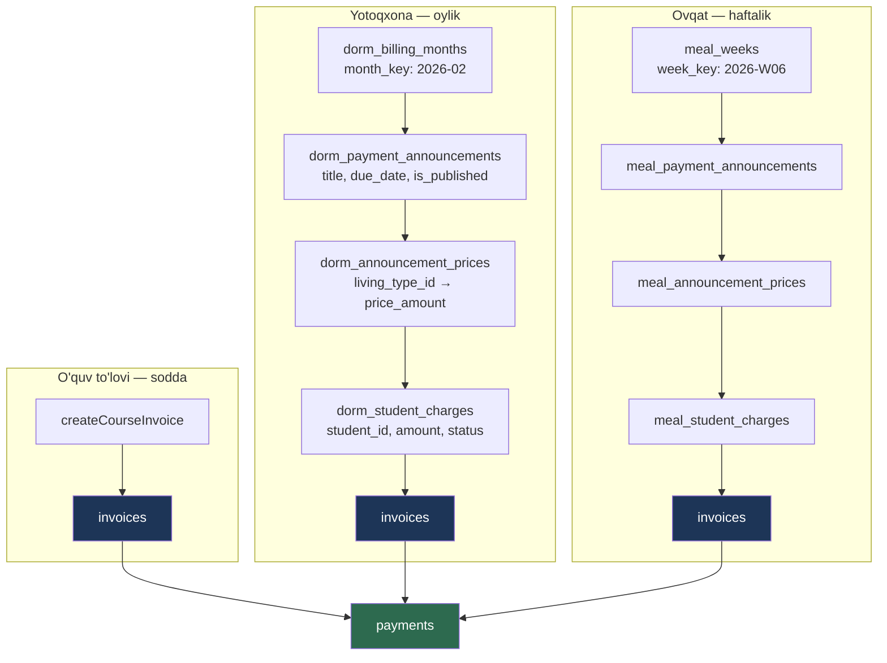

# 09 — Billing va moliya

> Modul: `billing` (1 610 qator — loyihaning **uchinchi eng katta** servisi)
> Bog'liq modullar: `dorms`, `students`, `notifications`, `rbac`, `audit`
> Status: **ishlab turgan tizim.** Real ota-onalar real pul to'laydi.

---

## 0. Bu hujjat nima haqida

MathAcademy'da pul — abstraksiya emas. Har oy ota-ona uchta narsa uchun to'laydi:
o'quv kursi, yotoqxona, ovqatlanish. Qabulxona xodimi tugmani bosadi, buxgalter
hisobotni yopadi. Bu **bugun ishlaydi**.

Bu hujjat quyidagilarni belgilaydi:

- Uch to'lov oqimi — nega uchta, birlashtirish kerakmi
- To'lov e'lonlari (payment announcements) — domen tushunchasi sifatida
- Proratsiya (hisob-kitob) mantiqi — **hozir mavjud emas**, va bu qaror qilinishi kerak
- Idempotentlik — pul tizimida eng ko'p xato keltiradigan joy
- Double-entry buxgalteriya — **kerakmi yoki yo'q** (halol javob)
- Payme / Click / Uzum integratsiyasi — eng katta qiymat
- Testlar — pul mantiqi eng ko'p test talab qiladigan joy

**⚠️ Hujjat chegarasi — pul TIPI qarori bu yerda EMAS.**

`Decimal` vs `BigInt` vs `Float`, API chegarasidagi shartnoma, `Number()` taqiqi —
bularning barchasi [ADR-0006](./adr/0006-money-decimal-in-db-string-at-api.md) da
hal qilingan. Bu hujjat o'sha qarorni **takrorlamaydi**, unga **tayanadi** va
qaror majburlanmagan joylarni ko'rsatadi.

**Yuridik maslahat yo'q.** Fiskal chek, QQS, soliq — §10.6 da "yurist savoli" deb
belgilangan.

---

## 1. Uch to'lov oqimi

### 1.1 Manzara

Sxemada pul uch xil yo'ldan oqadi. O'lchangan holat:

| Oqim | Modellar | Davriylik | Kim yaratadi |
|---|---|---|---|
| **O'quv to'lovi** | `invoices` → `payments` | Ad-hoc (qo'lda) | Xodim, bittalab |
| **Yotoqxona** | `dorm_billing_months` → `dorm_payment_announcements` → `dorm_announcement_prices` → `dorm_student_charges` → `invoices` | **Oylik** | Xodim, ommaviy |
| **Ovqatlanish** | `meal_weeks` → `meal_payment_announcements` → `meal_announcement_prices` → `meal_student_charges` → `invoices` | **Haftalik** | Xodim, ommaviy |



**Muhim kuzatuv:** uch oqim ham **bir joyga tushadi** — `invoices` → `payments`.
Ya'ni "uchta alohida to'lov tizimi" degani noto'g'ri bo'lardi. To'g'rirog'i:
**bitta ledger (`invoices` + `payments`) va uchta uni to'ldirish yo'li.**

### 1.2 `charges` va `invoices` — nega ikkalasi ham bor

Bu — hujjatning eng nozik savoli. Kodga qaraymiz
(`billing.service.ts:698-729`, dorm oqimi — ovqat oqimi `:404-434` **bir xil**):

```ts
if (generateInvoices) {
  const invoice = await tx.invoices.create({
    data: {
      tenant_id, student_id: student.id, type: 'DORM',
      period_start: month.month_start, period_end: month.month_end,
      amount,                      // ← Decimal
      currency: 'UZS', status: 'PENDING', due_date: dueDate,
      created_by_user_id: staff_user_id,
    },
    select: { id: true },
  });
  invoiceId = invoice.id;
}

await tx.dorm_student_charges.create({
  data: {
    tenant_id, dorm_announcement_id: announcement.id, student_id: student.id,
    living_type_id: student.living_type_id!,
    amount,                        // ← AYNAN O'SHA Decimal
    currency: 'UZS', status: 'PENDING', invoice_id: invoiceId,
  },
});
```

`amount` **ikki marta** yoziladi — `invoices.amount` va `dorm_student_charges.amount`.
Ikkalasi ham `Decimal(12,2)`. Ikkalasi ham `status` ustuniga ega. Munosabat **1:1**.

**Bu denormalizatsiya va u drift xavfini tug'diradi:** agar kimdir
`invoices.amount` ni tuzatsa (masalan chegirma bergani uchun),
`dorm_student_charges.amount` **eskicha qoladi**. Ikki raqam, bitta haqiqat.

Hozir bu xavf **realizatsiya bo'lmagan**, chunki invoysni tahrirlash endpoint'i
**umuman yo'q** (`staff-billing.controller.ts` da `@Patch` yo'q — faqat
`@Post('invoices')`). Ya'ni invoys yaratilgandan keyin **o'zgarmaydi**. Bu bagni
uxlatib turibdi.

### 1.3 Birlashtirish kerakmi? — halol tahlil

**Vasvasa:** "uchta oqim — ortiqcha. Hammasini `invoices` ga yig'ib,
`type` ustuni bilan ajratamiz."

**Javob: yo'q, va sabab domen ichida.**

`dorm_*` va `meal_*` — bu invoysning **nusxasi emas**, ular invoys yaratilishining
**sababi**. Ular ikkita savolga javob beradi, `invoices` javob bera olmaydi:

1. **"Bu narx qayerdan keldi?"** — `dorm_announcement_prices` narxni
   `living_type_id` bo'yicha saqlaydi. Invoysda faqat natija (`amount`) bor,
   qoida yo'q. Ota-ona "nega 500 000?" deb so'raganda javob **e'londa**
2. **"Bu oy kimga qancha e'lon qilingan?"** — e'lon `living_type` bo'yicha
   **butun sinfga** narx belgilaydi. Bu invoyslar yig'indisidan **tiklab
   bo'lmaydi** (override'lar aralashib ketadi)

Ya'ni `charges` — **domen hujjati**, `invoices` — **moliyaviy yozuv**. Ularni
birlashtirish domen bilimini yo'qotardi.

**Lekin uchta aniq muammo bor va ular tuzatilishi kerak:**

| # | Muammo | Tuzatish |
|---|---|---|
| 1 | `amount` ikki joyda dublikat (§1.2) | `charges.amount` — e'lon paytidagi **snapshot** deb hujjatlashtirilsin. `invoices.amount` — yagona haqiqat. Nomi ham `snapshot_amount` bo'lishi mumkin |
| 2 | `status` ikki joyda va **qo'lda** sinxronlanadi | `createPayment` `charges.status` ni `updateMany` bilan yangilaydi (`:1140-1148`). Agar unutilsa — drift. Status faqat `invoices` da bo'lsin |
| 3 | Uch oqim uchta **deyarli bir xil kod** | `createDormAnnouncement` (`:566-763`) va `createMealAnnouncement` (`:274-468`) — ~190 qator, **~85% bir xil**. Farq: `month`/`week`, va dorm'da living_type filtri |

**2-band bo'yicha aniq misol** — `createPayment` charge statusini yangilaydi:

```ts
// billing.service.ts:1139-1148
// Update related charges
await tx.meal_student_charges.updateMany({
  where: { tenant_id, invoice_id },
  data: { status: 'PAID' },
});

await tx.dorm_student_charges.updateMany({
  where: { tenant_id, invoice_id },
  data: { status: 'PAID' },
});
```

Bu **faqat `isFullyPaid` bo'lganda** ishlaydi. Qisman to'lovda charge `PENDING`
qoladi — to'g'ri. Lekin invoys `CANCELLED` qilinsa? Charge'lar `PENDING` qoladi —
**abadiy**. Bekor qilish endpoint'i yo'q, shuning uchun bu ham uxlab yotibdi.

---

## 2. ⚠️ Pul turi — o'lchangan, faraz qilinmagan

### 2.1 Xulosa: baza TO'G'RI

Buni birinchi aytish kerak, chunki ko'p "pul auditi" bu yerda noto'g'ri boshlanadi:

```bash
$ grep -c "Float" apps/api/prisma/schema.prisma
0
```

**Bitta ham `Float` yo'q.** Barcha pul ustunlari — `Decimal(12,2)`:

| Jadval | Ustun | Tip | Qator |
|---|---|---|---|
| `dorm_announcement_prices` | `price_amount` | `Decimal(12,2)` | `schema.prisma:330` |
| `dorm_student_charges` | `amount` | `Decimal(12,2)` | `schema.prisma:390` |
| `invoices` | `amount` | `Decimal(12,2)` | `schema.prisma:536` |
| `meal_announcement_prices` | `price_amount` | `Decimal(12,2)` | `schema.prisma:591` |
| `meal_student_charges` | `amount` | `Decimal(12,2)` | `schema.prisma:625` |
| `payments` | `paid_amount` | `Decimal(12,2)` | `schema.prisma:708` |

PostgreSQL `NUMERIC(12,2)` — **o'nlik** kasr, ikkilik emas. `0.1 + 0.2 = 0.3`
bazada **aniq**. Demak:

> **`0.1 + 0.2 !== 0.3` tanqidi bu loyihaga tegishli emas.** Uni boshqa
> loyihadan ko'chirish — halol emas. Muammo bor, lekin u **boshqa joyda**.

Chegara: `Decimal(12,2)` → maksimum **9 999 999 999.99 so'm** ≈ 10 mlrd.
Bitta invoys uchun yetarli.

### 2.2 Asl muammo — JS chegarasida izchillik yo'q

Prisma `NUMERIC` ni JS'ga `Prisma.Decimal` **obyekti** sifatida qaytaradi.
Muammo — u bilan **nima qilinishida**. Va bu yerda bitta servis ichida
**ikki xil shartnoma** bor:

```ts
// billing.service.ts:1576-1583 — getBillingSummary()
return {
  unpaidCount,
  unpaidTotal: unpaidTotal._sum.amount?.toString() || '0',                    // ← string
  partialTotal: partialTotal._sum.amount?.toString() || '0',                  // ← string
  currentMonthRevenue: currentMonthRevenue._sum.paid_amount?.toString() || '0', // ← string
  revenueTrend: Array.from(monthMap.values()).reverse(),
};
```

```ts
// billing.service.ts:1601-1607 — getPendingPayments()
return invoices.map((inv) => ({
  id: inv.id.toString(),
  studentName: inv.students.full_name,
  amount: Number(inv.amount),      // ← number
  type: inv.type,
  dueDate: inv.due_date,
}));
```

**Bitta fayl. 25 qator masofa. Ikki xil tip.** `/billing/summary` pulni string
qaytaradi, `/billing/summary/pending-payments` — number. Qaysi endpoint qaysi
tipni beradi — hech qayerda yozilmagan.

`Number()` pulga **11 joyda** ishlatiladi:

| Fayl : qator | Kod | Nima uchun |
|---|---|---|
| `billing.service.ts:1248` | `Number(totalPaid) > 0` | Solishtiruv |
| `billing.service.ts:1569` | `Number(p.paid_amount) / 1000` | Grafik |
| `billing.service.ts:1605` | `Number(inv.amount)` | API javobi |
| `guardian-billing.controller.ts:79` | `Number(body.paidAmount)` | **Kirish** ⚠️ |
| `guardian-student.controller.ts:576` | `acc.totalAmount += Number(invoice.amount)` | Yig'indi |
| `guardian-student.controller.ts:578` | `sum + Number(p.paid_amount)` | Yig'indi |
| `guardian-student.controller.ts:582` | `Number(invoice.amount) - paid` | Ayirma |
| `guardian-student.controller.ts:592` | `sum + Number(p.paid_amount)` | Yig'indi |
| `guardian-student.controller.ts:595` | `Number(inv.amount) - paid` | Ayirma |
| + `billing.dto.ts` da `@Type(() => Number)` | 4 ta pul maydonida | **Kirish** ⚠️ |

⚠️ **`guardian-student.controller.ts:574-587` — eng jiddiy naqsh:** `Number()`
**yig'indi ichida**, ya'ni xato **to'planadi**. Va u `billing.service.ts:1375-1401`
dagi **xuddi shu hisob**ning float versiyasi:

```ts
// guardian-student.controller.ts:576-582 — float
acc.totalAmount += Number(invoice.amount);
const paid = invoice.payments.reduce((sum, p) => sum + Number(p.paid_amount), 0);
acc.totalPending += Number(invoice.amount) - paid;

// billing.service.ts:1381-1385 — Decimal (to'g'ri)
const paid = inv.payments.reduce((sum, p) => sum.add(p.paid_amount), new Prisma.Decimal(0));
acc.totalAmount = acc.totalAmount.add(inv.amount);
```

**Bitta domen savoli — "ota-ona qancha qarz?" — ikki xil hisoblanadi, ikki xil
aniqlikda, ikki xil faylda.** Bu §11 ning markaziy muammosi.

### 2.3 ⚠️ Halol xavf tahlili: bu bag hozir UXLAB YOTIBDI

Auditning halol bo'lishi shuni talab qiladi: **`Number(inv.amount)` bugun
ma'lumot buzmaydi.**

```js
Number("20000000.00")    // 20000000       — ANIQ
Number("9999999999.99")  // 9999999999.99  — ANIQ
```

JS `number` — IEEE 754 double, **2⁵³ ≈ 9 007 199 254 740 992** gacha butun sonni
aniq ifodalaydi. Bizning maksimum — 10 mlrd, ya'ni 2⁵³ dan **~900 000 marta
kichik**. Butun so'm qiymatlari `Number()` dan **shikastsiz** o'tadi.

Va ikkinchi halol fakt: **O'zbek so'mida tiyin amalda muomalada yo'q.** Narxlar
butun so'mda. `Decimal(12,2)` ning `.00` qismi amalda **doim nol**.

**Ya'ni: bag mavjud, lekin uyqu holatida.** Uni uyg'otadigan narsa — **kasr
qiymat**:

- kechikish jarimasi (foiz)
- chegirma (foiz)
- **proratsiya** (§6 — oy o'rtasida kelgan o'quvchi)
- qisman to'lov taqsimoti

⚠️ **Lekin schema buni majburlamaydi.** `Decimal(12,2)` kasrni **ruxsat etadi**.
Bugungi xavfsizlik — **tasodif**, kafolat emas. Va §6 ko'rsatadiki, proratsiya —
mahsulot yo'l xaritasidagi eng ehtimolli qo'shimcha.

**Qaror va migratsiya rejasi:**
[ADR-0006](./adr/0006-money-decimal-in-db-string-at-api.md) —
*baza `Decimal`, API chegarasida `string`, `Number()` hech qachon*.
[14-roadmap.md](./14-roadmap.md) §2.3 — bosqich 2.

### 2.4 Yashirin birlik konvertatsiyasi

```ts
// billing.service.ts:1565-1574
payments.forEach((p) => {
  const key = monthKey(p.paid_at);
  if (monthMap.has(key)) {
    const data = monthMap.get(key);
    const amount = Number(p.paid_amount) / 1000;   // ← ??? 
    if (p.invoices.type === 'COURSE') data.kurs += amount;
    else if (p.invoices.type === 'MEAL') data.ovqat += amount;
    else if (p.invoices.type === 'DORM') data.yotoq += amount;
  }
});
```

`/ 1000` — bu **ming so'mga** konvertatsiya, grafik o'qi uchun. Lekin:

- API javobida `revenueTrend` maydoni **birligi yozilmagan**
- Hech qanday komment yo'q
- Frontend `1500` ni ko'rsa — bu 1 500 so'mmi yoki 1 500 000 so'mmi?

Bu — hujjatlashtirilmagan birlik. Klassik xato manbai (Mars Climate Orbiter naqshi).
**Tuzatish:** bo'lish backenddan chiqarilsin (u ko'rsatish amali) yoki maydon
`revenueTrendThousandsUzs` deb nomlansin.

### 2.5 ⚠️ `payments` jadvalida `currency` ustuni YO'Q

O'lchandi. `invoices` da valyuta bor, `payments` da — yo'q:

```prisma
// schema.prisma:536 — invoices
amount     Decimal  @db.Decimal(12, 2)
currency   String   @default("UZS")     // ← bor

// schema.prisma:708 — payments
paid_amount Decimal @db.Decimal(12, 2)
paid_at     DateTime @default(now()) @db.Timestamptz(6)
method      String  @default("CASH") @db.VarChar(10)
// currency — YO'Q
```

Ya'ni: invoys USD'da bo'lishi mumkin (sxema ruxsat etadi), lekin unga qilingan
to'lov **valyutasiz**. Bu — asimmetriya.

Bugun zararsiz (hammasi UZS). Lekin `invoices.currency` **mavjud bo'lgani uchun**
kimdir uni ishlatishi mumkin deb o'ylaydi — va `payments` uni qo'llab-quvvatlamaydi.

> ⚠️ **Qo'shni hujjatga tuzatish:**
> [ADR-0006](./adr/0006-money-decimal-in-db-string-at-api.md) "Ochiq savollar" §1
> da *"Hozir **hech bir** pul jadvalida valyuta ustuni yo'q"* deyilgan.
> **Bu o'lchov bo'yicha noto'g'ri** — `currency` 5 ta jadvalda bor
> (`invoices:537`, `payments` da — **yo'q**, `dorm_student_charges:391`,
> `meal_student_charges:626`, `dorm_announcement_prices:331`,
> `meal_announcement_prices:592`). ADR o'sha bandi tuzatilsin.

### 2.6 `Money` klassi — umuman yo'q

Grep tasdiqladi: `billing` moduli `Prisma.Decimal` ni **to'g'ridan-to'g'ri**
ishlatadi. O'rash (wrapper) yo'q. Ya'ni:

- Domen qatlami **ORM tipiga bog'langan**
- Valyuta va summa **hech qachon birga sayohat qilmaydi**
- Yaxlitlash siyosati **hech qayerda markazlashmagan**

Keyingi bo'lim — nega bu muhim.

---

## 3. `Money.allocate()` — nega kerak

### 3.1 Muammo

100 000 so'mni 3 oyga bo'lamiz:

```
100000 / 3 = 33333.333...
```

`Decimal(12,2)` ikki kasr saqlaydi → `33333.33`. Uchtasi:

```
33333.33 + 33333.33 + 33333.33 = 99999.99
```

**1 tiyin yo'qoldi.** Va u **hech qayerga ketmadi** — u shunchaki yo'q.

⚠️ **Muhim: bu muammo `Decimal` da ham, `BigInt` da ham bir xil.**
[ADR-0006](./adr/0006-money-decimal-in-db-string-at-api.md) `Decimal` ni tanladi,
lekin bu `allocate()` ni **keraksiz qilmaydi**. Bo'linish qoldig'i — **ifoda
tipining muammosi emas, arifmetikaning muammosi**. `100000n / 3n = 33333n`
(BigInt kesadi) — xuddi shu yo'qotish, hatto kattaroq.

Ko'paytirib qaytarish ham yordam bermaydi:

```js
(100000 / 3) * 3   // 100000.00000000001  ← float
```

**Yagona to'g'ri yechim:** qoldiqni **taqsimlash**. Yig'indi **ta'rifan** aslga
teng bo'lsin.

### 3.2 Bu qachon kerak bo'ladi

Bugun kodda bo'lish **yo'q** — shuning uchun bu muammo hali tug'ilmagan. Lekin
§6 (proratsiya) va §11 (qarz) uni **darhol** keltiradi:

- O'quvchi 20-fevralda keldi → fevral yotoqxona to'lovining **9/28** qismi
- Ota-ona 100 000 to'ladi, 3 ta invoys ochiq → qaysi biriga qancha?
- Yillik to'lov 9 oyga bo'linadi

Uchalasi ham **bo'lish**. Uchalasi ham qoldiq beradi.

### 3.3 `Money` — to'liq kod

`Prisma.Decimal` ustiga o'ralgan, ADR-0006 ga mos (ichida `Decimal`, chegarada
`string`). Bu ADR-0006 "Ochiq savollar" §4 ga javob.

```ts
// apps/api/src/common/money/money.ts
import { Prisma } from '@prisma/client';

const Decimal = Prisma.Decimal;
type DecimalT = Prisma.Decimal;
const SCALE = 2;   // Decimal(12,2) ga mos

/**
 * Money — summa va valyuta birga. O'zgarmas.
 *
 * Nega klass: `Prisma.Decimal` valyutani bilmaydi, va `decimal > 0`
 * (`.greaterThan(0)` o'rniga) KOMPILYATSIYA BO'LADI va jimgina `true`
 * qaytaradi (obyekt > 0). Money bu xatoni tipda ushlaydi.
 */
export class Money {
  private constructor(
    private readonly _amount: DecimalT,      // so'mda, 2 kasr
    public readonly currency: string,
  ) {}

  /** So'mdan. String — afzal (aniqlikni yo'qotmaydi). */
  static fromSom(value: string | number | DecimalT, currency = 'UZS'): Money {
    const d = new Decimal(value);
    if (!d.isFinite()) throw new Error(`MONEY_NOT_FINITE: ${String(value)}`);   // ← NaN/Infinity
    if (d.decimalPlaces() > SCALE) throw new Error(`MONEY_TOO_PRECISE: ${d}`);
    return new Money(d, currency);
  }

  /** Tiyindan. 5_000_000 tiyin → 50 000.00 so'm. */
  static fromTiyin(tiyin: bigint | number, currency = 'UZS'): Money {
    return new Money(new Decimal(tiyin.toString()).dividedBy(100), currency);
  }

  static zero(currency = 'UZS'): Money { return new Money(new Decimal(0), currency); }
  static fromPrisma(v: DecimalT, currency = 'UZS'): Money { return new Money(v, currency); }

  /** API chegarasi. ADR-0006: pul chegarada DOIM string. */
  toSom(): string { return this._amount.toFixed(SCALE); }

  /** Butun tiyin. Payme tiyin talab qiladi, Click — so'm (§10.3, §10.4). */
  toTiyin(): bigint { return BigInt(this._amount.times(100).toFixed(0)); }

  toPrisma(): DecimalT { return this._amount; }

  add(o: Money): Money {
    this.assertSameCurrency(o);
    return new Money(this._amount.plus(o._amount), this.currency);
  }

  subtract(o: Money): Money {
    this.assertSameCurrency(o);
    return new Money(this._amount.minus(o._amount), this.currency);
  }

  /** ⚠️ Yaxlitlash ROUND_HALF_UP — bu QAROR, standart emas. */
  multiply(factor: string | number | DecimalT): Money {
    return new Money(
      this._amount.times(new Decimal(factor)).toDecimalPlaces(SCALE, Decimal.ROUND_HALF_UP),
      this.currency,
    );
  }

  gte(o: Money): boolean { this.assertSameCurrency(o); return this._amount.gte(o._amount); }
  greaterThan(o: Money): boolean { this.assertSameCurrency(o); return this._amount.gt(o._amount); }
  isNegative(): boolean { return this._amount.isNegative(); }
  isPositive(): boolean { return this._amount.greaterThan(0); }

  /**
   * ⭐ Summani nisbatlar bo'yicha taqsimlaydi. QOLDIQ YO'QOLMAYDI.
   *
   * KAFOLAT (invariant):  sum(allocate(ratios)) === this
   * Martin Fowler, "Money" naqshi (PoEAA).
   *
   * @example Money.fromSom('100000').allocate([1, 1, 1])
   *   → ['33333.34', '33333.33', '33333.33']   yig'indi = 100000.00 ✅
   */
  allocate(ratios: number[]): Money[] {
    if (ratios.length === 0) throw new Error('ALLOCATE_EMPTY_RATIOS');
    if (ratios.some((r) => r < 0)) throw new Error('ALLOCATE_NEGATIVE_RATIO');

    const total = ratios.reduce((a, b) => a + b, 0);
    if (total === 0) throw new Error('ALLOCATE_ZERO_TOTAL');

    // Tiyinda — butun son arifmetikasi. Qoldiq ANIQ hisoblanadi.
    const totalTiyin = this.toTiyin();
    const totalRatio = BigInt(Math.round(total * 1_000_000));

    const shares: bigint[] = [];
    let distributed = 0n;

    // 1: har qismga pastga yaxlitlangan ulush (BigInt bo'lishi kesadi)
    for (const ratio of ratios) {
      const share = (totalTiyin * BigInt(Math.round(ratio * 1_000_000))) / totalRatio;
      shares.push(share);
      distributed += share;
    }

    // 2: qoldiqni bittadan tarqatish — hech qayerga yo'qolmaydi
    let remainder = totalTiyin - distributed;
    const step = remainder >= 0n ? 1n : -1n;
    for (let i = 0; remainder !== 0n; i++) {
      shares[i % shares.length] += step;
      remainder -= step;
    }

    return shares.map((s) => Money.fromTiyin(s, this.currency));
  }

  split(n: number): Money[] { return this.allocate(new Array(n).fill(1)); }

  private assertSameCurrency(o: Money): void {
    if (this.currency !== o.currency) {
      throw new Error(`CURRENCY_MISMATCH: ${this.currency} vs ${o.currency}`);
    }
  }
}
```

**Nega ichida BigInt tiyin, garchi tashqarida `Decimal` bo'lsa:**
`allocate()` — yagona joy bo'lish sodir bo'ladi. Butun son arifmetikasida
qoldiq **aniq** hisoblanadi (`totalTiyin - distributed`), kasr arifmetikasida esa
qoldiqni topish uchun yana yaxlitlash kerak bo'lardi. Bu — ADR-0006 ga zid emas:
baza `Decimal` qoladi, `BigInt` faqat metod ichida, chegaradan chiqmaydi.

### 3.4 Property test — yig'indi invarianti

Pul mantiqining **eng muhim testi**. `fast-check` bilan.

```ts
// apps/api/src/common/money/money.spec.ts
import fc from 'fast-check';
import { describe, it, expect } from 'vitest';
import { Money } from './money';

// Umumiy generatorlar: 0..9 999 999 999.99 so'm, tiyin aniqligida
const anyAmount = fc.bigInt({ min: 0n, max: 999_999_999_999n });
const anyRatios = fc.array(fc.integer({ min: 1, max: 100 }), { minLength: 1, maxLength: 20 });

describe('Money.allocate — invariantlar', () => {
  it('⭐ qismlar yig\'indisi DOIM asl summaga teng', () => {
    fc.assert(
      fc.property(anyAmount, anyRatios, (totalTiyin, ratios) => {
        const money = Money.fromTiyin(totalTiyin);
        const sum = money.allocate(ratios).reduce((a, p) => a.add(p), Money.zero());
        expect(sum.toSom()).toBe(money.toSom());   // ← 1 tiyin ham yo'qolmaydi
      }),
      { numRuns: 2000 },
    );
  });

  it('teng nisbatda qismlar farqi — ko\'pi bilan 1 tiyin', () => {
    fc.assert(
      fc.property(anyAmount, fc.integer({ min: 1, max: 20 }), (totalTiyin, n) => {
        const t = Money.fromTiyin(totalTiyin).split(n).map((p) => p.toTiyin());
        const max = t.reduce((a, b) => (a > b ? a : b));
        const min = t.reduce((a, b) => (a < b ? a : b));
        expect(max - min).toBeLessThanOrEqual(1n);
      }),
    );
  });
});

describe('Money — aniq misollar (regressiya)', () => {
  it('100 000 so\'m 3 ga — 1 tiyin yo\'qolmaydi', () => {
    const parts = Money.fromSom('100000').split(3);
    expect(parts.map((p) => p.toSom())).toEqual(['33333.34', '33333.33', '33333.33']);
    expect(parts.reduce((a, p) => a.add(p), Money.zero()).toSom()).toBe('100000.00');
    //                                                                  ↑ 99999.99 EMAS
  });

  it('proratsiya: 500 000 so\'mlik oyning 9/28 qismi', () => {
    const [used, unused] = Money.fromSom('500000').allocate([9, 19]);
    expect(used.add(unused).toSom()).toBe('500000.00');
  });

  it('valyuta aralashtirilsa va NaN — xato', () => {
    expect(() => Money.fromSom('1000', 'UZS').add(Money.fromSom('1000', 'USD')))
      .toThrow('CURRENCY_MISMATCH');
    expect(() => Money.fromSom(NaN)).toThrow('MONEY_NOT_FINITE');
    expect(() => Money.fromSom(Infinity)).toThrow('MONEY_NOT_FINITE');
  });
});
```

⚠️ **Oxirgi test §10.1 bilan bog'liq** — `Money.fromSom(NaN)` xato tashlaydi.
Hozirgi kod esa `new Prisma.Decimal(NaN)` ni **jimgina qabul qiladi**.

---

## 4. To'lov e'lonlari (payment announcements)

### 4.1 Domen tushunchasi

E'lon — bu **hujjat**, xabar emas. U aytadi:

> "2026-fevral yotoqxona to'lovi e'lon qilindi. FULL_BOARD — 500 000 so'm,
> WEEKDAYS_ONLY — 350 000 so'm. Muddat — 25-fevral."

Ikki qism:
1. **`*_payment_announcements`** — sarlavha, xabar, muddat, chop etilganmi
2. **`*_announcement_prices`** — `living_type` bo'yicha narx (kompozit PK)

```prisma
// schema.prisma:327-337
model dorm_announcement_prices {
  dorm_announcement_id BigInt
  living_type_id       BigInt
  price_amount         Decimal @db.Decimal(12, 2)
  currency             String  @default("UZS")
  ...
  @@id([dorm_announcement_id, living_type_id])   // ← kompozit PK, to'g'ri
}
```

`living_types` — uch xil (`billing.service.ts:111-127` da seed qilinadi):

| Kod | Ma'nosi |
|---|---|
| `DAY_ONLY` | Uyda yashaydi, faqat tushlik |
| `WEEKDAYS_ONLY` | Dush–Juma yotoqxonada, dam olish uyda |
| `FULL_BOARD` | 7 kun yotoqxonada |

### 4.2 Ish oqimi — real kod

`createDormAnnouncement` (`billing.service.ts:566-763`) bitta tranzaksiyada
9 bosqich bajaradi:

1. Oyni tekshirish (`dorm_billing_months`)
2. `living_type` larni validatsiya
3. E'lon yaratish
4. Narxlarni yozish (`createMany`)
5. **O'quvchilarni tanlash**
6. Override map
7. Narx map
8. **Har o'quvchi uchun invoys + charge**
9. Audit log

5-bosqich muhim:

```ts
// billing.service.ts:650-664
// Get active students with living type (FULL_BOARD or WEEKDAYS_ONLY for dorm)
const students = await tx.students.findMany({
  where: {
    tenant_id,
    status: 'ACTIVE',
    living_type_id: { not: null },
    living_types: {
      code: { in: ['FULL_BOARD', 'WEEKDAYS_ONLY'] },   // ← HARDKOD
    },
  },
  select: { id: true, living_type_id: true },
});
```

⚠️ **Kod satri hardkod qilingan.** `living_types.code` — tenant ichida
o'zgartirilishi mumkin (`seedDefaultLivingTypes` faqat **default** yaratadi;
xodim yangi kod bilan tur qo'shsa — masalan `WEEKEND_ONLY` — u yotoqxona
e'lonidan **jimgina tushib qoladi**). Ovqat e'loni esa (`:359-369`)
**barcha** `living_type` li o'quvchini oladi.

Ya'ni: "kim yotoqxona uchun to'laydi?" qoidasi — **kodda**, ma'lumotda emas.
Bu §1.3 dagi 189-ball naqshining takrori: domen qoidasi noto'g'ri qatlamda.

**Tuzatish:** `living_types` ga `is_dorm_billable` / `is_meal_billable` boolean
ustunlari qo'shilsin. Unda qoida ma'lumotda bo'ladi va xodim uni boshqara oladi.

### 4.3 Override — individual narx

```ts
// billing.service.ts:666-694
const overrideMap = new Map<string, number>();
for (const o of dto.overrides ?? []) {
  if (o.amount < 0) {
    throw new BadRequestException('OVERRIDE_AMOUNT_MUST_BE_POSITIVE');
  }
  overrideMap.set(o.studentId, o.amount);
}
...
const amount = overrideMap.has(studentIdStr)
  ? new Prisma.Decimal(overrideMap.get(studentIdStr)!)   // ← number → Decimal
  : priceMap.get(livingTypeIdStr)!;
```

Bu — chegirma/imtiyoz mexanizmi (masalan yetim bolaga chegirma). To'g'ri fikr.

⚠️ **Lekin sabab yozilmaydi.** `dorm_student_charges` da `note` ustuni **bor**
(`schema.prisma:396`), lekin override uni **to'ldirmaydi**. Ya'ni: "nega bu bola
450 000 to'lagan, boshqasi 500 000?" — javob **hech qayerda yo'q**. Audit logda
faqat `studentsCount` bor (`:742-750`), override ro'yxati **yo'q**.

**Tuzatish:** override `note` ga sabab yozsin va audit log override'larni
to'liq yozsin. Bu — chegirma, ya'ni **pul qarori**.

### 4.4 E'lon — snapshot, jonli qoida emas

`@@unique([tenant_id, dorm_month_id])` (`schema.prisma:367`) — **bir oyga bitta
e'lon**. Bu idempotentlik uchun yaxshi (§8), lekin oqibati bor:

E'lon yaratilganda o'quvchilar ro'yxati **muzlatiladi**. Keyin:

| Vaziyat | Nima bo'ladi |
|---|---|
| O'quvchi e'londan **keyin** keldi | Charge **yaratilmaydi**. Bepul yashaydi. Jimgina |
| O'quvchi e'londan **keyin** ketdi | Charge qoladi. To'liq oy uchun qarzdor |
| `living_type` e'londan keyin o'zgardi | Eski narx qoladi |

Va `@@unique` tufayli **ikkinchi e'lon yaratib bo'lmaydi** — `DORM_MONTH_ALREADY_EXISTS`
emas, balki Prisma unique violation (ushlanmagan → 500).

Bu — §6 ning kirish nuqtasi.

---

## 5. `dorm_billing_months` va `meal_weeks` — nega davriylik farq qiladi

### 5.1 Sabab domenda

| | Yotoqxona | Ovqat |
|---|---|---|
| Davr | **Oy** | **Hafta** |
| Kalit | `month_key` = `2026-02` | `week_key` = `2026-W06` |
| Nega | Yotoqxona — **joy ijarasi**. Joy oy davomida band, o'quvchi kelsa ham, kelmasa ham | Ovqat — **iste'mol**. Haftada necha marta ovqatlanish — o'zgaruvchan |
| Model | `dorm_billing_months` | `meal_weeks` |

Bu — **to'g'ri domen modellashtirish**. Ovqat haftalik, chunki:
- Dam olish kunlari uyga ketish rejasi haftadan haftaga o'zgaradi
- Ta'til/imtihon haftasi — boshqa rejim
- Oylik ovqat to'lovi qaytarish (refund) talab qilardi

Yotoqxona oylik, chunki joy **oy bo'yi zahiralangan**. Bu ijara mantiqiga mos.

### 5.2 ⚠️ Kalit generatsiyasida izchillik yo'q

Ikki funksiya, ikki xil vaqt zonasi:

```ts
// billing.service.ts:34-44 — ISO hafta, UTC
function isoWeekKey(date: Date): string {
  const d = new Date(date);
  d.setUTCHours(0, 0, 0, 0);          // ← UTC
  const day = d.getUTCDay() || 7;     // ← UTC
  d.setUTCDate(d.getUTCDate() + 4 - day);
  const yearStart = new Date(Date.UTC(d.getUTCFullYear(), 0, 1));
  const weekNo = Math.ceil(((d.getTime() - yearStart.getTime()) / 86400000 + 1) / 7);
  return `${d.getUTCFullYear()}-W${String(weekNo).padStart(2, '0')}`;
}

// billing.service.ts:46-48 — oy, LOKAL
function monthKey(date: Date): string {
  return `${date.getFullYear()}-${String(date.getMonth() + 1).padStart(2, '0')}`;
  //            ^^^^^^^^^^^^^^^ lokal        ^^^^^^^^^^^ lokal
}
```

`isoWeekKey` — **UTC**. `monthKey` — **serverning lokal vaqti**. Bitta faylda,
14 qator masofada.

**Oqibat:** server TZ o'zgarsa (`TZ` env yoki deploy muhiti), `monthKey`
**o'zgaradi**, `isoWeekKey` — yo'q. `2026-02-01T00:00:00Z` sanasi:

- Server UTC → `monthKey` = `2026-02` ✅
- Server UTC−5 (masalan `America/New_York`) → lokal `2026-01-31T19:00` →
  `monthKey` = **`2026-01`** ❌

Bag **uxlab yotibdi**, chunki Render odatda UTC'da ishlaydi. Lekin bu —
**konfiguratsiyaga bog'liq to'g'rilik**, kafolat emas. Va `monthKey`
`getBillingSummary` da ham ishlatiladi (`:1556`, `:1566`) — ya'ni **daromad
hisoboti** shu funksiyaga tayanadi.

**Tuzatish:** ikkalasi ham UTC bo'lsin, yoki ikkalasi ham aniq zona
(`Asia/Tashkent`, UTC+5) ishlatsin. `dayjs` allaqachon loyihada bor
(CANON §3 — stack ro'yxatida).

---

## 6. Hisob-kitob mantiqi — proratsiya

### 6.1 ⚠️ Xulosa: proratsiya YO'Q

O'lchandi. Butun `billing` va `dorms` modullarida:

- Bo'lish operatsiyasi — **yo'q** (grafik uchun `/1000` dan boshqa)
- Kun hisobi — **yo'q**
- `student_room_assignments.start_date` / `end_date` billing'da **ishlatilmaydi**

`amount` **doim** e'londagi to'liq narx:

```ts
// billing.service.ts:692-694
const amount = overrideMap.has(studentIdStr)
  ? new Prisma.Decimal(overrideMap.get(studentIdStr)!)
  : priceMap.get(livingTypeIdStr)!;      // ← to'liq oylik narx, kunga bo'linmaydi
```

### 6.2 Yotoqxonadan chiqsa nima bo'ladi

`dorms.service.ts:671-719` — `endAssignment()`:

```ts
const updated = await this.prisma.student_room_assignments.update({
  where: { id: assignment_id },
  data: { end_date: new Date() },
});

await this.auditLogger.log({ ... });

return { ok: true };
```

**Billing'ga bitta ham murojaat yo'q.** Ya'ni:

> O'quvchi 3-fevralda yotoqxonadan chiqdi. `dorm_student_charges` da fevral uchun
> 500 000 so'mlik charge **qoladi**. Invoys `PENDING` qoladi. Ota-ona **to'liq oy**
> uchun qarzdor ko'rinadi.

Xuddi shu `assignRoom()` da (`:576-669`) — yangi o'quvchi joylashsa, charge
**yaratilmaydi** (e'lon allaqachon o'tgan bo'lsa).

### 6.3 Halol baho: bu bagmi yoki qaror?

**Ehtimol — qaror, lekin yozilmagan qaror.**

Argument "proratsiya kerak emas" foydasiga:
- Yotoqxona — **joy zahirasi**. O'quvchi ketsa ham joy bo'sh turadi, akademiya
  xarajat qiladi. Ijara mantiqi bo'yicha to'liq oy — **odilona**
- Oy o'rtasida kelish/ketish — **kam uchraydigan** hodisa
- Qo'lda tuzatish mumkin: `overrides` bilan individual summa berish (§4.3)

Argument "kerak" foydasiga:
- Ovqat — **iste'mol**, joy zahirasi emas. 3 kun ovqatlangan bola bir haftalik
  to'lasa — bu **adolatsiz** va ota-ona buni sezadi
- O'quv yili boshida (sentyabr) va oxirida (may) kelish/ketish — **ommaviy**

**Tavsiya — o'rtacha yo'l:**

1. **Yotoqxona: proratsiya YO'Q** — bu qaror **hujjatlashtirilsin**
   (`dorm_payment_announcements.message` da ota-onaga aytilsin: "to'liq oy uchun")
2. **Ovqat: proratsiya KERAK** — haftalik, kunlar bo'yicha
3. Ikkala holatda ham — `Money.allocate()` (§3), aks holda tiyin yo'qoladi

Proratsiya qo'shilishi bilan **§2.3 dagi uxlab yotgan bag uyg'onadi** —
`500000 * 9 / 28 = 160714.2857...` — birinchi haqiqiy kasr qiymat.
Shuning uchun **ADR-0006 proratsiyadan OLDIN** bajarilishi kerak.

### 6.4 Minimal to'g'ri implementatsiya

```ts
// Ovqat charge'i — kunlar bo'yicha proratsiya
function prorateWeeklyMeal(
  weekPrice: Money,
  weekStart: Date,
  weekEnd: Date,
  studentStart: Date | null,   // student_room_assignments dan
  studentEnd: Date | null,
): Money {
  const totalDays = daysBetween(weekStart, weekEnd) + 1;

  const effStart = studentStart && studentStart > weekStart ? studentStart : weekStart;
  const effEnd = studentEnd && studentEnd < weekEnd ? studentEnd : weekEnd;

  if (effEnd < effStart) return Money.zero(weekPrice.currency);

  const usedDays = daysBetween(effStart, effEnd) + 1;
  if (usedDays >= totalDays) return weekPrice;

  // ⭐ allocate — qoldiq yo'qolmaydi
  const [used] = weekPrice.allocate([usedDays, totalDays - usedDays]);
  return used;
}
```

---

## 7. ⚠️ Double-entry buxgalteriya kerakmi?

### 7.1 Hozirgi model

```
invoices (nima qarz)  →  payments (nima kelgan)
qoldiq = invoices.amount − SUM(payments.paid_amount)
```

Oddiy. Tushunarli. **Va bu akademiya uchun — yetarli.**

### 7.2 Double-entry nima berardi

Har tranzaksiya ikki yozuv: debet va kredit. Invariant:
`SUM(debit) = SUM(credit)` — **har doim, istisnosiz**.

```
Ota-ona 500 000 to'ladi:
  Debet:  Kassa              +500 000
  Kredit: Debitorlik qarzi   −500 000
                             ─────────
                             = 0 ✅
```

Foydasi: pul **yo'qola olmaydi**. Har so'm qayerdan kelib qayerga ketgani
strukturaviy tarzda kuzatiladi.

### 7.3 Halol javob: HOZIR — YO'Q

Bu — **buxgalteriya dasturi emas**, Student Information System.

| Double-entry qachon kerak | MathAcademy'da bormi |
|---|---|
| Ko'p hisob (kassa, bank, debitorlik, kreditorlik) | ❌ Bitta oqim: ota-ona → akademiya |
| Split payment (pul bir necha tomonga) | ❌ Yo'q |
| Escrow / vaqtincha ushlab turish | ❌ Yo'q |
| Refund va chargeback | ❌ Endpoint yo'q |
| Komissiya hisobi | ❌ Yo'q (provayder integratsiyasi yo'q — §10) |
| Ko'p valyuta | ❌ Faqat UZS |
| Rasmiy buxgalteriya hisoboti | ❌ Buxgalter alohida dastur ishlatadi |

**Yettitadan yettitasi — yo'q.** Double-entry qo'shish:

- `ledger_entries` jadvali + hisoblar rejasi (chart of accounts)
- Har `payments.create()` → ikki yozuv
- Balanslanish tekshiruvi
- Mavjud ma'lumotni migratsiya qilish (real to'lovlar!)
- Xodimlarga o'rgatish

...va **evaziga hech narsa bermaydi**, chunki hal qiladigan muammolar **yo'q**.

> **Bu — YAGONA to'g'ri javob emas, lekin BUGUNGI to'g'ri javob.**
> "Double-entry — professional yondashuv" degan argument haqiqat, lekin
> professionallik — **muammoga mos yechim tanlash**, eng murakkabini emas.
> Yo'q muammoni hal qiladigan 500 qator kod — **texnik qarz**, aktiv emas.

### 7.4 LEKIN — invariant baribir kerak

Double-entry **rad etiladi**, uning **kafolati** — yo'q. Minimal invariantlar
test bilan majburlansin:

```ts
// apps/api/test/billing/invariants.spec.ts
describe('Billing invariantlari', () => {

  it('INVARIANT 1: to\'lovlar yig\'indisi invoys summasidan oshmaydi', async () => {
    const rows = await prisma.$queryRaw<{ invoice_id: bigint }[]>`
      SELECT i.id AS invoice_id
      FROM invoices i
      JOIN payments p ON p.invoice_id = i.id
      GROUP BY i.id, i.amount
      HAVING SUM(p.paid_amount) > i.amount
    `;
    expect(rows).toHaveLength(0);   // ← HOZIR BUZILADI, §8.3 ga qara
  });

  it('INVARIANT 2: status to\'lovlarga mos', async () => {
    const rows = await prisma.$queryRaw`
      SELECT i.id, i.status, i.amount, COALESCE(SUM(p.paid_amount), 0) AS paid
      FROM invoices i
      LEFT JOIN payments p ON p.invoice_id = i.id
      GROUP BY i.id, i.status, i.amount
      HAVING (i.status = 'PAID'    AND COALESCE(SUM(p.paid_amount), 0) < i.amount)
          OR (i.status = 'PENDING' AND COALESCE(SUM(p.paid_amount), 0) >= i.amount)
    `;
    expect(rows).toHaveLength(0);
  });

  it('INVARIANT 3: charge summasi invoys summasiga teng', async () => {
    const rows = await prisma.$queryRaw`
      SELECT c.id FROM dorm_student_charges c
      JOIN invoices i ON i.id = c.invoice_id
      WHERE c.amount <> i.amount
    `;
    expect(rows).toHaveLength(0);   // §1.2 dagi drift
  });

  it('INVARIANT 4: pul qiymati manfiy emas va NaN emas', async () => {
    const rows = await prisma.$queryRaw`
      SELECT id FROM payments
      WHERE paid_amount < 0 OR paid_amount = 'NaN'::numeric
    `;
    expect(rows).toHaveLength(0);   // ← §10.1
  });

  it('INVARIANT 5: har charge tenant chegarasida', async () => {
    const rows = await prisma.$queryRaw`
      SELECT c.id FROM dorm_student_charges c
      JOIN invoices i ON i.id = c.invoice_id
      WHERE c.tenant_id <> i.tenant_id
    `;
    expect(rows).toHaveLength(0);   // 03-multi-tenancy.md
  });
});
```

Bu beshta test — double-entry ning **95% qiymatini 5% narxiga** beradi.

### 7.5 Qachon qayta ko'riladi

| Signal | Harakat |
|---|---|
| Refund qo'shildi | Double-entry **qayta baholansin** |
| To'lov provayderi + komissiya (§10) | Komissiya — ikkinchi hisob. **Qayta baholansin** |
| Buxgalter tizimdan rasmiy hisobot so'radi | Qayta baholansin |
| Balans mos kelmadi (bitta hodisa) | Audit + darhol qayta baholansin |

---

## 8. Idempotentlik

### 8.1 ⚠️ To'lov ikki marta yozilsa

O'lchandi:

```bash
$ grep -rni "idempot" apps/api/src
(0 natija)
```

`payments` jadvalida **hech qanday unique constraint yo'q**:

```prisma
// schema.prisma:706-722
model payments {
  id                  BigInt   @id @default(autoincrement())
  tenant_id           BigInt
  invoice_id          BigInt
  source              String   @default("MANUAL") @db.VarChar(10)
  paid_amount         Decimal  @db.Decimal(12, 2)
  paid_at             DateTime @default(now()) @db.Timestamptz(6)
  method              String   @default("CASH") @db.VarChar(10)
  reference           String?
  ...
  // @@unique — YO'Q
}
```

**Ssenariy — qabulxona tugmani ikki marta bosdi:**

1. Xodim "To'lovni saqlash" bosadi. Tarmoq sekin
2. Javob kelmadi. Xodim yana bosadi
3. **Ikkala so'rov ham bajariladi**
4. `payments` da **ikki qator**: 500 000 + 500 000 = 1 000 000
5. `totalPaid.gte(invoice.amount)` → `true` → invoys `PAID`

Natija: ota-ona 500 000 to'ladi, tizim **1 000 000 qabul qilingan** deb hisoblaydi.
Buxgalteriya solishtiruvida **kassa mos kelmaydi**.

⚠️ Va bu **jimgina** sodir bo'ladi — hech qanday xato, hech qanday ogohlantirish.

### 8.2 Nima HIMOYALANGAN (halol e'tirof)

Hamma joyda emas. E'lonlar va charge'lar **himoyalangan**:

```prisma
dorm_payment_announcements  @@unique([tenant_id, dorm_month_id])       // :367
meal_payment_announcements  @@unique([tenant_id, meal_week_id])        // :607
dorm_student_charges        @@unique([dorm_announcement_id, student_id]) // :400
meal_student_charges        @@unique([meal_announcement_id, student_id]) // :635
dorm_billing_months         @@unique([tenant_id, month_key])           // :349
meal_weeks                  @@unique([tenant_id, week_key])            // :645
```

Ya'ni: **e'lonni ikki marta yaratib bo'lmaydi**, bir oyga ikkinchi e'lon
chiqmaydi, bitta o'quvchiga bitta e'londan ikki charge yozilmaydi.

Bu — **to'g'ri qilingan** va uni tan olish kerak. Muammo faqat `payments` da.
Ya'ni: ommaviy operatsiya himoyalangan, **bittalab pul qabul qilish** — yo'q.
Bu — teskari ustuvorlik.

### 8.3 Ortiqcha to'lov ham tekshirilmaydi

```ts
// billing.service.ts:1067-1069
if (dto.paidAmount < 0) {
  throw new BadRequestException('PAID_AMOUNT_MUST_BE_POSITIVE');
}
```

Bu — yagona tekshiruv. **Qoldiqqa solishtiruv yo'q.** Ya'ni:

- Invoys 500 000. To'lov 5 000 000 → **qabul qilinadi**
- `totalPaid` = 5 000 000, `remaining` = **−4 500 000** (manfiy)
- `listInvoices` `remaining: '-4500000.00'` qaytaradi (`:841`)

Va `@Min(0)` (`billing.dto.ts:369`) **nol to'lovni ruxsat etadi** —
`paidAmount: 0` → `0 < 0` false → bo'sh to'lov yozuvi yaratiladi.

### 8.4 Yechim

**Qatlam 1 — baza (majburlash):**

```prisma
model payments {
  ...
  idempotency_key String? @db.VarChar(255)

  @@unique([tenant_id, idempotency_key])
  @@index([invoice_id])          // §9.4 — indeks ham yo'q
  @@index([tenant_id, paid_at])
}
```

`String?` — mavjud qatorlar uchun `NULL`. PostgreSQL'da `NULL` unique
constraint'ni buzmaydi (bir nechta `NULL` ruxsat) → **migratsiya xavfsiz**,
eski ma'lumot tegilmaydi.

**Qatlam 2 — API:** `Idempotency-Key` header majburiy:

```ts
// staff-billing.controller.ts
@Post('payments')
createPayment(
  @Req() req: any,
  @Body() dto: CreatePaymentDto,
  @Headers('Idempotency-Key') idempotencyKey?: string,
) {
  if (!idempotencyKey) throw new BadRequestException('IDEMPOTENCY_KEY_REQUIRED');
  return this.service.createPayment(req.user.tenantId, req.user.sub, dto, idempotencyKey, req.ip);
}
```

**Qatlam 3 — servis.** Uchta o'zgarish (hozirgi kodga nisbatan):

```ts
async createPayment(tenantId, staffUserId, dto, idempotencyKey: string, ipAddress?) {
  const tenant_id = toBigInt(tenantId, 'tenantId');
  const invoice_id = toBigInt(dto.invoiceId, 'invoiceId');
  const key = { tenant_id, idempotency_key: idempotencyKey };

  // ① Takroriy so'rov — o'sha javob, yangi yozuv YO'Q
  const existing = await this.prisma.payments.findUnique({
    where: { tenant_id_idempotency_key: key },
  });
  if (existing) return this.buildPaymentResponse(existing);

  return await this.prisma.$transaction(async (tx) => {
    const invoice = await tx.invoices.findFirst({
      where: { id: invoice_id, tenant_id },
      select: { id: true, amount: true, status: true, student_id: true },
    });
    if (!invoice) throw new NotFoundException('INVOICE_NOT_FOUND');
    if (invoice.status === 'PAID') throw new BadRequestException('INVOICE_ALREADY_PAID');
    if (invoice.status === 'CANCELLED') throw new BadRequestException('INVOICE_CANCELLED');

    const paid = Money.fromSom(dto.paidAmount);     // ← NaN/Infinity SHU YERDA ushlanadi
    if (!paid.isPositive()) throw new BadRequestException('PAID_AMOUNT_MUST_BE_POSITIVE');

    // ② Ortiqcha to'lov tekshiruvi — HOZIR YO'Q (§8.3)
    const agg = await tx.payments.aggregate({ where: { invoice_id }, _sum: { paid_amount: true } });
    const total = Money.fromPrisma(agg._sum.paid_amount ?? new Prisma.Decimal(0)).add(paid);
    const invoiceAmount = Money.fromPrisma(invoice.amount);
    if (total.greaterThan(invoiceAmount)) throw new BadRequestException('OVERPAYMENT_NOT_ALLOWED');

    try {
      await tx.payments.create({
        data: { ...key, invoice_id, paid_amount: paid.toPrisma(), /* ... */ },
      });

      // ③ Status — UCH holat, ikki emas (§11.2)
      await tx.invoices.update({
        where: { id: invoice_id },
        data: { status: total.gte(invoiceAmount) ? 'PAID' : 'PARTIALLY_PAID' },
      });
      // ...
    } catch (e) {
      // ④ Poyga: ikkinchi so'rov constraint'ga urildi
      if (e instanceof Prisma.PrismaClientKnownRequestError && e.code === 'P2002') {
        const dup = await tx.payments.findUnique({ where: { tenant_id_idempotency_key: key } });
        return this.buildPaymentResponse(dup!);
      }
      throw e;
    }
  });
}
```

⚠️ **④ muhim:** ①dagi `findUnique` **poygani hal qilmaydi** — ikki so'rov bir
vaqtda kelsa, ikkalasi ham "topilmadi" ko'radi. **Yagona haqiqiy kafolat — baza
constraint'i.** `findUnique` — optimizatsiya, himoya emas.

---

## 9. Audit

### 9.1 O'lchangan holat

`audit_logs` mavjud va `AuditLogger` (`common/utils/audit.util.ts`) ishlatiladi.
`PAYMENT` — alohida audit action (`audit.util.ts:13`).

| Operatsiya | Audit | Qator |
|---|---|---|
| `createPayment` (xodim) | ✅ **Ha** | `:1152-1169` |
| `createCourseInvoice` | ✅ Ha | `:928-944` |
| `createDormAnnouncement` | ✅ Ha | `:735-752` |
| `createMealAnnouncement` | ✅ Ha | `:440-457` |
| **`guardianPayInvoice`** | ❌ **YO'Q** | `:1181-1263` |
| `createDormMonth` | ❌ Yo'q | `:472-525` |
| `createMealWeek` | ❌ Yo'q | `:180-233` |
| `seedDefaultLivingTypes` | ❌ Yo'q | `:108-176` |

### 9.2 ⚠️ Eng jiddiy bo'shliq

**`guardianPayInvoice` — pul yaratadi, audit YOZMAYDI.**

`billing.service.ts:1181-1263` — 82 qator, `payments.create()` bor,
invoys statusini `PAID` ga o'zgartiradi, `AuditLogger` chaqiruvi — **yo'q**.

Ya'ni: ota-ona invoysni "to'lagan" deb belgilaydi va bu **hech qayerda
qayd etilmaydi**. Kim, qachon, qaysi IP'dan — **noma'lum**.

Solishtiring — xodim to'lovi (`:1152`) **to'liq** yoziladi:

```ts
await this.auditLogger.log({
  tenantId: tenant_id,
  actorType: 'STAFF',
  actorUserId: staff_user_id,
  action: 'PAYMENT',
  entityType: 'payments',
  entityId: payment.id,
  afterData: { id, invoiceId, studentId, studentName, paidAmount, method, source },
  ipAddress,
});
```

`AuditLogger` `actorType: 'GUARDIAN'` va `actorStudentAccountId` ni
**qo'llab-quvvatlaydi** (`audit.util.ts:19, 40`) — ya'ni infratuzilma **tayyor**,
shunchaki chaqirilmagan. Tuzatish — ~10 qator.

### 9.3 Audit — o'zgarmasmi?

`audit_logs` da `UPDATE`/`DELETE` dan himoya **yo'q**. Prisma orqali
`audit_logs.deleteMany()` — ishlaydi. Superadmin izini o'chira oladi.

Bu — [10-security.md](./10-security.md) mavzusi, lekin **pul auditi** uchun
alohida muhim. Minimal: DB darajasida `REVOKE DELETE, UPDATE ON audit_logs`
ilova roli uchun.

### 9.4 ⚠️ Indeks yo'q — audit va billing uchun

O'lchandi (`prisma/migrations/000000_init/migration.sql`):

```
CREATE INDEX (performans)  →  0
CREATE UNIQUE INDEX        →  27
FOREIGN KEY                →  165
```

**PostgreSQL foreign key ustiga avtomatik indeks YARATMAYDI.** (Primary key va
unique constraint — yaratadi; FK — yo'q.) Ya'ni:

| So'rov | Nima bo'ladi |
|---|---|
| `payments WHERE invoice_id = ?` (`:1120-1127`) | **Seq scan** — butun jadval |
| `audit_logs WHERE tenant_id = ?` | **Seq scan** |
| `invoices` `ON DELETE CASCADE` (`students` o'chirilsa) | Har FK uchun **seq scan** |

`createPayment` **har chaqiruvda** `payments.aggregate({ where: { invoice_id } })`
qiladi (`:1120`). Bu — to'lovlar jadvali bo'yicha to'liq skan. Bugun to'lovlar
kam — sezilmaydi. 3 yildan keyin (500 o'quvchi × 12 oy × 3 oqim ≈ 18 000 invoys,
20 000+ to'lov) — **har to'lov sekinlashadi**.

Minimal indekslar:

```prisma
model payments {
  @@index([invoice_id])
  @@index([tenant_id, paid_at])       // getBillingSummary, listPayments
}
model invoices {
  @@index([tenant_id, status])        // getPendingPayments, getBillingSummary
  @@index([tenant_id, student_id])    // guardianInvoices
  @@index([student_id])               // CASCADE
}
model audit_logs {
  @@index([tenant_id, created_at])
  @@index([entity_type, entity_id])
}
```

Batafsil: [11-infrastructure.md](./11-infrastructure.md).

### 9.5 ⚠️⚠️ Render `plan: free` — zaxira YO'Q

O'lchandi — `render.yaml:58`:

```yaml
plan: free
```

Render'ning bepul PostgreSQL rejasida **avtomatik zaxira nusxa yo'q**. Va bepul
baza **muddati tugaydi** (Render bepul Postgres'ni 30 kundan keyin o'chiradi).

> ⚠️ **Bu — real ota-onalarning real to'lov yozuvlari.** Audit log, invoys,
> to'lov tarixi. Zaxirasiz.
>
> Bu hujjatdagi **eng yuqori ustuvorlikdagi bitta band**. §2 dagi `Number()`
> muammosi ma'lumotni **buzishi mumkin**; `plan: free` uni **yo'qotadi**.
> Ikkinchisi — qaytarib bo'lmaydigan.

Harakat: pullik rejaga o'tish + `pg_dump` cron + zaxirani **tiklab ko'rish**
(tiklanmagan zaxira — zaxira emas). [11-infrastructure.md](./11-infrastructure.md).

---

## 10. To'lov tizimlari integratsiyasi

### 10.1 ⚠️⚠️ Avval: hozirgi "online to'lov" — soxta

Bu — hujjatdagi **eng jiddiy topilma**.

```ts
// guardian-billing.controller.ts:66-82
@Post('invoices/:id/pay')
@ApiOperation({ summary: 'Submit an online payment for an invoice' })
@ApiResponse({ status: 201, description: 'Payment recorded' })
payInvoice(
  @Req() req: any,
  @Param('id') invoiceId: string,
  @Body() body: { paidAmount: number; method?: 'CASH' | 'CARD' | 'TRANSFER' | 'OTHER' },
  //     ^^^^^^^^^^^^^^^^^^^^^^^^^^^^ ← DTO EMAS. Oddiy TypeScript tipi
) {
  const { tenantId, studentAccountId } = this.getGuardianInfo(req);
  return this.service.guardianPayInvoice(
    tenantId,
    studentAccountId,
    invoiceId,
    Number(body.paidAmount),        // ← :79
    body.method ?? 'CARD',
  );
}
```

**`@Body() body: { paidAmount: number }` — bu klass emas, tip literali.**
NestJS `ValidationPipe` faqat **dekoratorli klasslarni** validatsiya qiladi.
Tip literali — TypeScript, kompilyatsiyada **o'chib ketadi**. Runtime'da
**hech qanday tekshiruv yo'q**.

Ya'ni: **ota-ona `paidAmount` ga istalgan narsani yuborishi mumkin.**

#### Har kirish uchun aniq tahlil

Yagona himoya — `guardianPayInvoice` ichidagi (`billing.service.ts:1192-1194`):

```ts
if (paidAmount <= 0) {
  throw new BadRequestException('PAID_AMOUNT_MUST_BE_POSITIVE');
}
```

| Kirish | `Number()` natijasi | `<= 0` ? | Natija |
|---|---|---|---|
| `500000` | `500000` | false | ✅ O'tadi — **lekin pul kelmagan** (§10.2) |
| `-5000` | `-5000` | **true** | ✅ Rad etiladi |
| `0` | `0` | **true** | ✅ Rad etiladi |
| `null` | `0` | **true** | ✅ Rad etiladi |
| `[]` | `0` | **true** | ✅ Rad etiladi |
| **`"abc"`** | **`NaN`** | ⚠️ **false** | ❌ **O'tadi** |
| **`undefined`** | **`NaN`** | ⚠️ **false** | ❌ **O'tadi** |
| **`{}`** | **`NaN`** | ⚠️ **false** | ❌ **O'tadi** |
| **`1e999`** | **`Infinity`** | ⚠️ **false** | ❌ **O'tadi** |
| `"1e999"` | `Infinity` | false | ❌ O'tadi |
| `99999999999999` | `99999999999999` | false | ❌ O'tadi → 500 |

⚠️ **`NaN <= 0` → `false`.** Bu — IEEE 754 semantikasi: `NaN` bilan **har qanday**
solishtiruv `false` qaytaradi. Ya'ni `NaN` **guardni teshib o'tadi** —
"musbat summa" tekshiruvi `NaN` ni musbat deb hisoblaydi.

#### `NaN` bazaga tushadimi

```ts
// billing.service.ts:1219
paid_amount: new Prisma.Decimal(paidAmount),   // paidAmount = NaN
```

`Decimal.js` `NaN` ni **qabul qiladi** va `Decimal(NaN)` yaratadi.
PostgreSQL `numeric` **`'NaN'` qiymatini qo'llab-quvvatlaydi** (spetsifikatsiya
bo'yicha — `numeric` yagona `NaN` ni saqlaydigan raqamli tip).

Agar `NaN` yozilsa — oqibat **falokatli va abadiy**:

```sql
SELECT SUM(paid_amount) FROM payments WHERE invoice_id = 42;
-- → NaN   (bitta NaN butun yig'indini zaharlaydi)
```

Va keyin:

```ts
const totalPaid = totalPaidAgg._sum.paid_amount ?? new Prisma.Decimal(0);  // NaN
const isFullyPaid = totalPaid.gte(invoice.amount);   // NaN.gte(...) → false
...
} else if (Number(totalPaid) > 0) {                  // NaN > 0 → false
```

**Ikkala shart ham `false`** → status **o'zgarmaydi**. Invoys abadiy `PENDING`.
Va o'sha o'quvchining **butun balansi** `NaN` — `guardianInvoices` summary
(`:1375-1401`) ham `NaN` qaytaradi. **Bitta so'rov bitta o'quvchining moliyaviy
tarixini qaytarib bo'lmas darajada buzadi.**

> ⚠️ **Halol chegara:** `NaN` ning bazaga **haqiqatan yetib borishi**
> Prisma 7 ning `Decimal` serializatsiyasiga bog'liq va **men buni ishlaydigan
> baza ustida sinab ko'rmadim**. Prisma `NaN` ni rad etishi ham mumkin (u holda
> 500 xato — baribir noto'g'ri javob, lekin ma'lumot buzilmaydi).
> **`NaN <= 0 === false` — bu esa aniq**, JS semantikasi bo'yicha kafolatlangan.
> Bu — **birinchi yozilishi kerak bo'lgan test** (§12.2).

`Infinity` uchun: PostgreSQL 14+ `numeric` da `'Infinity'` ni qo'llab-quvvatlaydi
(CANON: PostgreSQL 15+). Agar yozilsa — `Infinity >= invoice.amount` → **`true`**
→ invoys **darhol `PAID`**.

### 10.2 Va eng asosiysi: pul umuman kelmaydi

Yuqoridagilar — validatsiya baglari. Lekin **asosiy muammo boshqa**:

**Hatto `paidAmount: 500000` — mukammal to'g'ri qiymat — yuborilganda ham,
hech qanday pul o'tkazilmaydi.**

`guardianPayInvoice` (`:1181-1263`) faqat:
1. `payments` ga qator yozadi (`source: 'ONLINE'`)
2. Invoys statusini `PAID` qiladi

**To'lov provayderi yo'q. Karta yo'q. Tasdiq yo'q.** Grep:

```bash
$ grep -rni "payme\|click\|uzum" apps/api/src apps/web/src
(to'lov provayderiga oid natija: 0)
```

Ya'ni `POST /guardian/billing/invoices/:id/pay` — bu **"mening invoysimni
to'langan deb belgila"** tugmasi. Autentifikatsiya bor (guardian o'z invoysini
ko'radi — `:1205-1209` tekshiradi), lekin **avtorizatsiya semantikasi noto'g'ri**:
ota-onaga o'z qarzini bekor qilish huquqi berilgan.

**Darhol harakat (integratsiyadan oldin):** bu endpoint **o'chirilsin** yoki
`501 Not Implemented` qaytarsin. Hozirgi holatda u — ochiq moliyaviy zaiflik.

### 10.3 Uch provayder — tasdiqlangan taqqoslash

> Manbalar: [developer.help.paycom.uz](https://developer.help.paycom.uz/) ·
> [PaycomUZ/paycom-integration-php-template](https://github.com/PaycomUZ/paycom-integration-php-template) ·
> [docs.click.uz](https://docs.click.uz/) · [github.com/click-llc](https://github.com/click-llc) ·
> [developer.uzumbank.uz](https://developer.uzumbank.uz/)

| | **Payme** | **Click (SHOP-API)** | **Uzum** |
|---|---|---|---|
| Yo'nalish | **Payme → biz** (biz hostlaymiz) | **Click → biz** | Ikkalasi ham |
| Protokol | JSON-RPC 2.0, POST, TLS | `x-www-form-urlencoded` → JSON | REST/JSON |
| Auth | `Basic base64("Paycom:<kassa_kaliti>")` — login literal **`Paycom`** | MD5 `sign_string` | Basic (webhook) / `X-API-Key` (checkout) |
| **⭐ Birlik** | **butun TIYIN** | **kasrli SO'M** | — |
| Timeout | **12 soat** | — | **30 daqiqa** |
| **Sandbox** | ✅ [test.paycom.uz](https://test.paycom.uz) | ❌ **yo'q** | ❌ topilmadi |
| Manba IP | `185.234.113.1–15` | — | — |

> ⚠️⚠️ **Integratsiyadagi eng xavfli farq: Payme = butun tiyin, Click = kasrli
> so'm.** Payme hujjati: *"целое число… сумму в тийинах"*. Click hujjati:
> `amount | float | "Payment amount (in soums)"` — "tiyin" so'zi Click'da
> **umuman uchramaydi**.
>
> 100× xato **jimgina** va **yo'nalishli**. `Money` (§3) buni tipda hal qiladi:
> `toTiyin()` Payme uchun, `toSom()` Click uchun.

**Payme metodlari:** `CheckPerformTransaction` → `CreateTransaction` →
`PerformTransaction`; + `CancelTransaction`, `CheckTransaction`, `GetStatement`,
`SetFiscalData`. Holatlar: `1` yaratilgan · `2` bajarilgan · `-1` / `-2` bekor.
`account` — ixtiyoriy JSON, biz belgilaymiz (`{ invoice_id: "42" }`).

Payme xato kodlari: `-32300` POST emas · `-32700` parse · `-32600` RPC maydonlari ·
`-32601` metod yo'q · `-32504` auth · `-32400` ichki · `-31001` summa ·
`-31003` tranzaksiya yo'q · `-31007` bekor qilib bo'lmaydi · `-31008` bajarib
bo'lmaydi · **`-31050..-31099`** `account` xatosi (biz belgilaymiz).

⚠️ **`ChangePassword` — Payme'ning joriy hujjatida YO'Q** (faqat uchinchi tomon
kutubxonalarida, eski). Unga tayanmang.

**Click imzosi** (rasmiy PHP kutubxonasidan tasdiqlangan):

```
Prepare:  md5(click_trans_id + service_id + SECRET_KEY + merchant_trans_id
              + amount + action + sign_time)
Complete: md5(click_trans_id + service_id + SECRET_KEY + merchant_trans_id
              + merchant_prepare_id + amount + action + sign_time)
```

`SECRET_KEY` — **3-o'rinda**. `merchant_prepare_id` — **faqat Complete**'da.
`sign_time`: `YYYY-MM-DD HH:mm:ss`.

⚠️ **Amaliy tuzoq:** `amount` ni **simda kelgan ko'rinishida** hash qiling —
`1000.00` va `1000` **turli MD5** beradi. Qayta parse qilingan float'dan emas,
**xom POST satridan**.

Click kodlari: `0` ok · `-1` imzo · `-2` summa · `-3` action · `-4` allaqachon
to'langan · `-5` foydalanuvchi yo'q · `-6` tranzaksiya yo'q · `-7` yangilab
bo'lmadi · `-8` so'rov xatosi · `-9` bekor qilingan.

**Uzum:** Checkout (biz → Uzum, `/api/v1/payment/register`, `/refund`) +
Merchant API (Uzum → biz: `/check`, `/create`, `/confirm`, `/reverse`, `/status`).
Uzum Nasiya (BNPL) — alohida API. ⚠️ Checkout'ning bazaviy hosti hujjatda yo'q
(onboarding'da beriladi).

### 10.6 Narx va onboarding (2026)

| Provayder | Komissiya | Manba |
|---|---|---|
| **Payme** | E-commerce (billing bilan): **2.0%** · billing'siz: 1.5% · Payme GO: 1% · QR: 1% | [business.payme.uz](https://business.payme.uz/ru/solutions/spot-payments) |
| **Click** | **Ta'lim sohasi: 1–2.5%** (Uzcard/Humo) · Visa: 2.5% · QR: 1% | [business.click.uz](https://business.click.uz/ru) |
| **Uzum** | Uzum kartasi: **0%** · boshqa banklar: **0.4%** | [merchants.uzumbank.uz](https://merchants.uzumbank.uz/ru/) |

⚠️ **Payme'ning 1.1% — bu P2P (karta→karta) komissiyasi, merchant tarifi EMAS.**
Ularni aralashtirmaslik kerak.

⚠️ **Click ta'lim sohasini alohida tarif sifatida nomlaydi** — uchtasidan yagona.
Muzokarada bu **anchor** sifatida ishlatilsin.

**Onboarding — uchalasi ham yuridik shaxs talab qiladi.** Payme'ning ruxsat
etilgan shakllari ro'yxatida **НОУ (nodavlat ta'lim muassasasi)** bor. Click
shartnomani **didox** orqali elektron imzo bilan tuzadi. Uzum: INN, h/r, MFO,
guvohnoma, direktor pasporti.

**Hisob-kitob muddati:** Uzum — **kunlik** (yagona e'lon qilingan raqam).
Payme va Click — **e'lon qilinmagan**, shartnoma muzokarasi mavzusi.

### 10.7 ⚠️ Click + Uzum birlashuvi — SODIR BO'LMADI

Keng tarqalgan noto'g'ri tasavvur. 2023-yil iyunda niyat e'lon qilingan edi,
lekin **2024-yil 13-iyunda Uzum birlashuvdan voz kechdi**
([UzDaily](https://www.uzdaily.uz/en/uzum-abandons-plans-to-merge-with-the-click-payment-system/)).
2025-yil iyulda Click o'rniga Qozog'istonning **Halyk Bank** bilan hamkorlik
tuzdi (49%, $176.4M) — **ikkala kompaniya yuridik jihatdan mustaqil qoladi**
([kun.uz](https://kun.uz/en/news/2025/07/23/click-and-halyk-bank-announce-historic-237-million-partnership-to-transform-uzbekistans-financial-services)).

> **Integratsiyaga ta'siri: birlashgan Click+Uzum API YO'Q va kutilmaydi.**
> Ular — **to'liq alohida** integratsiya.

⚠️ Tasdiqlanmagan: Halyk/Click kelishuvi rasman yopilgani.

### 10.8 Tavsiya

**Bosqichma-bosqich:**

| Bosqich | Ish | Sabab |
|---|---|---|
| **0** | `POST /guardian/billing/invoices/:id/pay` **o'chirilsin** | §10.2 — ochiq zaiflik. Integratsiyadan **oldin** |
| **1** | `Money` klassi (§3) + ADR-0006 majburlash | Provayderlar turli birlik talab qiladi. Bularsiz — 100× xato |
| **2** | Idempotentlik (§8) | Webhook **ta'rifan** takrorlanadi. Bularsiz integratsiya **xavfli** |
| **3** | `PaymentProvider` port + `PaymeAdapter` | Payme — **ochiq sandbox** bor. Prototip **shartnomagacha** mumkin |
| **4** | `ClickAdapter` | Sandbox yo'q → shartnomadan keyin |
| **5** | `UzumAdapter` | 0% Uzum kartasi — jozibali, lekin P2 |

**Abstraksiya — birinchi kundan:**

```ts
// apps/api/src/modules/billing/providers/payment-provider.port.ts
export interface PaymentProvider {
  readonly code: 'PAYME' | 'CLICK' | 'UZUM';

  /** Provayder so'rovi haqiqiyligini tekshiradi. Imzo/auth. */
  verifyInbound(req: RawRequest): Promise<VerifyResult>;

  /** Xom summani Money ga. ⚠️ Payme tiyin, Click so'm — farq SHU YERDA yashiriladi. */
  parseAmount(raw: unknown): Money;

  /** Money ni provayder formatiga. */
  formatAmount(money: Money): string | number;
}
```

⚠️ **`returnUrl` — to'lovning isboti EMAS.** Foydalanuvchi URL'ni qo'lda ochishi
mumkin. **Yagona haqiqat manbai — provayderning server-to-server chaqiruvi**
(`PerformTransaction` / `Complete`). Bu qoida buzilsa — §10.2 dagi bag
**qaytadan tug'iladi**, endi provayder bilan.

### 10.9 Fiskalizatsiya — yurist savoli

**Onlayn to'lovlarni fiskalizatsiya qilish — qonuniy talab.** Manba:
**ПП-5252, 04.10.2021** ([lex.uz/docs/5665877](https://lex.uz/docs/5665877)) —
2022-yil 1-fevraldan elektron cheklarda fiskal belgi majburiy. Istisno faqat
**P2P va kredit to'lovlari**.

- **Click:** biz **push** qilamiz — `POST /v2/merchant/payment/ofd_data/submit_items`.
  Talab: **IKPU (MXIK), PackageCode, Price, Amount, VAT, VATPercent, TIN/PINFL**
- **Payme:** **Payme bizga push qiladi** — `SetFiscalData` metodi (biz
  implementatsiya qilamiz). Payme uni "majburiy emas" deydi — ⚠️ bu **chekni
  QABUL QILISH** majburiy emas degani, **fiskalizatsiya** emas

> ⚖️ **Yurist savoli — javob topilmadi:**
> Ta'lim xizmati **QQS dan ozod** (Soliq kodeksi 243-modda 10-band). **Lekin
> QQS dan ozodlik — fiskalizatsiyadan ozodlik EMAS**, bu ikki alohida rejim.
> Chek sxemasida `VAT`/`VATPercent` maydonlari bor — ya'ni **ehtimol** QQS=0
> bilan fiskalizatsiya qilinadi, o'tkazib yuborilmaydi. **Bu — mulohaza,
> tasdiqlangan xulosa emas.** Ta'lim uchun maxsus istisno bor-yo'qligini
> tasdiqlovchi **ham, rad etuvchi ham manba topilmadi.**
>
> **Buxgalter/soliq yuristi bilan tasdiqlansin.** Amaliy narx:
> **tasnif.soliq.uz** dan IKPU/MXIK kodlari olinishi kerak.

---

## 11. Qarzdorlik (debt) hisobi

### 11.1 Hozirgi holat

Alohida `debts` jadvali **yo'q** — va **kerak emas**. Qarz = hisoblanadigan
qiymat:

```
qarz = SUM(invoices.amount) − SUM(payments.paid_amount)
```

**Ota-ona ko'radi:** `GET /guardian/billing/invoices` (`billing.service.ts:1336-1448`)
`summary` qaytaradi: `totalAmount`, `totalPaid`, `totalRemaining`,
`pendingInvoices`, `pendingAmount`. Frontend: `apps/web/src/pages/guardian/GuardianBilling.tsx`.

**Bu — to'g'ri qilingan.** Hisoblanadigan qiymatni saqlash (denormalizatsiya)
drift keltirardi.

### 11.2 ⚠️ Status lug'ati — uch xil, mos kelmaydi

O'lchandi. **Bitta domen tushunchasi, uch xil nom:**

```ts
// billing.service.ts:1251 — YOZILADI
data: { status: 'PARTIAL' },

// billing.service.ts:1513 — O'QILADI
this.prisma.invoices.count({ where: { tenant_id, status: 'PARTIALLY_PAID' } }),

// billing.dto.ts:268 — FILTRLANADI
@IsIn(['PENDING', 'PAID', 'OVERDUE', 'CANCELLED', 'REFUNDED'])
//     ← na PARTIAL, na PARTIALLY_PAID
```

**Oqibat — `getBillingSummary` (`:1513-1514`) `PARTIALLY_PAID` ni sanaydi,
lekin bazaga hech qachon `PARTIALLY_PAID` yozilmaydi.**

> **`partialCount` va `partialTotal` — DOIM 0.** Buxgalter panelida
> "qisman to'langan: 0" ko'radi, garchi qisman to'lovlar **bo'lsa ham**.

Frontend `PARTIAL` kutadi (`StatusBadge.tsx:32,40`, `BillingPage.tsx:64`,
`GuardianBilling.tsx:62`) — ya'ni **frontend to'g'ri**, backend summary noto'g'ri.

**Va yana ikkita bog'liq bag:**

**(a) Xodim to'lovi `PARTIAL` ni umuman yozmaydi.** `createPayment` (`:1133-1149`)
faqat `isFullyPaid` bo'lsa status o'zgartiradi:

```ts
if (isFullyPaid && invoice.status !== 'PAID') {
  await tx.invoices.update({ where: { id: invoice_id }, data: { status: 'PAID' } });
  ...
}
// else — hech narsa. Status PENDING qoladi
```

`guardianPayInvoice` (`:1248-1253`) esa `PARTIAL` **yozadi**. Ya'ni: **qisman
to'lovning statusi kim to'laganiga bog'liq.** Xodim qabul qilsa — `PENDING`,
ota-ona "to'lasa" — `PARTIAL`.

**(b) `OVERDUE` — hech qachon saqlanmaydi, faqat hisoblanadi:**

```ts
// billing.service.ts:842-845
const isOverdue = item.due_date && item.status === 'PENDING' && new Date(item.due_date) < new Date();
...
status: isOverdue ? 'OVERDUE' : item.status,
```

Lekin DTO `status=OVERDUE` bo'yicha **filtrlashga ruxsat beradi** (`:268`) va
u `where.status = 'OVERDUE'` ga aylanadi (`:786`) → **bazada bunday qator yo'q**
→ **doim bo'sh natija**. Ya'ni `GET /billing/invoices?status=OVERDUE` —
"muddati o'tgan invoyslar yo'q" deydi, **har doim**.

### 11.3 Sabab: `status` — enum emas, `String`

```prisma
// schema.prisma:542
status String @default("PENDING") @db.VarChar(20)

// schema.prisma:530
type String @db.VarChar(10)
```

CANON §3: butun sxemada **1 ta enum** (`SubjectRole`). Ya'ni `status` va `type` —
**erkin satr**. Baza `'PARTIAL'`, `'PARTIALLY_PAID'`, `'partial'`, `'xyz'` —
hammasini **bir xil xursandchilik bilan** qabul qiladi.

**Bu — §11.2 dagi drift'ning strukturaviy sababi.** Agar `status` enum bo'lganda,
`status: 'PARTIAL'` **kompilyatsiya bo'lmasdi** (agar enum'da `PARTIALLY_PAID`
bo'lsa).

**Tuzatish (bosqichma-bosqich):**

1. **Bugun:** TypeScript `const` union + yagona manba:
   ```ts
   // apps/api/src/modules/billing/billing.constants.ts
   export const INVOICE_STATUS = {
     PENDING: 'PENDING',
     PARTIALLY_PAID: 'PARTIALLY_PAID',
     PAID: 'PAID',
     CANCELLED: 'CANCELLED',
     REFUNDED: 'REFUNDED',
   } as const;
   export type InvoiceStatus = typeof INVOICE_STATUS[keyof typeof INVOICE_STATUS];
   // OVERDUE — status EMAS, hisoblanadigan holat. Bu yerda yo'q — ATAYLAB
   ```
2. **Ma'lumot migratsiyasi:** `UPDATE invoices SET status='PARTIALLY_PAID' WHERE status='PARTIAL'`
3. **Keyin:** Prisma enum + `CHECK` constraint

⚠️ `OVERDUE` — **status emas**. U `due_date` va to'lovdan **hisoblanadi**.
Uni statusga aylantirish — cron kerak qiladi va drift keltiradi. To'g'ri
yechim — uni filtrlash uchun alohida query parametri:
`?overdue=true` → `where: { status: 'PENDING', due_date: { lt: new Date() } }`.

### 11.4 Nima yo'q

| | |
|---|---|
| Qarz **yoshi** (30/60/90 kun — aging report) | ❌ |
| To'lov **eslatmasi** (`notifications` moduli bor, ulanmagan) | ❌ |
| Qarzdorlar **ro'yxati** (xodim uchun) | ❌ `getPendingPayments` faqat **top-5** (`:1595`) |
| Qarz **tarixi** (qachon qancha edi) | ❌ |

---

## 12. Testlar

> Kontekst: [13-testing-strategy.md](./13-testing-strategy.md).
> CANON §3: hozir **1 ta test** — `apps/web/src/test/example.test.ts` (placeholder).
> Ya'ni **billing testlari amalda NOL**. 1 610 qator pul mantiqi — sinovsiz.

### 12.1 Nega aynan bu yerda

Pul mantiqi — **eng ko'p test talab qiladigan joy**, chunki:
- Xato **jimgina** (kompilyator ushlamaydi)
- Xato **to'planadi** (bitta tiyin → yillik farq)
- Xato **kech topiladi** (buxgalteriya solishtiruvida)
- Xato **qaytarib bo'lmaydi** (§9.5 — zaxira yo'q)

### 12.2 Ideal misol: `type='OTHER'` bagi

Bu bag — **nega test kerakligini** bitta misolda ko'rsatadi.

**DTO to'rt qiymatga ruxsat beradi:**

```ts
// billing.dto.ts:257-263
@ApiPropertyOptional({ example: 'MEAL', enum: ['COURSE', 'MEAL', 'DORM', 'OTHER'] })
@IsOptional()
@IsIn(['COURSE', 'MEAL', 'DORM', 'OTHER'])
type?: 'COURSE' | 'MEAL' | 'DORM' | 'OTHER';
```

`createCourseInvoice` `OTHER` ni **qabul qiladi** (`billing.dto.ts:296`:
`@IsIn(['COURSE', 'OTHER'])`, `billing.service.ts:911`: `type: dto.type ?? 'COURSE'`).

**Servis uchtasini ishlaydi:**

```ts
// billing.service.ts:1565-1574
payments.forEach((p) => {
  const key = monthKey(p.paid_at);
  if (monthMap.has(key)) {
    const data = monthMap.get(key);
    const amount = Number(p.paid_amount) / 1000;
    if (p.invoices.type === 'COURSE') data.kurs += amount;
    else if (p.invoices.type === 'MEAL') data.ovqat += amount;
    else if (p.invoices.type === 'DORM') data.yotoq += amount;
    // ← else YO'Q
  }
});
```

**Natija:** `type: 'OTHER'` invoysiga qilingan to'lov:
- Bazada **bor** ✅
- `listPayments` da **ko'rinadi** ✅
- `currentMonthRevenue` da **hisoblanadi** ✅ (u `_sum` — turga qaramaydi)
- **`revenueTrend` diagrammasida YO'Q** ❌

Ya'ni: **pul kelgan, oylik daromad diagrammasida yo'q.** Jimgina.
Direktor "bu oy 50 mln" ko'radi, aslida 55 mln. Farq — `OTHER`.

Va §11.3 tufayli bu **yanada yomon**: `type` — enum emas, `String`. DTO'ni
chetlab o'tgan **har qanday** yo'l (seed, migratsiya, `$executeRaw`, kelajakdagi
import) istalgan turni yozadi — `'BOOKS'`, `'TRANSPORT'` — va u ham
diagrammadan **jimgina tushib qoladi**.

**Bitta test buni ushlardi:**

```ts
it('OTHER turidagi to\'lov ham daromad diagrammasiga tushadi', async () => {
  await createInvoiceWithPayment({ type: 'OTHER', amount: '100000' });

  const summary = await service.getBillingSummary(tenantId);
  const thisMonth = summary.revenueTrend.at(-1)!;

  const total = thisMonth.kurs + thisMonth.ovqat + thisMonth.yotoq + (thisMonth.boshqa ?? 0);
  expect(total).toBeGreaterThan(0);   // ← HOZIR 0 — TEST YIQILADI
});
```

**Tuzatish:** `else` shoxi + `boshqa` maydoni. Yoki `type` enum bo'lsin va
`switch` `exhaustive` tekshirilsin:

```ts
switch (p.invoices.type) {
  case 'COURSE': data.kurs += amount; break;
  case 'MEAL':   data.ovqat += amount; break;
  case 'DORM':   data.yotoq += amount; break;
  case 'OTHER':  data.boshqa += amount; break;
  default: {
    const _exhaustive: never = p.invoices.type;   // ← yangi tur qo'shilsa — KOMPILYATSIYA XATOSI
    throw new Error(`UNKNOWN_INVOICE_TYPE: ${_exhaustive}`);
  }
}
```

⚠️ **`never` hiylasi faqat `type` enum bo'lsa ishlaydi.** `String` bo'lsa —
TypeScript uni `string` deb biladi va `exhaustive` tekshiruvi **mumkin emas**.
Ya'ni §11.3 (enum) va bu bag — **bitta ildizdan**.

### 12.3 Test matritsasi

Ustuvorlik bo'yicha:

| # | Test | Nima ushlaydi | Turi |
|---|---|---|---|
| **1** | `Money.allocate` yig'indi invarianti | Tiyin yo'qolishi | Property (§3.4) |
| **2** | `guardianPayInvoice` — `"abc"`, `1e999`, `NaN` | §10.1 — `NaN` guardni teshadi | Unit |
| **3** | To'lov ikki marta (bir xil `Idempotency-Key`) | §8.1 — dublikat | Integratsiya |
| **4** | Ortiqcha to'lov rad etiladi | §8.3 | Unit |
| **5** | `type='OTHER'` diagrammada | §12.2 | Integratsiya |
| **6** | `PARTIALLY_PAID` — yozish va o'qish mos | §11.2 | Integratsiya |
| **7** | `status=OVERDUE` filtri ishlaydi | §11.2(b) | Integratsiya |
| **8** | Invariant 1–5 (SQL) | Ma'lumot yaxlitligi | Integratsiya (§7.4) |
| **9** | **Tenant izolyatsiyasi:** A tenant B ning invoysini ko'rmaydi | Multi-tenancy | Integratsiya |
| **10** | Guardian boshqa o'quvchi invoysini ko'rmaydi | Avtorizatsiya | Integratsiya |
| **11** | API chegarasida pul — `string` | ADR-0006 kontrakti | Kontrakt |
| **12** | Proratsiya (qo'shilganda) | §6 | Property |
| **13** | `monthKey` TZ ga bog'liq emas | §5.2 | Unit |

**#9 — eng muhim.** CANON §6: "A tenanti B'ni o'qiy olmaydi" — tizimning eng
muhim testi va u **yo'q**. Billing uchun bu **pul** degani.

### 12.4 Eng birinchi yoziladigan test

```ts
// apps/api/test/billing/guardian-pay.spec.ts
describe('guardianPayInvoice — kirish validatsiyasi', () => {
  // ⚠️ Bu testlar HOZIR YIQILADI. Ular — bagning isboti.

  it.each([
    ['manfiy',    -5000,      'PAID_AMOUNT_MUST_BE_POSITIVE'],
    ['nol',        0,         'PAID_AMOUNT_MUST_BE_POSITIVE'],
    ['satr',      'abc',      'PAID_AMOUNT_MUST_BE_POSITIVE'],  // ← NaN, YIQILADI
    ['undefined',  undefined, 'PAID_AMOUNT_MUST_BE_POSITIVE'],  // ← NaN, YIQILADI
    ['obyekt',     {},        'PAID_AMOUNT_MUST_BE_POSITIVE'],  // ← NaN, YIQILADI
    ['cheksiz',    1e999,     'PAID_AMOUNT_MUST_BE_POSITIVE'],  // ← Infinity, YIQILADI
  ])('%s summa rad etiladi', async (_name, value, expectedError) => {
    await expect(
      request(app).post(`/guardian/billing/invoices/${invoiceId}/pay`)
        .set('Authorization', `Bearer ${guardianToken}`)
        .send({ paidAmount: value }),
    ).rejects.toThrow(expectedError);
  });

  it('to\'lov provayderisiz invoys PAID bo\'lmaydi', async () => {
    // ⚠️ HOZIR YIQILADI — §10.2. Bu test bagning ta'rifi.
    await request(app).post(`/guardian/billing/invoices/${invoiceId}/pay`)
      .set('Authorization', `Bearer ${guardianToken}`)
      .send({ paidAmount: 500000 })
      .expect(501);   // Not Implemented

    const inv = await prisma.invoices.findUnique({ where: { id: invoiceId } });
    expect(inv!.status).toBe('PENDING');
  });
});
```

---

## 13. Ochiq savollar

1. **Proratsiya — qaror kerak (§6).** Yotoqxonada to'liq oy — **qaror**mi yoki
   **e'tiborsizlik**mi? Akademiya rahbariyati javob bersin. Javob "to'liq oy"
   bo'lsa — u **hujjatlashtirilsin** va ota-onaga aytilsin. Javob "proratsiya"
   bo'lsa — ADR-0006 **avval** bajarilsin (kasr paydo bo'ladi)

2. **Ovqat proratsiyasi — alohida savol.** Ovqat iste'mol, joy zahirasi emas.
   3 kun ovqatlangan bola bir haftalik to'lasa — adolatlimi?

3. **`guardianPayInvoice` — nima uchun yozilgan (§10.2)?** Bu kelajakdagi
   integratsiya uchun placeholdermi yoki "ota-ona o'zi belgilaydi, xodim
   tasdiqlaydi" oqimimi? Agar ikkinchisi — `status: 'PENDING_CONFIRMATION'`
   kerak, `PAID` emas. **Javobsiz — endpoint o'chirilsin**

4. **Ota-ona qisman to'lay oladimi?** Hozir — ha (`PARTIAL`). Bu siyosatmi?
   Yotoqxona to'lovining yarmi — nima degani?

5. **Chegirma (override) — kim tasdiqlaydi (§4.3)?** Hozir e'lon yaratgan
   **har qanday** xodim istalgan o'quvchiga istalgan summa qo'ya oladi. Sabab
   yozilmaydi, audit'da ko'rinmaydi. Bu — **pul qarori**. RBAC'da alohida
   ruxsat kerakmi (`billing.override.create`)?

6. **`invoices` ni tahrirlash/bekor qilish kerakmi?** Hozir endpoint yo'q —
   xato invoys **abadiy** qoladi. Real hayotda xato bo'ladi. `CANCELLED`
   statusi sxemada **bor**, lekin unga o'tish yo'li **yo'q**

7. **Refund?** Sxemada `REFUNDED` bor (`billing.dto.ts:268`), implementatsiya
   **yo'q**. Ota-ona ortiqcha to'lasa yoki o'quvchi ketsa — pul qanday qaytadi?
   ⚠️ Refund qo'shilsa — §7 (double-entry) **qayta baholanadi**

8. **`payments.currency` kerakmi (§2.5)?** `invoices` da valyuta bor, `payments`
   da yo'q. Asimmetriya ataylabmi?

9. **Fiskal chek — ta'lim uchun majburiymi (§10.9)?** ⚖️ **Yurist/buxgalter
   savoli.** QQS dan ozodlik ≠ fiskalizatsiyadan ozodlik. Javob topilmadi.
   Integratsiyadan **oldin** tasdiqlansin — **bloker**

10. **Bozor: qaysi provayder birinchi?** Payme — sandbox bor, prototip
    shartnomagacha mumkin. Click — ta'lim tarifi (1–2.5%), sandbox yo'q.
    Uzum — 0% (Uzum kartasi), lekin qamrov kichikroq. **O'lchov kerak:**
    akademiya ota-onalari **qaysi ilovadan** foydalanadi? Bu — so'rovnoma,
    taxmin emas

11. **`living_types` — billing qoidasi ma'lumotda bo'lsinmi (§4.2)?**
    `code IN ('FULL_BOARD', 'WEEKDAYS_ONLY')` hardkod. `is_dorm_billable`
    ustuni qo'shilsinmi?

12. **Ko'p tenant — narx tenant bo'yicha farq qiladimi?** Hozir `living_types`
    tenant-scoped (`@@unique([tenant_id, code])`) — ya'ni ha. Lekin
    `seedDefaultLivingTypes` **bir xil** uch kodni beradi. Ikkinchi akademiyada
    boshqa yashash turlari bo'lsa?

---

## Havolalar

- [ADR-0006](./adr/0006-money-decimal-in-db-string-at-api.md) — **pul turi qarori** (bu hujjat unga tayanadi)
- [ADR-0008](./adr/0008-migrations-as-source-of-truth.md) — migratsiya ishonchliligi
- [04-data-model.md](./04-data-model.md) — pul maydonlari
- [05-api-spec.md](./05-api-spec.md) — API chegarasi shartnomasi
- [03-multi-tenancy.md](./03-multi-tenancy.md) — tenant izolyatsiyasi (§12.3 #9)
- [10-security.md](./10-security.md) — audit o'zgarmasligi
- [11-infrastructure.md](./11-infrastructure.md) — indekslar, zaxira (§9.5)
- [13-testing-strategy.md](./13-testing-strategy.md) — test strategiyasi
- [14-roadmap.md](./14-roadmap.md) §2.3 — pul kontrakti, bosqich 2
- Kod: `apps/api/src/modules/billing/billing.service.ts` (1 610 qator)
- Kod: `apps/api/src/modules/billing/guardian-billing.controller.ts:66-82` (§10.1)
- Kod: `apps/api/src/modules/dorms/dorms.service.ts:671-719` (§6.2)
- Payme: [developer.help.paycom.uz](https://developer.help.paycom.uz/) · sandbox [test.paycom.uz](https://test.paycom.uz)
- Click: [docs.click.uz](https://docs.click.uz/) · [github.com/click-llc](https://github.com/click-llc)
- Uzum: [developer.uzumbank.uz](https://developer.uzumbank.uz/)
- ПП-5252 (fiskalizatsiya): [lex.uz/docs/5665877](https://lex.uz/docs/5665877)
- Martin Fowler — "Money" naqshi (PoEAA) — `allocate()` manbasi
