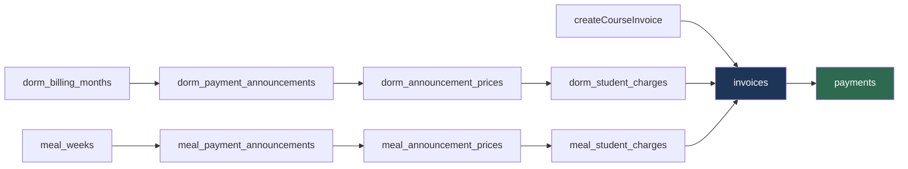

# 09 — Billing va moliya

> Modul: `billing` (1 610 qator — loyihaning **uchinchi eng katta** servisi)
> Bog'liq: `dorms`, `students`, `notifications`, `rbac`
> Status: **ishlab turgan tizim.** Real ota-onalar real pul to'laydi.

---

## 0. Bu hujjat nima haqida

Ziyo'da pul — abstraksiya emas. Har oy ota-ona uchta narsa uchun to'laydi:
o'quv kursi, yotoqxona, ovqatlanish. Qabulxona xodimi tugmani bosadi, buxgalter
hisobotni yopadi. Bu **bugun ishlaydi**.

**⚠️ Hujjat chegarasi — pul TIPI qarori bu yerda EMAS.**
`Decimal` vs `BigInt`, API chegarasidagi shartnoma, `Number()` taqiqi —
[ADR-0006](./adr/0006-money-decimal-in-db-string-at-api.md) da hal qilingan.
Bu hujjat o'sha qarorni **takrorlamaydi**, unga **tayanadi** va qaror
majburlanmagan joylarni ko'rsatadi. Migratsiya bosqichlari:
[14-roadmap.md](./14-roadmap.md) §2.3.

**Yuridik maslahat yo'q** — §10.9 "yurist savoli" deb belgilangan.

---

## 1. Uch to'lov oqimi

### 1.1 Manzara

| Oqim | Zanjir | Davriylik | Yaratish |
|---|---|---|---|
| **O'quv** | `invoices` → `payments` | Ad-hoc | Bittalab |
| **Yotoqxona** | `dorm_billing_months` → `dorm_payment_announcements` → `dorm_announcement_prices` → `dorm_student_charges` → `invoices` | **Oylik** | Ommaviy |
| **Ovqat** | `meal_weeks` → `meal_payment_announcements` → `meal_announcement_prices` → `meal_student_charges` → `invoices` | **Haftalik** | Ommaviy |



**Muhim kuzatuv:** uch oqim ham **bir joyga tushadi**. Ya'ni "uchta alohida
to'lov tizimi" emas — **bitta ledger (`invoices` + `payments`) va uchta uni
to'ldirish yo'li**.

### 1.2 `charges` va `invoices` — nega ikkalasi ham bor

`billing.service.ts:698-729` (dorm; ovqat oqimi `:404-434` — **bir xil**):

```ts
if (generateInvoices) {
  const invoice = await tx.invoices.create({
    data: {
      tenant_id, student_id: student.id, type: 'DORM',
      period_start: month.month_start, period_end: month.month_end,
      amount,                        // ← Decimal
      currency: 'UZS', status: 'PENDING', due_date: dueDate,
      created_by_user_id: staff_user_id,
    },
    select: { id: true },
  });
  invoiceId = invoice.id;
}

await tx.dorm_student_charges.create({
  data: {
    tenant_id, dorm_announcement_id: announcement.id, student_id: student.id,
    living_type_id: student.living_type_id!,
    amount,                          // ← AYNAN O'SHA Decimal
    currency: 'UZS', status: 'PENDING', invoice_id: invoiceId,
  },
});
```

`amount` **ikki marta** yoziladi. Munosabat **1:1**. Ikkalasida ham `status`.
Bu — denormalizatsiya va **drift xavfi**: `invoices.amount` tuzatilsa,
`charges.amount` eskicha qoladi.

Hozir xavf realizatsiya bo'lmagan — invoysni tahrirlash endpoint'i **yo'q**
(`staff-billing.controller.ts` da `@Patch` yo'q). Bu bagni uxlatib turibdi.

### 1.3 Birlashtirish kerakmi? — halol tahlil

**Vasvasa:** "hammasini `invoices` ga yig'ib, `type` bilan ajratamiz."
**Javob: yo'q**, va sabab domen ichida.

`dorm_*` / `meal_*` — invoysning nusxasi emas, uning **sababi**. Ular ikki
savolga javob beradi, `invoices` javob bera olmaydi:

1. **"Bu narx qayerdan keldi?"** — `*_announcement_prices` narxni `living_type`
   bo'yicha saqlaydi. Invoysda faqat natija, qoida yo'q
2. **"Bu oy kimga qancha e'lon qilingan?"** — invoyslar yig'indisidan **tiklab
   bo'lmaydi** (override'lar aralashadi)

Ya'ni `charges` — **domen hujjati**, `invoices` — **moliyaviy yozuv**.

**Lekin uch muammo tuzatilsin:**

| # | Muammo | Tuzatish |
|---|---|---|
| 1 | `amount` dublikat | `charges.amount` — **snapshot** deb hujjatlashtirilsin (nomi `snapshot_amount`). `invoices.amount` — yagona haqiqat |
| 2 | `status` ikki joyda, **qo'lda** sinxronlanadi (`:1140-1148`) | Status faqat `invoices` da |
| 3 | `createDormAnnouncement` (`:566-763`) va `createMealAnnouncement` (`:274-468`) — ~190 qator, **~85% bir xil** | Umumiy `createAnnouncement<T>()` |

2-band: `createPayment` charge statusini `updateMany` bilan yangilaydi, **faqat
`isFullyPaid` bo'lganda**. Invoys `CANCELLED` qilinsa — charge'lar `PENDING`
qoladi **abadiy**. (Bekor qilish endpoint'i yo'q → uxlab yotibdi.)

---

## 2. ⚠️ Pul turi — o'lchangan, faraz qilinmagan

### 2.1 Xulosa: baza TO'G'RI

```bash
$ grep -c "Float" apps/api/prisma/schema.prisma
0
```

**Bitta ham `Float` yo'q.** Barcha pul ustunlari — `Decimal(12,2)`:
`dorm_announcement_prices.price_amount` (`:330`) ·
`dorm_student_charges.amount` (`:390`) · `invoices.amount` (`:536`) ·
`meal_announcement_prices.price_amount` (`:591`) ·
`meal_student_charges.amount` (`:625`) · `payments.paid_amount` (`:708`).

PostgreSQL `NUMERIC(12,2)` — **o'nlik** kasr, ikkilik emas. `0.1 + 0.2 = 0.3`
bazada **aniq**.

> **`0.1 + 0.2 !== 0.3` tanqidi bu loyihaga tegishli emas.** Uni boshqa
> loyihadan ko'chirish — halol emas. Muammo bor, lekin **boshqa joyda**.

Chegara: maksimum **9 999 999 999.99 so'm** ≈ 10 mlrd.

### 2.2 Asl muammo — JS chegarasida izchillik yo'q

Prisma `NUMERIC` ni `Prisma.Decimal` **obyekti** sifatida qaytaradi. Muammo —
u bilan **nima qilinishida**. Bitta servis, **ikki shartnoma**:

```ts
// billing.service.ts:1578 — getBillingSummary()
unpaidTotal: unpaidTotal._sum.amount?.toString() || '0',      // ← string

// billing.service.ts:1605 — getPendingPayments()
amount: Number(inv.amount),                                    // ← number
```

**Bitta fayl. 25 qator masofa. Ikki xil tip.** Qaysi endpoint qaysi tipni
beradi — hech qayerda yozilmagan.

`Number()` pulga **11 joyda**:

| Fayl : qator | Kod | Kontekst |
|---|---|---|
| `billing.service.ts:1248` | `Number(totalPaid) > 0` | Solishtiruv |
| `billing.service.ts:1569` | `Number(p.paid_amount) / 1000` | Grafik ⚠️ §2.4 |
| `billing.service.ts:1605` | `Number(inv.amount)` | API javobi |
| `guardian-billing.controller.ts:79` | `Number(body.paidAmount)` | **Kirish** ⚠️ §10.1 |
| `guardian-student.controller.ts:576,578,582,592,595` | `+= Number(...)` | **Yig'indi** ⚠️ |
| `billing.dto.ts` × 4 | `@Type(() => Number)` | **Kirish** ⚠️ |

⚠️ **`guardian-student.controller.ts:574-587` — eng jiddiy naqsh:** `Number()`
**yig'indi ichida** → xato **to'planadi**. Va bu `billing.service.ts:1375-1401`
dagi **xuddi shu hisob**ning float versiyasi:

```ts
// guardian-student.controller.ts:576-582 — float
acc.totalAmount += Number(invoice.amount);
const paid = invoice.payments.reduce((sum, p) => sum + Number(p.paid_amount), 0);

// billing.service.ts:1377-1383 — Decimal (to'g'ri)
const paid = inv.payments.reduce((sum, p) => sum.add(p.paid_amount), new Prisma.Decimal(0));
acc.totalAmount = acc.totalAmount.add(inv.amount);
```

**Bitta domen savoli — "ota-ona qancha qarz?" — ikki xil hisoblanadi, ikki xil
aniqlikda, ikki xil faylda.** Bu §11 ning markaziy muammosi.

### 2.3 ⚠️ Halol xavf tahlili: bag hozir UXLAB YOTIBDI

**`Number(inv.amount)` bugun ma'lumot buzmaydi:**

```js
Number("20000000.00")    // 20000000       — ANIQ
Number("9999999999.99")  // 9999999999.99  — ANIQ
```

JS `number` — IEEE 754 double, **2⁵³ ≈ 9·10¹⁵** gacha butun sonni aniq
ifodalaydi. Bizning maksimum — 10 mlrd, ya'ni 2⁵³ dan **~900 000 marta kichik**.

Va ikkinchi halol fakt: **O'zbek so'mida tiyin amalda muomalada yo'q.** Narxlar
butun so'mda. `Decimal(12,2)` ning `.00` qismi amalda **doim nol**.

**Ya'ni: bag mavjud, lekin uyqu holatida.** Uni uyg'otadigan narsa — **kasr
qiymat**: jarima, chegirma, **proratsiya** (§6), qisman to'lov taqsimoti.

⚠️ **Lekin schema buni majburlamaydi.** `Decimal(12,2)` kasrni **ruxsat etadi**.
Bugungi xavfsizlik — **tasodif**, kafolat emas. Va §6 ko'rsatadiki, proratsiya —
eng ehtimolli qo'shimcha.

### 2.4 Yashirin birlik konvertatsiyasi

```ts
// billing.service.ts:1569
const amount = Number(p.paid_amount) / 1000;   // ← ming so'm? Hech qayerda yozilmagan
```

API javobida `revenueTrend` maydonining **birligi yozilmagan**, komment yo'q.
Frontend `1500` ni ko'rsa — 1 500 so'mmi yoki 1 500 000 so'mmi?
Klassik xato manbai (Mars Climate Orbiter naqshi).

**Tuzatish:** bo'lish backenddan chiqsin (ko'rsatish amali) yoki maydon
`revenueTrendThousandsUzs` deb nomlansin.

### 2.5 ⚠️ `payments` da `currency` ustuni YO'Q

`invoices` da valyuta bor (`:537`), `payments` da — **yo'q**. Ya'ni: invoys
USD'da bo'lishi mumkin (sxema ruxsat etadi), unga to'lov esa **valyutasiz**.

> ⚠️ **Qo'shni hujjatga tuzatish:** ADR-0006 "Ochiq savollar" §1 da
> *"hech bir pul jadvalida valyuta ustuni yo'q"* deyilgan. **O'lchov bo'yicha
> noto'g'ri** — `currency` 5 ta jadvalda **bor** (`invoices:537`,
> `dorm_student_charges:391`, `meal_student_charges:626`,
> `dorm_announcement_prices:331`, `meal_announcement_prices:592`); **faqat
> `payments` da yo'q**. ADR o'sha bandi tuzatilsin.

### 2.6 `Money` klassi — umuman yo'q

`billing` `Prisma.Decimal` ni **to'g'ridan-to'g'ri** ishlatadi. O'rash yo'q →
domen **ORM tipiga bog'langan**, valyuta va summa **hech qachon birga sayohat
qilmaydi**, yaxlitlash siyosati **markazlashmagan**.

---

## 3. `Money.allocate()` — nega kerak

### 3.1 Muammo

100 000 so'mni 3 ga bo'lamiz → `33333.333...`. `Decimal(12,2)` → `33333.33`.
Uchtasi: `99999.99`. **1 tiyin yo'qoldi** va u **hech qayerga ketmadi**.

⚠️ **Bu muammo `Decimal` da ham, `BigInt` da ham bir xil.** ADR-0006 `Decimal`
ni tanladi, lekin bu `allocate()` ni **keraksiz qilmaydi**: bo'linish qoldig'i —
**ifoda tipining emas, arifmetikaning muammosi**. `100000n / 3n = 33333n`
(BigInt kesadi) — xuddi shu yo'qotish, hatto kattaroq.

### 3.2 Bu qachon kerak bo'ladi

Bugun kodda bo'lish **yo'q** (grafik `/1000` dan boshqa) — muammo hali
tug'ilmagan. Lekin §6 va §11 uni **darhol** keltiradi:

- O'quvchi 20-fevralda keldi → fevral to'lovining **9/28** qismi
- Ota-ona 100 000 to'ladi, 3 invoys ochiq → qaysi biriga qancha?
- Yillik to'lov 9 oyga bo'linadi

### 3.3 `Money` — kod

`Prisma.Decimal` ustiga o'ralgan, ADR-0006 ga mos (ichida `Decimal`, chegarada
`string`). Bu — ADR-0006 "Ochiq savollar" §4 ga javob.

```ts
// apps/api/src/common/money/money.ts
import { Prisma } from '@prisma/client';

const Decimal = Prisma.Decimal;
type DecimalT = Prisma.Decimal;
const SCALE = 2;   // Decimal(12,2) ga mos

/**
 * Money — summa va valyuta birga. O'zgarmas.
 *
 * Nega klass: `Prisma.Decimal` valyutani bilmaydi, va `decimal > 0`
 * (`.greaterThan(0)` o'rniga) KOMPILYATSIYA BO'LADI va jimgina `true`
 * qaytaradi (obyekt > 0). Money bu xatoni tipda ushlaydi.
 */
export class Money {
  private constructor(
    private readonly _amount: DecimalT,   // so'mda, 2 kasr
    public readonly currency: string,
  ) {}

  /** So'mdan. String — afzal. */
  static fromSom(value: string | number | DecimalT, currency = 'UZS'): Money {
    const d = new Decimal(value);
    if (!d.isFinite()) throw new Error(`MONEY_NOT_FINITE: ${String(value)}`);  // ← NaN/Infinity
    if (d.decimalPlaces() > SCALE) throw new Error(`MONEY_TOO_PRECISE: ${d}`);
    return new Money(d, currency);
  }

  /** Tiyindan. 5_000_000 tiyin → 50 000.00 so'm. */
  static fromTiyin(t: bigint | number, c = 'UZS'): Money {
    return new Money(new Decimal(t.toString()).dividedBy(100), c);
  }
  static zero(c = 'UZS'): Money { return new Money(new Decimal(0), c); }
  static fromPrisma(v: DecimalT, c = 'UZS'): Money { return new Money(v, c); }

  /** API chegarasi. ADR-0006: pul chegarada DOIM string. */
  toSom(): string { return this._amount.toFixed(SCALE); }
  /** Butun tiyin. Payme tiyin, Click so'm talab qiladi (§10.3). */
  toTiyin(): bigint { return BigInt(this._amount.times(100).toFixed(0)); }
  toPrisma(): DecimalT { return this._amount; }

  add(o: Money): Money {
    this.assertSameCurrency(o);
    return new Money(this._amount.plus(o._amount), this.currency);
  }
  subtract(o: Money): Money {
    this.assertSameCurrency(o);
    return new Money(this._amount.minus(o._amount), this.currency);
  }
  /** ⚠️ ROUND_HALF_UP — bu QAROR, standart emas. */
  multiply(factor: string | number | DecimalT): Money {
    return new Money(
      this._amount.times(new Decimal(factor)).toDecimalPlaces(SCALE, Decimal.ROUND_HALF_UP),
      this.currency,
    );
  }

  gte(o: Money): boolean { this.assertSameCurrency(o); return this._amount.gte(o._amount); }
  greaterThan(o: Money): boolean { this.assertSameCurrency(o); return this._amount.gt(o._amount); }
  isNegative(): boolean { return this._amount.isNegative(); }
  isPositive(): boolean { return this._amount.greaterThan(0); }

  /**
   * ⭐ Nisbatlar bo'yicha taqsimlaydi. QOLDIQ YO'QOLMAYDI.
   * KAFOLAT:  sum(allocate(ratios)) === this      (Fowler, PoEAA)
   *
   * @example Money.fromSom('100000').allocate([1, 1, 1])
   *   → ['33333.34', '33333.33', '33333.33']   yig'indi = 100000.00 ✅
   */
  allocate(ratios: number[]): Money[] {
    if (ratios.length === 0) throw new Error('ALLOCATE_EMPTY_RATIOS');
    if (ratios.some((r) => r < 0)) throw new Error('ALLOCATE_NEGATIVE_RATIO');
    const total = ratios.reduce((a, b) => a + b, 0);
    if (total === 0) throw new Error('ALLOCATE_ZERO_TOTAL');

    // Tiyinda — butun son arifmetikasi. Qoldiq ANIQ hisoblanadi.
    const totalTiyin = this.toTiyin();
    const totalRatio = BigInt(Math.round(total * 1_000_000));
    const shares: bigint[] = [];
    let distributed = 0n;

    for (const ratio of ratios) {   // 1: pastga yaxlitlangan ulush (BigInt kesadi)
      const share = (totalTiyin * BigInt(Math.round(ratio * 1_000_000))) / totalRatio;
      shares.push(share);
      distributed += share;
    }

    let remainder = totalTiyin - distributed;   // 2: qoldiqni bittadan tarqatish
    const step = remainder >= 0n ? 1n : -1n;
    for (let i = 0; remainder !== 0n; i++) {
      shares[i % shares.length] += step;
      remainder -= step;
    }

    return shares.map((s) => Money.fromTiyin(s, this.currency));
  }

  split(n: number): Money[] { return this.allocate(new Array(n).fill(1)); }

  private assertSameCurrency(o: Money): void {
    if (this.currency !== o.currency) {
      throw new Error(`CURRENCY_MISMATCH: ${this.currency} vs ${o.currency}`);
    }
  }
}
```

### 3.4 Property test — yig'indi invarianti

```ts
// apps/api/src/common/money/money.spec.ts
import fc from 'fast-check';
import { describe, it, expect } from 'vitest';
import { Money } from './money';

const anyAmount = fc.bigInt({ min: 0n, max: 999_999_999_999n });   // 0..~10 mlrd so'm
const anyRatios = fc.array(fc.integer({ min: 1, max: 100 }), { minLength: 1, maxLength: 20 });

describe('Money.allocate — invariantlar', () => {
  it('⭐ qismlar yig\'indisi DOIM asl summaga teng', () => {
    fc.assert(
      fc.property(anyAmount, anyRatios, (totalTiyin, ratios) => {
        const money = Money.fromTiyin(totalTiyin);
        const sum = money.allocate(ratios).reduce((a, p) => a.add(p), Money.zero());
        expect(sum.toSom()).toBe(money.toSom());   // ← 1 tiyin ham yo'qolmaydi
      }),
      { numRuns: 2000 },
    );
  });

  it('teng nisbatda qismlar farqi — ko\'pi bilan 1 tiyin', () => {
    fc.assert(
      fc.property(anyAmount, fc.integer({ min: 1, max: 20 }), (totalTiyin, n) => {
        const t = Money.fromTiyin(totalTiyin).split(n).map((p) => p.toTiyin());
        const max = t.reduce((a, b) => (a > b ? a : b));
        const min = t.reduce((a, b) => (a < b ? a : b));
        expect(max - min).toBeLessThanOrEqual(1n);
      }),
    );
  });
});

describe('Money — regressiya', () => {
  it('100 000 so\'m 3 ga — 1 tiyin yo\'qolmaydi', () => {
    const parts = Money.fromSom('100000').split(3);
    expect(parts.map((p) => p.toSom())).toEqual(['33333.34', '33333.33', '33333.33']);
    expect(parts.reduce((a, p) => a.add(p), Money.zero()).toSom()).toBe('100000.00');
    //                                                                  ↑ 99999.99 EMAS
  });

  it('proratsiya: oyning 9/28 qismi', () => {
    const [used, unused] = Money.fromSom('500000').allocate([9, 19]);
    expect(used.add(unused).toSom()).toBe('500000.00');
  });

  it('valyuta aralashuvi va NaN — xato', () => {
    expect(() => Money.fromSom('1000', 'UZS').add(Money.fromSom('1000', 'USD')))
      .toThrow('CURRENCY_MISMATCH');
    expect(() => Money.fromSom(NaN)).toThrow('MONEY_NOT_FINITE');       // ← §10.1
    expect(() => Money.fromSom(Infinity)).toThrow('MONEY_NOT_FINITE');
  });
});
```

---

## 4. To'lov e'lonlari (payment announcements)

### 4.1 Domen tushunchasi

E'lon — **hujjat**, xabar emas:

> "2026-fevral yotoqxona to'lovi e'lon qilindi. FULL_BOARD — 500 000 so'm,
> WEEKDAYS_ONLY — 350 000. Muddat — 25-fevral."

Ikki qism: **`*_payment_announcements`** (sarlavha, muddat, `is_published`) +
**`*_announcement_prices`** (`living_type` bo'yicha narx, kompozit PK —
`@@id([dorm_announcement_id, living_type_id])`, `:335`).

`living_types` (`billing.service.ts:111-127` da seed): `DAY_ONLY` (uyda, faqat
tushlik) · `WEEKDAYS_ONLY` (Dush–Juma) · `FULL_BOARD` (7 kun).

### 4.2 ⚠️ Billing qoidasi — kodda, ma'lumotda emas

`createDormAnnouncement` (`:566-763`) bitta tranzaksiyada 9 bosqich bajaradi.
5-bosqich muhim:

```ts
// billing.service.ts:650-664
const students = await tx.students.findMany({
  where: {
    tenant_id, status: 'ACTIVE', living_type_id: { not: null },
    living_types: { code: { in: ['FULL_BOARD', 'WEEKDAYS_ONLY'] } },   // ← HARDKOD
  },
  select: { id: true, living_type_id: true },
});
```

`living_types.code` — tenant ichida o'zgartirilishi mumkin
(`seedDefaultLivingTypes` faqat **default** yaratadi). Xodim yangi kod bilan tur
qo'shsa — masalan `WEEKEND_ONLY` — u yotoqxona e'lonidan **jimgina tushib
qoladi**. Ovqat e'loni esa (`:359-369`) **barcha** `living_type` li o'quvchini
oladi.

Ya'ni "kim yotoqxona uchun to'laydi?" qoidasi — **kodda**. Bu — DTM 189 ball
naqshining takrori: domen qoidasi noto'g'ri qatlamda
([07-dtm-assessment-engine.md](./07-dtm-assessment-engine.md)).

**Tuzatish:** `living_types` ga `is_dorm_billable` / `is_meal_billable` boolean
ustunlari → qoida ma'lumotda, xodim boshqara oladi.

### 4.3 Override — individual narx

```ts
// billing.service.ts:692-694
const amount = overrideMap.has(studentIdStr)
  ? new Prisma.Decimal(overrideMap.get(studentIdStr)!)   // ← number → Decimal
  : priceMap.get(livingTypeIdStr)!;
```

Chegirma/imtiyoz mexanizmi — to'g'ri fikr. ⚠️ **Lekin sabab yozilmaydi.**
`dorm_student_charges.note` ustuni **bor** (`:396`), override uni
**to'ldirmaydi**. Audit logda faqat `studentsCount` (`:742-750`), override
ro'yxati **yo'q**. Ya'ni "nega bu bola 450 000, boshqasi 500 000?" — javob
**hech qayerda yo'q**. Bu — **pul qarori** (§13 #5).

### 4.4 E'lon — snapshot, jonli qoida emas

`@@unique([tenant_id, dorm_month_id])` (`:367`) — **bir oyga bitta e'lon**.
Idempotentlik uchun yaxshi (§8), lekin oqibati bor: o'quvchilar ro'yxati e'lon
paytida **muzlatiladi**.

| Vaziyat | Nima bo'ladi |
|---|---|
| O'quvchi e'londan **keyin** keldi | Charge **yaratilmaydi**. Bepul yashaydi. Jimgina |
| O'quvchi e'londan **keyin** ketdi | Charge qoladi. To'liq oy uchun qarzdor |
| `living_type` keyin o'zgardi | Eski narx qoladi |

---

## 5. `dorm_billing_months` va `meal_weeks` — nega davriylik farq qiladi

### 5.1 Sabab domenda

| | Yotoqxona | Ovqat |
|---|---|---|
| Davr | **Oy** (`month_key` = `2026-02`) | **Hafta** (`week_key` = `2026-W06`) |
| Nega | **Joy ijarasi** — joy oy davomida band, o'quvchi kelsa ham, kelmasa ham | **Iste'mol** — haftada necha marta ovqatlanish o'zgaruvchan |

Bu — **to'g'ri domen modellashtirish**. Ovqat haftalik, chunki dam olish
rejasi, ta'til/imtihon haftasi o'zgaradi; oylik ovqat to'lovi refund talab
qilardi. Yotoqxona oylik, chunki joy **oy bo'yi zahiralangan**.

### 5.2 ⚠️ Kalit generatsiyasida izchillik yo'q

```ts
// billing.service.ts:34-44 — UTC
function isoWeekKey(date: Date): string {
  const d = new Date(date);
  d.setUTCHours(0, 0, 0, 0);
  const day = d.getUTCDay() || 7;
  ...
}

// billing.service.ts:46-48 — serverning LOKAL vaqti
function monthKey(date: Date): string {
  return `${date.getFullYear()}-${String(date.getMonth() + 1).padStart(2, '0')}`;
  //            ^^^^^^^^^^^^^ lokal        ^^^^^^^^^^^ lokal
}
```

Bitta fayl, 14 qator masofa, **ikki xil vaqt zonasi**.

**Oqibat:** `2026-02-01T00:00:00Z` sanasi server UTC'da → `2026-02` ✅;
server UTC−5 da → lokal `2026-01-31T19:00` → **`2026-01`** ❌.

Bag **uxlab yotibdi** (Render odatda UTC), lekin bu — **konfiguratsiyaga bog'liq
to'g'rilik**, kafolat emas. Va `monthKey` `getBillingSummary` da ham ishlatiladi
(`:1556`, `:1566`) — ya'ni **daromad hisoboti** shunga tayanadi.

**Tuzatish:** ikkalasi ham UTC yoki ikkalasi ham `Asia/Tashkent`. `dayjs`
allaqachon stack'da bor.

---

## 6. Hisob-kitob mantiqi — proratsiya

### 6.1 ⚠️ Xulosa: proratsiya YO'Q

O'lchandi. `billing` va `dorms` modullarida: bo'lish **yo'q** (grafik `/1000`
dan boshqa), kun hisobi **yo'q**, `student_room_assignments.start_date` /
`end_date` billing'da **ishlatilmaydi**. `amount` **doim** to'liq narx.

### 6.2 Yotoqxonadan chiqsa

`dorms.service.ts:671-719` — `endAssignment()`:

```ts
const updated = await this.prisma.student_room_assignments.update({
  where: { id: assignment_id },
  data: { end_date: new Date() },
});
await this.auditLogger.log({ ... });
return { ok: true };
```

**Billing'ga bitta ham murojaat yo'q.** Ya'ni:

> O'quvchi 3-fevralda chiqdi. Fevral uchun 500 000 so'mlik charge **qoladi**.
> Ota-ona **to'liq oy** uchun qarzdor ko'rinadi.

Xuddi shu `assignRoom()` da (`:576-669`) — yangi o'quvchiga charge
**yaratilmaydi** (e'lon o'tgan bo'lsa).

### 6.3 Halol baho: bagmi yoki qaror?

**Ehtimol — qaror, lekin yozilmagan qaror.**

*Proratsiya kerak emas* foydasiga: yotoqxona — **joy zahirasi**, o'quvchi ketsa
ham joy bo'sh turadi → to'liq oy **odilona**; oy o'rtasida harakat **kam
uchraydi**; `overrides` bilan qo'lda tuzatish mumkin (§4.3).

*Kerak* foydasiga: ovqat — **iste'mol**, joy zahirasi emas. 3 kun ovqatlangan
bola bir haftalik to'lasa — **adolatsiz** va ota-ona buni sezadi. O'quv yili
boshi/oxirida kelish-ketish — **ommaviy**.

**Tavsiya:**
1. **Yotoqxona: proratsiya YO'Q** — bu qaror **hujjatlashtirilsin** va
   `dorm_payment_announcements.message` da ota-onaga aytilsin
2. **Ovqat: proratsiya KERAK** — kunlar bo'yicha
3. Ikkalasida ham — `Money.allocate()` (§3)

⚠️ **Proratsiya §2.3 dagi uxlab yotgan bagni UYG'OTADI** —
`500000 × 9/28 = 160714.2857...` — birinchi haqiqiy kasr. Shuning uchun
**ADR-0006 proratsiyadan OLDIN** bajarilishi kerak.

### 6.4 Minimal to'g'ri implementatsiya

```ts
function prorateWeeklyMeal(
  weekPrice: Money, weekStart: Date, weekEnd: Date,
  studentStart: Date | null, studentEnd: Date | null,
): Money {
  const totalDays = daysBetween(weekStart, weekEnd) + 1;
  const effStart = studentStart && studentStart > weekStart ? studentStart : weekStart;
  const effEnd = studentEnd && studentEnd < weekEnd ? studentEnd : weekEnd;
  if (effEnd < effStart) return Money.zero(weekPrice.currency);

  const usedDays = daysBetween(effStart, effEnd) + 1;
  if (usedDays >= totalDays) return weekPrice;

  const [used] = weekPrice.allocate([usedDays, totalDays - usedDays]);  // ← qoldiq yo'qolmaydi
  return used;
}
```

---

## 7. ⚠️ Double-entry buxgalteriya kerakmi?

### 7.1 Hozirgi model

```
invoices (nima qarz) → payments (nima kelgan)
qoldiq = invoices.amount − SUM(payments.paid_amount)
```

Oddiy. Tushunarli. **Va bu akademiya uchun — yetarli.**

### 7.2 Double-entry nima berardi

Har tranzaksiya debet + kredit, invariant `SUM(debit) = SUM(credit)`:

```
Ota-ona 500 000 to'ladi:
  Debet:  Kassa            +500 000
  Kredit: Debitorlik qarzi −500 000
                           ─────────  = 0 ✅
```

Foydasi: pul **yo'qola olmaydi** — strukturaviy kafolat.

### 7.3 Halol javob: HOZIR — YO'Q

Bu — **buxgalteriya dasturi emas**, Student Information System.

| Double-entry qachon kerak | Bormi |
|---|---|
| Ko'p hisob (kassa, bank, debitorlik, kreditorlik) | ❌ Bitta oqim: ota-ona → akademiya |
| Split payment (pul bir necha tomonga) | ❌ |
| Escrow / vaqtincha ushlash | ❌ |
| Refund va chargeback | ❌ Endpoint yo'q |
| Komissiya hisobi | ❌ Provayder yo'q (§10) |
| Ko'p valyuta | ❌ Faqat UZS |
| Rasmiy buxgalteriya hisoboti | ❌ Buxgalter alohida dastur ishlatadi |

**Yettitadan yettitasi — yo'q.** Double-entry qo'shish `ledger_entries` +
hisoblar rejasi + har `payments.create()` da ikki yozuv + real to'lovlar
migratsiyasi + xodimlarni o'qitishni talab qiladi — va **evaziga hech narsa
bermaydi**, chunki hal qiladigan muammolar **yo'q**.

> **Bu — YAGONA to'g'ri javob emas, lekin BUGUNGI to'g'ri javob.**
> "Double-entry — professional yondashuv" argumenti haqiqat, lekin
> professionallik — **muammoga mos yechim tanlash**, eng murakkabini emas.
> Yo'q muammoni hal qiladigan 500 qator kod — **texnik qarz**, aktiv emas.

### 7.4 LEKIN — invariant baribir kerak

Double-entry rad etiladi, uning **kafolati** — yo'q:

```ts
// apps/api/test/billing/invariants.spec.ts
describe('Billing invariantlari', () => {
  it('INV-1: to\'lovlar yig\'indisi invoys summasidan oshmaydi', async () => {
    const rows = await prisma.$queryRaw`
      SELECT i.id FROM invoices i JOIN payments p ON p.invoice_id = i.id
      GROUP BY i.id, i.amount HAVING SUM(p.paid_amount) > i.amount`;
    expect(rows).toHaveLength(0);          // ← HOZIR BUZILADI (§8.3)
  });

  it('INV-2: status to\'lovlarga mos', async () => {
    const rows = await prisma.$queryRaw`
      SELECT i.id FROM invoices i LEFT JOIN payments p ON p.invoice_id = i.id
      GROUP BY i.id, i.status, i.amount
      HAVING (i.status = 'PAID'    AND COALESCE(SUM(p.paid_amount),0) < i.amount)
          OR (i.status = 'PENDING' AND COALESCE(SUM(p.paid_amount),0) >= i.amount)`;
    expect(rows).toHaveLength(0);
  });

  it('INV-3: charge summasi invoysga teng', async () => {
    const rows = await prisma.$queryRaw`
      SELECT c.id FROM dorm_student_charges c JOIN invoices i ON i.id = c.invoice_id
      WHERE c.amount <> i.amount`;
    expect(rows).toHaveLength(0);          // §1.2 drift
  });

  it('INV-4: pul manfiy emas va NaN emas', async () => {
    const rows = await prisma.$queryRaw`
      SELECT id FROM payments WHERE paid_amount < 0 OR paid_amount = 'NaN'::numeric`;
    expect(rows).toHaveLength(0);          // ← §10.1
  });

  it('INV-5: charge tenant chegarasida', async () => {
    const rows = await prisma.$queryRaw`
      SELECT c.id FROM dorm_student_charges c JOIN invoices i ON i.id = c.invoice_id
      WHERE c.tenant_id <> i.tenant_id`;
    expect(rows).toHaveLength(0);          // 03-multi-tenancy.md
  });
});
```

Bu beshta test — double-entry ning **95% qiymatini 5% narxiga** beradi.

### 7.5 Qachon qayta ko'riladi

| Signal | Harakat |
|---|---|
| Refund qo'shildi | Qayta baholansin |
| To'lov provayderi + komissiya (§10) | Komissiya — ikkinchi hisob. Qayta baholansin |
| Buxgalter rasmiy hisobot so'radi | Qayta baholansin |
| Balans mos kelmadi (bitta hodisa) | Audit + darhol qayta baholansin |

---

## 8. Idempotentlik

### 8.1 ⚠️ To'lov ikki marta yozilsa

```bash
$ grep -rni "idempot" apps/api/src
(0 natija)
```

`payments` jadvalida **hech qanday unique constraint yo'q** (`schema.prisma:706-722`).

**Ssenariy — qabulxona tugmani ikki marta bosdi:**

1. Xodim "Saqlash" bosadi. Tarmoq sekin
2. Javob kelmadi. Xodim yana bosadi
3. **Ikkala so'rov ham bajariladi** → `payments` da **ikki qator**: 500 000 + 500 000
4. `totalPaid.gte(invoice.amount)` → `true` → invoys `PAID`

Natija: ota-ona 500 000 to'ladi, tizim **1 000 000** qabul qilingan deb
hisoblaydi. Buxgalteriyada **kassa mos kelmaydi**. ⚠️ Va bu **jimgina** —
xato yo'q, ogohlantirish yo'q.

### 8.2 Nima HIMOYALANGAN (halol e'tirof)

```prisma
dorm_payment_announcements  @@unique([tenant_id, dorm_month_id])         // :367
meal_payment_announcements  @@unique([tenant_id, meal_week_id])          // :607
dorm_student_charges        @@unique([dorm_announcement_id, student_id]) // :400
meal_student_charges        @@unique([meal_announcement_id, student_id]) // :635
dorm_billing_months         @@unique([tenant_id, month_key])             // :349
meal_weeks                  @@unique([tenant_id, week_key])              // :645
```

E'lonni ikki marta yaratib bo'lmaydi, bitta o'quvchiga ikki charge yozilmaydi.
Bu — **to'g'ri qilingan**. Muammo faqat `payments` da: **ommaviy operatsiya
himoyalangan, bittalab pul qabul qilish — yo'q**. Teskari ustuvorlik.

### 8.3 Ortiqcha to'lov ham tekshirilmaydi

```ts
// billing.service.ts:1067-1069 — yagona tekshiruv
if (dto.paidAmount < 0) throw new BadRequestException('PAID_AMOUNT_MUST_BE_POSITIVE');
```

**Qoldiqqa solishtiruv yo'q:** invoys 500 000, to'lov 5 000 000 → **qabul
qilinadi**, `remaining` = **−4 500 000**. Va `@Min(0)` (`billing.dto.ts:369`)
**nol to'lovni ruxsat etadi** (`0 < 0` → false).

### 8.4 Yechim

**Qatlam 1 — baza (yagona haqiqiy kafolat):**

```prisma
model payments {
  idempotency_key String? @db.VarChar(255)

  @@unique([tenant_id, idempotency_key])
  @@index([invoice_id])              // §9.4 — indeks ham yo'q
  @@index([tenant_id, paid_at])
}
```

`String?` — mavjud qatorlar `NULL`. PostgreSQL'da bir nechta `NULL` unique
constraint'ni buzmaydi → **migratsiya xavfsiz**, eski ma'lumot tegilmaydi.

**Qatlam 2 — API:** `Idempotency-Key` header majburiy.

**Qatlam 3 — servis.** Uch o'zgarish:

```ts
async createPayment(tenantId, staffUserId, dto, idempotencyKey: string, ipAddress?) {
  const key = { tenant_id, idempotency_key: idempotencyKey };

  // ① Takroriy so'rov — o'sha javob, yangi yozuv YO'Q
  const existing = await this.prisma.payments.findUnique({ where: { tenant_id_idempotency_key: key } });
  if (existing) return this.buildPaymentResponse(existing);

  return await this.prisma.$transaction(async (tx) => {
    const invoice = await tx.invoices.findFirst({ where: { id: invoice_id, tenant_id }, select: {...} });
    if (!invoice) throw new NotFoundException('INVOICE_NOT_FOUND');
    if (invoice.status === 'PAID') throw new BadRequestException('INVOICE_ALREADY_PAID');

    const paid = Money.fromSom(dto.paidAmount);      // ← NaN/Infinity SHU YERDA ushlanadi
    if (!paid.isPositive()) throw new BadRequestException('PAID_AMOUNT_MUST_BE_POSITIVE');

    // ② Ortiqcha to'lov tekshiruvi — HOZIR YO'Q (§8.3)
    const agg = await tx.payments.aggregate({ where: { invoice_id }, _sum: { paid_amount: true } });
    const total = Money.fromPrisma(agg._sum.paid_amount ?? new Prisma.Decimal(0)).add(paid);
    const invoiceAmount = Money.fromPrisma(invoice.amount);
    if (total.greaterThan(invoiceAmount)) throw new BadRequestException('OVERPAYMENT_NOT_ALLOWED');

    try {
      await tx.payments.create({ data: { ...key, invoice_id, paid_amount: paid.toPrisma() } });

      // ③ Status — UCH holat, ikki emas (§11.2)
      await tx.invoices.update({
        where: { id: invoice_id },
        data: { status: total.gte(invoiceAmount) ? 'PAID' : 'PARTIALLY_PAID' },
      });
    } catch (e) {
      // ④ Poyga: ikkinchi so'rov constraint'ga urildi
      if (e instanceof Prisma.PrismaClientKnownRequestError && e.code === 'P2002') {
        const dup = await tx.payments.findUnique({ where: { tenant_id_idempotency_key: key } });
        return this.buildPaymentResponse(dup!);
      }
      throw e;
    }
  });
}
```

⚠️ **④ muhim:** ①dagi `findUnique` **poygani hal qilmaydi** — ikki so'rov bir
vaqtda kelsa, ikkalasi ham "topilmadi" ko'radi. **Yagona haqiqiy kafolat — baza
constraint'i.** `findUnique` — optimizatsiya, himoya emas.

---

## 9. Audit

### 9.1 O'lchangan holat

`audit_logs` mavjud, `AuditLogger` (`common/utils/audit.util.ts`) ishlatiladi.
`PAYMENT` — alohida audit action (`audit.util.ts:13`).

| Operatsiya | Audit | Qator |
|---|---|---|
| `createPayment` (xodim) | ✅ Ha | `:1152-1169` |
| `createCourseInvoice` | ✅ Ha | `:928-944` |
| `createDormAnnouncement` / `createMealAnnouncement` | ✅ Ha | `:735` / `:440` |
| **`guardianPayInvoice`** | ❌ **YO'Q** | `:1181-1263` |
| `createDormMonth` / `createMealWeek` | ❌ Yo'q | `:472` / `:180` |
| `seedDefaultLivingTypes` | ❌ Yo'q | `:108-176` |

### 9.2 ⚠️ Eng jiddiy bo'shliq

**`guardianPayInvoice` — pul yaratadi, audit YOZMAYDI.** 82 qator,
`payments.create()` bor, invoys statusini o'zgartiradi, `AuditLogger` chaqiruvi
**yo'q**. Ya'ni ota-ona invoysni "to'lagan" deb belgilaydi — kim, qachon, qaysi
IP'dan — **noma'lum**.

`AuditLogger` `actorType: 'GUARDIAN'` va `actorStudentAccountId` ni
**qo'llab-quvvatlaydi** (`audit.util.ts:19, 40`) — infratuzilma **tayyor**,
shunchaki chaqirilmagan. Tuzatish — ~10 qator.

### 9.3 Audit o'zgarmasmi?

`audit_logs` da `UPDATE`/`DELETE` dan himoya **yo'q** — `audit_logs.deleteMany()`
ishlaydi. Superadmin izini o'chira oladi. Minimal:
`REVOKE DELETE, UPDATE ON audit_logs` ilova roli uchun
([10-security.md](./10-security.md)).

### 9.4 ⚠️ Indeks yo'q

O'lchandi (`prisma/migrations/000000_init/migration.sql`):

```
CREATE INDEX (performans)  →  0
CREATE UNIQUE INDEX        →  27
FOREIGN KEY                →  165
```

**PostgreSQL foreign key ustiga avtomatik indeks YARATMAYDI** (PK va unique —
yaratadi; FK — yo'q). Ya'ni `payments WHERE invoice_id = ?` (`:1120-1127`) —
**seq scan**; `ON DELETE CASCADE` — har FK uchun seq scan.

`createPayment` **har chaqiruvda** `payments.aggregate({ where: { invoice_id } })`
qiladi. Bugun sezilmaydi. 3 yildan keyin (500 o'quvchi × 12 oy × 3 oqim
≈ 18 000 invoys) — **har to'lov sekinlashadi**.

Minimal: `payments` `@@index([invoice_id])`, `@@index([tenant_id, paid_at])` ·
`invoices` `@@index([tenant_id, status])`, `@@index([tenant_id, student_id])`,
`@@index([student_id])` · `audit_logs` `@@index([tenant_id, created_at])`.
Batafsil: [11-infrastructure.md](./11-infrastructure.md).

### 9.5 ⚠️⚠️ Render `plan: free` — zaxira YO'Q

`render.yaml:58` → `plan: free`. Render'ning bepul PostgreSQL'ida **avtomatik
zaxira yo'q** va bepul baza **muddati tugaydi** (30 kundan keyin o'chiriladi).

> ⚠️ **Bu — real ota-onalarning real to'lov yozuvlari.** Audit log, invoys,
> to'lov tarixi. Zaxirasiz.
>
> Bu hujjatdagi **eng yuqori ustuvorlikdagi bitta band**. §2 dagi `Number()`
> ma'lumotni **buzishi mumkin**; `plan: free` uni **yo'qotadi**. Ikkinchisi —
> qaytarib bo'lmaydigan.

Harakat: pullik reja + `pg_dump` cron + zaxirani **tiklab ko'rish**
(tiklanmagan zaxira — zaxira emas).

---

## 10. To'lov tizimlari integratsiyasi

### 10.1 ⚠️⚠️ Avval: hozirgi "online to'lov" — soxta

Hujjatdagi **eng jiddiy topilma**.

```ts
// guardian-billing.controller.ts:66-82
@Post('invoices/:id/pay')
@ApiOperation({ summary: 'Submit an online payment for an invoice' })
payInvoice(
  @Req() req: any,
  @Param('id') invoiceId: string,
  @Body() body: { paidAmount: number; method?: 'CASH' | 'CARD' | 'TRANSFER' | 'OTHER' },
  //     ^^^^^^^^^^^^^^^^^^^^^^^^^^ ← DTO EMAS. Oddiy TypeScript tip literali
) {
  const { tenantId, studentAccountId } = this.getGuardianInfo(req);
  return this.service.guardianPayInvoice(
    tenantId, studentAccountId, invoiceId,
    Number(body.paidAmount),        // ← :79
    body.method ?? 'CARD',
  );
}
```

**`@Body() body: { paidAmount: number }` — klass emas, tip literali.** NestJS
`ValidationPipe` faqat **dekoratorli klasslarni** validatsiya qiladi. Tip
literali kompilyatsiyada **o'chib ketadi** → runtime'da **hech qanday tekshiruv
yo'q**. Ya'ni **ota-ona `paidAmount` ga istalgan narsani yuborishi mumkin**.

Yagona himoya — `billing.service.ts:1192-1194`:

```ts
if (paidAmount <= 0) throw new BadRequestException('PAID_AMOUNT_MUST_BE_POSITIVE');
```

| Kirish | `Number()` | `<= 0` ? | Natija |
|---|---|---|---|
| `500000` | `500000` | false | ✅ O'tadi — **lekin pul kelmagan** (§10.2) |
| `-5000` | `-5000` | **true** | ✅ Rad etiladi |
| `0` | `0` | **true** | ✅ Rad etiladi |
| `null` / `[]` | `0` | **true** | ✅ Rad etiladi |
| **`"abc"`** | **`NaN`** | ⚠️ **false** | ❌ **O'tadi** |
| **`undefined`** | **`NaN`** | ⚠️ **false** | ❌ **O'tadi** |
| **`{}`** | **`NaN`** | ⚠️ **false** | ❌ **O'tadi** |
| **`1e999`** | **`Infinity`** | ⚠️ **false** | ❌ **O'tadi** |
| `99999999999999` | o'zi | false | ❌ O'tadi → `numeric overflow` → **500** |

⚠️ **`NaN <= 0` → `false`.** IEEE 754 semantikasi: `NaN` bilan **har qanday**
solishtiruv `false`. Ya'ni **`NaN` guardni teshib o'tadi** — "musbat summa"
tekshiruvi `NaN` ni musbat deb hisoblaydi.

**`NaN` bazaga tushsa** (`:1219` — `new Prisma.Decimal(paidAmount)`):
`Decimal.js` `NaN` ni qabul qiladi; PostgreSQL `numeric` **`'NaN'` ni
qo'llab-quvvatlaydi** (yagona shunday raqamli tip). Oqibat **abadiy**:

```sql
SELECT SUM(paid_amount) FROM payments WHERE invoice_id = 42;   -- → NaN
```

Bitta `NaN` butun yig'indini zaharlaydi. Keyin `totalPaid.gte(...)` → `false`
va `Number(totalPaid) > 0` → `false` → **ikkala shart ham false** → status
**o'zgarmaydi**, invoys abadiy `PENDING`, o'quvchining **butun balansi `NaN`**
(`guardianInvoices` summary `:1375-1401`). **Bitta so'rov bitta o'quvchining
moliyaviy tarixini qaytarib bo'lmas darajada buzadi.**

> ⚠️ **Halol chegara:** `NaN` ning bazaga **haqiqatan yetib borishi** Prisma 7
> ning `Decimal` serializatsiyasiga bog'liq va **ishlaydigan baza ustida sinab
> ko'rilmagan** — Prisma uni rad etishi ham mumkin (u holda 500, ma'lumot
> buzilmaydi). **`NaN <= 0 === false` — bu esa aniq**, JS semantikasi bo'yicha
> kafolatlangan. Bu — **birinchi yozilishi kerak bo'lgan test** (§12.4).

### 10.2 Va eng asosiysi: pul umuman kelmaydi

Yuqoridagilar — validatsiya baglari. **Asosiy muammo boshqa:** hatto
`paidAmount: 500000` — mukammal qiymat — yuborilganda ham **hech qanday pul
o'tkazilmaydi**.

`guardianPayInvoice` (`:1181-1263`) faqat: `payments` ga qator yozadi
(`source: 'ONLINE'`) va invoys statusini `PAID` qiladi. **To'lov provayderi
yo'q. Karta yo'q. Tasdiq yo'q.**

```bash
$ grep -rni "payme\|click\|uzum" apps/api/src apps/web/src
(to'lov provayderiga oid natija: 0)
```

Ya'ni `POST /guardian/billing/invoices/:id/pay` — **"mening invoysimni to'langan
deb belgila"** tugmasi. Autentifikatsiya bor (guardian o'z invoysini ko'radi —
`:1205-1209`), lekin **avtorizatsiya semantikasi noto'g'ri**: ota-onaga o'z
qarzini bekor qilish huquqi berilgan.

**Darhol harakat:** bu endpoint **o'chirilsin** yoki `501 Not Implemented`
qaytarsin — integratsiyadan **oldin**. Hozirgi holatda u — ochiq moliyaviy
zaiflik.

### 10.3 Uch provayder — tasdiqlangan taqqoslash

> [developer.help.paycom.uz](https://developer.help.paycom.uz/) ·
> [PaycomUZ/paycom-integration-php-template](https://github.com/PaycomUZ/paycom-integration-php-template) ·
> [docs.click.uz](https://docs.click.uz/) · [github.com/click-llc](https://github.com/click-llc) ·
> [developer.uzumbank.uz](https://developer.uzumbank.uz/)

| | **Payme** | **Click (SHOP-API)** | **Uzum** |
|---|---|---|---|
| Yo'nalish | **Payme → biz** (biz hostlaymiz) | **Click → biz** | Ikkalasi |
| Protokol | JSON-RPC 2.0, POST, TLS | `x-www-form-urlencoded` → JSON | REST/JSON |
| Auth | `Basic base64("Paycom:<kassa_kaliti>")` — login literal **`Paycom`** | MD5 `sign_string` | Basic / `X-API-Key` |
| **⭐ Birlik** | **butun TIYIN** | **kasrli SO'M** | — |
| Timeout | **12 soat** | — | **30 daqiqa** |
| **Sandbox** | ✅ [test.paycom.uz](https://test.paycom.uz) | ❌ **yo'q** | ❌ topilmadi |
| Manba IP | `185.234.113.1–15` | — | — |

> ⚠️⚠️ **Integratsiyadagi eng xavfli farq: Payme = butun tiyin, Click = kasrli
> so'm.** Payme hujjati: *"целое число… сумму в тийинах"*. Click hujjati:
> `amount | float | "Payment amount (in soums)"` — "tiyin" so'zi Click'da
> **umuman uchramaydi**.
>
> 100× xato **jimgina** va **yo'nalishli**. `Money` (§3) buni tipda hal qiladi:
> `toTiyin()` Payme uchun, `toSom()` Click uchun.

**Payme metodlari:** `CheckPerformTransaction` → `CreateTransaction` →
`PerformTransaction`; + `CancelTransaction`, `CheckTransaction`, `GetStatement`,
`SetFiscalData`. Holatlar: `1` yaratilgan · `2` bajarilgan · `-1` / `-2` bekor.
`account` — ixtiyoriy JSON, biz belgilaymiz (`{ invoice_id: "42" }`).
Xatolar: `-32300` POST emas · `-32700` parse · `-32600` RPC maydonlari ·
`-32601` metod yo'q · `-32504` auth · `-32400` ichki · `-31001` summa ·
`-31003` tranzaksiya yo'q · `-31007` bekor qilib bo'lmaydi · `-31008` bajarib
bo'lmaydi · **`-31050..-31099`** `account` xatosi (biz belgilaymiz).
⚠️ **`ChangePassword` — Payme'ning joriy hujjatida YO'Q** (faqat uchinchi tomon
kutubxonalarida). Unga tayanmang.

**Click imzosi** (rasmiy PHP kutubxonasidan tasdiqlangan):

```
Prepare:  md5(click_trans_id + service_id + SECRET_KEY + merchant_trans_id
              + amount + action + sign_time)
Complete: md5(click_trans_id + service_id + SECRET_KEY + merchant_trans_id
              + merchant_prepare_id + amount + action + sign_time)
```

`SECRET_KEY` — **3-o'rinda**. `merchant_prepare_id` — **faqat Complete**'da.
`sign_time`: `YYYY-MM-DD HH:mm:ss`.

⚠️ **Amaliy tuzoq:** `amount` ni **simda kelgan ko'rinishida** hash qiling —
`1000.00` va `1000` **turli MD5** beradi. Qayta parse qilingan float'dan emas,
**xom POST satridan**.

Click kodlari: `0` ok · `-1` imzo · `-2` summa · `-3` action · `-4` allaqachon
to'langan · `-5` foydalanuvchi yo'q · `-6` tranzaksiya yo'q · `-7` yangilab
bo'lmadi · `-8` so'rov xatosi · `-9` bekor qilingan.

**Uzum:** Checkout (biz → Uzum: `/api/v1/payment/register`, `/refund`) +
Merchant API (Uzum → biz: `/check`, `/create`, `/confirm`, `/reverse`,
`/status`). Uzum Nasiya (BNPL) — alohida API. ⚠️ Checkout'ning bazaviy hosti
hujjatda yo'q (onboarding'da beriladi).

### 10.4 Narx va onboarding (2026)

| Provayder | Komissiya | Manba |
|---|---|---|
| **Payme** | E-commerce (billing bilan): **2.0%** · billing'siz: 1.5% · QR/GO: 1% | [business.payme.uz](https://business.payme.uz/ru/solutions/spot-payments) |
| **Click** | **Ta'lim sohasi: 1–2.5%** (Uzcard/Humo) · Visa: 2.5% · QR: 1% | [business.click.uz](https://business.click.uz/ru) |
| **Uzum** | Uzum kartasi: **0%** · boshqa banklar: **0.4%** | [merchants.uzumbank.uz](https://merchants.uzumbank.uz/ru/) |

⚠️ **Payme'ning 1.1% — P2P (karta→karta) komissiyasi, merchant tarifi EMAS.**
⚠️ **Click ta'lim sohasini alohida tarif sifatida nomlaydi** — uchtasidan
yagona. Muzokarada **anchor** sifatida ishlatilsin.

**Onboarding — uchalasi ham yuridik shaxs talab qiladi.** Payme'ning ruxsat
etilgan shakllari ro'yxatida **НОУ (nodavlat ta'lim muassasasi)** bor. Click
shartnomani **didox** orqali elektron imzo bilan tuzadi.

**Hisob-kitob muddati:** Uzum — **kunlik** (yagona e'lon qilingan raqam).
Payme va Click — **e'lon qilinmagan**, shartnoma muzokarasi mavzusi.

### 10.5 ⚠️ Click + Uzum birlashuvi — SODIR BO'LMADI

Keng tarqalgan noto'g'ri tasavvur. 2023-yil iyunda niyat e'lon qilingan edi,
lekin **2024-yil 13-iyunda Uzum voz kechdi**
([UzDaily](https://www.uzdaily.uz/en/uzum-abandons-plans-to-merge-with-the-click-payment-system/)).
2025-yil iyulda Click o'rniga Qozog'istonning **Halyk Bank** bilan hamkorlik
tuzdi (49%, $176.4M) — **ikkalasi yuridik jihatdan mustaqil qoladi**
([kun.uz](https://kun.uz/en/news/2025/07/23/click-and-halyk-bank-announce-historic-237-million-partnership-to-transform-uzbekistans-financial-services)).

> **Integratsiyaga ta'siri: birlashgan Click+Uzum API YO'Q va kutilmaydi.**

⚠️ Tasdiqlanmagan: Halyk/Click kelishuvi rasman yopilgani.

### 10.6 Tavsiya

| Bosqich | Ish | Sabab |
|---|---|---|
| **0** | `POST /guardian/billing/invoices/:id/pay` **o'chirilsin** | §10.2 — ochiq zaiflik. Integratsiyadan **oldin** |
| **1** | `Money` (§3) + ADR-0006 majburlash | Provayderlar turli birlik talab qiladi. Bularsiz — 100× xato |
| **2** | Idempotentlik (§8) | Webhook **ta'rifan** takrorlanadi |
| **3** | `PaymentProvider` port + `PaymeAdapter` | Payme — **ochiq sandbox**, prototip **shartnomagacha** mumkin |
| **4** | `ClickAdapter` | Sandbox yo'q → shartnomadan keyin |
| **5** | `UzumAdapter` | 0% jozibali, lekin P2 |

**Abstraksiya — birinchi kundan:**

```ts
export interface PaymentProvider {
  readonly code: 'PAYME' | 'CLICK' | 'UZUM';
  /** Imzo/auth tekshiruvi. */
  verifyInbound(req: RawRequest): Promise<VerifyResult>;
  /** ⚠️ Payme tiyin, Click so'm — farq SHU YERDA yashiriladi. */
  parseAmount(raw: unknown): Money;
  formatAmount(money: Money): string | number;
}
```

⚠️ **`returnUrl` — to'lovning isboti EMAS.** Foydalanuvchi URL'ni qo'lda ochishi
mumkin. **Yagona haqiqat manbai — provayderning server-to-server chaqiruvi**
(`PerformTransaction` / `Complete`). Bu qoida buzilsa — §10.2 dagi bag
**qaytadan tug'iladi**, endi provayder bilan.

### 10.7 Fiskalizatsiya — yurist savoli

**Onlayn to'lovlarni fiskalizatsiya qilish — qonuniy talab:** **ПП-5252,
04.10.2021** ([lex.uz/docs/5665877](https://lex.uz/docs/5665877)) — 2022-yil
1-fevraldan elektron cheklarda fiskal belgi majburiy. Istisno faqat **P2P va
kredit to'lovlari**.

- **Click:** biz **push** qilamiz — `POST /v2/merchant/payment/ofd_data/submit_items`.
  Talab: **IKPU (MXIK), PackageCode, Price, Amount, VAT, VATPercent, TIN/PINFL**
- **Payme:** **Payme bizga push qiladi** — `SetFiscalData` (biz implementatsiya
  qilamiz). Payme uni "majburiy emas" deydi — ⚠️ bu **chekni QABUL QILISH**
  majburiy emas degani, **fiskalizatsiya** emas

> ⚖️ **Yurist savoli — javob topilmadi:** ta'lim xizmati **QQS dan ozod**
> (Soliq kodeksi 243-modda 10-band). **Lekin QQS dan ozodlik ≠
> fiskalizatsiyadan ozodlik** — ikki alohida rejim. Chek sxemasida
> `VAT`/`VATPercent` maydonlari bor → **ehtimol** QQS=0 bilan fiskalizatsiya
> qilinadi, o'tkazib yuborilmaydi. **Bu — mulohaza, tasdiqlangan xulosa emas.**
> Ta'lim uchun maxsus istisno bor-yo'qligini tasdiqlovchi **ham, rad etuvchi
> ham** manba topilmadi.
>
> **Buxgalter/soliq yuristi bilan tasdiqlansin — bu BLOKER.** Amaliy narx:
> **tasnif.soliq.uz** dan IKPU/MXIK kodlari olinishi kerak.

---

## 11. Qarzdorlik (debt) hisobi

### 11.1 Hozirgi holat

Alohida `debts` jadvali **yo'q** — va **kerak emas**. Qarz = hisoblanadigan
qiymat: `SUM(invoices.amount) − SUM(payments.paid_amount)`.

**Ota-ona ko'radi:** `GET /guardian/billing/invoices` (`:1336-1448`) `summary`
qaytaradi: `totalAmount`, `totalPaid`, `totalRemaining`, `pendingInvoices`,
`pendingAmount`. Frontend: `apps/web/src/pages/guardian/GuardianBilling.tsx`.
**Bu — to'g'ri qilingan** (hisoblanadigan qiymatni saqlash drift keltirardi).

### 11.2 ⚠️ Status lug'ati — uch xil, mos kelmaydi

**Bitta domen tushunchasi, uch xil nom:**

```ts
// billing.service.ts:1251 — YOZILADI
data: { status: 'PARTIAL' },

// billing.service.ts:1513 — O'QILADI
this.prisma.invoices.count({ where: { tenant_id, status: 'PARTIALLY_PAID' } }),

// billing.dto.ts:268 — FILTRLANADI
@IsIn(['PENDING', 'PAID', 'OVERDUE', 'CANCELLED', 'REFUNDED'])
//     ← na PARTIAL, na PARTIALLY_PAID
```

`getBillingSummary` `PARTIALLY_PAID` ni sanaydi, lekin bazaga hech qachon
`PARTIALLY_PAID` **yozilmaydi**.

> **`partialCount` va `partialTotal` — DOIM 0.** Buxgalter panelida "qisman
> to'langan: 0" ko'radi, garchi qisman to'lovlar **bo'lsa ham**.

Frontend `PARTIAL` kutadi (`StatusBadge.tsx:32,40`, `BillingPage.tsx:64`,
`GuardianBilling.tsx:62`) — ya'ni **frontend to'g'ri**, backend summary noto'g'ri.

**(a) Xodim to'lovi `PARTIAL` ni umuman yozmaydi.** `createPayment` (`:1133-1149`)
faqat `isFullyPaid` bo'lsa status o'zgartiradi; aks holda `PENDING` qoladi.
`guardianPayInvoice` (`:1248-1253`) esa `PARTIAL` **yozadi**. Ya'ni **qisman
to'lovning statusi kim to'laganiga bog'liq**.

**(b) `OVERDUE` — hech qachon saqlanmaydi, faqat hisoblanadi** (`:842-845`).
Lekin DTO `status=OVERDUE` bo'yicha **filtrlashga ruxsat beradi** (`:268`) va u
`where.status = 'OVERDUE'` ga aylanadi (`:786`) → bazada bunday qator yo'q →
**doim bo'sh natija**. `GET /billing/invoices?status=OVERDUE` — "muddati o'tgan
invoyslar yo'q" deydi, **har doim**.

### 11.3 Sabab: `status` — enum emas, `String`

```prisma
status String @default("PENDING") @db.VarChar(20)   // :542
type   String @db.VarChar(10)                        // :530
```

CANON §3: butun sxemada **1 ta enum** (`SubjectRole`). Ya'ni `status` va `type`
— **erkin satr**. Baza `'PARTIAL'`, `'PARTIALLY_PAID'`, `'partial'`, `'xyz'` —
hammasini **bir xil xursandchilik bilan** qabul qiladi. **Bu — §11.2 dagi
drift'ning strukturaviy sababi.**

**Tuzatish (bosqichma-bosqich):**

```ts
// apps/api/src/modules/billing/billing.constants.ts
export const INVOICE_STATUS = {
  PENDING: 'PENDING', PARTIALLY_PAID: 'PARTIALLY_PAID', PAID: 'PAID',
  CANCELLED: 'CANCELLED', REFUNDED: 'REFUNDED',
} as const;
export type InvoiceStatus = typeof INVOICE_STATUS[keyof typeof INVOICE_STATUS];
// OVERDUE — status EMAS, hisoblanadigan holat. Bu yerda yo'q — ATAYLAB
```

Keyin: `UPDATE invoices SET status='PARTIALLY_PAID' WHERE status='PARTIAL'` →
Prisma enum + `CHECK` constraint.

⚠️ `OVERDUE` — **status emas**, u `due_date` va to'lovdan **hisoblanadi**.
Uni statusga aylantirish cron talab qiladi va drift keltiradi. To'g'ri yechim —
alohida parametr: `?overdue=true` →
`where: { status: 'PENDING', due_date: { lt: new Date() } }`.

### 11.4 Nima yo'q

Qarz **yoshi** (aging report 30/60/90) ❌ · to'lov **eslatmasi**
(`notifications` moduli bor, **ulanmagan**) ❌ · qarzdorlar **to'liq ro'yxati**
❌ (`getPendingPayments` faqat **top-5** — `:1595`) · qarz **tarixi** ❌.

---

## 12. Testlar

> [13-testing-strategy.md](./13-testing-strategy.md). CANON §3: hozir **1 ta
> test** — `apps/web/src/test/example.test.ts` (placeholder). Ya'ni **billing
> testlari amalda NOL**. 1 610 qator pul mantiqi — sinovsiz.

### 12.1 Nega aynan bu yerda

Pul mantiqida xato **jimgina** (kompilyator ushlamaydi), **to'planadi** (bitta
tiyin → yillik farq), **kech topiladi** (buxgalteriya solishtiruvida) va
**qaytarib bo'lmaydi** (§9.5 — zaxira yo'q).

### 12.2 Ideal misol: `type='OTHER'` bagi

Bu bag **nega test kerakligini** bitta misolda ko'rsatadi.

**DTO to'rt qiymatga ruxsat beradi** (`billing.dto.ts:257-263`):

```ts
@IsIn(['COURSE', 'MEAL', 'DORM', 'OTHER'])
type?: 'COURSE' | 'MEAL' | 'DORM' | 'OTHER';
```

`createCourseInvoice` `OTHER` ni **qabul qiladi** (`billing.dto.ts:296`,
`billing.service.ts:911`).

**Servis uchtasini ishlaydi** (`billing.service.ts:1565-1574`):

```ts
const amount = Number(p.paid_amount) / 1000;
if (p.invoices.type === 'COURSE') data.kurs += amount;
else if (p.invoices.type === 'MEAL') data.ovqat += amount;
else if (p.invoices.type === 'DORM') data.yotoq += amount;
// ← else YO'Q
```

**Natija:** `type: 'OTHER'` to'lovi bazada **bor** ✅, `listPayments` da
**ko'rinadi** ✅, `currentMonthRevenue` da **hisoblanadi** ✅ (u `_sum` —
turga qaramaydi), **`revenueTrend` diagrammasida YO'Q** ❌.

> **Pul kelgan, oylik daromad diagrammasida yo'q. Jimgina.** Direktor "bu oy
> 50 mln" ko'radi, aslida 55 mln. Farq — `OTHER`.

Va §11.3 tufayli **yanada yomon**: `type` enum emas → DTO'ni chetlab o'tgan
**har qanday** yo'l (seed, migratsiya, `$executeRaw`, kelajakdagi import)
istalgan turni yozadi (`'BOOKS'`, `'TRANSPORT'`) va u ham **jimgina** tushib
qoladi.

**Bitta test buni ushlardi:**

```ts
it('OTHER turidagi to\'lov ham daromad diagrammasiga tushadi', async () => {
  await createInvoiceWithPayment({ type: 'OTHER', amount: '100000' });
  const summary = await service.getBillingSummary(tenantId);
  const m = summary.revenueTrend.at(-1)!;
  expect(m.kurs + m.ovqat + m.yotoq + (m.boshqa ?? 0)).toBeGreaterThan(0);  // ← HOZIR 0
});
```

**Tuzatish** — `else` shoxi + `boshqa` maydoni, yoki `type` enum + exhaustive
`switch`:

```ts
default: {
  const _exhaustive: never = p.invoices.type;   // ← yangi tur → KOMPILYATSIYA XATOSI
  throw new Error(`UNKNOWN_INVOICE_TYPE: ${_exhaustive}`);
}
```

⚠️ **`never` hiylasi faqat `type` enum bo'lsa ishlaydi.** `String` bo'lsa —
TypeScript uni `string` deb biladi va exhaustive tekshiruv **mumkin emas**.
Ya'ni §11.3 (enum) va bu bag — **bitta ildizdan**.

### 12.3 Test matritsasi

| # | Test | Nima ushlaydi | Turi |
|---|---|---|---|
| **1** | `Money.allocate` yig'indi invarianti | Tiyin yo'qolishi | Property (§3.4) |
| **2** | `guardianPayInvoice` — `"abc"`, `1e999`, `NaN` | §10.1 — `NaN` guardni teshadi | Unit |
| **3** | To'lov ikki marta (bir xil `Idempotency-Key`) | §8.1 — dublikat | Integratsiya |
| **4** | Ortiqcha to'lov rad etiladi | §8.3 | Unit |
| **5** | `type='OTHER'` diagrammada | §12.2 | Integratsiya |
| **6** | `PARTIALLY_PAID` — yozish va o'qish mos | §11.2 | Integratsiya |
| **7** | `status=OVERDUE` filtri ishlaydi | §11.2(b) | Integratsiya |
| **8** | Invariant 1–5 (SQL) | Ma'lumot yaxlitligi | Integratsiya (§7.4) |
| **9** | **Tenant izolyatsiyasi:** A tenant B ning invoysini ko'rmaydi | Multi-tenancy | Integratsiya |
| **10** | Guardian boshqa o'quvchi invoysini ko'rmaydi | Avtorizatsiya | Integratsiya |
| **11** | API chegarasida pul — `string` | ADR-0006 kontrakti | Kontrakt |
| **12** | Proratsiya (qo'shilganda) | §6 | Property |
| **13** | `monthKey` TZ ga bog'liq emas | §5.2 | Unit |

**#9 — eng muhim.** CANON §6: "A tenanti B'ni o'qiy olmaydi" — tizimning eng
muhim testi va u **yo'q**. Billing uchun bu **pul** degani.

### 12.4 Eng birinchi yoziladigan test

```ts
// apps/api/test/billing/guardian-pay.spec.ts
describe('guardianPayInvoice — kirish validatsiyasi', () => {
  // ⚠️ Bu testlar HOZIR YIQILADI. Ular — bagning isboti.
  it.each([
    ['manfiy',    -5000],
    ['nol',        0],
    ['satr',      'abc'],       // ← NaN, YIQILADI
    ['undefined',  undefined],  // ← NaN, YIQILADI
    ['obyekt',     {}],         // ← NaN, YIQILADI
    ['cheksiz',    1e999],      // ← Infinity, YIQILADI
  ])('%s summa rad etiladi', async (_n, value) => {
    await request(app).post(`/guardian/billing/invoices/${invoiceId}/pay`)
      .set('Authorization', `Bearer ${guardianToken}`)
      .send({ paidAmount: value })
      .expect(400);
  });

  it('to\'lov provayderisiz invoys PAID bo\'lmaydi', async () => {
    // ⚠️ HOZIR YIQILADI — §10.2. Bu test bagning ta'rifi.
    await request(app).post(`/guardian/billing/invoices/${invoiceId}/pay`)
      .set('Authorization', `Bearer ${guardianToken}`)
      .send({ paidAmount: 500000 })
      .expect(501);

    const inv = await prisma.invoices.findUnique({ where: { id: invoiceId } });
    expect(inv!.status).toBe('PENDING');
  });
});
```

---

## 13. Ochiq savollar

1. **Proratsiya — qaror kerak (§6).** Yotoqxonada to'liq oy — **qaror**mi yoki
   **e'tiborsizlik**mi? Rahbariyat javob bersin. "To'liq oy" bo'lsa —
   **hujjatlashtirilsin** va ota-onaga aytilsin. "Proratsiya" bo'lsa —
   ADR-0006 **avval** bajarilsin (kasr paydo bo'ladi)
2. **Ovqat proratsiyasi — alohida savol.** Ovqat iste'mol, joy zahirasi emas.
   3 kun ovqatlangan bola bir haftalik to'lasa — adolatlimi?
3. **`guardianPayInvoice` nima uchun yozilgan (§10.2)?** Kelajakdagi integratsiya
   uchun placeholdermi yoki "ota-ona belgilaydi, xodim tasdiqlaydi" oqimimi?
   Ikkinchisi bo'lsa — `PENDING_CONFIRMATION` kerak, `PAID` emas.
   **Javobsiz — endpoint o'chirilsin**
4. **Ota-ona qisman to'lay oladimi?** Hozir — ha (`PARTIAL`). Bu siyosatmi?
   Yotoqxona to'lovining yarmi — nima degani?
5. **Chegirma (override) — kim tasdiqlaydi (§4.3)?** Hozir e'lon yaratgan
   **har qanday** xodim istalgan summa qo'ya oladi; sabab yozilmaydi, audit'da
   ko'rinmaydi. Bu — **pul qarori**. RBAC'da alohida ruxsat kerakmi
   (`billing.override.create`)?
6. **`invoices` ni tahrirlash/bekor qilish kerakmi?** Endpoint yo'q → xato
   invoys **abadiy** qoladi. `CANCELLED` statusi sxemada **bor**, unga o'tish
   yo'li **yo'q**
7. **Refund?** `REFUNDED` DTO'da bor (`:268`), implementatsiya **yo'q**.
   ⚠️ Refund qo'shilsa — §7 (double-entry) **qayta baholanadi**
8. **`payments.currency` kerakmi (§2.5)?** `invoices` da bor, `payments` da
   yo'q. Asimmetriya ataylabmi?
9. **Fiskal chek — ta'lim uchun majburiymi (§10.7)?** ⚖️ **Yurist/buxgalter
   savoli — BLOKER.** QQS dan ozodlik ≠ fiskalizatsiyadan ozodlik
10. **Qaysi provayder birinchi?** Payme — sandbox bor, prototip shartnomagacha
    mumkin. Click — ta'lim tarifi (1–2.5%), sandbox yo'q. Uzum — 0%, qamrov
    kichikroq. **O'lchov kerak:** ota-onalar **qaysi ilovadan** foydalanadi?
    Bu — so'rovnoma, taxmin emas
11. **`living_types` — billing qoidasi ma'lumotda bo'lsinmi (§4.2)?**
    `is_dorm_billable` ustuni qo'shilsinmi?
12. **Ko'p tenant — narx tenant bo'yicha farq qiladimi?** `living_types`
    tenant-scoped, lekin `seedDefaultLivingTypes` **bir xil** uch kodni beradi.
    Ikkinchi akademiyada boshqa yashash turlari bo'lsa?

---

## Havolalar

- [ADR-0006](./adr/0006-money-decimal-in-db-string-at-api.md) — **pul turi qarori** (bu hujjat unga tayanadi)
- [ADR-0008](./adr/0008-migrations-as-source-of-truth.md) — migratsiya ishonchliligi
- [04-data-model.md](./04-data-model.md) · [05-api-spec.md](./05-api-spec.md) — pul maydonlari, API kontrakti
- [03-multi-tenancy.md](./03-multi-tenancy.md) — tenant izolyatsiyasi (§12.3 #9)
- [10-security.md](./10-security.md) — audit o'zgarmasligi
- [11-infrastructure.md](./11-infrastructure.md) — indekslar, zaxira (§9.5)
- [13-testing-strategy.md](./13-testing-strategy.md) · [14-roadmap.md](./14-roadmap.md) §2.3
- Kod: `apps/api/src/modules/billing/billing.service.ts` (1 610 qator)
- Kod: `apps/api/src/modules/billing/guardian-billing.controller.ts:66-82` (§10.1)
- Kod: `apps/api/src/modules/dorms/dorms.service.ts:671-719` (§6.2)
- Payme: [developer.help.paycom.uz](https://developer.help.paycom.uz/) · sandbox [test.paycom.uz](https://test.paycom.uz)
- Click: [docs.click.uz](https://docs.click.uz/) · Uzum: [developer.uzumbank.uz](https://developer.uzumbank.uz/)
- ПП-5252 (fiskalizatsiya): [lex.uz/docs/5665877](https://lex.uz/docs/5665877)
- Martin Fowler — "Money" naqshi (PoEAA) — `allocate()` manbasi
