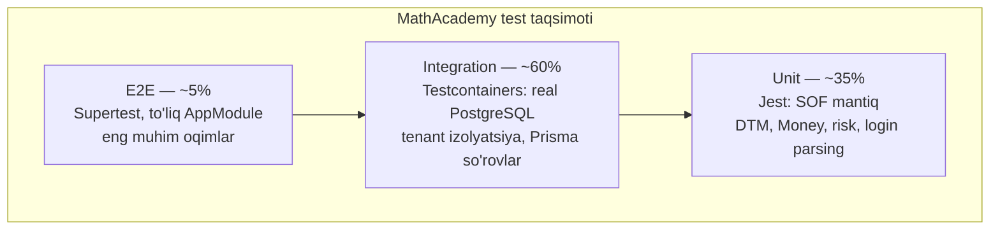

# 13 — Test strategiyasi (Testing Strategy)

> **Loyiha:** MathAcademy Digital Campus — ko'p ijarachilik (multi-tenant) SIS
> **Hujjat holati:** loyihalash bosqichi. **Hozirgi holat qismi — o'lchangan fakt.**
> Test turlari va ustuvorliklar qat'iy; **vaqt va coverage raqamlari — maqsad,
> birinchi o'lchovdan keyin tuzatiladi.**

**Bog'liq hujjatlar:**
- [03-multi-tenancy.md](./03-multi-tenancy.md) — Prisma extension migratsiyasi. **Bu hujjatdagi 6-bo'lim uning darvozasi**
- [11-infrastructure.md](./11-infrastructure.md) — CI pipeline, Testcontainers infratuzilmasi
- [00-vision-and-market.md](./00-vision-and-market.md) — nega bu tizim demo emas

---

## 1. ⚠️ Hozirgi holat — halol

Bu bo'lim hech qanday yumshatishsiz yoziladi, chunki qolgan hamma narsa
shundan kelib chiqadi.

### 1.1 O'lchangan fakt

| | |
|---|---|
| Kod hajmi | `apps/api` **37 294** qator · `apps/web` **25 489** qator = **62 783** |
| `apps/api` dagi `.spec.ts` fayllar | **0** (`find apps/api -name "*.spec.ts"` → bo'sh) |
| `apps/api/test/` katalogi | **mavjud emas** |
| `apps/web` dagi test fayllar | **1** — `apps/web/src/test/example.test.ts` |
| Jami mazmunli test | **0** |

`apps/api/package.json:78-94` da jest **to'liq sozlangan**:

```json
"jest": {
  "moduleFileExtensions": ["js", "json", "ts"],
  "rootDir": "src",
  "testRegex": ".*\\.spec\\.ts$",
  "transform": { "^.+\\.(t|j)s$": "ts-jest" },
  "collectCoverageFrom": ["**/*.(t|j)s"],
  "coverageDirectory": "../coverage",
  "testEnvironment": "node"
}
```

`testRegex` `.spec.ts` fayllarni qidiradi. Bunday fayl **bitta ham yo'q**.
`package.json:20` da `test:e2e` skripti `./test/jest-e2e.json` konfiguratsiyasiga
murojaat qiladi — **bu fayl ham yo'q**. Ya'ni `npm run test:e2e` hozir xato bilan
yiqiladi. `devDependencies` da `jest@30`, `ts-jest@29`, `supertest@7`,
`@nestjs/testing@11`, `@types/supertest` — hammasi o'rnatilgan va **hech qachon
ishlatilmagan**.

Bu holat aniq nomga ega: **test infratuzilmasi bor, testlar yo'q.** Bu shunchaki
"test yozilmagan" dan boshqacha — bu "test yozish niyati bo'lgan, lekin
boshlanmagan" degani.

### 1.2 Yagona mavjud "test"

`apps/web/src/test/example.test.ts` — to'liq mazmuni:

```typescript
import { describe, it, expect } from "vitest";

describe("example", () => {
  it("should pass", () => {
    expect(true).toBe(true);
  });
});
```

Bu test `true === true` ekanini tekshiradi. U **hech qachon yiqilmaydi** va
shuning uchun **hech qanday ma'lumot bermaydi**. Bu Vite shablonidan qolgan
placeholder. Uni test deb hisoblash — o'zini aldash.

⚠️ E'tibor bering: web `vitest`, api `jest` ishlatadi. Bu **to'g'ri qaror**
(Vite loyihasida vitest tabiiy), lekin buni hujjatlashtirish kerak — 10-bo'limga
qarang.

### 1.3 Kontekst — nega bu oddiy "texnik qarz" emas

Kanon 0-bo'limi: bu **demo emas**. Tizim muallif o'qigan akademiyada **real
xodimlar va ota-onalar tomonidan har kuni ishlatiladi**. Ma'lumot bazasida real
o'quvchilar bor — **voyaga yetmagan bolalar**: ismi, bahosi, intizom yozuvi,
yotoqxona to'lovi, oilasining aloqa ma'lumoti.

62 783 qator kod. 51 commit. 69 Prisma modeli. 28 modul. **0 test.**

Bu holatda har bir deploy — bu **tekshirilmagan taxmin**.

---

## 2. Bu nimani anglatadi

### 2.1 845 ta so'rov faqat ko'z bilan tekshirilgan

Tenant **845 ta Prisma chaqiruv nuqtasida qo'lda** boshqariladi — eng kattasi
`findFirst`, 272 ta. (Kanon 5.1 buni 176 deb sanaydi, chunki faqat `findMany` va
`findUnique` ni hisoblagan.) Har biri shunday ko'rinadi (`students.service.ts:538`):

```typescript
const student = await this.prisma.students.findFirst({
  where: { id, tenant_id },   // ← tenant_id shu yerda. Qo'lda. Har safar.
  include: { /* ... */ },
});
```

Bu kod **to'g'ri**. Muammo bunda emas. Muammo shundaki: uning to'g'riligini
**hech narsa tasdiqlamaydi**. 845 marta yozilgan, 845 marta ko'z bilan
o'qilgan. 844 tasi to'g'ri bo'lsa, 845-chisi — bir maktab boshqasining
o'quvchilarini ko'radi.

Va buni **hech kim sezmaydi**. Server 200 qaytaradi. Sahifa ochiladi. Jadval
to'ladi. Faqat unda begona bolalarning ismi turadi.

### 2.2 Refactoring imkonsiz

Kanon 5.1 ning markaziy vazifasi — tenant filtrini qo'ldan olib, **Prisma client
extension** ga ko'chirish ([03-multi-tenancy.md](./03-multi-tenancy.md)). Ya'ni
845 nuqtaga tegish.

Testsiz bu refactoring **qilinmasligi kerak**. Sabab oddiy: 845 nuqtani
o'zgartirganda bittasini buzsangiz, **hech narsa sizni ushlamaydi**. Kod
kompilyatsiya bo'ladi, ilova ishga tushadi, sahifa ochiladi — va tenant
izolyatsiyasi jimgina buziladi.

Bu hujjatning eng muhim xulosasi:

> **Test — 03-multi-tenancy dagi refactoringning old sharti, undan keyingi ish emas.**

### 2.3 `tenant.util.ts` — o'lik kodni test ham fosh qilardi

Kanon 5.1: `common/utils/tenant.util.ts` da **to'g'ri yechim yozilgan** —
`withTenantCondition()`, `ensureTenantId()`, `getUserTenantId()` — lekin
**hech qayerda ishlatilmaydi**.

Faylni o'qidim, kod haqiqatan yaxshi:

```typescript
// common/utils/tenant.util.ts — MAVJUD KOD, ISHLATILMAYDI
export function withTenantCondition<T extends Record<string, any>>(
  user: RequestUser,
  where: T = {} as T,
): T & { tenant_id: bigint } {
  const userTenantId = getUserTenantId(user);

  if (where.tenant_id !== undefined && where.tenant_id !== null) {
    const requested = parseBigIntId(where.tenant_id, 'tenant_id');
    if (requested !== userTenantId)
      throw new ForbiddenException('TENANT_MISMATCH');
    return where as any;
  }

  return { ...(where as any), tenant_id: userTenantId };
}
```

Diqqat qiling: agar bu funksiyaga **bitta test** yozilganida, birinchi savol
"uni kim chaqiradi?" bo'lardi. Va o'lik kod **birinchi kunidayoq** ma'lum
bo'lardi. Test faqat bug topmaydi — u **kodning ishlatilishini** ham fosh qiladi.

---

## 3. ⚠️ Muallif buni biladi

Bu bo'lim noqulay, lekin uni yozish kerak — chunki u butun rejaning ishonchliligi
haqida.

### 3.1 `manatask` da tenant izolyatsiya testi BOR

Muallifning boshqa loyihasi — `d:\GitHubim\manatask`. U yerda ikkita spec fayl
bor va **biri aynan tenant izolyatsiya testi**:

`apps/api/src/common/guards/workspace.guard.spec.ts` — **to'liq mazmuni**:

```typescript
import { BadRequestException, ExecutionContext, ForbiddenException } from '@nestjs/common';
import { Repository } from 'typeorm';
import { WorkspaceMember } from '../../database/entities';
import { WorkspaceGuard } from './workspace.guard';

function context(req: any): ExecutionContext {
  return { switchToHttp: () => ({ getRequest: () => req }) } as unknown as ExecutionContext;
}

describe('WorkspaceGuard (tenant isolation)', () => {
  let members: jest.Mocked<Pick<Repository<WorkspaceMember>, 'findOne'>>;
  let guard: WorkspaceGuard;

  beforeEach(() => {
    members = { findOne: jest.fn() } as any;
    // requireEmailVerification = false so verification gating is inactive in these tests.
    const config = { get: jest.fn().mockReturnValue(false) } as any;
    guard = new WorkspaceGuard(members as unknown as Repository<WorkspaceMember>, config);
  });

  it('rejects when no workspace header is provided', async () => {
    const req = { headers: {}, user: { id: 'u1' } };
    await expect(guard.canActivate(context(req))).rejects.toThrow(BadRequestException);
  });

  it('rejects when not authenticated', async () => {
    const req = { headers: { 'x-workspace-id': 'w1' } };
    await expect(guard.canActivate(context(req))).rejects.toThrow(ForbiddenException);
  });

  it('rejects when the user is NOT a member of the workspace', async () => {
    members.findOne.mockResolvedValue(null);
    const req = { headers: { 'x-workspace-id': 'w1' }, user: { id: 'u1' } };
    await expect(guard.canActivate(context(req))).rejects.toThrow(ForbiddenException);
    // Verifies the membership lookup is scoped to BOTH workspace and user.
    expect(members.findOne).toHaveBeenCalledWith({ where: { workspaceId: 'w1', userId: 'u1' } });
  });

  it('attaches workspaceId + membership when the user is a member', async () => {
    const membership = { id: 'm1', workspaceId: 'w1', userId: 'u1', role: 'admin' } as any;
    members.findOne.mockResolvedValue(membership);
    const req: any = { headers: { 'x-workspace-id': 'w1' }, user: { id: 'u1' } };
    await expect(guard.canActivate(context(req))).resolves.toBe(true);
    expect(req.workspaceId).toBe('w1');
    expect(req.membership).toBe(membership);
  });
});
```

Bu **yaxshi test**. Diqqat qiling:
- `describe` nomida to'g'ridan-to'g'ri `(tenant isolation)` deb yozilgan — muallif
  bu testning maqsadini **aniq bilgan**
- Har `it` bitta narsani tekshiradi
- Kommentlar **nega** shunday yozilganini tushuntiradi ("Verifies the membership
  lookup is scoped to BOTH workspace and user")
- Eng muhim satr — 36-qator: `expect(members.findOne).toHaveBeenCalledWith({ where: { workspaceId: 'w1', userId: 'u1' } })`.
  Bu **ikkala** shart tekshirilganini tasdiqlaydi

Ikkinchi fayl `roles.guard.spec.ts` da esa bundan ham nozik narsa bor:

```typescript
// Guards against the ROLES_KEY contract changing silently.
it('reads metadata using ROLES_KEY', () => {
  const reflector = { getAllAndOverride: jest.fn().mockReturnValue(undefined) } as unknown as Reflector;
  new RolesGuard(reflector).canActivate(ctxWithRole());
  expect((reflector.getAllAndOverride as jest.Mock).mock.calls[0][0]).toBe(ROLES_KEY);
});
```

"Kontrakt jimgina o'zgarib ketmasin" uchun test. Bu — **tajribali odamning
o'ylagan narsasi**.

### 3.2 Xulosa: bu bilim muammosi emas

Demak holat aniq:

| | manatask | mathacademy |
|---|---|---|
| Tenant izolyatsiya testi | **Bor** | Yo'q |
| Guard testi | **Bor** | Yo'q |
| Bu testni yozishni biladimi | **Ha, isbotlangan** | — |

Muallif tenant izolyatsiya testi **nima ekanini biladi**, uni **yozgan**, va
uning **nima uchun kerakligini tushunadi**. `mathacademy` da shunchaki
**yozmagan**.

Bu — yaxshi xabar. Bu hujjat **o'rgatish** hujjati emas, **qo'llash** hujjati.

### 3.3 ⚠️ Lekin manatask testi yetarli emas — halol farq

Bu nozik va muhim nuqta, uni yashirmaslik kerak.

`workspace.guard.spec.ts` — **mock qilingan repository bilan guard darajasidagi
test**. `members.findOne` — `jest.fn()`. Real ma'lumot bazasi yo'q.

Bu manatask uchun **to'g'ri qaror**, chunki u yerda izolyatsiya **guard'da**
yashaydi: `WorkspaceGuard` a'zolikni tekshiradi va `req.workspaceId` ni
biriktiradi. Guard'ni test qilsang — izolyatsiyani test qilgan bo'lasan.

**`mathacademy` da arxitektura boshqacha.** Bu yerda izolyatsiya guard'da emas —
u **845 ta alohida chaqiruvning ichida** yashaydi (`where` bandida, `create` uchun
esa `data` da). `PermissionsGuard`
ruxsatni tekshiradi, tenantni emas. Tenant `students.service.ts:538` da
`where: { id, tenant_id }` sifatida qo'lda qo'yiladi.

Buning oqibati:

> `mathacademy` da guard darajasidagi mock test **hech narsa isbotlamaydi**.
> Guard o'tadi, keyin servis `tenant_id` ni unutadi — va guard testi buni
> ko'rmaydi.

Shuning uchun `manatask` uslubini **ko'chirib bo'lmaydi**. Uni **ko'tarish**
kerak: guard darajasidan → **HTTP + real DB** darajasiga. 4 va 6-bo'limlar
aynan shu haqda.

---

## 4. Test piramidasi — bu loyiha uchun

### 4.1 Nisbat va nega u standartdan farq qiladi

Klassik piramida: ko'p unit, ozroq integration, juda kam e2e. **MathAcademy'da
bu nisbat noto'g'ri.**



| Qatlam | Ulush | Nishon vaqt | Qachon |
|--------|-------|-------------|--------|
| Unit | ~35% | < 20 s | Har save (watch), har push |
| Integration | ~60% | < 6 daqiqa | Har push |
| E2E | ~5% | < 5 daqiqa | Har PR |

**Vaqt raqamlari — maqsad, o'lchov emas.** Hozir 0 test bor, o'lchash mumkin
emas. Birinchi 20 test yozilgandan keyin bular qayta ko'riladi.

### 4.2 Nega integration ulushi 60% — bu loyihaning asosiy qarori

Sabab bitta va u hal qiluvchi:

> **MathAcademy mantiqining ko'pi Prisma so'rovlarining ichida yashaydi.**

`students.service.ts` — 2079 qator. Uning ichida sof algoritm deyarli yo'q.
Bor narsa — `where` bandlari, `include` daraxtlari, `$transaction` bloklari.
`billing.service.ts` — 1610 qator: `Prisma.Decimal`, `aggregate._sum`,
`groupBy`. `auth.service.ts` — 1644 qator: DB'dagi `auth_attempts`,
`auth_locks`, `auth_sessions`.

Bu kodning to'g'riligi — **so'rovning to'g'riligi**. Va so'rovni faqat
**real ma'lumot bazasi** tekshira oladi.

### 4.3 ⚠️ Mock qilingan Prisma bilan unit test hech narsa isbotlamaydi

Bu bo'lim ataylab batafsil, chunki bu — eng jozibador va eng zararli qisqa yo'l.

`jest-mock-extended` bilan `PrismaService` ni mock qilish oson va tez.
Shunday test yozamiz:

```typescript
// ❌ YOMON — bu testni YOZMANG. U yolg'on ishonch beradi.
describe('StudentsService.detail', () => {
  it('returns the student', async () => {
    const prisma = { students: { findFirst: jest.fn().mockResolvedValue({ id: 1n, first_name: 'Ali' }) } };
    const service = new StudentsService(prisma as any);

    const result = await service.detail({ tenantId: '1', studentId: '1' });

    expect(result.firstName).toBe('Ali');
  });
});
```

Bu test **o'tadi**. Va u **hech narsa isbotlamaydi**. Aniq sabablar:

**1. Mock `tenant_id` ni tekshirmaydi.** `findFirst.mockResolvedValue(...)`
har qanday `where` uchun bir xil javob qaytaradi. Agar kimdir
`where: { id, tenant_id }` ni `where: { id }` ga o'zgartirsa — **bu test
baribir o'tadi**. Ya'ni test **aynan biz qo'rqayotgan bugni** o'tkazib
yuboradi.

**2. Mock SQL ni bilmaydi.** Prisma `where` obyektini SQL'ga aylantiradi.
Noto'g'ri `include`, noto'g'ri nested filtr, noto'g'ri `mode: 'insensitive'` —
mock'da hammasi o'tadi. Masalan `students.service.ts:107` dagi nested filtr:

```typescript
...(args.cohortId
  ? { student_cohort: { cohort_id: toBigInt(args.cohortId, 'cohortId') } }
  : {}),
```

Bu nested relation filtri `tenant_id` ni **o'z ichiga olmaydi** — `student_cohort`
boshqa tenant'niki bo'lsa nima bo'ladi? Mock buni **hech qachon aytmaydi**.
Real PostgreSQL aytadi.

**3. Mock constraint'ni bilmaydi.** 69 modeldagi `@@unique`, foreign key,
`ON DELETE` — hech biri mock'da yo'q. `students.service.ts:32` da
`P2002 → ConflictException` konvertatsiyasi bor. Mock hech qachon `P2002`
qaytarmaydi — demak bu qator **hech qachon test qilinmaydi**.

**4. Mock `Decimal` ni bilmaydi.** `billing.service.ts:1129`:
`totalPaidAgg._sum.paid_amount ?? new Prisma.Decimal(0)`. Real DB `Decimal`
qaytaradi. Mock siz nima yozsangiz shuni — odatda `number`. Test yashil,
production'da `.toFixed is not a function`.

**5. Mock `$transaction` ni bilmaydi.** `students.service.ts:298-450` —
uzun `$transaction` bloki. Mock'da rollback yo'q. Yarim yozilgan o'quvchi
holati **hech qachon sinalmaydi**.

Xulosa:

> **Mock qilingan Prisma DB haqidagi taxminlaringizni tekshiradi, DB'ni emas.**
> Va aynan o'sha taxminlar noto'g'ri bo'ladi.

### 4.4 Unit test — nima uchun (sof mantiq)

Unit test **faqat I/O'siz sof funksiyalar** uchun. MathAcademy'da ular bor,
lekin ular **oz** — va aynan shuning uchun unit ulushi 35%.

| Nima | Qayerda | Nega unit |
|------|---------|-----------|
| DTM 189 hisoblash | Yangi: `domain/dtm/` (8-bo'lim) | Sof matematika |
| Money / Decimal amallar | Yangi: `domain/money/` (7-bo'lim) | Sof |
| `levelFromScore()` | `risk.service.ts:22` | Sof — son kiradi, enum chiqadi |
| `parseGuardianLogin()` | `auth.service.ts:62` | Sof — string kiradi, obyekt chiqadi |
| `calculateGraduationYear()` | `students.service.ts:52` | Sof |
| `generateStudentLoginId()` | `students.service.ts:48` | Sof |
| BigInt konversiya | `common/utils/bigint.util.ts` | Sof |
| Sana util | `common/utils/date.util.ts` | Sof (vaqt in'ektsiya qilinsa) |

### 4.5 Mock siyosati

**Mock qilinadi:** tashqi tarmoq chegarasi (SMS provayder, push/FCM,
fayl saqlash agar S3 bo'lsa).

**Mock QILINMAYDI:** PostgreSQL, Redis, o'z modullaringiz.

```typescript
// ❌ YOMON — mock'ni test qilyapmiz
const prisma = { students: { findFirst: jest.fn() } };
const service = new StudentsService(prisma as any);

// ✅ YAXSHI — sof funksiya, mock kerak emas
expect(parseGuardianLogin('mathacademy-MA-0001')).toEqual({
  tenantSlug: 'mathacademy', loginId: 'MA-0001', raw: 'mathacademy-MA-0001',
});

// ✅ YAXSHI — real DB, real so'rov
const found = await prisma.students.findFirst({ where: { id, tenant_id } });
```

---

## 5. Testcontainers — real PostgreSQL

### 5.1 Nega mock emas — hal qiluvchi sabab

4.3-bo'limdagi umumiy sabablardan tashqari, bu loyihada **bitta maxsus va
hal qiluvchi sabab** bor:

> **Tenant izolyatsiyasi — ma'lumot bazasi darajasidagi xususiyat.**

MathAcademy'da tenant izolyatsiyasi kodda emas. U — **`students` jadvalidagi
`tenant_id` ustuni** va **so'rovdagi `WHERE tenant_id = $1`** bandi. Bu ikkovi
DB'da uchrashadi. Mock bu uchrashuvni **simulyatsiya qilolmaydi** — u undan
oldin javob qaytaradi.

Ya'ni: **mock bilan tenant izolyatsiyasini test qilish printsipial ravishda
imkonsiz.** Bu tanlov emas, bu fakt.

Bundan tashqari Testcontainers **haqiqiy migratsiyalarni** ham sinaydi.
Kanon 9: `db push` **hech qachon**, migration **majburiy**. Hozir 2 ta migratsiya
bor (`000000_init`, `000001_files_storage`). Testcontainers ularni **noldan**
qo'llaydi — demak buzuq migratsiya CI'da tutiladi.

### 5.2 Kerakli paketlar

```bash
cd apps/api
npm i -D @testcontainers/postgresql testcontainers fast-check
```

`@testcontainers/postgresql` — PostgreSQL konteyner. `fast-check` — property
test (7 va 8-bo'limlar). Redis konteyneri **hozircha kerak emas**: birinchi
bosqichda auth sessiya testlari yo'q; 12-bo'limdagi rejaning 3-qadamida
qo'shiladi.

### 5.3 Konteyner setup — to'liq kod

```typescript
// apps/api/test/setup/containers.ts
import {
  PostgreSqlContainer,
  StartedPostgreSqlContainer,
} from '@testcontainers/postgresql';
import { execSync } from 'node:child_process';

export interface TestInfra {
  postgres: StartedPostgreSqlContainer;
  databaseUrl: string;
}

/**
 * Konteyner butun test to'plami uchun BIR MARTA ko'tariladi (globalSetup).
 * Har test faylida ko'tarish sekin: ~3 s x har fayl.
 * Testlar orasidagi izolyatsiya konteyner bilan emas, TRUNCATE bilan (5.5).
 */
export async function startInfra(): Promise<TestInfra> {
  // Versiya PRODUCTION bilan bir xil — CANON 3: PostgreSQL 15+.
  // Boshqa versiyada test qilish = boshqa DB'ni test qilish.
  const postgres = await new PostgreSqlContainer('postgres:15-alpine')
    .withDatabase('mathacademy_test')
    .withUsername('mathacademy')
    .withPassword('test')
    // Testda durablik kerak emas — tezlik kerak.
    // fsync=off testni ~2-3x tezlashtiradi va hech narsa yo'qotmaydi:
    // konteyner test oxirida o'chiriladi.
    .withCommand([
      'postgres',
      '-c', 'fsync=off',
      '-c', 'full_page_writes=off',
      '-c', 'synchronous_commit=off',
    ])
    .start();

  const databaseUrl = postgres.getConnectionUri();

  // Migratsiyalarni REAL holda qo'llaymiz — `db push` EMAS.
  // Sabab (CANON 9): migration fayllarining o'zi ham test qilinishi kerak.
  // `db push` migratsiyani chetlab o'tadi va buzuq migration jimgina o'tadi.
  execSync('npx prisma migrate deploy', {
    env: { ...process.env, DATABASE_URL: databaseUrl },
    stdio: 'inherit',
    cwd: process.cwd(),
  });

  return { postgres, databaseUrl };
}
```

```typescript
// apps/api/test/setup/global-setup.ts
import { startInfra } from './containers';

module.exports = async function globalSetup(): Promise<void> {
  const infra = await startInfra();

  // PrismaService konstruktorida requireEnv('DATABASE_URL') bor
  // (prisma/prisma.service.ts) — u ishga tushishidan OLDIN qo'yish shart.
  process.env.DATABASE_URL = infra.databaseUrl;

  // env.validation.ts ishga tushmasin deb minimal to'plam.
  // Real qiymatlar kerak emas, lekin BO'SH bo'lmasligi kerak.
  process.env.NODE_ENV = 'test';
  process.env.JWT_SECRET ??= 'test-jwt-secret-not-a-real-secret-000000';
  process.env.ACCESS_TOKEN_TTL ??= '15m';
  process.env.REFRESH_TOKEN_DAYS ??= '30';

  (globalThis as any).__INFRA__ = infra;
};
```

```typescript
// apps/api/test/setup/global-teardown.ts
import type { TestInfra } from './containers';

module.exports = async function globalTeardown(): Promise<void> {
  const infra = (globalThis as any).__INFRA__ as TestInfra | undefined;
  await infra?.postgres.stop();
};
```

### 5.4 Jest konfiguratsiyasi — integration uchun alohida

Mavjud `package.json` dagi jest bloki **unit** uchun qoladi (u `rootDir: "src"`
va `.spec.ts` ni qidiradi — bu to'g'ri). Integration uchun **alohida konfig**:

```javascript
// apps/api/test/jest-integration.json  (yangi fayl)
{
  "moduleFileExtensions": ["js", "json", "ts"],
  "rootDir": "..",
  "testRegex": ".*\\.int-spec\\.ts$",
  "transform": { "^.+\\.(t|j)s$": "ts-jest" },
  "testEnvironment": "node",
  "globalSetup": "<rootDir>/test/setup/global-setup.ts",
  "globalTeardown": "<rootDir>/test/setup/global-teardown.ts",
  "setupFilesAfterEnv": ["<rootDir>/test/setup/after-env.ts"],
  "testTimeout": 60000,
  "maxWorkers": 1
}
```

⚠️ **`maxWorkers: 1` — ataylab.** Bitta PostgreSQL konteyner, va testlar orasida
`TRUNCATE` ishlatiladi. Parallel worker'lar bir-birining ma'lumotini o'chirib
yuboradi. Tezlashtirish kerak bo'lsa keyinchalik **har worker uchun alohida
schema** qilinadi — lekin bu optimallashtirish, birinchi kunning ishi emas.

⚠️ **`testTimeout: 60000` —** konteyner ko'tarilishi + `migrate deploy` sekin.
Birinchi test uzoq kutadi.

`package.json` skriptlariga qo'shiladi:

```json
"test:int": "jest --config ./test/jest-integration.json --runInBand",
"test:int:watch": "jest --config ./test/jest-integration.json --runInBand --watch"
```

⚠️ Mavjud `test:e2e` skripti buzuq (`test/jest-e2e.json` yo'q) — u yo o'chiriladi,
yo shu tuzilma bo'yicha qayta yoziladi.

### 5.5 Tozalash — nega TRUNCATE, rollback emas

Uch variant bor:

| Usul | Tezlik | Ishonchlilik | Qaror |
|------|--------|--------------|-------|
| Har test uchun yangi konteyner | Juda sekin (~3 s x N) | Mukammal | Yo'q |
| Tranzaksiya + rollback | Eng tez | **Bu loyihada ishlamaydi** | Yo'q |
| `TRUNCATE ... CASCADE` | O'rta | Yaxshi | **Tanlandi** |

⚠️ **Nega rollback ishlamaydi — muhim va aniq sabab:**

`students.service.ts:298-450`, `students.service.ts:766+`, `billing.service.ts`
— servislarning o'zi **`$transaction` ishlatadi**. Agar testni tranzaksiyaga
o'rasak, servisning tranzaksiyasi **ichma-ich** bo'ladi. Prisma buni savepoint
bilan eplaydi, lekin:
- isolation level xatti-harakati boshqacha bo'ladi
- rollback semantikasi test qilayotgan narsadan farq qiladi
- ya'ni **biz test qilmoqchi bo'lgan narsa buziladi**

Shuning uchun `TRUNCATE`:

```typescript
// apps/api/test/setup/db.ts
import { PrismaClient } from '@prisma/client';

let client: PrismaClient | null = null;

export function testPrisma(): PrismaClient {
  if (!client) {
    client = new PrismaClient({
      datasources: { db: { url: process.env.DATABASE_URL! } },
    });
  }
  return client;
}

/**
 * Barcha jadvallarni tozalaydi. 69 model bor — ro'yxatni QO'LDA yozish
 * yangi model qo'shilganda unutiladigan joy. Shuning uchun information_schema
 * dan O'QIYMIZ: yangi model qo'shilsa avtomatik qamrab olinadi.
 *
 * _prisma_migrations CHETLAB O'TILADI — u o'chirilsa migratsiya holati
 * yo'qoladi va keyingi test noto'g'ri schema'da ishlaydi.
 */
export async function truncateAll(): Promise<void> {
  const prisma = testPrisma();

  const rows = await prisma.$queryRaw<Array<{ tablename: string }>>`
    SELECT tablename FROM pg_tables
    WHERE schemaname = 'public'
      AND tablename <> '_prisma_migrations'
  `;

  if (rows.length === 0) return;

  const tables = rows.map((r) => `"public"."${r.tablename}"`).join(', ');

  // CASCADE — foreign key tartibini o'ylab o'tirmaymiz.
  // RESTART IDENTITY — autoincrement ID'lar har testda 1 dan boshlanadi,
  // ya'ni testlar deterministik bo'ladi (CANON 9: PK autoincrement).
  await prisma.$executeRawUnsafe(
    `TRUNCATE TABLE ${tables} RESTART IDENTITY CASCADE`,
  );
}
```

```typescript
// apps/api/test/setup/after-env.ts
import { testPrisma, truncateAll } from './db';

// Har testdan OLDIN tozalaymiz, keyin emas.
// Sabab: test yiqilganda ma'lumot DB'da qoladi va uni qo'lda ko'rish mumkin.
beforeEach(async () => {
  await truncateAll();
});

afterAll(async () => {
  await testPrisma().$disconnect();
});
```

---

## 6. ⚠️ 1-USTUVORLIK: Tenant izolyatsiya testi

> Bu — **tizimning eng muhim testi**. Boshqa hamma narsadan oldin.

### 6.1 Nima isbotlanadi

Bitta jumla:

> **A tenantining JWT'si bilan B tenantining resursini so'raganda, javob
> 404 yoki 403 bo'ladi — HECH QACHON ma'lumot emas.**

"Hech qachon ma'lumot emas" — kuchli talab. U quyidagilarni **ham** taqiqlaydi:
- 200 + bo'sh massiv o'rniga begona yozuv
- 200 + `{ id: ..., firstName: null }` — qisman ma'lumot ham ma'lumot
- xato xabarida begona ma'lumot ("Student Ali Valiyev not in your tenant")

### 6.2 Poydevor: ikki tenantli fixture

```typescript
// apps/api/test/fixtures/two-tenants.ts
import { PrismaClient } from '@prisma/client';
import { makeFactories } from '../factories';   // 10.2-bo'lim

export interface TenantWorld {
  tenantId: bigint;
  slug: string;
  campusId: bigint;
  groupId: bigint;
  studentId: bigint;
  assessmentId: bigint;
  staffUserId: bigint;
  /** Bu tenant staff'ining access tokeni */
  token: string;
}

export interface TwoTenants {
  a: TenantWorld;
  b: TenantWorld;
}

/**
 * Ikki TO'LIQ ALOHIDA tenant quradi, har birida bir xil shakldagi ma'lumot.
 * Bir xil shakl MUHIM: agar A ga so'rov B ning ma'lumotini qaytarsa,
 * struktura bir xil bo'lgani uchun bu "shunchaki ishlayapti" ga o'xshaydi —
 * aynan shuning uchun test bunga e'tibor beradi.
 */
export async function seedTwoTenants(
  prisma: PrismaClient,
  signToken: (payload: Record<string, unknown>) => Promise<string>,
): Promise<TwoTenants> {
  const a = await seedTenant(prisma, 'alpha-academy', 'AA', signToken);
  const b = await seedTenant(prisma, 'beta-academy', 'BB', signToken);
  return { a, b };
}

async function seedTenant(
  prisma: PrismaClient,
  slug: string,
  prefix: string,
  signToken: (payload: Record<string, unknown>) => Promise<string>,
): Promise<TenantWorld> {
  // 10.2-bo'limdagi factory'lardan foydalanamiz — bu yerda takrorlamaymiz.
  // Har maydonda `prefix` bor: javobda begona ma'lumot chiqsa DARROV ko'rinadi.
  const f = makeFactories(prisma);

  const tenant = await f.tenant({ slug, name: `${slug} test tenant` });
  const campus = await f.campus(tenant.id, { name: `${prefix} Main Campus` });
  const academicYear = await f.academicYear(tenant.id);
  const group = await f.group(tenant.id, campus.id, academicYear.id, { name: `${prefix}-11A` });

  const student = await f.student(tenant.id, campus.id, group.id, {
    student_id_code: `${prefix}-0001`,
    first_name: `${prefix}First`,
    last_name: `${prefix}Last`,
  });

  const subject = await f.subject(tenant.id, { name: `${prefix} Matematika`, code: `${prefix}-MATH` });
  const assessment = await f.assessment(tenant.id, group.id, subject.id, {
    name: `${prefix} Block Test 1`,
    max_score: '189',
  });

  // Staff foydalanuvchi — bu tenant ichida TO'LIQ huquqli.
  // Maqsad: test RUXSAT yetishmasligi tufayli emas, TENANT tufayli
  // rad etilishini isbotlashi kerak. Shuning uchun superadmin.
  const staffUser = await f.user(tenant.id, { email: `staff@${slug}.test`, full_name: `${prefix} Staff` });

  await grantAllPermissions(prisma, tenant.id, staffUser.id);

  const token = await signToken({
    sub: String(staffUser.id),
    userId: String(staffUser.id),
    tenantId: String(tenant.id),   // ← TENANT JWT'DAN. Mijoz parametridan EMAS (CANON 5.1)
    type: 'STAFF',
    roles: ['superadmin'],
  });

  return {
    tenantId: tenant.id,
    slug,
    campusId: campus.id,
    groupId: group.id,
    studentId: student.id,
    assessmentId: assessment.id,
    staffUserId: staffUser.id,
    token,
  };
}

/**
 * Tenant ichida superadmin roli + barcha permissionlar.
 * rbac moduli: permissions + roles + role_permissions + user_roles (CANON 5.3).
 */
async function grantAllPermissions(
  prisma: PrismaClient,
  tenantId: bigint,
  userId: bigint,
): Promise<void> {
  const role = await prisma.roles.create({
    data: { tenant_id: tenantId, code: 'superadmin', name: 'Superadmin' },
  });

  const perms = await prisma.permissions.findMany();
  if (perms.length > 0) {
    await prisma.role_permissions.createMany({
      data: perms.map((p) => ({ role_id: role.id, permission_id: p.id })),
      skipDuplicates: true,
    });
  }

  await prisma.user_roles.create({
    data: { user_id: userId, role_id: role.id },
  });
}
```

⚠️ **Halol eslatma:** yuqoridagi maydon nomlari (`student_id_code`, `held_on`,
`starts_on`, `code`) `schema.prisma` bo'yicha **aniqlashtirilishi kerak** —
69 model bor va bu hujjat schema'ni to'liq ko'rmagan. Birinchi implementatsiya
qadamida `npx prisma studio` yoki schema o'qib **aniq maydonlar qo'yiladi**.
Test mantiqi o'zgarmaydi.

### 6.3 ⚠️ Asosiy test — PARAMETRLASHTIRILGAN

Bu testning **eng muhim xususiyati**: u 28 modulni **ro'yxat orqali** qamrab
oladi. Yangi modul qo'shilsa — ro'yxatga bitta qator, va test avtomatik ishlaydi.

```typescript
// apps/api/test/tenant-isolation.int-spec.ts
import { INestApplication, ValidationPipe } from '@nestjs/common';
import { Test } from '@nestjs/testing';
import { JwtService } from '@nestjs/jwt';
import * as request from 'supertest';
import { AppModule } from '../src/app.module';
import { testPrisma } from './setup/db';
import { seedTwoTenants, TwoTenants } from './fixtures/two-tenants';

/**
 * TENANT IZOLYATSIYA REESTRI.
 *
 * Har yozuv: bitta tenant-scoped resursga murojaat qiladigan route.
 * `id` — TwoTenants dagi qaysi ID ishlatilishi.
 *
 * ⚠️ YANGI MODUL QO'SHILSA — SHU RO'YXATGA QO'SHILADI.
 * 6.5-bo'limdagi "reestr to'liqligi" testi buni majburlaydi.
 */
interface IsolationCase {
  module: string;
  method: 'get' | 'patch' | 'delete';
  /** :id o'rniga TwoTenants dagi qaysi maydon qo'yiladi */
  idFrom: 'studentId' | 'groupId' | 'campusId' | 'assessmentId';
  path: (id: string) => string;
  /** PATCH uchun minimal body */
  body?: Record<string, unknown>;
}

const CASES: IsolationCase[] = [
  { module: 'students',       method: 'get',    idFrom: 'studentId',    path: (id) => `/staff/students/${id}` },
  { module: 'students',       method: 'patch',  idFrom: 'studentId',    path: (id) => `/staff/students/${id}`, body: { firstName: 'Hacked' } },
  { module: 'students',       method: 'delete', idFrom: 'studentId',    path: (id) => `/staff/students/${id}` },
  { module: 'groups',         method: 'get',    idFrom: 'groupId',      path: (id) => `/staff/groups/${id}` },
  { module: 'groups',         method: 'patch',  idFrom: 'groupId',      path: (id) => `/staff/groups/${id}`, body: { name: 'Hacked' } },
  { module: 'campuses',       method: 'get',    idFrom: 'campusId',     path: (id) => `/staff/campuses/${id}` },
  { module: 'assessments',    method: 'get',    idFrom: 'assessmentId', path: (id) => `/staff/assessments/${id}` },
  { module: 'attendance',     method: 'get',    idFrom: 'groupId',      path: (id) => `/staff/attendance?groupId=${id}` },
  { module: 'billing',        method: 'get',    idFrom: 'studentId',    path: (id) => `/staff/billing/students/${id}/charges` },
  { module: 'discipline',     method: 'get',    idFrom: 'studentId',    path: (id) => `/staff/discipline?studentId=${id}` },
  { module: 'risk',           method: 'get',    idFrom: 'studentId',    path: (id) => `/staff/risk/students/${id}` },
  { module: 'awards',         method: 'get',    idFrom: 'studentId',    path: (id) => `/staff/awards?studentId=${id}` },
  { module: 'certificates',   method: 'get',    idFrom: 'studentId',    path: (id) => `/staff/certificates?studentId=${id}` },
  { module: 'leaves',         method: 'get',    idFrom: 'studentId',    path: (id) => `/staff/leaves?studentId=${id}` },
  { module: 'timetables',     method: 'get',    idFrom: 'groupId',      path: (id) => `/staff/timetables?groupId=${id}` },
  { module: 'ranking',        method: 'get',    idFrom: 'groupId',      path: (id) => `/staff/ranking?groupId=${id}` },
  { module: 'outcomes',       method: 'get',    idFrom: 'studentId',    path: (id) => `/staff/outcomes?studentId=${id}` },
  // ... qolgan modullar shu tartibda. To'liq ro'yxat — 6.5 testi majburlaydi.
];

describe('⚠️ TENANT IZOLYATSIYASI — tizimning eng muhim testi', () => {
  let app: INestApplication;
  let world: TwoTenants;

  beforeAll(async () => {
    const moduleRef = await Test.createTestingModule({
      imports: [AppModule],
    }).compile();

    app = moduleRef.createNestApplication();
    app.useGlobalPipes(new ValidationPipe({ whitelist: true, transform: true }));
    await app.init();
  });

  afterAll(async () => {
    await app.close();
  });

  beforeEach(async () => {
    // after-env.ts allaqachon truncate qildi. Endi qayta seed qilamiz.
    const jwt = app.get(JwtService);
    world = await seedTwoTenants(testPrisma(), (payload) => jwt.signAsync(payload));
  });

  // ==================== ASOSIY: CROSS-TENANT O'QISH ====================

  describe.each(CASES)(
    '$module — $method $idFrom',
    ({ method, idFrom, path, body }) => {
      it("A ning tokeni bilan B ning resursi — RAD ETILADI", async () => {
        const foreignId = String(world.b[idFrom]);

        const req = request(app.getHttpServer())
          [method](path(foreignId))
          .set('Authorization', `Bearer ${world.a.token}`);

        if (body) req.send(body);

        const res = await req;

        // 404 yoki 403 — ikkovi ham qabul.
        // 404 afzalroq: u resurs BORLIGINI ham oshkor qilmaydi.
        expect([403, 404]).toContain(res.status);

        // ⚠️ ENG MUHIM TEKSHIRUV: javobda B ning ma'lumoti YO'Q.
        // Status to'g'ri, lekin body'da ma'lumot sizib chiqishi mumkin
        // (masalan xato xabarida ism).
        const raw = JSON.stringify(res.body ?? {});
        expect(raw).not.toContain('BB');          // B ning prefiksi
        expect(raw).not.toContain('beta-academy'); // B ning slug'i
      });

      it('A ning tokeni bilan A ning resursi — ISHLAYDI (test yolg\'on emasligi isboti)', async () => {
        const ownId = String(world.a[idFrom]);

        const req = request(app.getHttpServer())
          [method](path(ownId))
          .set('Authorization', `Bearer ${world.a.token}`);

        if (body) req.send(body);

        const res = await req;

        // Bu "sanity check". Usiz yuqoridagi test YOLG'ON bo'lishi mumkin:
        // agar route umuman ishlamasa, u ham 404 qaytaradi va
        // izolyatsiya testi "o'tadi" — hech narsani isbotlamasdan.
        expect(res.status).toBeLessThan(400);
      });
    },
  );

  // ==================== RO'YXAT SO'ROVLARI ====================

  it("A ning ro'yxati B ning birorta yozuvini o'z ichiga olmaydi", async () => {
    const res = await request(app.getHttpServer())
      .get('/staff/students?limit=200')
      .set('Authorization', `Bearer ${world.a.token}`)
      .expect(200);

    const items = res.body.items ?? res.body.data ?? res.body;
    expect(Array.isArray(items)).toBe(true);
    expect(items.length).toBeGreaterThan(0);   // A ning o'z o'quvchisi bor

    // Har yozuv A ga tegishli
    for (const item of items) {
      expect(String(item.firstName ?? item.first_name)).toContain('AA');
    }

    // B ning o'quvchisi ro'yxatda YO'Q
    const ids = items.map((i: any) => String(i.id));
    expect(ids).not.toContain(String(world.b.studentId));
  });

  // ==================== YOZISH OQIMI ====================

  it("A tenanti B ning guruhiga o'quvchi biriktira olmaydi", async () => {
    // Bu nozik holat: o'quvchi A niki, GURUH B niki.
    // Agar assignGroup faqat studentni tekshirsa va guruhni tekshirmasa —
    // cross-tenant bog'lanish yaratiladi va DB buziladi.
    const res = await request(app.getHttpServer())
      .post(`/staff/students/${world.a.studentId}/assign-group`)
      .set('Authorization', `Bearer ${world.a.token}`)
      .send({ groupId: String(world.b.groupId) });

    expect([400, 403, 404]).toContain(res.status);

    // DB'da haqiqatan bog'lanish yaratilmaganini tekshiramiz.
    // Status to'g'ri bo'lib, yozuv baribir yaratilgan bo'lishi mumkin.
    const student = await testPrisma().students.findUnique({
      where: { id: world.a.studentId },
    });
    expect(student!.current_group_id).not.toBe(world.b.groupId);
  });

  it("A tenanti B ning o'quvchisiga baho qo'ya olmaydi", async () => {
    const res = await request(app.getHttpServer())
      .post(`/staff/assessments/${world.a.assessmentId}/grades`)
      .set('Authorization', `Bearer ${world.a.token}`)
      .send({ studentId: String(world.b.studentId), score: '100' });

    expect([400, 403, 404]).toContain(res.status);
  });

  // ==================== TENANT MANBAI ====================

  it("⚠️ tenantId so'rov parametridan OLINMAYDI — faqat JWT'dan", async () => {
    // CANON 5.1: "Tenant JWT'dan olinadi, mijoz parametridan HECH QACHON emas".
    // Bu test o'sha qoidani majburlaydi.
    const res = await request(app.getHttpServer())
      .get(`/staff/students?tenantId=${world.b.tenantId}&limit=200`)
      .set('Authorization', `Bearer ${world.a.token}`)
      .expect(200);

    const items = res.body.items ?? res.body.data ?? res.body;
    for (const item of items) {
      expect(String(item.firstName ?? item.first_name)).toContain('AA');
    }
  });

  it("⚠️ tenant header bilan almashtirib bo'lmaydi", async () => {
    const res = await request(app.getHttpServer())
      .get('/staff/students?limit=200')
      .set('Authorization', `Bearer ${world.a.token}`)
      .set('X-Tenant-Id', String(world.b.tenantId))
      .expect(200);

    const items = res.body.items ?? res.body.data ?? res.body;
    for (const item of items) {
      expect(String(item.firstName ?? item.first_name)).toContain('AA');
    }
  });
});
```

### 6.4 Nega "A o'zining resursini o'qiy oladi" testi majburiy

Yuqorida har case uchun **ikkita** test bor va ikkinchisi shart. Sabab:

Faraz qiling `/staff/students/:id` route umuman mavjud emas (nomi
o'zgargan). Unda:
- "A → B" testi 404 oladi → **o'tadi** ✅
- Lekin u hech narsani isbotlamadi — route yo'q, izolyatsiya sinalmadi

Bu **yolg'on yashil test** — testsizlikdan yomonroq, chunki u ishonch beradi.
"A → A ishlaydi" testi buni bloklaydi.

### 6.5 Reestr to'liqligi — test o'zini majburlaydi

Eng nozik xavf: yangi modul qo'shiladi, `CASES` ga qo'shilmaydi, va u
**test qilinmagan holda** production'ga chiqadi. Buni test o'zi ushlashi kerak:

```typescript
// apps/api/test/tenant-isolation-registry.int-spec.ts
import { Test } from '@nestjs/testing';
import { INestApplication } from '@nestjs/common';
import { AppModule } from '../src/app.module';
import { CASES } from './tenant-isolation.int-spec';

/**
 * ⚠️ Bu test kod emas, QOIDA majburlaydi:
 * har staff route'i tenant izolyatsiya reestrida bo'lishi shart.
 *
 * Yangi modul qo'shgan odam bu testni ko'radi va reestrga qo'shadi.
 * Alternativa — hech kim eslamaydi va modul testsiz qoladi.
 */
describe('Tenant izolyatsiya reestri — to\'liqlik', () => {
  let app: INestApplication;

  beforeAll(async () => {
    const moduleRef = await Test.createTestingModule({ imports: [AppModule] }).compile();
    app = moduleRef.createNestApplication();
    await app.init();
  });

  afterAll(async () => { await app.close(); });

  it('har staff/* modul reestrda qamrab olingan', () => {
    const server = app.getHttpAdapter().getInstance();
    const router = server._router ?? server.router;

    const staffModules = new Set<string>();
    for (const layer of router.stack) {
      const path: string | undefined = layer.route?.path;
      if (!path?.startsWith('/staff/')) continue;
      staffModules.add(path.split('/')[2]);   // /staff/<modul>/...
    }

    const covered = new Set(CASES.map((c) => c.module));

    // ISTISNO RO'YXATI — har biri IZOHLANGAN bo'lishi SHART.
    const knownExceptions = new Set<string>([
      // tenants global (CANON 5.1) — lekin u system/* da, staff/* da emas.
      // Bu yerda istisno bo'lmasligi kerak. Ro'yxat bo'sh turishi — maqsad.
    ]);

    const missing = [...staffModules].filter(
      (m) => !covered.has(m) && !knownExceptions.has(m),
    );

    expect(missing).toEqual([]);
  });
});
```

### 6.6 ⚠️ Bu test — 03-multi-tenancy ning darvozasi

Qoida, aniq va muhokamasiz:

> **Tenant izolyatsiya testi to'liq yashil bo'lmaguncha,
> [03-multi-tenancy.md](./03-multi-tenancy.md) dagi Prisma extension refactoringi
> BOSHLANMAYDI.**

Sabab 2.2-bo'limda: 845 nuqtani testsiz o'zgartirish — bu ko'r-ko'rona jarrohlik.

Va test bu refactoringda **ikki marta** ishlaydi:

1. **Oldin** — u hozirgi qo'lda yozilgan filtrlar bilan **yashil** bo'lishi
   kerak. Agar hozir yiqilsa — **bizda allaqachon bug bor** va refactoring
   emas, tuzatish kerak
2. **Keyin** — extension qo'shilgandan keyin **yana yashil** bo'lishi kerak.
   Bu — refactoring hech narsani buzmaganining isboti

Bu ikki holat orasidagi farq — bu testning butun qiymati. Boshqa hech narsa
buni bera olmaydi.

---

## 7. 2-USTUVORLIK: Pul mantiqi

### 7.1 ⚠️ Halol holat: Money klassi YO'Q

Grep natijasi: `apps/api/src` da `Money` nomli klass yoki `money` util
**mavjud emas**. Billing to'g'ridan-to'g'ri `Prisma.Decimal` ishlatadi:

```typescript
// billing.service.ts:914
amount: new Prisma.Decimal(dto.amount),

// billing.service.ts:1129
const totalPaid = totalPaidAgg._sum.paid_amount ?? new Prisma.Decimal(0);
```

Bu **yomon emas** — `Decimal` float emas, yaxlitlash xatosi bermaydi. Lekin
muammo bor: **hisob-kitob mantiqi 1610 qatorli servisga tarqalgan**. Uni test
qilish uchun har safar DB kerak.

Shuning uchun 2-ustuvorlik ikki qismdan iborat:
1. Sof pul mantiqini `domain/money/` ga **ajratish** (yangi kod)
2. Uni unit + property test bilan qoplash

### 7.2 Money — ajratilgan sof mantiq

```typescript
// apps/api/src/domain/money/money.ts
import { Prisma } from '@prisma/client';

/**
 * Pul amallari. SOF — hech qanday I/O yo'q.
 *
 * Ichkarida Prisma.Decimal ishlatiladi (mavjud kod uslubi — billing.service.ts).
 * FLOAT hech qachon: 0.1 + 0.2 !== 0.3 va bu pulda qabul qilinmaydi.
 */
export type Money = Prisma.Decimal;

export const ZERO: Money = new Prisma.Decimal(0);

export function money(v: string | number | Money): Money {
  return new Prisma.Decimal(v);
}

export function add(a: Money, b: Money): Money {
  return a.add(b);
}

export function sub(a: Money, b: Money): Money {
  return a.sub(b);
}

/**
 * Summani N ta o'quvchiga bo'ladi (masalan: yotoqxona oyi umumiy narxi).
 *
 * ⚠️ ENG MUHIM INVARIANT: qismlar yig'indisi asl summaga TENG bo'lishi SHART.
 * Yaxlitlash qoldig'i yo'qolmasin va yaratilmasin.
 *
 * Qoldiq birinchi qismlarga bittadan tarqatiladi (banker's rounding EMAS —
 * bu yerda determinizm muhimroq).
 */
export function allocate(total: Money, parts: number): Money[] {
  if (parts <= 0) throw new Error('ALLOCATE_INVALID_PARTS');

  // Tiyinda ishlaymiz — butun son, yaxlitlash yo'q.
  // UZS uchun 2 xona (so'm-tiyin) saqlanadi: Decimal(12,2) mavjud kodda.
  const cents = total.mul(100).round();
  const base = cents.div(parts).floor();
  const remainder = cents.sub(base.mul(parts)).toNumber();

  const out: Money[] = [];
  for (let i = 0; i < parts; i++) {
    const extra = i < remainder ? 1 : 0;
    out.push(base.add(extra).div(100));
  }
  return out;
}

/**
 * To'lov balansi: qancha qarz qoldi.
 * Manfiy bo'lmaydi — ortiqcha to'lov alohida hisoblanadi.
 */
export function remaining(charged: Money, paid: Money): Money {
  const diff = charged.sub(paid);
  return diff.isNegative() ? ZERO : diff;
}

export function overpaid(charged: Money, paid: Money): Money {
  const diff = paid.sub(charged);
  return diff.isNegative() ? ZERO : diff;
}
```

### 7.3 Unit test — misolga asoslangan

```typescript
// apps/api/src/domain/money/money.spec.ts
import { allocate, add, money, overpaid, remaining, ZERO } from './money';

describe('Money', () => {
  describe('allocate', () => {
    it("teng bo'linadigan summa teng bo'linadi", () => {
      const parts = allocate(money('300.00'), 3);
      expect(parts.map((p) => p.toString())).toEqual(['100', '100', '100']);
    });

    it("⚠️ teng bo'linmaydigan summada tiyin YO'QOLMAYDI", () => {
      // 100.00 / 3 = 33.333... — klassik yaxlitlash tuzog'i.
      // Naive kod 33.33 x 3 = 99.99 beradi va 1 tiyin yo'qoladi.
      const parts = allocate(money('100.00'), 3);
      expect(parts.map((p) => p.toString())).toEqual(['33.34', '33.33', '33.33']);

      const sum = parts.reduce(add, ZERO);
      expect(sum.equals(money('100.00'))).toBe(true);
    });

    it('nol summa nol qismlar beradi', () => {
      const parts = allocate(ZERO, 5);
      expect(parts.every((p) => p.isZero())).toBe(true);
    });

    it("parts <= 0 da xato beradi", () => {
      expect(() => allocate(money('100'), 0)).toThrow('ALLOCATE_INVALID_PARTS');
      expect(() => allocate(money('100'), -1)).toThrow('ALLOCATE_INVALID_PARTS');
    });
  });

  describe('remaining / overpaid', () => {
    it("to'liq to'langanda qarz nol", () => {
      expect(remaining(money('500000'), money('500000')).isZero()).toBe(true);
    });

    it("qisman to'langanda farq qoladi", () => {
      expect(remaining(money('500000'), money('200000')).toString()).toBe('300000');
    });

    it("⚠️ ortiqcha to'langanda qarz MANFIY bo'lmaydi", () => {
      // Manfiy qarz UI'da "-50000 so'm qarzingiz bor" bo'lib chiqadi — bema'nilik.
      expect(remaining(money('500000'), money('550000')).isZero()).toBe(true);
      expect(overpaid(money('500000'), money('550000')).toString()).toBe('50000');
    });

    it("kam to'langanda ortiqcha nol", () => {
      expect(overpaid(money('500000'), money('200000')).isZero()).toBe(true);
    });
  });
});
```

### 7.4 Property test — yig'indi invarianti

```typescript
// apps/api/src/domain/money/money.property-spec.ts
import fc from 'fast-check';
import { add, allocate, money, overpaid, remaining, ZERO } from './money';

describe('Money — invariantlar', () => {
  // UZS: real summalar. Yotoqxona oyi ~1-3 mln so'm, o'quv yili ~10-30 mln.
  // 0 dan 100 mln gacha oraliq real diapazonni qamrab oladi.
  const amountArb = fc
    .integer({ min: 0, max: 10_000_000_00 })   // tiyinda
    .map((cents) => money(cents).div(100));

  it("⚠️ INVARIANT: allocate yig'indisi asl summaga TENG", () => {
    fc.assert(
      fc.property(amountArb, fc.integer({ min: 1, max: 200 }), (total, parts) => {
        const shares = allocate(total, parts);

        expect(shares).toHaveLength(parts);

        // ENG MUHIM: pul yo'qolmasin va yaratilmasin.
        // Bu invariant buzilsa — akademiya pulni yo'qotadi yoki
        // ota-onadan ortiqcha oladi. Ikkovi ham qabul qilinmaydi.
        const sum = shares.reduce(add, ZERO);
        expect(sum.equals(total)).toBe(true);
      }),
      { numRuns: 2000 },   // eng ko'p run — eng muhim invariant
    );
  });

  it('INVARIANT: hech bir qism manfiy emas', () => {
    fc.assert(
      fc.property(amountArb, fc.integer({ min: 1, max: 200 }), (total, parts) => {
        for (const s of allocate(total, parts)) {
          expect(s.isNegative()).toBe(false);
        }
      }),
      { numRuns: 1000 },
    );
  });

  it("INVARIANT: qismlar orasidagi farq 1 tiyindan oshmaydi", () => {
    // Adolat: ikki o'quvchi bir xil xizmat uchun sezilarli farq to'lamasin.
    fc.assert(
      fc.property(amountArb, fc.integer({ min: 1, max: 200 }), (total, parts) => {
        const shares = allocate(total, parts).map((s) => s.mul(100).toNumber());
        expect(Math.max(...shares) - Math.min(...shares)).toBeLessThanOrEqual(1);
      }),
      { numRuns: 1000 },
    );
  });

  it("⚠️ INVARIANT: remaining + paid >= charged (pul hisobdan chiqmaydi)", () => {
    fc.assert(
      fc.property(amountArb, amountArb, (charged, paid) => {
        const rem = remaining(charged, paid);
        const over = overpaid(charged, paid);

        // Ikkalasi bir vaqtda musbat bo'lolmaydi
        expect(rem.isZero() || over.isZero()).toBe(true);

        // Balans tenglamasi: charged - paid = remaining - overpaid
        expect(charged.sub(paid).equals(rem.sub(over))).toBe(true);
      }),
      { numRuns: 2000 },
    );
  });
});
```

### 7.5 Integration test — real Decimal, real aggregate

Sof mantiq yetarli emas: `billing.service.ts:1129` da `_sum` **DB'dan** keladi.
Ikkita test butun `Decimal` zanjirini qamraydi:

```typescript
// apps/api/src/modules/billing/billing.int-spec.ts

describe('Billing — real PostgreSQL', () => {
  it("⚠️ 100 ta mayda to'lov yig'indisi yaxlitlash xatosi bermaydi", async () => {
    // Bu test FLOAT ishlatilsa YIQILADI — aynan shuning uchun kerak.
    const { charge } = await seedChargeWith100Payments('10000.00');

    const agg = await testPrisma().dorm_payments.aggregate({
      where: { charge_id: charge.id },
      _sum: { paid_amount: true },
    });

    // FLOAT'da bu 999999.9999999998 bo'lardi
    expect(agg._sum.paid_amount!.equals(new Prisma.Decimal('1000000.00'))).toBe(true);
  });

  it("_sum bo'sh to'plamda null qaytaradi — kod buni eplaydi", async () => {
    // billing.service.ts:1129 da `?? new Prisma.Decimal(0)` bor.
    // Bu test o'sha qatorning KERAKLIGINI isbotlaydi.
    const agg = await testPrisma().dorm_payments.aggregate({
      where: { charge_id: 999_999_999n },
      _sum: { paid_amount: true },
    });
    expect(agg._sum.paid_amount).toBeNull();
  });
});
```

⚠️ Jadval/maydon nomlari schema bo'yicha aniqlashtiriladi (6.2 dagi eslatma).

---

## 8. 3-USTUVORLIK: DTM hisoblash

### 8.1 Muammo — kanondan

Kanon 4.1: 189 ball qoidasi **faqat frontendda** yashaydi
(`apps/web/src/pages/staff/AssessmentsPage.tsx:503,516,710,719,727`).
Backend'da `assessments.max_score` — oddiy `Decimal(8,2)`. Ya'ni:

> **API `BLOCK_TEST` ni `max_score: 500` bilan ham qabul qiladi.**

Test bu muammoni **hal qilmaydi** — u domen qatlamini talab qiladi. Lekin test
domen qatlamining **spetsifikatsiyasi** bo'ladi.

### 8.2 DTM domen mantiqi — sof funksiya

```typescript
// apps/api/src/domain/dtm/dtm.ts

/**
 * DTM 189 ballik tizimi (CANON 4.1).
 *
 *   Asosiy fan (MAIN)           -> 93 ball
 *   Qo'shimcha fan (SECONDARY)  -> 63 ball
 *   Majburiy fanlar (MANDATORY) -> 3 x 11 = 33 ball
 *                                  ----------------
 *                                  JAMI: 189 ball
 *
 * Bu SOF mantiq — DB kerak emas. Hozir u AssessmentsPage.tsx da yashaydi.
 */

export const DTM_MAIN_MAX = 93;
export const DTM_SECONDARY_MAX = 63;
export const DTM_MANDATORY_MAX_EACH = 11;
export const DTM_MANDATORY_COUNT = 3;
export const DTM_TOTAL_MAX = 189;

export type SubjectRole = 'MAIN' | 'SECONDARY' | 'MANDATORY';

export interface DtmSubjectResult {
  role: SubjectRole;
  /** 0..1 — to'g'ri javob ulushi */
  ratio: number;
}

export function maxScoreForRole(role: SubjectRole): number {
  switch (role) {
    case 'MAIN': return DTM_MAIN_MAX;
    case 'SECONDARY': return DTM_SECONDARY_MAX;
    case 'MANDATORY': return DTM_MANDATORY_MAX_EACH;
  }
}

/**
 * Track tarkibini tekshiradi.
 * CANON 4.1: MAIN va SECONDARY track ichida YAGONA
 * (mavjud tekshiruv: tracks.service.ts:280).
 */
export function validateTrackComposition(roles: SubjectRole[]): void {
  const count = (r: SubjectRole) => roles.filter((x) => x === r).length;

  if (count('MAIN') !== 1) throw new Error('DTM_MAIN_MUST_BE_EXACTLY_ONE');
  if (count('SECONDARY') !== 1) throw new Error('DTM_SECONDARY_MUST_BE_EXACTLY_ONE');
  if (count('MANDATORY') !== DTM_MANDATORY_COUNT) {
    throw new Error('DTM_MANDATORY_MUST_BE_EXACTLY_THREE');
  }
}

/** Yakuniy DTM balli. Natija har doim [0, 189] oralig'ida. */
export function calculateDtmScore(results: DtmSubjectResult[]): number {
  validateTrackComposition(results.map((r) => r.role));

  let total = 0;
  for (const r of results) {
    if (r.ratio < 0 || r.ratio > 1 || !Number.isFinite(r.ratio)) {
      throw new Error('DTM_INVALID_RATIO');
    }
    total += r.ratio * maxScoreForRole(r.role);
  }

  // DTM ballari 0.1 aniqlikda e'lon qilinadi
  return Math.round(total * 10) / 10;
}
```

### 8.3 Ma'lum vektorlar — golden test

```typescript
// apps/api/src/domain/dtm/dtm.spec.ts
import {
  DTM_TOTAL_MAX, calculateDtmScore, maxScoreForRole, validateTrackComposition,
} from './dtm';

const fullTrack = (ratio: number) => [
  { role: 'MAIN' as const, ratio },
  { role: 'SECONDARY' as const, ratio },
  { role: 'MANDATORY' as const, ratio },
  { role: 'MANDATORY' as const, ratio },
  { role: 'MANDATORY' as const, ratio },
];

describe('DTM 189 tizimi', () => {
  describe('ball taqsimoti — CANON 4.1', () => {
    it('93 + 63 + 3x11 = 189', () => {
      expect(
        maxScoreForRole('MAIN') +
        maxScoreForRole('SECONDARY') +
        3 * maxScoreForRole('MANDATORY'),
      ).toBe(DTM_TOTAL_MAX);
    });

    it('MAIN = 93', () => expect(maxScoreForRole('MAIN')).toBe(93));
    it('SECONDARY = 63', () => expect(maxScoreForRole('SECONDARY')).toBe(63));
    it('MANDATORY = 11', () => expect(maxScoreForRole('MANDATORY')).toBe(11));
  });

  describe('ma\'lum vektorlar', () => {
    it("⚠️ to'liq to'g'ri = aynan 189", () => {
      expect(calculateDtmScore(fullTrack(1))).toBe(189);
    });

    it("⚠️ to'liq noto'g'ri = aynan 0", () => {
      expect(calculateDtmScore(fullTrack(0))).toBe(0);
    });

    it('yarmi = 94.5', () => {
      expect(calculateDtmScore(fullTrack(0.5))).toBe(94.5);
    });

    it("faqat MAIN to'liq = 93", () => {
      expect(calculateDtmScore([
        { role: 'MAIN', ratio: 1 },
        { role: 'SECONDARY', ratio: 0 },
        { role: 'MANDATORY', ratio: 0 },
        { role: 'MANDATORY', ratio: 0 },
        { role: 'MANDATORY', ratio: 0 },
      ])).toBe(93);
    });

    it('MAIN + SECONDARY = 156, majburiylarsiz', () => {
      expect(calculateDtmScore([
        { role: 'MAIN', ratio: 1 },
        { role: 'SECONDARY', ratio: 1 },
        { role: 'MANDATORY', ratio: 0 },
        { role: 'MANDATORY', ratio: 0 },
        { role: 'MANDATORY', ratio: 0 },
      ])).toBe(156);
    });
  });

  describe('track tarkibi — tracks.service.ts:280 qoidasi', () => {
    it('ikkita MAIN rad etiladi', () => {
      expect(() => validateTrackComposition(
        ['MAIN', 'MAIN', 'SECONDARY', 'MANDATORY', 'MANDATORY', 'MANDATORY'],
      )).toThrow('DTM_MAIN_MUST_BE_EXACTLY_ONE');
    });

    it('MAIN yo\'q — rad etiladi', () => {
      expect(() => validateTrackComposition(
        ['SECONDARY', 'MANDATORY', 'MANDATORY', 'MANDATORY'],
      )).toThrow('DTM_MAIN_MUST_BE_EXACTLY_ONE');
    });

    it('ikkita SECONDARY rad etiladi', () => {
      expect(() => validateTrackComposition(
        ['MAIN', 'SECONDARY', 'SECONDARY', 'MANDATORY', 'MANDATORY', 'MANDATORY'],
      )).toThrow('DTM_SECONDARY_MUST_BE_EXACTLY_ONE');
    });

    it('4 ta MANDATORY rad etiladi', () => {
      expect(() => validateTrackComposition(
        ['MAIN', 'SECONDARY', 'MANDATORY', 'MANDATORY', 'MANDATORY', 'MANDATORY'],
      )).toThrow('DTM_MANDATORY_MUST_BE_EXACTLY_THREE');
    });
  });

  describe('noto\'g\'ri kirish', () => {
    it('ratio > 1 rad etiladi', () => {
      expect(() => calculateDtmScore(fullTrack(1.5))).toThrow('DTM_INVALID_RATIO');
    });
    it('ratio < 0 rad etiladi', () => {
      expect(() => calculateDtmScore(fullTrack(-0.1))).toThrow('DTM_INVALID_RATIO');
    });
    it('NaN rad etiladi', () => {
      expect(() => calculateDtmScore(fullTrack(NaN))).toThrow('DTM_INVALID_RATIO');
    });
  });
});
```

### 8.4 Property test

```typescript
// apps/api/src/domain/dtm/dtm.property-spec.ts
import fc from 'fast-check';
import { DTM_TOTAL_MAX, calculateDtmScore } from './dtm';

const ratioArb = fc.double({ min: 0, max: 1, noNaN: true });

const trackArb = fc.tuple(ratioArb, ratioArb, ratioArb, ratioArb, ratioArb).map(
  ([m, s, a, b, c]) => [
    { role: 'MAIN' as const, ratio: m },
    { role: 'SECONDARY' as const, ratio: s },
    { role: 'MANDATORY' as const, ratio: a },
    { role: 'MANDATORY' as const, ratio: b },
    { role: 'MANDATORY' as const, ratio: c },
  ],
);

describe('DTM — invariantlar', () => {
  it('⚠️ INVARIANT: 0 <= score <= 189 — HAR DOIM', () => {
    fc.assert(
      fc.property(trackArb, (track) => {
        const score = calculateDtmScore(track);
        expect(score).toBeGreaterThanOrEqual(0);
        expect(score).toBeLessThanOrEqual(DTM_TOTAL_MAX);
      }),
      { numRuns: 2000 },
    );
  });

  it('INVARIANT: natija har doim chekli son', () => {
    fc.assert(
      fc.property(trackArb, (track) => {
        expect(Number.isFinite(calculateDtmScore(track))).toBe(true);
      }),
      { numRuns: 1000 },
    );
  });

  it("INVARIANT: monotonlik — ratio oshsa ball kamaymaydi", () => {
    fc.assert(
      fc.property(trackArb, fc.double({ min: 0, max: 0.5, noNaN: true }), (track, delta) => {
        const better = track.map((t) => ({ ...t, ratio: Math.min(1, t.ratio + delta) }));
        expect(calculateDtmScore(better)).toBeGreaterThanOrEqual(calculateDtmScore(track));
      }),
      { numRuns: 1000 },
    );
  });

  it('INVARIANT: determinizm — bir xil kirish, bir xil chiqish', () => {
    fc.assert(
      fc.property(trackArb, (track) => {
        expect(calculateDtmScore(track)).toBe(calculateDtmScore(track));
      }),
      { numRuns: 500 },
    );
  });
});
```

### 8.5 Integration test — API qoidani majburlaydimi

Bu test **hozir yiqiladi** — va bu to'g'ri. U kanon 4.1 dagi muammoning
o'lchagichi:

```typescript
// apps/api/src/modules/assessments/assessments-dtm.int-spec.ts

describe('⚠️ DTM qoidasi API darajasida', () => {
  it("BLOCK_TEST max_score = 500 bilan RAD ETILADI", async () => {
    // ⚠️ BU TEST HOZIR YIQILADI (CANON 4.1).
    // Sabab: qoida faqat AssessmentsPage.tsx:503 da, backend'da yo'q.
    // Test o'chirilmaydi — u domen qatlami qo'shilgunga qadar
    // muammoning ochiq ekanini KO'RSATIB TURADI.
    const res = await request(app.getHttpServer())
      .post('/staff/assessments')
      .set('Authorization', `Bearer ${token}`)
      .send({ groupId, subjectId, name: 'Blok test', type: 'BLOCK_TEST', maxScore: '500' });

    expect(res.status).toBe(400);
    expect(res.body.message).toContain('DTM');
  });

  it('189 dan katta max_score rad etiladi', async () => {
    const res = await request(app.getHttpServer())
      .post('/staff/assessments')
      .set('Authorization', `Bearer ${token}`)
      .send({ groupId, subjectId, name: 'Blok test', type: 'BLOCK_TEST', maxScore: '190' });

    expect(res.status).toBe(400);
  });
});
```

⚠️ Bunday "kutilgan holda yiqiladigan" testlar `describe.skip` bilan emas,
**`it.failing()`** bilan belgilanadi (jest 30 da bor) — shunda muammo tuzatilganda
test **avtomatik ogohlantiradi**: "bu endi o'tyapti, `.failing` ni olib tashla".

---

## 9. 4-USTUVORLIK: Auth

### 9.1 ⚠️ Guardian login parsing — REAL BAG uchun regression test

Kanon 4.2: guardian login formati `<tenant-slug>-<student-id>`, masalan
`mathacademy-MA-0001`. **Birinchi tire bo'yicha ajratiladi** (oxirgisi bo'yicha
emas) — **bu real bag edi**.

Mavjud kod (`auth.service.ts:62-72`):

```typescript
function parseGuardianLogin(
  studentId: string,
): { tenantSlug: string; loginId: string; raw: string } | null {
  const s = String(studentId || '').trim();
  const idx = s.indexOf('-');            // ← indexOf, lastIndexOf EMAS
  if (idx <= 0 || idx === s.length - 1) return null;
  const tenantSlug = s.slice(0, idx).trim().toLowerCase();
  const loginId = s.slice(idx + 1).trim();
  if (!tenantSlug || !loginId) return null;
  return { tenantSlug, loginId, raw: s };
}
```

Bu funksiya **sof** va **hozir eksport qilinmagan**. Test uchun eksport
qilinadi (yagona o'zgarish: `function` → `export function`).

```typescript
// apps/api/src/modules/auth/auth.parse.spec.ts
import { parseGuardianLogin } from './auth.service';

describe('parseGuardianLogin', () => {
  describe('⚠️ REGRESSION: birinchi tire bo\'yicha ajratish', () => {
    /**
     * BU REAL BAG EDI (CANON 4.2).
     * `lastIndexOf('-')` ishlatilsa:
     *   'mathacademy-MA-0001' -> slug='mathacademy-MA', loginId='0001'
     * Natija: tenant topilmaydi -> ota-ona tizimga kira olmaydi.
     *
     * BU TEST HECH QACHON O'CHIRILMAYDI.
     */
    it("'mathacademy-MA-0001' -> slug='mathacademy', loginId='MA-0001'", () => {
      expect(parseGuardianLogin('mathacademy-MA-0001')).toEqual({
        tenantSlug: 'mathacademy',
        loginId: 'MA-0001',
        raw: 'mathacademy-MA-0001',
      });
    });

    it("loginId'dagi tirelar SAQLANADI", () => {
      expect(parseGuardianLogin('alpha-A-B-C-1')!.loginId).toBe('A-B-C-1');
    });

    it("slug'da tire bo'lsa ham birinchi tire ajratadi — hujjatlashtirilgan cheklov", () => {
      // 'beta-academy-MA-0001' -> slug='beta', loginId='academy-MA-0001'.
      // Bu XATO EMAS — bu formatning cheklovi: tenant slug'da TIRE BO'LMASLIGI kerak.
      // ⚠️ 15-bo'lim: bu cheklov tenant yaratishda majburlanadimi?
      expect(parseGuardianLogin('beta-academy-MA-0001')).toEqual({
        tenantSlug: 'beta',
        loginId: 'academy-MA-0001',
        raw: 'beta-academy-MA-0001',
      });
    });
  });

  describe('normalizatsiya', () => {
    it("slug kichik harfga o'tkaziladi", () => {
      expect(parseGuardianLogin('MathAcademy-MA-0001')!.tenantSlug).toBe('mathacademy');
    });

    it("loginId kichik harfga O'TKAZILMAYDI", () => {
      // student_id_code 'MA-0001' — katta harfda saqlanadi.
      expect(parseGuardianLogin('mathacademy-MA-0001')!.loginId).toBe('MA-0001');
    });

    it("bo'sh joy olib tashlanadi", () => {
      expect(parseGuardianLogin('  mathacademy-MA-0001  ')!.tenantSlug).toBe('mathacademy');
    });
  });

  describe('rad etiladigan kirishlar', () => {
    it.each([
      ['bo\'sh string', ''],
      ['faqat bo\'sh joy', '   '],
      ['tire yo\'q', 'mathacademy'],
      ['tire boshida', '-MA-0001'],
      ['tire oxirida', 'mathacademy-'],
      ['faqat tire', '-'],
    ])('%s -> null', (_label, input) => {
      expect(parseGuardianLogin(input)).toBeNull();
    });

    it('null / undefined -> null', () => {
      expect(parseGuardianLogin(null as any)).toBeNull();
      expect(parseGuardianLogin(undefined as any)).toBeNull();
    });
  });
});
```

### 9.2 Brute-force lock — integration test

`auth_attempts`, `auth_locks`, `auth_sessions` jadvallari **DB'da**
(kanon 5.4). Demak bu **integration test**, unit emas.

```typescript
// apps/api/src/modules/auth/auth-lock.int-spec.ts

describe('Brute-force himoyasi — real DB', () => {
  it("bir necha noto'g'ri urinishdan keyin akkaunt bloklanadi", async () => {
    const { email } = await seedStaffUser(testPrisma(), 'lock@test.uz', 'CorrectPass1!');

    // Noto'g'ri parol bilan urinamiz
    for (let i = 0; i < 10; i++) {
      await request(app.getHttpServer())
        .post('/auth/staff/login')
        .send({ email, password: 'WrongPass1!' });
    }

    // ⚠️ ENG MUHIM: endi TO'G'RI parol ham ishlamaydi.
    // Agar bu 200 qaytarsa — lock ishlamayapti.
    const res = await request(app.getHttpServer())
      .post('/auth/staff/login')
      .send({ email, password: 'CorrectPass1!' });

    expect(res.status).toBe(429);

    // DB'da lock yozuvi bor
    const locks = await testPrisma().auth_locks.findMany({ where: { identifier: email } });
    expect(locks.length).toBeGreaterThan(0);
  });

  it("noto'g'ri urinish auth_attempts'ga yoziladi", async () => {
    const { email } = await seedStaffUser(testPrisma(), 'attempt@test.uz', 'CorrectPass1!');

    await request(app.getHttpServer())
      .post('/auth/staff/login')
      .send({ email, password: 'WrongPass1!' });

    const attempts = await testPrisma().auth_attempts.findMany({ where: { identifier: email } });
    expect(attempts).toHaveLength(1);
    expect(attempts[0].success).toBe(false);
  });

  it("⚠️ xato xabari foydalanuvchi BORLIGINI oshkor qilmaydi", async () => {
    // User enumeration: "user not found" va "wrong password" farqli bo'lsa,
    // hujumchi qaysi email ro'yxatda borligini bilib oladi.
    await seedStaffUser(testPrisma(), 'exists@test.uz', 'CorrectPass1!');

    const a = await request(app.getHttpServer())
      .post('/auth/staff/login').send({ email: 'exists@test.uz', password: 'Wrong1!' });
    const b = await request(app.getHttpServer())
      .post('/auth/staff/login').send({ email: 'nobody@test.uz', password: 'Wrong1!' });

    expect(a.status).toBe(b.status);
    expect(a.body.message).toEqual(b.body.message);
  });
});
```

### 9.3 Token rotatsiya

```typescript
// apps/api/src/modules/auth/auth-rotation.int-spec.ts

describe('Refresh token rotatsiya — real DB', () => {
  it("refresh qilinganda ESKI token bekor bo'ladi", async () => {
    const login = await request(app.getHttpServer())
      .post('/auth/staff/login')
      .send({ email: 'rot@test.uz', password: 'CorrectPass1!' })
      .expect(200);

    const oldCookie = extractRefreshCookie(login);

    // Birinchi refresh — ishlaydi
    const first = await request(app.getHttpServer())
      .post('/auth/refresh').set('Cookie', oldCookie).expect(200);

    const newCookie = extractRefreshCookie(first);
    expect(newCookie).not.toBe(oldCookie);

    // ⚠️ Eski token bilan ikkinchi refresh — RAD ETILADI.
    // Agar bu 200 qaytarsa: o'g'irlangan token muddatsiz ishlaydi.
    await request(app.getHttpServer())
      .post('/auth/refresh').set('Cookie', oldCookie).expect(401);

    // Yangi token ishlaydi
    await request(app.getHttpServer())
      .post('/auth/refresh').set('Cookie', newCookie).expect(200);
  });

  it("logout sessiyani DB'dan bekor qiladi", async () => {
    const login = await request(app.getHttpServer())
      .post('/auth/staff/login').send({ email: 'rot@test.uz', password: 'CorrectPass1!' });
    const cookie = extractRefreshCookie(login);

    await request(app.getHttpServer()).post('/auth/logout').set('Cookie', cookie).expect(200);
    await request(app.getHttpServer()).post('/auth/refresh').set('Cookie', cookie).expect(401);
  });
});
```

### 9.4 ⚠️ ACCESS_TOKEN_TTL ziddiyati — test yozishdan oldin qaror kerak

Kanon 5.4: `.env.example` da `ACCESS_TOKEN_TTL="15h"`, README **15 daqiqa**
deydi. Kod (`auth.service.ts:89`): `process.env.ACCESS_TOKEN_TTL || '15m'` —
ya'ni **default 15 daqiqa**, lekin `.env.example` uni 15 **soat** ga
o'zgartiradi.

⚠️ **Bu yerda test yozilmaydi**, chunki **kutilgan natija noma'lum**: 15h
ataylabmi (UX qulayligi) yoki xatomi? Test noma'lum qoidani majburlay olmaydi —
u shunchaki hozirgi xatti-harakatni qotirib qo'yadi. Avval qaror, keyin test.
15-bo'limning 3-savoli.

---

## 10. Test ma'lumoti (fixtures)

### 10.1 Muammo: 69 model

Bitta o'quvchi yaratish uchun kerak: `tenants` → `campuses` →
`academic_years` → `groups` → `students`. Baho uchun yana `subjects` →
`assessments`. Har testda buni qo'lda yozish — 20 qator boilerplate va
**har schema o'zgarishida 40 joyda tuzatish**.

Yechim — **factory pattern**: default qiymat + override.

### 10.2 Factory — to'liq kod

```typescript
// apps/api/test/factories/index.ts
import { PrismaClient } from '@prisma/client';

/** Har factory chaqiruvida noyob qiymat uchun. TRUNCATE RESTART IDENTITY
 *  ID'larni tiklaydi, lekin string maydonlar unique bo'lishi kerak. */
let seq = 0;
const uniq = () => `${Date.now().toString(36)}-${++seq}`;

export function resetSequence(): void {
  seq = 0;
}

type Override<T> = Partial<T>;

export function makeFactories(prisma: PrismaClient) {
  const tenant = async (o: Override<any> = {}) =>
    prisma.tenants.create({
      data: {
        slug: `t-${uniq()}`,
        name: 'Test Academy',
        is_active: true,
        ...o,
      },
    });

  const campus = async (tenantId: bigint, o: Override<any> = {}) =>
    prisma.campuses.create({
      data: { tenant_id: tenantId, name: `Campus ${uniq()}`, ...o },
    });

  const academicYear = async (tenantId: bigint, o: Override<any> = {}) =>
    prisma.academic_years.create({
      data: {
        tenant_id: tenantId,
        name: '2025-2026',
        starts_on: new Date('2025-09-01'),
        ends_on: new Date('2026-06-01'),
        is_active: true,
        ...o,
      },
    });

  const group = async (
    tenantId: bigint,
    campusId: bigint,
    academicYearId: bigint,
    o: Override<any> = {},
  ) =>
    prisma.groups.create({
      data: {
        tenant_id: tenantId,
        campus_id: campusId,
        academic_year_id: academicYearId,
        name: `G-${uniq()}`,
        ...o,
      },
    });

  const student = async (
    tenantId: bigint,
    campusId: bigint,
    groupId: bigint | null,
    o: Override<any> = {},
  ) =>
    prisma.students.create({
      data: {
        tenant_id: tenantId,
        campus_id: campusId,
        current_group_id: groupId,
        student_id_code: `MA-${uniq()}`,
        first_name: 'Test',
        last_name: 'Student',
        admission_grade: 10,
        admission_date: new Date('2025-09-01'),
        status: 'ACTIVE',
        ...o,
      },
    });

  const subject = async (tenantId: bigint, o: Override<any> = {}) =>
    prisma.subjects.create({
      data: { tenant_id: tenantId, name: `Subject ${uniq()}`, code: `S-${uniq()}`, ...o },
    });

  const assessment = async (
    tenantId: bigint,
    groupId: bigint,
    subjectId: bigint,
    o: Override<any> = {},
  ) =>
    prisma.assessments.create({
      data: {
        tenant_id: tenantId,
        group_id: groupId,
        subject_id: subjectId,
        name: `A-${uniq()}`,
        max_score: '189',
        weight: '1.0',
        held_on: new Date('2025-10-01'),
        ...o,
      },
    });

  const user = async (tenantId: bigint, o: Override<any> = {}) =>
    prisma.users.create({
      data: {
        tenant_id: tenantId,
        email: `u-${uniq()}@test.uz`,
        // ⚠️ cost 4 — FAQAT testda. Production cost 12 (CANON 5.4).
        // 12 da har foydalanuvchi ~300 ms qo'shadi va test to'plami sekinlashadi.
        password_hash: await bcrypt.hash('test-password-Aa1!', 4),
        full_name: 'Test User',
        is_active: true,
        ...o,
      },
    });

  /**
   * Eng ko'p ishlatiladigan yo'l: to'liq ishlaydigan tenant + o'quvchi.
   * Ko'p testga aynan shu kerak va boshqa hech narsa.
   */
  const world = async (o: { slug?: string } = {}) => {
    const t = await tenant(o.slug ? { slug: o.slug } : {});
    const c = await campus(t.id);
    const ay = await academicYear(t.id);
    const g = await group(t.id, c.id, ay.id);
    const s = await student(t.id, c.id, g.id);
    return { tenant: t, campus: c, academicYear: ay, group: g, student: s };
  };

  return { tenant, campus, academicYear, group, student, subject, assessment, user, world };
}
```

Ishlatilishi — 20 qator o'rniga 1 qator:

```typescript
const f = makeFactories(testPrisma());

it("o'quvchi guruhga biriktiriladi", async () => {
  const { tenant, campus, group } = await f.world();
  const s = await f.student(tenant.id, campus.id, null);   // guruhsiz

  await service.assignGroup({
    tenantId: String(tenant.id),
    studentId: String(s.id),
    dto: { groupId: String(group.id) },
  });

  const updated = await testPrisma().students.findUnique({ where: { id: s.id } });
  expect(updated!.current_group_id).toBe(group.id);
});
```

### 10.3 Factory qoidalari

1. **Har factory minimal to'g'ri obyekt yaratadi.** Test uchun ahamiyatsiz
   maydonlar default bilan to'ladi
2. **Har factory override qabul qiladi.** Test faqat **o'ziga muhim** maydonni
   yozadi — o'qigan odam nima muhimligini darrov ko'radi
3. **Factory `prisma.seed.ts` ni ISHLATMAYDI.** Kanon 5.4: seed superadmin
   yaratadi va `ALLOW_SEED` talab qiladi. Test seed'ga bog'lanmaydi
4. **`bcrypt` cost 4** — testda 12 emas. 12 da har foydalanuvchi ~300 ms.
   ⚠️ Bu **faqat testda**; production cost 12 (kanon 5.4)
5. **Global counter** — noyob string uchun. `TRUNCATE RESTART IDENTITY`
   raqamli ID'ni tiklaydi, `slug` esa unique bo'lib qolishi kerak

---

## 11. Coverage maqsadi

### 11.1 ⚠️ "80% coverage" — ma'nosiz maqsad

Buni ochiq aytish kerak, chunki bu birinchi taklif bo'ladi.

MathAcademy'da 80% coverage'ga **bir kunda** yetish mumkin: har servisga
mock qilingan Prisma bilan "smoke test" yozib chiqiladi. `collectCoverageFrom:
["**/*.(t|j)s"]` qatorlarni sanaydi va **80% chiqadi**.

Va bu testlar **4.3-bo'limda ko'rsatilganidek — hech narsani isbotlamaydi**.
Tenant izolyatsiyasi buzilsa ular yashil qoladi.

> **Coverage — o'lchov emas, kuzatuv. Uni maqsad qilish — Gudxart qonuni:
> o'lchov maqsadga aylansa, u o'lchov bo'lishdan to'xtaydi.**

### 11.2 Aniq maqsadlar — ular o'lchanadi

Foiz o'rniga **tekshiriladigan shartlar**:

| # | Maqsad | Qanday o'lchanadi | Muddat |
|---|--------|-------------------|--------|
| 1 | **Har tenant-scoped modul izolyatsiya testiga ega** | 6.5-bo'limdagi reestr testi yashil | 2-hafta |
| 2 | **Pul mantiqi 100%** | `domain/money/` uchun `--coverage` 100% | 3-oy |
| 3 | **DTM mantiqi 100%** | `domain/dtm/` uchun `--coverage` 100% | 3-oy |
| 4 | **Har tuzatilgan bag = 1 regression test** | PR review qoidasi (13-bo'lim) | doimiy |
| 5 | Auth kritik yo'llari | login, refresh, lock, rotatsiya — testda | 4-hafta |

1-maqsad — **eng muhimi**. U foizga aylanmaydi, chunki u **bulut** javob:
modul qamrangan yoki qamranmagan.

2 va 3-maqsadlarda 100% **real va oson**, chunki `domain/money/` va
`domain/dtm/` — sof funksiyalar, ~150 qator. Sof kodda 100% qiyin emas.
Va bu kod **noto'g'ri bo'lsa pul yoki bola kelajagi zarar ko'radi**.

### 11.3 Qolgani — o'sib boradi

Umumiy coverage uchun **maqsad qo'yilmaydi**. Uning o'rniga:

- Coverage **o'lchanadi va ko'rsatiladi** (CI hisobotida)
- Trend kuzatiladi: **pasaymasin**
- Yangi kod uchun qoida: **testsiz merge bo'lmaydi** (12-bo'lim)

Bir yildan keyin coverage nima bo'lishini **aytib bo'lmaydi** va aytishga
urinish — to'qib chiqarish bo'lardi. Ma'lum narsa: u **hozirgi ~0% dan yuqori**
bo'ladi va **muhim joylarda 100%** bo'ladi.

---

## 12. Bosqichma-bosqich reja

0 testdan boshlash psixologik jihatdan og'ir: qayerdan boshlash noma'lum va
har joy muhim ko'rinadi. Shuning uchun tartib **qat'iy**.

### 12.1 1-hafta: setup + BITTA modul (isbot)

**Maqsad:** "Testcontainers bu loyihada ishlaydi" ni isbotlash. Ko'p test emas.

| Qadam | Ish | Natija |
|---|---|---|
| 1 | `npm i -D @testcontainers/postgresql testcontainers fast-check` | paketlar |
| 2 | `test/setup/containers.ts` + `global-setup.ts` + `global-teardown.ts` | 5.3 |
| 3 | `test/jest-integration.json` + `test:int` skripti | 5.4 |
| 4 | `test/setup/db.ts` (`truncateAll`) + `after-env.ts` | 5.5 |
| 5 | `test/factories/index.ts` | 10.2 |
| 6 | `test/fixtures/two-tenants.ts` | 6.2 |
| 7 | **`students` uchun izolyatsiya testi** — parametrlashsiz, qo'lda | 6.3 |

**1-hafta muvaffaqiyat mezoni:** `npm run test:int` ishlaydi va **bitta**
test "A `students` da B ning o'quvchisini ko'rmaydi" ni isbotlaydi.

⚠️ **Bu haftada boshqa hech narsa yozilmaydi.** Vasvasaga qarshi turish kerak:
"bir vaqtda `groups` ni ham qo'shaman". Yo'q. Poydevor bitta modulda **ishlab
turishi** kerak, keyin ko'chiriladi.

⚠️ **Kutilgan qiyinchiliklar (halol):**
- Docker kerak. Windows'da Docker Desktop / WSL2
- Birinchi `migrate deploy` sekin: ~20-40 s
- `env.validation.ts` (kanon 5.4) testda ishga tushmasligi mumkin —
  `global-setup.ts` dagi env to'plami to'ldiriladi
- `PrismaService` konstruktorida `requireEnv('DATABASE_URL')` bor — u
  `globalSetup` dan **keyin** ishlashi kerak

### 12.2 2-hafta: 28 modulga yoyish

| Qadam | Ish |
|---|---|
| 1 | 1-haftadagi testni `describe.each(CASES)` ga aylantirish (6.3) |
| 2 | `CASES` reestrini 28 modul bo'yicha to'ldirish |
| 3 | Reestr to'liqligi testini qo'shish (6.5) |
| 4 | **Topilgan har buzilishni tuzatish** |

⚠️ **4-qadam eng muhimi va uni rejalashtirish kerak.** Ehtimol yuqori:
28 moduldan bir nechtasida izolyatsiya **buzilgan bo'lib chiqadi**. Bu —
**yaxshi xabar** (test ishlayapti), lekin vaqt oladi. 2-hafta **faqat test
yozish** haftasi emas, **tuzatish** haftasi ham.

**2-hafta muvaffaqiyat mezoni:** reestr testi yashil, ya'ni har staff modul
qamrangan. **Shundan keyin [03-multi-tenancy.md](./03-multi-tenancy.md)
refactoringi boshlanishi mumkin** (6.6).

### 12.3 3-4 hafta: pul, DTM, auth

| Hafta | Ish |
|---|---|
| 3 | `domain/money/` ajratish + unit + property (7-bo'lim). Billing integration |
| 3 | `domain/dtm/` yaratish + golden vektorlar + property (8-bo'lim) |
| 4 | `parseGuardianLogin` eksport + regression test (9.1) |
| 4 | Redis konteyner qo'shish + auth lock/rotatsiya integration (9.2, 9.3) |

### 12.4 Keyin: qoida

Bir vaqt kelib test yozish **loyiha ishiga** aylanishi kerak, alohida
tashabbusga emas. Buning uchun **qoida**:

> **Yangi kod testsiz merge qilinmaydi.**

Aniqroq — PR checklist:
- [ ] Yangi **tenant-scoped modul** → `CASES` reestriga qo'shildimi?
- [ ] Yangi **sof mantiq** (hisob, validatsiya) → unit test bormi?
- [ ] Tuzatilgan **bag** → regression test bormi? (13-bo'lim)
- [ ] Yangi **Prisma so'rov** → `tenant_id` bormi va u testda tekshirilganmi?

⚠️ **Bu qoida eski kodga QO'LLANMAYDI.** 62 783 qatorni retroaktiv qoplash —
loyihani to'xtatadi. Qoida faqat **yangi va o'zgartirilgan** kodga. Eski kod
tegilganda qoplanadi ("boy scout rule").

### 12.5 Nega aynan bu tartib

| Nega | |
|---|---|
| Tenant birinchi | Chunki u **eng katta xavf** va **03 ning darvozasi** (6.6) |
| Pul ikkinchi | Chunki xatosi **darrov va qaytarib bo'lmaydigan** — ota-ona noto'g'ri summa to'laydi |
| DTM uchinchi | Chunki xatosi jiddiy, lekin **sekin ko'rinadi** va tuzatib bo'ladi |
| Auth to'rtinchi | Chunki mavjud himoya (lock, bcrypt 12) **allaqachon bor** — test uni **tasdiqlaydi**, yaratmaydi |

---

## 13. Regression testlar

### 13.1 Qoida

> **Har tuzatilgan bag = kamida 1 ta test.**

Sabab: bag bir marta yuzaga kelgan bo'lsa, u **yana** yuzaga kelishi mumkin.
Va tuzatilgan bag — **eng arzon test**: siz allaqachon bilasiz nima noto'g'ri
edi, kutilgan natija nima, va qanday takrorlanadi.

Regression test **hech qachon o'chirilmaydi** va **hech qachon
soddalashtirilmaydi**. Uning `describe` bloki `⚠️ REGRESSION:` bilan
boshlanadi — kelajakdagi o'quvchi uni "keraksiz" deb o'chirmasin.

### 13.2 Kanondagi real baglar

Kanon uchta real bagni nomlaydi. Har biri uchun test:

**1. Guardian login parsing** (kanon 4.2) — 9.1-bo'limda to'liq yozilgan.

**2. Timetable `startsAt` null** (kanon: timetable oqimi)

Mavjud kod (`timetable.service.ts:205`):

```typescript
const startsAtStr = l.starts_at instanceof Date
  ? l.starts_at.toISOString().split('T')[1].substring(0, 5)
  : null;
```

`instanceof Date` tekshiruvi bor — demak `starts_at` **null bo'lishi mumkin**
va usiz bu qator `Cannot read properties of null` bilan yiqilardi.

```typescript
// apps/api/src/modules/timetable/timetable-regression.int-spec.ts

describe('⚠️ REGRESSION: timetable starts_at null', () => {
  /**
   * REAL BAG EDI: starts_at null bo'lganda `.toISOString()` chaqirilib,
   * butun dars jadvali sahifasi 500 bilan yiqilardi.
   * Tuzatildi: timetable.service.ts:205 da `instanceof Date` tekshiruvi.
   *
   * BU TEST HECH QACHON O'CHIRILMAYDI.
   */
  it("starts_at NULL bo'lgan dars jadvalni YIQITMAYDI", async () => {
    const { tenant, group } = await f.world();
    const subject = await f.subject(tenant.id);

    // Ataylab starts_at = null
    await testPrisma().timetable_lessons.create({
      data: {
        tenant_id: tenant.id,
        group_id: group.id,
        subject_id: subject.id,
        weekday: 1,
        starts_at: null,
      },
    });

    const res = await request(app.getHttpServer())
      .get(`/staff/timetables?groupId=${group.id}`)
      .set('Authorization', `Bearer ${token}`);

    expect(res.status).toBe(200);

    const lessons = res.body.items ?? res.body;
    expect(lessons).toHaveLength(1);
    // null darsda startsAt null bo'ladi, xato emas
    expect(lessons[0].startsAt).toBeNull();
  });

  it("starts_at bor dars 'HH:mm' formatida qaytadi", async () => {
    const { tenant, group } = await f.world();
    const subject = await f.subject(tenant.id);

    await testPrisma().timetable_lessons.create({
      data: {
        tenant_id: tenant.id,
        group_id: group.id,
        subject_id: subject.id,
        weekday: 1,
        // timetable.service.ts:417 dagi formatga mos
        starts_at: new Date('1970-01-01T08:30:00Z'),
      },
    });

    const res = await request(app.getHttpServer())
      .get(`/staff/timetables?groupId=${group.id}`)
      .set('Authorization', `Bearer ${token}`)
      .expect(200);

    expect((res.body.items ?? res.body)[0].startsAt).toBe('08:30');
  });

  it("⚠️ vaqt UTC'da saqlanadi va UTC'da qaytadi — timezone siljishi yo'q", async () => {
    // timetable.service.ts:417: new Date(`1970-01-01T${startsAt}:00Z`) — 'Z' bor.
    // 205: toISOString() — ham UTC. Ikkovi mos.
    // Agar biri local time ishlatsa, dars 5 soat siljiydi (UZT = UTC+5).
    const { tenant, group } = await f.world();
    const subject = await f.subject(tenant.id);

    const created = await request(app.getHttpServer())
      .post('/staff/timetables')
      .set('Authorization', `Bearer ${token}`)
      .send({ groupId: String(group.id), subjectId: String(subject.id), weekday: 1, startsAt: '08:30' })
      .expect(201);

    const read = await request(app.getHttpServer())
      .get(`/staff/timetables?groupId=${group.id}`)
      .set('Authorization', `Bearer ${token}`)
      .expect(200);

    // Round-trip: yozilgan nima bo'lsa, o'qilgan ham shu
    expect((read.body.items ?? read.body)[0].startsAt).toBe('08:30');
  });
});
```

**3. Seed superadmin paroli** (kanon 5.4)

Bu **xavfsizlik bagi** edi: `seed.ts` superadmin parolini hardkod qilgan va u
**public README'da chop etilgan** edi. Tuzatildi: `NODE_ENV=production` da
`ALLOW_SEED=true` talab qiladi, parollar `SEED_*` env'dan, tekshiruv **birinchi
DB yozuvidan oldin**.

```typescript
// apps/api/prisma/seed.spec.ts

describe('⚠️ REGRESSION: seed production himoyasi', () => {
  /**
   * REAL XAVFSIZLIK BAGI EDI (CANON 5.4): seed hardkod superadmin paroli
   * bilan ishlar edi va parol public README'da chop etilgan edi.
   *
   * Bu testlar himoyani majburlaydi. Ular yiqilsa — bag QAYTGAN.
   */
  const savedEnv = { ...process.env };
  afterEach(() => { process.env = { ...savedEnv }; });

  it.each([
    ["ALLOW_SEED'siz", { ALLOW_SEED: undefined }, /ALLOW_SEED/],
    ['SEED_* parollarsiz', { ALLOW_SEED: 'true' }, /SEED_/],
  ])('NODE_ENV=production da %s RAD ETILADI', async (_l, env, pattern) => {
    process.env.NODE_ENV = 'production';
    delete process.env.SEED_SUPERADMIN_PASSWORD;
    Object.assign(process.env, env);

    await expect(runSeedGuard()).rejects.toThrow(pattern);
  });

  it("⚠️ tekshiruv BIRINCHI DB YOZUVIDAN OLDIN bo'ladi", async () => {
    // Bu eng nozik nuqta: agar seed avval tenant yaratib, keyin
    // parolni tekshirsa — production DB'da yarim yozuv qoladi.
    process.env.NODE_ENV = 'production';
    delete process.env.ALLOW_SEED;

    const before = await testPrisma().tenants.count();
    await expect(runSeed()).rejects.toThrow();
    const after = await testPrisma().tenants.count();

    expect(after).toBe(before);   // HECH NARSA yozilmadi
  });

  it("kodda hardkod parol YO'Q", () => {
    // Statik tekshiruv: seed.ts da parol literal bo'lmasin.
    const src = readFileSync(join(__dirname, 'seed.ts'), 'utf8');
    // Har parolga o'xshash literal SEED_* env'dan kelishi kerak
    expect(src).not.toMatch(/password:\s*['"][^'"]{6,}['"]/);
  });

  it("seed:prod skripti package.json'da YO'Q", () => {
    const pkg = JSON.parse(readFileSync(join(__dirname, '../package.json'), 'utf8'));
    expect(pkg.scripts['seed:prod']).toBeUndefined();
  });
});
```

⚠️ Oxirgi ikki test — **oddiy, lekin qimmatli**. Ular kodni emas, **qarorni**
himoya qiladi. Kimdir "qulaylik uchun" `seed:prod` ni qaytarsa — test aytadi.

### 13.3 Regression test yozish shabloni

Har yangi bag uchun:

```typescript
describe('⚠️ REGRESSION: <bag qisqacha nomi>', () => {
  /**
   * NIMA BO'LGAN: <foydalanuvchi nima ko'rgan>
   * NEGA: <ildiz sabab>
   * TUZATILDI: <fayl:qator>
   * SANA: <YYYY-MM-DD>
   *
   * BU TEST HECH QACHON O'CHIRILMAYDI.
   */
  it('<aynan o\'sha stsenariy endi ishlaydi>', async () => {
    // 1. Bag holatini QAYTA YARAT
    // 2. Amalni bajar
    // 3. TO'G'RI natijani tekshir
  });
});
```

⚠️ **Muhim intizom:** regression testni **avval yoz va uning yiqilishini
ko'r**, keyin tuzat. Agar test bug tuzatilgandan keyin yozilsa, u
**haqiqatan bugni ushlashini hech kim bilmaydi**.

---

## 14. CI'da

### 14.1 Halol holat: CI yo'q

Kanon 6: **`.github/` katalogi yo'q**. Hech qanday avtomatik tekshiruv yo'q.

### 14.2 ⚠️ Hozircha — local

Halol qaror: **GitHub Actions bepul emas**. Public repoda Actions daqiqalari
bepul, lekin:
- Testcontainers Docker talab qiladi — Actions runner'da Docker bor, lekin
  konteyner ko'tarish har run'da ~30-60 s qo'shadi
- Repo public (kanon 0) — ya'ni **har fork ham** workflow ishga tushirishi
  mumkin
- Loyihada hozir CI yo'q va uni birinchi kunda joriy qilish **testlarni
  kechiktiradi**

Shuning uchun tartib:

| Faza | Qayerda | Qachon |
|---|---|---|
| 1-4 hafta | **Local** — `npm run test:int` qo'lda | Hozir |
| Test barqaror bo'lgach | GitHub Actions | 12.2 tugagandan keyin |

⚠️ **Bu vaqtincha qaror va uning xavfi bor:** local testni **unutish oson**.
Yumshatish — `husky` pre-push hook (faqat unit, integration sekin):

```bash
npx husky add .husky/pre-push "cd apps/api && npm test"
```

### 14.3 YAML — tayyor tursin

Batafsil CI konfiguratsiyasi — [11-infrastructure.md](./11-infrastructure.md).
Bu yerda **test qismi**:

```yaml
# .github/workflows/test.yml — HOZIR YOQILMAYDI, tayyor turadi
name: test

on:
  push:
    branches: [main]
  pull_request:

jobs:
  unit:
    # Unit testlar Docker'siz — tez va arzon. Ular BIRINCHI yoqiladi.
    runs-on: ubuntu-latest
    steps:
      - uses: actions/checkout@v4
      - uses: actions/setup-node@v4
        with:
          node-version: '22'
          cache: npm
          cache-dependency-path: apps/api/package-lock.json
      - run: npm ci
        working-directory: apps/api
      - run: npx prisma generate
        working-directory: apps/api
      - run: npm test
        working-directory: apps/api

  integration:
    # ⚠️ Testcontainers Docker talab qiladi. ubuntu-latest da Docker bor.
    runs-on: ubuntu-latest
    needs: unit          # unit yiqilsa integration ishlamaydi — vaqt tejash
    steps:
      - uses: actions/checkout@v4
      - uses: actions/setup-node@v4
        with:
          node-version: '22'
          cache: npm
          cache-dependency-path: apps/api/package-lock.json
      - run: npm ci
        working-directory: apps/api
      - run: npx prisma generate
        working-directory: apps/api
      - run: npm run test:int
        working-directory: apps/api
        env:
          # Testcontainers Ryuk (cleanup konteyner) — CI'da o'chiriladi,
          # chunki runner har run'dan keyin butunlay o'chadi.
          TESTCONTAINERS_RYUK_DISABLED: 'true'

  web:
    runs-on: ubuntu-latest
    steps:
      - uses: actions/checkout@v4
      - uses: actions/setup-node@v4
        with:
          node-version: '22'
          cache: npm
          cache-dependency-path: apps/web/package-lock.json
      - run: npm ci
        working-directory: apps/web
      - run: npx vitest run
        working-directory: apps/web
```

⚠️ **`fork_pr` xavfi:** public repoda fork'dan kelgan PR workflow'ni ishga
tushiradi. Secret'lar fork PR'ga berilmaydi (GitHub default) — bu bizni himoya
qiladi, chunki testlar Testcontainers ishlatadi va **hech qanday secret talab
qilmaydi**. Bu — Testcontainers'ning yana bir foydasi.

### 14.4 Merge blokirovkasi — qachon

CI yoqilgandan keyin `main` branch protection:

| Tekshiruv | Bloklaydi? | Qachondan |
|---|---|---|
| `unit` | Ha | CI yoqilishi bilan |
| `integration` | Ha | 12.2 tugagandan keyin |
| `web` | Ha | CI yoqilishi bilan |
| Coverage chegarasi | **Yo'q** | Hech qachon (11.1) |

---

## 15. Ochiq savollar

1. **⚠️ Guruh darajasidagi ruxsat testda nima kutadi?** Kanon 5.3 ochiq savol
   qoldiradi: "o'qituvchi FAQAT o'z guruhiga baho qo'ya oladi" qoidasi qanday
   majburlanadi? **Testni yozishdan oldin qoida aniqlanishi kerak** — hozir
   kutilgan natija ma'lum emas: 403 mi, 404 mi, yoki bu qoida umuman
   majburlanmaydimi?

2. **Tenant slug'da tire bo'lishi mumkinmi?** `parseGuardianLogin` birinchi
   tire bo'yicha ajratadi (9.1). Demak `beta-academy` slug'i guardian
   login'ni buzadi. Tenant yaratishda `slug` da tire taqiqlanadimi? Agar yo'q
   bo'lsa — bu **kutayotgan bag**.

3. **`ACCESS_TOKEN_TTL` — 15h yoki 15m?** Kanon 5.4 ziddiyati. 9.4-bo'limdagi
   test qaysi qiymatni majburlashi kerak? Va nima uchun `.env.example` da
   `15h` turibdi — ataylabmi (UX) yoki xatomi?

4. **Testcontainers Windows'da qanchalik og'ir?** Muallif Windows 11 da
   ishlaydi. Docker Desktop / WSL2 da konteyner ko'tarish vaqti o'lchanmagan.
   Agar u > 60 s bo'lsa, local ish oqimi og'irlashadi va alternativ kerak
   (masalan doimiy local `postgres` konteyner + faqat schema tozalash).

5. **28 moduldan nechtasida izolyatsiya haqiqatan buzilgan?** Bu **noma'lum**
   va taxmin qilish noto'g'ri bo'lardi. 12.2-bo'limdagi ish bu savolga javob
   beradi. Agar 5 dan ko'p modul buzilgan bo'lsa — 03-multi-tenancy
   ustuvorligi yanada oshadi.

6. **Frontend testlari qachon?** 48 sahifa, `useCrud` + `DataTable` poydevori
   (kanon 5.5). Poydevorni test qilish 48 sahifani test qilishdan arzonroq.
   Lekin bu hujjat doirasida emas — alohida qaror kerak.

7. **`guardian/*` route'lari uchun izolyatsiya testi qanday?** 6.3-bo'limdagi
   reestr `staff/*` ni qamraydi. Guardian tokeni boshqacha (`type: 'GUARDIAN'`,
   `studentId` bor). Guardian faqat **o'z bolasini** ko'rishi kerak — bu
   tenant izolyatsiyasidan **boshqa va qo'shimcha** qatlam. Alohida reestr
   kerakmi?

8. **`e2e` qatlami aynan nimani qamraydi?** 4.1 da ~5% deyilgan, lekin
   "eng muhim oqimlar" ro'yxati aniqlanmagan. Nomzodlar: o'quvchi qabul qilish
   → guruhga biriktirish → guardian login; yotoqxona to'lovi e'loni → charge →
   payment → balans. Qaysi biri birinchi?

9. **Test ma'lumotida real o'quvchi ismi ishlatilmasin — qanday majburlanadi?**
   Factory'lar generatsiya qiladi (10.2), lekin kimdir production dump'idan
   fixture yasashi mumkin. Bu — **voyaga yetmagan bolalar ma'lumoti**
   (kanon 10). Bu **yurist savoli** ham: test muhitida real bola ma'lumotini
   ishlatish qonuniymi?

10. **`prisma migrate deploy` har test run'da ishlaydi — bu qancha vaqt oladi?**
    Hozir 2 ta migratsiya bor va tez. 50 ta migratsiya bo'lganda? O'lchov bilan
    aniqlanadi; kerak bo'lsa schema snapshot cache'lanadi.
